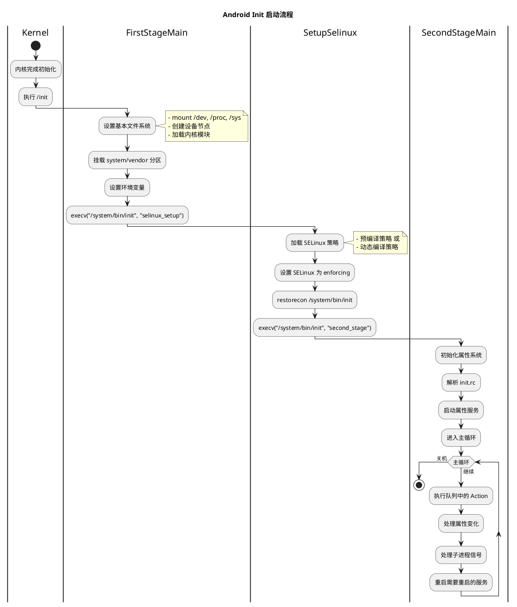
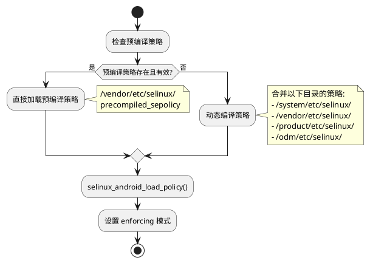
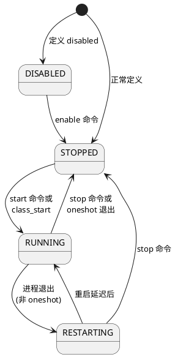
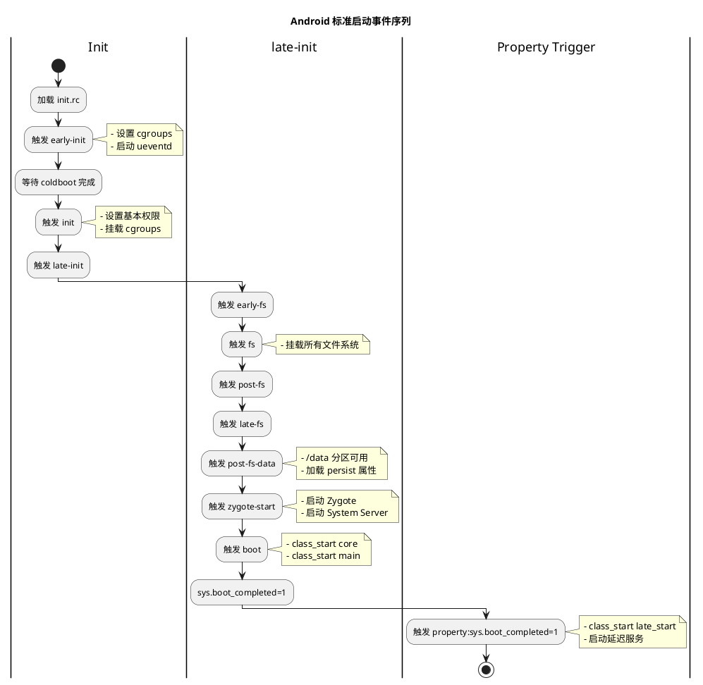
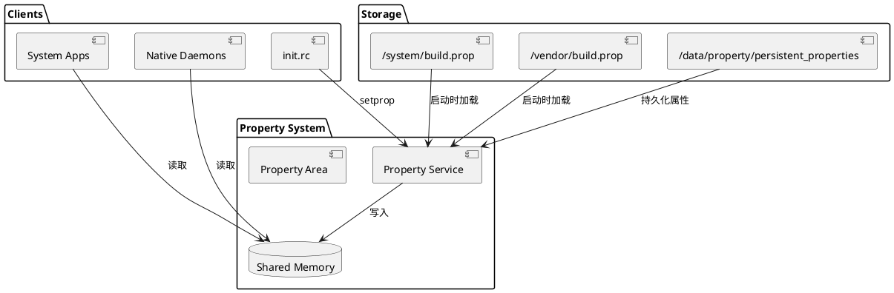

# Android Init 系统与属性服务

> **文档信息**
> - **更新日期**: 2025-12-12
> - **适用版本**: Android 14 (AOSP)
> - **源码路径**: `system/core/init/`

---

## 目录

1. [概述](#1-概述)
2. [Init 进程启动流程](#2-init-进程启动流程)
3. [init.rc 语法详解](#3-initrc-语法详解)
4. [服务 (Service) 定义与管理](#4-服务-service-定义与管理)
5. [触发器 (Trigger) 与动作 (Action)](#5-触发器-trigger-与动作-action)
6. [属性系统 (Property) 详解](#6-属性系统-property-详解)
7. [SELinux 与权限配置](#7-selinux-与权限配置)
8. [本项目 init.rc 分析](#8-本项目-initrc-分析)
9. [添加开机服务实践](#9-添加开机服务实践)
10. [调试与问题排查](#10-调试与问题排查)

---

## 1. 概述

### 1.1 什么是 Init 进程

Init 是 Android 系统启动的**第一个用户空间进程**（PID=1），由内核直接启动。它承担着系统初始化的核心职责：

```
Kernel 启动完成
       ↓
启动 /init (PID=1)
       ↓
┌──────────────────────────────────────────────────┐
│                Init 进程职责                      │
├──────────────────────────────────────────────────┤
│ • 挂载文件系统 (/dev, /proc, /sys 等)            │
│ • 加载 SELinux 策略                              │
│ • 解析并执行 init.rc 脚本                        │
│ • 启动系统关键服务 (ueventd, servicemanager 等)  │
│ • 管理属性系统 (Property Service)                │
│ • 处理子进程退出信号 (SIGCHLD)                   │
│ • 响应属性变化触发器                             │
└──────────────────────────────────────────────────┘
```

### 1.2 Init 进程的特殊性

| 特性 | 说明 |
|------|------|
| **PID 为 1** | 系统中唯一 PID 为 1 的进程 |
| **永不退出** | Init 进程退出会导致内核 Panic |
| **回收孤儿进程** | 所有孤儿进程的父进程都会变成 init |
| **处理 SIGCHLD** | 负责回收所有子进程的退出状态 |
| **SELinux 上下文切换** | 负责在启动过程中切换 SELinux 上下文 |

### 1.3 源码结构

```
system/core/init/
├── main.cpp                 # 入口点，根据参数调用不同阶段
├── first_stage_init.cpp     # 第一阶段初始化
├── selinux.cpp              # SELinux 设置阶段
├── init.cpp                 # 第二阶段主逻辑
├── property_service.cpp     # 属性服务实现
├── service.h/cpp            # 服务管理
├── service_parser.cpp       # 服务解析器
├── action.h/cpp             # 动作管理
├── action_parser.cpp        # 动作解析器
├── builtins.cpp             # 内置命令实现
├── ueventd.cpp              # uevent 守护进程
└── subcontext.cpp           # 子上下文管理
```

---

## 2. Init 进程启动流程

### 2.1 启动阶段概览

Init 进程的启动分为**三个主要阶段**：



### 2.2 第一阶段 (FirstStageMain)

第一阶段在 `first_stage_init.cpp:FirstStageMain()` 中实现：

```cpp
// system/core/init/first_stage_init.cpp

int FirstStageMain(int argc, char** argv) {
    // 1. 设置基本文件系统
    umask(0);
    clearenv();
    setenv("PATH", _PATH_DEFPATH, 1);

    // 挂载临时文件系统
    mount("tmpfs", "/dev", "tmpfs", MS_NOSUID, "mode=0755");
    mkdir("/dev/pts", 0755);
    mkdir("/dev/socket", 0755);
    mount("devpts", "/dev/pts", "devpts", 0, NULL);
    mount("proc", "/proc", "proc", 0, "hidepid=2,gid=3009");
    mount("sysfs", "/sys", "sysfs", 0, NULL);
    mount("selinuxfs", "/sys/fs/selinux", "selinuxfs", 0, NULL);

    // 2. 创建必要的设备节点
    mknod("/dev/kmsg", S_IFCHR | 0600, makedev(1, 11));
    mknod("/dev/random", S_IFCHR | 0666, makedev(1, 8));
    mknod("/dev/urandom", S_IFCHR | 0666, makedev(1, 9));
    mknod("/dev/null", S_IFCHR | 0666, makedev(1, 3));

    // 3. 初始化日志
    InitKernelLogging(argv);
    LOG(INFO) << "init first stage started!";

    // 4. 加载内核模块
    LoadKernelModules(...);

    // 5. 挂载 system/vendor 等分区
    DoFirstStageMount(...);

    // 6. 执行 SELinux 设置阶段
    const char* path = "/system/bin/init";
    const char* args[] = {path, "selinux_setup", nullptr};
    execv(path, const_cast<char**>(args));
}
```

**关键操作说明**：

| 操作 | 目的 |
|------|------|
| `mount tmpfs /dev` | 创建设备文件系统 |
| `mount proc /proc` | 提供进程信息访问 |
| `mount sysfs /sys` | 提供内核对象信息 |
| `mknod /dev/kmsg` | 创建内核日志设备 |
| `DoFirstStageMount` | 挂载 system、vendor 等关键分区 |

### 2.3 SELinux 设置阶段 (SetupSelinux)

在 `selinux.cpp:SetupSelinux()` 中实现：

```cpp
// system/core/init/selinux.cpp

int SetupSelinux(char** argv) {
    InitKernelLogging(argv);
    LOG(INFO) << "Opening SELinux policy";

    // 1. 加载 SELinux 策略
    //    - 优先使用预编译策略
    //    - 否则动态编译 (split policy)
    PrepareApexSepolicy();
    ReadPolicy(&policy);

    // 2. 加载策略到内核
    LoadSelinuxPolicy(policy);

    // 3. 设置 enforcing 模式
    SelinuxSetEnforcement();

    // 4. 恢复 init 的安全上下文
    setcon("u:r:init:s0");

    // 5. 执行第二阶段
    const char* path = "/system/bin/init";
    const char* args[] = {path, "second_stage", nullptr};
    execv(path, const_cast<char**>(args));
}
```

**SELinux 策略加载流程**：



### 2.4 第二阶段 (SecondStageMain)

第二阶段是 Init 的主要工作阶段，在 `init.cpp:SecondStageMain()` 中实现：

```cpp
// system/core/init/init.cpp

int SecondStageMain(int argc, char** argv) {
    // 1. 初始化
    trigger_shutdown = [](const std::string& command) {
        shutdown_state.TriggerShutdown(command);
    };
    InitKernelLogging(argv);
    LOG(INFO) << "init second stage started!";

    // 2. 初始化属性系统
    PropertyInit();

    // 3. 挂载额外的文件系统
    MountExtraFilesystems();  // /apex, /linkerconfig

    // 4. SELinux 相关设置
    SelabelInitialize();
    SelinuxRestoreContext();

    // 5. 设置 epoll 和信号处理
    Epoll epoll;
    epoll.Open();
    InstallSignalFdHandler(&epoll);
    InstallInitNotifier(&epoll);

    // 6. 启动属性服务
    StartPropertyService(&property_fd);

    // 7. 解析 init.rc 脚本
    ActionManager& am = ActionManager::GetInstance();
    ServiceList& sm = ServiceList::GetInstance();
    LoadBootScripts(am, sm);

    // 8. 触发启动事件
    am.QueueEventTrigger("early-init");
    am.QueueBuiltinAction(wait_for_coldboot_done_action, "wait_for_coldboot_done");
    am.QueueEventTrigger("init");
    am.QueueEventTrigger("late-init");

    // 9. 主循环
    while (true) {
        // 检查是否需要关机
        auto shutdown_command = shutdown_state.CheckShutdown();
        if (shutdown_command) {
            HandlePowerctlMessage(*shutdown_command);
        }

        // 执行队列中的命令
        if (!(prop_waiter_state.MightBeWaiting() || Service::is_exec_service_running())) {
            am.ExecuteOneCommand();
        }

        // 处理需要重启的服务
        if (!IsShuttingDown()) {
            auto next_process_action_time = HandleProcessActions();
        }

        // 等待事件
        epoll.Wait(epoll_timeout);

        // 处理控制消息
        if (!IsShuttingDown()) {
            HandleControlMessages();
        }
    }
}
```

### 2.5 Init.rc 加载顺序

```cpp
// system/core/init/init.cpp:LoadBootScripts()

static void LoadBootScripts(ActionManager& action_manager, ServiceList& service_list) {
    Parser parser = CreateParser(action_manager, service_list);

    std::string bootscript = GetProperty("ro.boot.init_rc", "");
    if (bootscript.empty()) {
        // 默认加载顺序
        parser.ParseConfig("/system/etc/init/hw/init.rc");
        parser.ParseConfig("/system/etc/init");
        parser.ParseConfig("/system_ext/etc/init");
        parser.ParseConfig("/vendor/etc/init");
        parser.ParseConfig("/odm/etc/init");
        parser.ParseConfig("/product/etc/init");
    } else {
        parser.ParseConfig(bootscript);
    }
}
```

**加载优先级**：

```
1. /system/etc/init/hw/init.rc      # 主配置文件
2. /system/etc/init/*.rc            # 系统服务
3. /system_ext/etc/init/*.rc        # 系统扩展
4. /vendor/etc/init/*.rc            # 厂商服务
5. /odm/etc/init/*.rc               # ODM 服务
6. /product/etc/init/*.rc           # 产品服务
```

---

## 3. init.rc 语法详解

### 3.1 基本语法结构

init.rc 使用 Android Init Language (AIL)，主要包含以下元素：

```
┌─────────────────────────────────────────────────────┐
│              init.rc 语法结构                        │
├─────────────────────────────────────────────────────┤
│                                                     │
│  Actions (动作块)                                    │
│  ┌───────────────────────────────────────────────┐ │
│  │ on <trigger> [&& <trigger>]*                  │ │
│  │     <command>                                 │ │
│  │     <command>                                 │ │
│  └───────────────────────────────────────────────┘ │
│                                                     │
│  Services (服务定义)                                 │
│  ┌───────────────────────────────────────────────┐ │
│  │ service <name> <pathname> [<argument>]*       │ │
│  │     <option>                                  │ │
│  │     <option>                                  │ │
│  └───────────────────────────────────────────────┘ │
│                                                     │
│  Imports (导入其他配置)                              │
│  ┌───────────────────────────────────────────────┐ │
│  │ import <path>                                 │ │
│  └───────────────────────────────────────────────┘ │
│                                                     │
└─────────────────────────────────────────────────────┘
```

### 3.2 Action 语法

```bash
# 基本语法
on <trigger> [&& <trigger>]*
    <command>
    <command>
    ...

# 示例：启动时触发
on boot
    # 设置系统属性
    setprop sys.boot_completed 0

    # 创建目录
    mkdir /data/misc/wifi 0770 wifi wifi

    # 设置权限
    chmod 0660 /sys/class/leds/lcd-backlight/brightness
    chown system system /sys/class/leds/lcd-backlight/brightness

    # 启动服务类
    class_start core

# 示例：属性触发
on property:sys.boot_completed=1
    # 启动晚加载服务
    class_start late_start

    # 写入文件
    write /sys/power/wake_lock boot_completed

# 示例：多条件触发
on property:vold.decrypt=trigger_restart_framework && property:sys.boot_completed=1
    start surfaceflinger
```

### 3.3 Service 语法

```bash
# 基本语法
service <name> <pathname> [<argument>]*
    <option>
    <option>
    ...

# 完整示例
service surfaceflinger /system/bin/surfaceflinger
    class core animation           # 服务类别
    user system                    # 运行用户
    group graphics drmrpc readproc # 运行组
    capabilities SYS_NICE          # Linux 能力
    onrestart restart --only-if-running zygote  # 重启时动作
    task_profiles HighPerformance  # 任务配置
    socket pdx/system/vr/display/client stream 0666 system graphics u:object_r:pdx_display_client_endpoint_socket:s0
    socket pdx/system/vr/display/manager stream 0666 system graphics u:object_r:pdx_display_manager_endpoint_socket:s0
```

### 3.4 常用命令列表

#### 文件系统命令

| 命令 | 语法 | 说明 |
|------|------|------|
| `mkdir` | `mkdir <path> [mode] [owner] [group]` | 创建目录 |
| `chmod` | `chmod <octal-mode> <path>` | 修改权限 |
| `chown` | `chown <owner> <group> <path>` | 修改所有者 |
| `mount` | `mount <type> <device> <dir> [flags] [options]` | 挂载文件系统 |
| `symlink` | `symlink <target> <path>` | 创建符号链接 |
| `write` | `write <path> <content>` | 写入文件 |
| `copy` | `copy <src> <dst>` | 复制文件 |
| `rm` | `rm <path>` | 删除文件 |
| `rmdir` | `rmdir <path>` | 删除目录 |
| `restorecon` | `restorecon <path>` | 恢复 SELinux 上下文 |
| `restorecon_recursive` | `restorecon_recursive <path>` | 递归恢复 SELinux 上下文 |

#### 服务控制命令

| 命令 | 语法 | 说明 |
|------|------|------|
| `start` | `start <service>` | 启动服务 |
| `stop` | `stop <service>` | 停止服务 |
| `restart` | `restart <service>` | 重启服务 |
| `class_start` | `class_start <class>` | 启动某类所有服务 |
| `class_stop` | `class_stop <class>` | 停止某类所有服务 |
| `class_reset` | `class_reset <class>` | 重置某类所有服务 |
| `class_restart` | `class_restart <class>` | 重启某类所有服务 |
| `enable` | `enable <service>` | 启用被禁用的服务 |

#### 属性命令

| 命令 | 语法 | 说明 |
|------|------|------|
| `setprop` | `setprop <name> <value>` | 设置属性 |
| `setrlimit` | `setrlimit <resource> <cur> <max>` | 设置资源限制 |

#### 执行命令

| 命令 | 语法 | 说明 |
|------|------|------|
| `exec` | `exec [seclabel] [user] [group] -- <command>` | 执行命令并等待 |
| `exec_start` | `exec_start <service>` | 启动服务并等待完成 |
| `exec_background` | `exec_background <command>` | 后台执行命令 |

#### 其他命令

| 命令 | 语法 | 说明 |
|------|------|------|
| `trigger` | `trigger <event>` | 触发事件 |
| `loglevel` | `loglevel <level>` | 设置日志级别 |
| `wait` | `wait <path> [timeout]` | 等待文件存在 |
| `wait_for_prop` | `wait_for_prop <name> <value>` | 等待属性值 |
| `insmod` | `insmod <path> [options]` | 加载内核模块 |
| `hostname` | `hostname <name>` | 设置主机名 |
| `domainname` | `domainname <name>` | 设置域名 |
| `ifup` | `ifup <interface>` | 启用网络接口 |

### 3.5 服务选项列表

| 选项 | 语法 | 说明 |
|------|------|------|
| `class` | `class <name> [<name>]*` | 服务类别，用于批量控制 |
| `user` | `user <username>` | 运行服务的用户 |
| `group` | `group <groupname> [<groupname>]*` | 运行服务的组 |
| `disabled` | `disabled` | 不自动启动，需手动 start |
| `oneshot` | `oneshot` | 服务退出后不自动重启 |
| `critical` | `critical` | 关键服务，崩溃 4 次后重启到 bootloader |
| `socket` | `socket <name> <type> <perm> [user] [group] [seclabel]` | 创建 socket |
| `file` | `file <path> <type>` | 打开文件描述符 |
| `onrestart` | `onrestart <command>` | 服务重启时执行的命令 |
| `writepid` | `writepid <file>` | 将 PID 写入文件 |
| `priority` | `priority <priority>` | 调度优先级 (-20~19) |
| `oom_score_adjust` | `oom_score_adjust <value>` | OOM 调整值 |
| `namespace` | `namespace <pid\|mnt>` | 进入命名空间 |
| `seclabel` | `seclabel <label>` | SELinux 安全标签 |
| `capabilities` | `capabilities <cap> [<cap>]*` | Linux 能力 |
| `setenv` | `setenv <name> <value>` | 设置环境变量 |
| `task_profiles` | `task_profiles <profile> [<profile>]*` | 任务配置文件 |
| `interface` | `interface <interface_name> <instance_name>` | HIDL 接口声明 |
| `override` | `override` | 覆盖同名服务 |
| `updatable` | `updatable` | 可更新服务 |
| `restart_period` | `restart_period <seconds>` | 重启间隔 |
| `timeout_period` | `timeout_period <seconds>` | 超时时间 |
| `shutdown` | `shutdown <critical\|shutdown>` | 关机行为 |
| `gentle_kill` | `gentle_kill` | 使用 SIGTERM 而非 SIGKILL |

### 3.6 服务类别 (Class)

预定义的服务类别及其启动顺序：

```
┌─────────────────────────────────────────────────────────────┐
│                      服务类别启动顺序                         │
├─────────────────────────────────────────────────────────────┤
│                                                             │
│  early-init                                                 │
│      ↓                                                      │
│  ┌─────────────────────────────────────────┐               │
│  │ class_start charger (如果是充电模式)     │               │
│  └─────────────────────────────────────────┘               │
│      ↓                                                      │
│  init                                                       │
│      ↓                                                      │
│  late-init                                                  │
│      ↓                                                      │
│  ┌─────────────────────────────────────────┐               │
│  │ class_start core                        │ servicemanager │
│  │                                         │ surfaceflinger │
│  │                                         │ healthd        │
│  └─────────────────────────────────────────┘               │
│      ↓                                                      │
│  ┌─────────────────────────────────────────┐               │
│  │ class_start main                        │ zygote         │
│  │                                         │ netd           │
│  │                                         │ vold           │
│  └─────────────────────────────────────────┘               │
│      ↓                                                      │
│  ┌─────────────────────────────────────────┐               │
│  │ class_start late_start                  │ 用户自定义服务 │
│  └─────────────────────────────────────────┘               │
│                                                             │
└─────────────────────────────────────────────────────────────┘
```

---

## 4. 服务 (Service) 定义与管理

### 4.1 服务生命周期



### 4.2 服务标志位

服务内部使用标志位跟踪状态，定义在 `service.h`：

```cpp
// system/core/init/service.h

#define SVC_DISABLED       0x001  // 不随 class 自动启动
#define SVC_ONESHOT        0x002  // 退出后不重启
#define SVC_RUNNING        0x004  // 当前正在运行
#define SVC_RESTARTING     0x008  // 等待重启
#define SVC_CONSOLE        0x010  // 需要控制台
#define SVC_CRITICAL       0x020  // 关键服务，崩溃后重启到 bootloader
#define SVC_RESET          0x040  // 停止但可以重启
#define SVC_RC_DISABLED    0x080  // rc 文件中定义的 disabled
#define SVC_RESTART        0x100  // 安全重启中
#define SVC_DISABLED_START 0x200  // 请求启动但当时被禁用
#define SVC_EXEC           0x400  // exec 或 exec_start 启动
#define SVC_SHUTDOWN_CRITICAL 0x800   // 关机关键服务
#define SVC_TEMPORARY      0x1000     // 临时服务，退出后删除
#define SVC_GENTLE_KILL    0x2000     // 使用 SIGTERM 停止
```

### 4.3 服务状态属性

Init 会为每个服务维护状态属性：

```bash
# 服务状态属性
init.svc.<service_name>=<state>

# 状态值
- stopped   : 服务已停止
- starting  : 服务正在启动
- running   : 服务正在运行
- stopping  : 服务正在停止
- restarting: 服务正在重启

# 示例
init.svc.surfaceflinger=running
init.svc.zygote=running
init.svc.adbd=running
```

### 4.4 服务控制方法

#### 通过属性控制

```bash
# 启动服务
setprop ctl.start <service_name>

# 停止服务
setprop ctl.stop <service_name>

# 重启服务
setprop ctl.restart <service_name>

# 示例
setprop ctl.start bootanim
setprop ctl.stop bootanim
setprop ctl.restart surfaceflinger
```

#### 通过 init.rc 控制

```bash
# 启动单个服务
start surfaceflinger

# 停止单个服务
stop bootanim

# 重启服务
restart zygote

# 启动一类服务
class_start main

# 停止一类服务
class_stop late_start
```

### 4.5 关键服务示例

#### Zygote 服务

```bash
# system/core/rootdir/init.zygote64.rc

service zygote /system/bin/app_process64 -Xzygote /system/bin --zygote --start-system-server
    class main
    priority -20
    user root
    group root readproc reserved_disk
    socket zygote stream 660 root system
    socket usap_pool_primary stream 660 root system
    onrestart exec_background -- /system/bin/vdc volume abort_fuse
    onrestart write /sys/power/state on
    onrestart restart audioserver
    onrestart restart cameraserver
    onrestart restart media
    onrestart restart netd
    onrestart restart wificond
    task_profiles ProcessCapacityHigh MaxPerformance
    critical window=${zygote.critical_window.minute:-off} target=zygote-fatal
```

#### SurfaceFlinger 服务

```bash
# frameworks/native/services/surfaceflinger/surfaceflinger.rc

service surfaceflinger /system/bin/surfaceflinger
    class core animation
    user system
    group graphics drmrpc readproc
    capabilities SYS_NICE
    onrestart restart --only-if-running zygote
    task_profiles HighPerformance
```

#### ServiceManager 服务

```bash
# frameworks/native/cmds/servicemanager/servicemanager.rc

service servicemanager /system/bin/servicemanager
    class core animation
    user system
    group system readproc
    critical
    onrestart restart apexd
    onrestart restart audioserver
    onrestart restart gatekeeperd
    onrestart class_restart --only-enabled main
    onrestart class_restart --only-enabled hal
    onrestart class_restart --only-enabled early_hal
    task_profiles ServiceCapacityLow
    shutdown critical
```

---

## 5. 触发器 (Trigger) 与动作 (Action)

### 5.1 触发器类型

#### 事件触发器 (Event Trigger)

由系统事件触发，按照预定义顺序执行：

```bash
# 启动顺序触发器
on early-init    # 最早执行，挂载基本文件系统后
on init          # 基本初始化
on late-init     # 延迟初始化
on boot          # 启动完成
on charger       # 充电模式
on shutdown      # 关机时

# 文件系统触发器
on fs            # 挂载文件系统时
on early-fs      # 早期文件系统
on post-fs       # 文件系统挂载后
on post-fs-data  # /data 分区挂载后

# 自定义触发器
on vendor-init   # 厂商自定义
on zygote-start  # Zygote 启动
```

#### 属性触发器 (Property Trigger)

当属性值变化时触发：

```bash
# 单属性触发
on property:sys.boot_completed=1
    start late_service

# 多属性触发 (AND 关系)
on property:vold.decrypt=trigger_restart_framework && property:sys.boot_completed=1
    start framework_service

# 通配符匹配
on property:persist.sys.timezone=*
    restart system_server
```

### 5.2 标准启动事件序列



### 5.3 Action 执行机制

```cpp
// system/core/init/init.cpp

// 主循环中执行 Action
while (true) {
    // 每次循环执行一个命令
    if (!(prop_waiter_state.MightBeWaiting() || Service::is_exec_service_running())) {
        am.ExecuteOneCommand();

        // 如果还有命令，立即继续
        if (am.HasMoreCommands()) {
            next_action_time = boot_clock::now();
        }
    }

    // 等待事件
    epoll.Wait(epoll_timeout);
}
```

**Action 队列管理**：

```cpp
// system/core/init/action_manager.cpp

void ActionManager::QueueEventTrigger(const std::string& trigger) {
    // 将匹配触发器的所有 Action 加入队列
    for (const auto& action : actions_) {
        if (action->CheckEvent(event_trigger)) {
            current_executing_actions_.emplace(action.get());
        }
    }
}

void ActionManager::QueuePropertyChange(const std::string& name, const std::string& value) {
    // 将匹配属性变化的所有 Action 加入队列
    for (const auto& action : actions_) {
        if (action->CheckPropertyTrigger(name, value)) {
            current_executing_actions_.emplace(action.get());
        }
    }
}
```

### 5.4 实际示例

#### 启动完成后的优化

```bash
# device/amlogic/ross/init.amlogic.board.rc

on property:sys.boot_completed=1
    # 调整 CPU 调度器
    write /sys/devices/system/cpu/cpu0/cpufreq/scaling_governor schedutil
    write /sys/devices/system/cpu/cpu0/cpufreq/scaling_min_freq 1000000

    # 配置 cpuset
    write /dev/cpuset/top-app/cpus 0-3
    write /dev/cpuset/foreground/cpus 0-3
    write /dev/cpuset/background/cpus 0
    write /dev/cpuset/system-background/cpus 0-3
    write /dev/cpuset/restricted/cpus 0-1

    # 配置 DMA 缓冲区
    write /sys/class/dmabuf_manage/dmabuf_manage_config "dmabuf_manage.secure_vdec_def_size_bytes=16777216"
```

#### 加载内核模块

```bash
on early-init
    # GPU 驱动
    insmod /vendor/lib/modules/mali.ko

on init
    # 保护内存分配器
    insmod /vendor/lib/modules/protected_memory_allocator.ko

    # Dolby Vision 支持
    insmod /oem/overlay/dovi.ko

on post-fs-data
    # HDR 支持
    insmod /vendor/lib/sl_hdr.ko
```

---

## 6. 属性系统 (Property) 详解

### 6.1 属性系统架构



### 6.2 属性命名规范

| 前缀 | 说明 | 权限 |
|------|------|------|
| `ro.*` | 只读属性，启动后不可修改 | 只读 |
| `persist.*` | 持久化属性，重启后保留 | 可读写 |
| `sys.*` | 系统属性 | 系统进程可写 |
| `ctl.*` | 控制属性，用于控制服务 | 特殊 |
| `init.svc.*` | 服务状态属性 | 只读 |
| `selinux.*` | SELinux 相关 | 只读 |
| `vendor.*` | 厂商属性 | 厂商进程可写 |
| `debug.*` | 调试属性 | shell 可写 |
| `log.*` | 日志属性 | 可读写 |

### 6.3 属性加载顺序

```cpp
// system/core/init/property_service.cpp

void PropertyInit() {
    // 1. 初始化属性区域
    __system_property_area_init();

    // 2. 导出内核命令行参数
    ProcessKernelCmdline();
    ProcessKernelDt();
    ProcessBootconfig();

    // 3. 加载属性文件
    LoadPropertyInfos();

    // 4. 按顺序加载属性
    // (1) /system/etc/prop.default
    // (2) /system/build.prop
    // (3) /system_ext/build.prop
    // (4) /vendor/build.prop
    // (5) /vendor/default.prop
    // (6) /odm/build.prop
    // (7) /product/build.prop
    load_properties_from_file("/system/etc/prop.default", NULL);
    load_properties_from_file("/system/build.prop", NULL);
    // ... 其他属性文件

    // 5. 设置版本相关属性
    PropertyLoadBootDefaults();
}

void LoadPersistentProperties() {
    // 加载持久化属性
    // /data/property/persistent_properties
    auto persistent_properties = LoadPersistentProperties();
    for (const auto& [name, value] : persistent_properties) {
        property_set(name.c_str(), value.c_str());
    }
}
```

### 6.4 重要系统属性

#### 启动相关

```bash
# 启动状态
sys.boot_completed=1              # 启动完成标志
ro.boottime.init=<timestamp>      # init 启动时间
ro.boottime.init.first_stage=<ms> # 第一阶段耗时
ro.boottime.init.selinux=<ms>     # SELinux 设置耗时

# 启动模式
ro.bootmode=normal|charger|recovery|fastboot
ro.boot.hardware=<hardware_name>
ro.boot.serialno=<serial_number>
```

#### 版本信息

```bash
ro.build.version.sdk=34           # SDK 版本
ro.build.version.release=14       # Android 版本
ro.build.fingerprint=<fingerprint> # 构建指纹
ro.build.type=user|userdebug|eng  # 构建类型
ro.build.display.id=<build_id>    # 显示的构建 ID
ro.product.model=<model>          # 产品型号
ro.product.manufacturer=<manufacturer> # 制造商
```

#### 安全相关

```bash
ro.secure=1                       # 安全启动
ro.debuggable=0                   # 是否可调试
ro.adb.secure=1                   # ADB 安全模式
selinux.reload_policy=1           # SELinux 策略加载
ro.boot.verifiedbootstate=green|yellow|orange # 验证启动状态
```

### 6.5 属性服务实现

```cpp
// system/core/init/property_service.cpp

static std::optional<uint32_t> PropertySet(const std::string& name,
                                           const std::string& value,
                                           SocketConnection* socket,
                                           std::string* error) {
    // 1. 验证属性名
    if (!IsLegalPropertyName(name)) {
        *error = "Illegal property name";
        return {PROP_ERROR_INVALID_NAME};
    }

    // 2. 验证属性值
    if (auto result = IsLegalPropertyValue(name, value); !result.ok()) {
        *error = result.error().message();
        return {PROP_ERROR_INVALID_VALUE};
    }

    // 3. 检查是否为只读属性
    prop_info* pi = __system_property_find(name.c_str());
    if (pi != nullptr && StartsWith(name, "ro.")) {
        *error = "Read-only property was already set";
        return {PROP_ERROR_READ_ONLY_PROPERTY};
    }

    // 4. SELinux 权限检查
    if (!CheckMacPerms(name, target_context, source_context, cr)) {
        *error = "SELinux permission denied";
        return {PROP_ERROR_PERMISSION_DENIED};
    }

    // 5. 更新属性
    if (pi != nullptr) {
        __system_property_update(pi, value.c_str(), value.size());
    } else {
        __system_property_add(name.c_str(), name.size(),
                              value.c_str(), value.size());
    }

    // 6. 处理持久化属性
    if (StartsWith(name, "persist.")) {
        WritePersistentProperty(name, value);
    }

    // 7. 通知属性变化
    NotifyPropertyChange(name, value);

    return {PROP_SUCCESS};
}

void PropertyChanged(const std::string& name, const std::string& value) {
    // 处理 sys.powerctl
    if (name == "sys.powerctl") {
        trigger_shutdown(value);
    }

    // 触发属性变化 Action
    if (property_triggers_enabled) {
        ActionManager::GetInstance().QueuePropertyChange(name, value);
        WakeMainInitThread();
    }
}
```

### 6.6 属性操作 API

#### C/C++ API

```cpp
#include <cutils/properties.h>
#include <android-base/properties.h>

// 传统 API
char value[PROPERTY_VALUE_MAX];
property_get("ro.build.version.sdk", value, "0");
property_set("debug.myapp.level", "3");

// android-base API (推荐)
#include <android-base/properties.h>

std::string sdk = android::base::GetProperty("ro.build.version.sdk", "0");
bool success = android::base::SetProperty("debug.myapp.level", "3");
bool debuggable = android::base::GetBoolProperty("ro.debuggable", false);
int sdk_int = android::base::GetIntProperty("ro.build.version.sdk", 0);
```

#### Java API

```java
import android.os.SystemProperties;

// 读取属性
String sdk = SystemProperties.get("ro.build.version.sdk", "0");
int sdkInt = SystemProperties.getInt("ro.build.version.sdk", 0);
boolean debuggable = SystemProperties.getBoolean("ro.debuggable", false);

// 设置属性 (需要权限)
SystemProperties.set("debug.myapp.level", "3");
```

#### Shell 命令

```bash
# 获取属性
getprop ro.build.version.sdk
getprop                          # 列出所有属性

# 设置属性
setprop debug.myapp.level 3

# 监控属性变化
watchprops
```

---

## 7. SELinux 与权限配置

### 7.1 SELinux 基础

SELinux (Security-Enhanced Linux) 是 Android 的强制访问控制 (MAC) 系统：

```
┌─────────────────────────────────────────────────────────────┐
│                    SELinux 概念                             │
├─────────────────────────────────────────────────────────────┤
│                                                             │
│  主体 (Subject)                                             │
│  ├── 进程、用户                                             │
│  └── 安全上下文: u:r:init:s0                                │
│                                                             │
│  客体 (Object)                                              │
│  ├── 文件、目录、设备、socket、属性                          │
│  └── 安全上下文: u:object_r:system_file:s0                  │
│                                                             │
│  安全上下文格式                                              │
│  user:role:type:level                                       │
│  ├── user  : 用户 (Android 通常为 u)                         │
│  ├── role  : 角色 (r 或 object_r)                           │
│  ├── type  : 类型/域 (最重要的部分)                          │
│  └── level : 安全级别 (MLS, 通常为 s0)                       │
│                                                             │
└─────────────────────────────────────────────────────────────┘
```

### 7.2 Init 的 SELinux 上下文切换

```plantuml
@startuml
skinparam backgroundColor #FFFFFF

title Init SELinux 上下文切换

rectangle "Kernel Domain" as KD {
    :init 进程启动;
    note right: 内核域,无 SELinux 限制
}

rectangle "init Domain" as ID {
    :SetupSelinux;
    :LoadSelinuxPolicy();
    :setcon("u:r:init:s0");
    note right
      切换到 init 域
      受 SELinux 策略限制
    end note
}

rectangle "Second Stage" as SS {
    :SecondStageMain;
    :SelinuxRestoreContext();
    note right
      恢复文件安全上下文
    end note
}

KD --> ID : execv(selinux_setup)
ID --> SS : execv(second_stage)

@enduml
```

### 7.3 服务的 SELinux 标签

```bash
# 为服务指定 SELinux 标签
service myservice /system/bin/myservice
    seclabel u:r:myservice:s0    # 进程运行时的安全上下文
```

**自动转换规则**：

```
# file_contexts (文件安全上下文)
/system/bin/myservice    u:object_r:myservice_exec:s0

# 域转换规则
# 当 init 域执行 myservice_exec 类型的文件时
# 自动转换到 myservice 域
type_transition init myservice_exec:process myservice;
```

### 7.4 常见 SELinux 类型

| 域/类型 | 说明 |
|---------|------|
| `init` | init 进程域 |
| `kernel` | 内核域 |
| `system_server` | system_server 域 |
| `zygote` | zygote 域 |
| `shell` | shell 域 |
| `untrusted_app` | 第三方应用域 |
| `platform_app` | 平台应用域 |
| `system_app` | 系统应用域 |
| `vendor_init` | vendor init 脚本域 |
| `system_file` | /system 文件类型 |
| `vendor_file` | /vendor 文件类型 |
| `data_file` | /data 文件类型 |
| `device` | /dev 设备类型 |
| `property_type` | 属性类型 |
| `socket_type` | socket 类型 |

### 7.5 属性的 SELinux 控制

```bash
# property_contexts (属性安全上下文)
persist.sys.            u:object_r:system_prop:s0
sys.                    u:object_r:system_prop:s0
debug.                  u:object_r:debug_prop:s0
vendor.                 u:object_r:vendor_default_prop:s0
ro.boot.                u:object_r:default_prop:s0
ctl.                    u:object_r:ctl_default_prop:s0
init.svc.               u:object_r:init_service_status_prop:s0
```

**属性访问控制**：

```
# 允许 system_server 设置 system_prop
allow system_server system_prop:property_service set;

# 允许所有域读取 default_prop
allow domain default_prop:file r_file_perms;
```

### 7.6 调试 SELinux 问题

#### 查看拒绝日志

```bash
# 实时查看 SELinux 拒绝
adb shell dmesg | grep avc

# 或使用 logcat
adb logcat | grep avc

# 输出示例
avc: denied { write } for pid=1234 comm="myservice" name="myfile"
     dev="sda1" ino=5678 scontext=u:r:myservice:s0
     tcontext=u:object_r:system_data_file:s0 tclass=file permissive=0
```

#### 生成策略规则

```bash
# 使用 audit2allow 工具
adb shell dmesg | grep avc | audit2allow -p policy

# 输出示例
allow myservice system_data_file:file write;
```

#### 临时设置 permissive 模式

```bash
# 设置整个系统为 permissive (仅 userdebug/eng)
adb shell setenforce 0

# 设置特定域为 permissive
# 在 sepolicy 中添加
permissive myservice;
```

---

## 8. 本项目 init.rc 分析

### 8.1 项目 init.rc 结构

本项目 (Amlogic S905X5) 的 init.rc 文件分布：

```
device/amlogic/ross/
├── init.amlogic.board.rc      # 板级配置
└── init.amlogic.board.ext.rc  # 板级扩展配置

device/amlogic/common/products/mbox/
└── init.amlogic.system.rc     # 系统级配置

system/core/rootdir/
└── init.rc                    # AOSP 主配置
```

### 8.2 ross 板级配置分析

```bash
# device/amlogic/ross/init.amlogic.board.rc

# ============== early-init 阶段 ==============
on early-init
    # 设置日志级别
    loglevel 3

    # 加载保护内存分配器模块
    insmod /vendor/lib/modules/protected_memory_allocator.ko

# ============== init 阶段 ==============
on init
    # 加载 GPU 驱动 (Mali)
    insmod /vendor/lib/modules/mali.ko

    # 加载 Dolby Vision 支持
    insmod /oem/overlay/dovi.ko

# ============== early-fs 阶段 ==============
on early-fs
    # 配置 ZRAM 压缩算法
    write /sys/block/zram0/comp_algorithm amfc

# ============== post-fs-data 阶段 ==============
on post-fs-data
    # 加载 HDR 支持
    insmod /vendor/lib/sl_hdr.ko

# ============== boot 阶段 ==============
on boot
    # 视频解码器配置
    write /sys/module/decoder_common/parameters/v4lvideo_add_di 0
    write /sys/module/aml_media/parameters/dim_post_num 5
    write /sys/class/di_process/di_proc_enable 1

    # 解码器缓冲区配置
    write /sys/module/amvdec_mh264/parameters/reorder_dpb_size_margin 9
    write /sys/module/amvdec_h265/parameters/dynamic_buf_num_margin 9
    write /sys/module/amvdec_vp9/parameters/max_buf_num 12

    # 网络 RPS (Receive Packet Steering) 配置
    write /sys/class/net/eth0/queues/rx-0/rps_cpus f
    write /proc/sys/net/core/rps_sock_flow_entries 32768
    write /sys/class/net/eth0/queues/rx-0/rps_flow_cnt 32768

# ============== 属性触发器 ==============
# OEM 密钥同步
on property:ro.boot.oem.key1=*
    setprop ro.oem.key1 ${ro.boot.oem.key1}

# ============== 启动完成后优化 ==============
on property:sys.boot_completed=1
    # CPU 调度器优化
    write /sys/devices/system/cpu/cpu0/cpufreq/scaling_governor schedutil
    write /sys/devices/system/cpu/cpu0/cpufreq/scaling_min_freq 1000000

    # cpuset 配置 - 进程 CPU 亲和性
    write /dev/cpuset/top-app/cpus 0-3        # 前台应用使用全部核心
    write /dev/cpuset/foreground/cpus 0-3     # 前台进程使用全部核心
    write /dev/cpuset/background/cpus 0       # 后台进程限制到核心 0
    write /dev/cpuset/system-background/cpus 0-3  # 系统后台使用全部核心
    write /dev/cpuset/restricted/cpus 0-1     # 受限进程使用核心 0-1

    # DMA 缓冲区配置
    write /sys/class/dmabuf_manage/dmabuf_manage_config \
          "dmabuf_manage.secure_vdec_def_size_bytes=16777216"
```

### 8.3 配置说明

#### 内核模块加载

| 模块 | 用途 | 加载阶段 |
|------|------|----------|
| `protected_memory_allocator.ko` | 安全视频解码内存 | early-init |
| `mali.ko` | ARM Mali GPU 驱动 | init |
| `dovi.ko` | Dolby Vision 支持 | init |
| `sl_hdr.ko` | SL-HDR 支持 | post-fs-data |

#### 视频解码器参数

| 参数 | 值 | 说明 |
|------|-----|------|
| `v4lvideo_add_di` | 0 | 禁用自动去隔行 |
| `dim_post_num` | 5 | 去隔行后处理数量 |
| `di_proc_enable` | 1 | 启用去隔行处理 |
| `reorder_dpb_size_margin` | 9 | H.264 DPB 重排序余量 |
| `dynamic_buf_num_margin` | 9 | H.265 动态缓冲区余量 |
| `max_buf_num` | 12 | VP9 最大缓冲区数 |

#### 网络 RPS 配置

```
RPS (Receive Packet Steering) 将网络包处理分散到多个 CPU

rps_cpus=f (二进制 1111)
└── 表示 4 个 CPU 核心都参与处理

rps_sock_flow_entries=32768
└── socket 流表大小

rps_flow_cnt=32768
└── 每个队列的流数量
```

---

## 9. 添加开机服务实践

### 9.1 创建自定义服务

#### 步骤 1: 创建可执行文件

```cpp
// vendor/mycompany/myservice/main.cpp

#include <android-base/logging.h>
#include <android-base/properties.h>
#include <signal.h>
#include <unistd.h>

static volatile bool running = true;

void signalHandler(int sig) {
    if (sig == SIGTERM || sig == SIGINT) {
        LOG(INFO) << "MyService received signal " << sig << ", exiting";
        running = false;
    }
}

int main(int argc, char** argv) {
    // 设置信号处理
    signal(SIGTERM, signalHandler);
    signal(SIGINT, signalHandler);

    LOG(INFO) << "MyService started";

    // 主循环
    while (running) {
        // 执行服务逻辑
        LOG(INFO) << "MyService running...";
        sleep(10);
    }

    LOG(INFO) << "MyService stopped";
    return 0;
}
```

#### 步骤 2: 创建 Android.bp

```json
// vendor/mycompany/myservice/Android.bp

cc_binary {
    name: "myservice",
    vendor: true,
    srcs: ["main.cpp"],
    shared_libs: [
        "libbase",
        "liblog",
    ],
    init_rc: ["myservice.rc"],
}
```

#### 步骤 3: 创建 init.rc 配置

```bash
# vendor/mycompany/myservice/myservice.rc

service myservice /vendor/bin/myservice
    class late_start
    user system
    group system
    disabled
    oneshot
```

#### 步骤 4: 创建 SELinux 策略

```
# device/mycompany/sepolicy/vendor/file_contexts
/vendor/bin/myservice    u:object_r:myservice_exec:s0

# device/mycompany/sepolicy/vendor/myservice.te
type myservice, domain;
type myservice_exec, exec_type, vendor_file_type, file_type;

# 域转换
init_daemon_domain(myservice)

# 基本权限
allow myservice self:capability { setuid setgid };
allow myservice vendor_data_file:dir rw_dir_perms;
allow myservice vendor_data_file:file create_file_perms;

# 日志权限
allow myservice kernel:system syslog_read;

# 属性权限
set_prop(myservice, vendor_default_prop)
get_prop(myservice, default_prop)
```

### 9.2 服务配置选项

#### 基本配置

```bash
service myservice /vendor/bin/myservice
    # 服务类别 - 决定启动时机
    class late_start

    # 运行身份
    user system
    group system log sdcard_rw

    # 启动控制
    disabled          # 需要手动启动
    # oneshot         # 退出后不重启

    # SELinux 标签 (可选，默认从 file_contexts 推断)
    # seclabel u:r:myservice:s0
```

#### 高级配置

```bash
service myservice /vendor/bin/myservice --config /vendor/etc/myservice.conf
    class late_start
    user system
    group system

    # 进程优先级
    priority -10                    # nice 值
    oom_score_adjust -500           # OOM 分数调整

    # 能力限制
    capabilities NET_ADMIN NET_RAW  # 授予的 Linux 能力

    # 命名空间隔离
    namespace mnt                   # 挂载命名空间

    # 环境变量
    setenv MY_CONFIG /vendor/etc/myservice.conf

    # 重启策略
    restart_period 5                # 重启间隔 (秒)
    timeout_period 60               # 超时时间 (秒)

    # 关键服务标记
    # critical                      # 崩溃后重启到 bootloader
    shutdown critical               # 关机时最后停止

    # Socket 创建
    socket myservice stream 0660 system system

    # 重启时执行的命令
    onrestart restart other_service

    # 任务配置
    task_profiles ProcessCapacityHigh
```

### 9.3 启动服务

#### 自动启动

```bash
# 随 class 启动 (去掉 disabled)
service myservice /vendor/bin/myservice
    class late_start    # late-init 后自动启动
    user system
    group system
```

#### 手动启动

```bash
# 在 init.rc 中
on property:vendor.myservice.start=1
    start myservice

# 或通过 shell
setprop ctl.start myservice
```

#### 条件启动

```bash
# 属性条件启动
on property:sys.boot_completed=1 && property:vendor.feature.enabled=true
    start myservice

# 文件存在条件
on post-fs-data
    # 检查配置文件是否存在
    exec - system system -- /system/bin/test -f /vendor/etc/myservice.conf
    start myservice
```

### 9.4 调试服务

#### 查看服务状态

```bash
# 查看服务状态属性
getprop init.svc.myservice

# 查看服务进程
ps -A | grep myservice

# 查看服务日志
logcat -s myservice:*
```

#### 手动控制服务

```bash
# 启动服务
setprop ctl.start myservice

# 停止服务
setprop ctl.stop myservice

# 重启服务
setprop ctl.restart myservice
```

#### SELinux 调试

```bash
# 查看拒绝
dmesg | grep "avc.*myservice"

# 临时 permissive (调试)
# 在 myservice.te 添加:
# permissive myservice;

# 重新编译 sepolicy 后生效
```

---

## 10. 调试与问题排查

### 10.1 常用调试命令

| 命令 | 用途 |
|------|------|
| `adb shell dmesg` | 查看内核日志 |
| `adb shell logcat -b all` | 查看所有日志 |
| `adb shell getprop` | 列出所有属性 |
| `adb shell ps -A` | 查看所有进程 |
| `adb shell dumpsys` | 查看系统服务状态 |
| `adb shell cat /proc/bootprof` | 查看启动时间统计 |

### 10.2 启动时间分析

```bash
# 查看各阶段耗时
adb shell getprop | grep boottime

# 示例输出
[ro.boottime.init]: [5000000000]           # init 启动时间 (ns)
[ro.boottime.init.first_stage]: [1200]     # 第一阶段耗时 (ms)
[ro.boottime.init.selinux]: [800]          # SELinux 设置耗时 (ms)
[ro.boottime.init.modules]: [300]          # 模块加载耗时 (ms)
[ro.boottime.init.cold_boot_wait]: [2000]  # 冷启动等待 (ms)

# 使用 bootchart 分析
# 1. 启用 bootchart
adb shell touch /data/bootchart/enabled
adb reboot

# 2. 获取数据
adb pull /data/bootchart

# 3. 生成报告
bootchart bootchart-data
```

### 10.3 常见问题排查

#### 服务无法启动

```bash
# 1. 检查服务定义
adb shell cat /vendor/etc/init/*.rc | grep -A 10 "service myservice"

# 2. 检查可执行文件
adb shell ls -la /vendor/bin/myservice
adb shell file /vendor/bin/myservice

# 3. 检查 SELinux 上下文
adb shell ls -Z /vendor/bin/myservice

# 4. 检查 SELinux 拒绝
adb shell dmesg | grep "avc.*myservice"

# 5. 手动启动测试
adb shell /vendor/bin/myservice
```

#### 属性设置失败

```bash
# 1. 检查属性名是否合法
# ro.* 属性启动后不可修改
# persist.* 需要 /data 分区可写

# 2. 检查 SELinux 权限
adb shell dmesg | grep "avc.*property"

# 3. 检查 property_contexts
adb shell cat /system/etc/selinux/plat_property_contexts | grep myprop
```

#### 启动卡住

```bash
# 1. 查看当前执行的 Action
adb shell dmesg | grep "init:"

# 2. 检查服务状态
adb shell getprop | grep "init.svc"

# 3. 检查是否有服务崩溃循环
adb shell logcat -b crash

# 4. 检查 exec 或 exec_start 是否超时
adb shell dmesg | grep "timeout"
```

### 10.4 日志分析

#### 关键日志标签

```bash
# Init 日志
logcat -s init:*

# 服务管理日志
logcat -s ServiceManager:*

# SELinux 日志
dmesg | grep avc

# 属性服务日志
logcat | grep property_service
```

#### 日志级别

```bash
# init.rc 中设置
on early-init
    loglevel 7    # 最详细

# 日志级别
# 0: EMERG
# 3: ERROR
# 4: WARNING
# 6: INFO
# 7: DEBUG
```

### 10.5 性能优化建议

1. **并行加载模块**
   ```bash
   # 在 bootconfig 中启用
   androidboot.load_modules_parallel=true
   ```

2. **延迟非关键服务**
   ```bash
   # 使用 late_start class
   service non_critical_service /vendor/bin/service
       class late_start
   ```

3. **减少 exec 使用**
   ```bash
   # 避免
   exec - root root -- /system/bin/slow_command

   # 改用属性触发或后台执行
   exec_background - root root -- /system/bin/slow_command
   ```

4. **优化属性触发器**
   ```bash
   # 合并相关操作到同一触发器
   on property:sys.boot_completed=1
       # 所有启动完成后的操作放在一起
   ```

---

## 附录

### A. 参考文档

- [Android Init Language](https://android.googlesource.com/platform/system/core/+/master/init/README.md)
- [SELinux for Android](https://source.android.com/security/selinux)
- [Android Property System](https://android.googlesource.com/platform/system/core/+/master/init/property_service.cpp)

### B. 源码路径

| 组件 | 路径 |
|------|------|
| Init 源码 | `system/core/init/` |
| 主 init.rc | `system/core/rootdir/init.rc` |
| SELinux 策略 | `system/sepolicy/` |
| 属性定义 | `system/core/init/property_service.cpp` |
| 本项目板级配置 | `device/amlogic/ross/init.amlogic.board.rc` |

### C. 相关命令

```bash
# 查看 init 进程
adb shell ps | grep "init"

# 查看服务列表
adb shell service list

# 查看 init 解析的所有服务
adb shell cat /proc/1/cmdline  # 确认是 init
adb shell ls /dev/socket/      # 查看 init 创建的 socket

# 模拟启动事件
adb shell setprop sys.powerctl reboot  # 重启
```

---

> **文档版本**: v1.0
> **最后更新**: 2025-12-12
