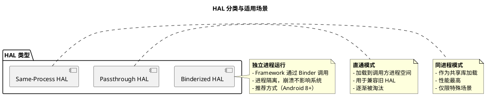
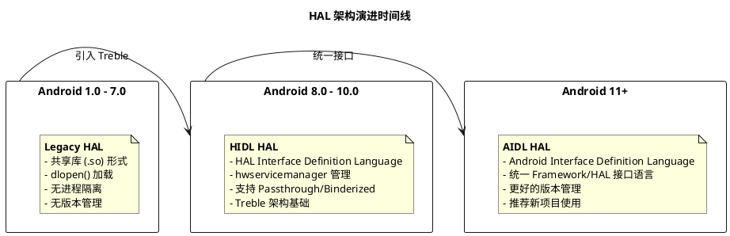
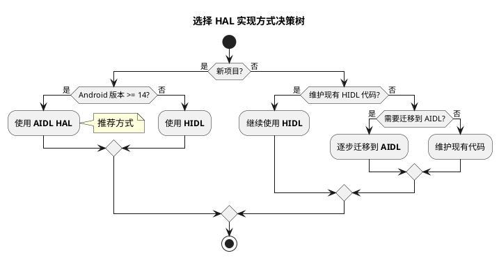
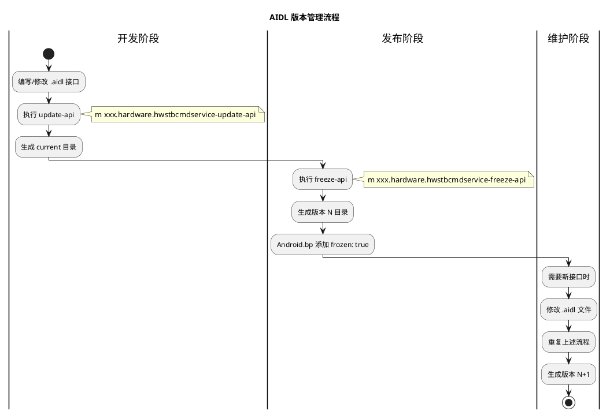
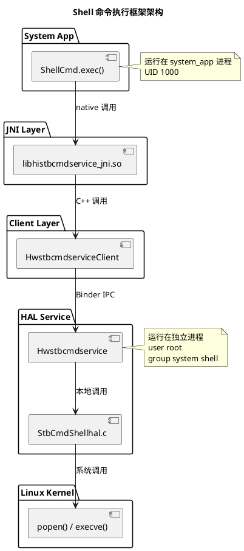
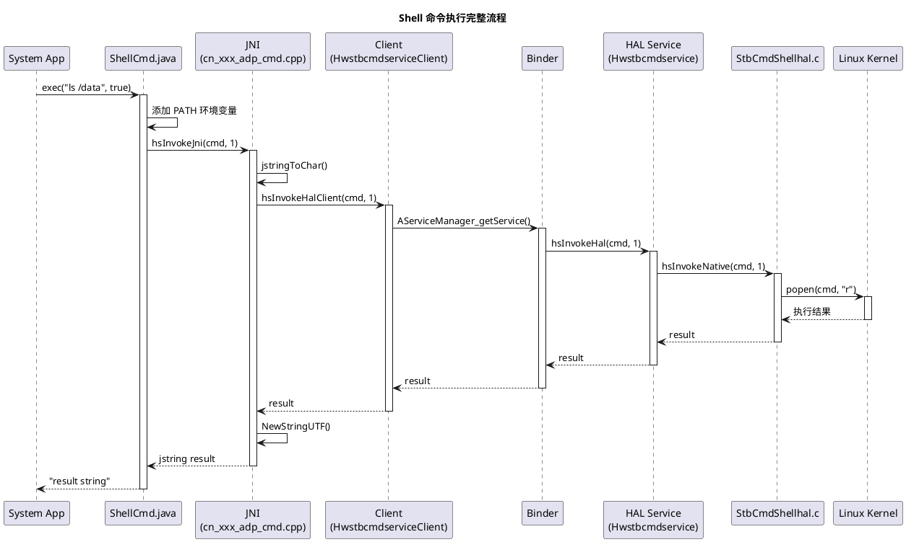

# HAL 硬件抽象层开发指南

> **文档信息**
> - **更新日期**: 2025-12-12
> - **适用版本**: Android 14 (AOSP)
> - **实践参考**: Shell 命令执行框架实现

---

## 目录

1. [概述](#1-概述)
2. [HAL 架构演进](#2-hal-架构演进)
3. [HIDL 接口开发](#3-hidl-接口开发)
4. [AIDL HAL 开发](#4-aidl-hal-开发)
5. [HAL 服务注册与发现](#5-hal-服务注册与发现)
6. [JNI 桥接层开发](#6-jni-桥接层开发)
7. [SELinux 权限配置](#7-selinux-权限配置)
8. [实战案例：Shell 命令执行框架](#8-实战案例shell-命令执行框架)
9. [调试与问题排查](#9-调试与问题排查)
10. [最佳实践](#10-最佳实践)

---

## 1. 概述

### 1.1 什么是 HAL

HAL（Hardware Abstraction Layer，硬件抽象层）是 Android 系统架构中的关键组件，位于 Linux 内核与 Android Framework 之间，提供标准化的硬件访问接口。

```
┌─────────────────────────────────────────────────────────────────┐
│                    Android 系统架构                              │
├─────────────────────────────────────────────────────────────────┤
│                                                                  │
│   ┌──────────────────────────────────────────────────────────┐  │
│   │                    Applications                           │  │
│   └──────────────────────────────────────────────────────────┘  │
│                              ↓                                   │
│   ┌──────────────────────────────────────────────────────────┐  │
│   │                 Android Framework                         │  │
│   │            (Java/Kotlin + Native Services)               │  │
│   └──────────────────────────────────────────────────────────┘  │
│                              ↓ Binder IPC                        │
│   ┌──────────────────────────────────────────────────────────┐  │
│   │                 HAL (Hardware Abstraction Layer)          │  │
│   │                                                           │  │
│   │  ┌─────────────┐  ┌─────────────┐  ┌─────────────┐       │  │
│   │  │  Audio HAL  │  │ Camera HAL  │  │ Display HAL │  ...  │  │
│   │  └─────────────┘  └─────────────┘  └─────────────┘       │  │
│   │                                                           │  │
│   │  ┌──────────────────────────────────────────────────┐    │  │
│   │  │           自定义 HAL (如 Shell 命令执行)          │    │  │
│   │  └──────────────────────────────────────────────────┘    │  │
│   └──────────────────────────────────────────────────────────┘  │
│                              ↓                                   │
│   ┌──────────────────────────────────────────────────────────┐  │
│   │                     Linux Kernel                          │  │
│   │           (Drivers, Filesystems, Network Stack)          │  │
│   └──────────────────────────────────────────────────────────┘  │
│                                                                  │
└─────────────────────────────────────────────────────────────────┘
```

### 1.2 HAL 的核心作用

| 作用 | 说明 |
|------|------|
| **硬件抽象** | 屏蔽底层硬件差异，提供统一接口 |
| **进程隔离** | Framework 与 HAL 运行在不同进程，提高稳定性 |
| **版本管理** | 支持接口版本演进，保证兼容性 |
| **安全隔离** | 通过 SELinux 限制 HAL 权限范围 |
| **独立升级** | 符合 Treble 架构，Vendor 可独立升级 |

### 1.3 HAL 分类



### 1.4 本项目 HAL 概览

本项目基于 Amlogic S905X5M 平台，涉及以下 HAL：

| HAL | 路径 | 说明 |
|-----|------|------|
| Audio HAL | `hardware/amlogic/audio/` | 音频输出/输入 |
| Display HAL | `hardware/amlogic/gralloc/` | 图形缓冲区分配 |
| TV Input HAL | `device/amlogic/common/tvinput/` | 电视输入源 |
| **自定义 Shell HAL** | `vendor/xxx/common/libraries/hwstbcmdapi/` | Shell 命令执行 |

---

## 2. HAL 架构演进

### 2.1 HAL 发展历程



### 2.2 三种 HAL 实现方式对比

| 特性 | Legacy HAL | HIDL | AIDL HAL |
|------|-----------|------|----------|
| **引入版本** | Android 1.0 | Android 8.0 | Android 11 |
| **接口定义** | C 头文件 | .hal 文件 | .aidl 文件 |
| **进程模型** | 同进程 | 独立进程/直通 | 独立进程 |
| **Binder 类型** | N/A | HwBinder | Binder |
| **服务管理** | dlopen | hwservicemanager | servicemanager |
| **版本管理** | 无 | 包名版本号 | 冻结版本 |
| **代码生成** | 无 | hidl-gen | aidl |
| **语言支持** | C/C++ | C++/Java | C++/Java/Rust |
| **推荐使用** | 不推荐 | 维护旧代码 | **新项目** |

### 2.3 Treble 架构

Android Treble 架构是 Android 8.0 引入的重大架构变更，核心目标是解耦 Framework 和 Vendor 代码：

```
┌─────────────────────────────────────────────────────────────────┐
│                      Treble 架构分层                             │
├─────────────────────────────────────────────────────────────────┤
│                                                                  │
│   ┌────────────────────────────────────────────────────────┐    │
│   │                    Framework (Google)                   │    │
│   │                    /system 分区                         │    │
│   └────────────────────────────────────────────────────────┘    │
│                              ↑                                   │
│                         VINTF 接口                              │
│                    (Vendor Interface)                           │
│                              ↓                                   │
│   ┌────────────────────────────────────────────────────────┐    │
│   │                    Vendor (OEM/ODM)                     │    │
│   │               /vendor + /odm 分区                       │    │
│   └────────────────────────────────────────────────────────┘    │
│                                                                  │
│   分区独立性:                                                    │
│   • Framework 可以单独 OTA 升级                                  │
│   • Vendor 可以保持不变                                          │
│   • 通过 VINTF Manifest 检查兼容性                               │
│                                                                  │
└─────────────────────────────────────────────────────────────────┘
```

### 2.4 如何选择 HAL 实现方式



---

## 3. HIDL 接口开发

### 3.1 HIDL 基础

HIDL（HAL Interface Definition Language）是 Android 8.0 引入的 HAL 接口定义语言。

#### 目录结构

```
hardware/interfaces/[hal_name]/[version]/
├── Android.bp              # 构建文件
├── I[ServiceName].hal      # 接口定义
├── types.hal               # 类型定义（可选）
└── default/
    ├── Android.bp
    ├── [ServiceName].h     # 服务头文件
    ├── [ServiceName].cpp   # 服务实现
    ├── service.cpp         # 服务入口
    └── [hal].rc            # init.rc 配置
```

### 3.2 定义 HIDL 接口

以 Shell 命令执行服务为例：

**文件**: `hardware/interfaces/hwstbcmdservice/1.0/IHwstbcmdservice.hal`

```java
package xxx.hardware.hwstbcmdservice@1.0;

interface IHwstbcmdservice {
    /**
     * 执行 Shell 命令
     * @param request 要执行的命令
     * @param type 执行类型：0-不返回结果，1-返回结果
     * @return result 命令执行结果
     */
    hsInvokeHal(string request, int32_t type) generates(string result);
};
```

#### HIDL 数据类型

| HIDL 类型 | C++ 类型 | Java 类型 |
|----------|----------|----------|
| `bool` | `bool` | `boolean` |
| `int8_t` | `int8_t` | `byte` |
| `int32_t` | `int32_t` | `int` |
| `int64_t` | `int64_t` | `long` |
| `float` | `float` | `float` |
| `double` | `double` | `double` |
| `string` | `hidl_string` | `String` |
| `vec<T>` | `hidl_vec<T>` | `T[]` |
| `handle` | `hidl_handle` | `NativeHandle` |

### 3.3 生成 HIDL 代码框架

```bash
# 1. 设置环境
source build/envsetup.sh
lunch [target]

# 2. 运行 update-makefiles.sh 生成构建文件
. vendor/xxx/hardware/interfaces/update-makefiles.sh

# 3. 生成代码框架（可选，用于参考）
hidl-gen -o /tmp/hidl-out \
         -Lc++-impl \
         -rxxx.hardware:vendor/xxx/hardware/interfaces \
         xxx.hardware.hwstbcmdservice@1.0
```

**update-makefiles.sh 示例**:

```bash
#!/bin/bash
source ./system/tools/hidl/update-makefiles-helper.sh

do_makefiles_update \
    "xxx.hardware:vendor/xxx/hardware/interfaces/" \
    "android.hardware:hardware/interfaces" \
    "android.hidl:system/libhidl/transport"
```

### 3.4 实现 HIDL 服务

#### 服务头文件

**文件**: `default/Hwstbcmdservice.h`

```cpp
#pragma once

#include <xxx/hardware/hwstbcmdservice/1.0/IHwstbcmdservice.h>
#include <hidl/MQDescriptor.h>
#include <hidl/Status.h>

namespace xxx {
namespace hardware {
namespace hwstbcmdservice {
namespace V1_0 {
namespace implementation {

using ::android::hardware::Return;
using ::android::hardware::Void;
using ::android::hardware::hidl_string;

class Hwstbcmdservice : public IHwstbcmdservice {
public:
    // 实现接口方法
    Return<void> hsInvokeHal(
        const hidl_string& request,
        int32_t type,
        hsInvokeHal_cb _hidl_cb) override;
};

}  // namespace implementation
}  // namespace V1_0
}  // namespace hwstbcmdservice
}  // namespace hardware
}  // namespace xxx
```

#### 服务实现

**文件**: `default/Hwstbcmdservice.cpp`

```cpp
#include "Hwstbcmdservice.h"
#include "StbCmdShellhal.h"  // 底层实现
#include <log/log.h>

namespace xxx {
namespace hardware {
namespace hwstbcmdservice {
namespace V1_0 {
namespace implementation {

Return<void> Hwstbcmdservice::hsInvokeHal(
    const hidl_string& request,
    int32_t type,
    hsInvokeHal_cb _hidl_cb)
{
    ALOGI("hsInvokeHal: cmd=%s, type=%d", request.c_str(), type);

    // 调用底层 HAL 实现
    const char* result = hsInvokeNative(request.c_str(), type);

    // 通过回调返回结果
    hidl_string cb(result ? result : "error");
    _hidl_cb(cb);

    return Void();
}

}  // namespace implementation
}  // namespace V1_0
}  // namespace hwstbcmdservice
}  // namespace hardware
}  // namespace xxx
```

#### 服务入口

**文件**: `default/service.cpp`

```cpp
#define LOG_TAG "hwstbcmdservice"

#include <android/hardware/configstore/1.0/ISurfaceFlingerConfigs.h>
#include <hidl/HidlTransportSupport.h>
#include <binder/ProcessState.h>
#include "Hwstbcmdservice.h"

using xxx::hardware::hwstbcmdservice::V1_0::IHwstbcmdservice;
using xxx::hardware::hwstbcmdservice::V1_0::implementation::Hwstbcmdservice;
using android::hardware::configureRpcThreadpool;
using android::hardware::joinRpcThreadpool;

int main() {
    // 使用 vndbinder（Vendor Binder）
    android::ProcessState::initWithDriver("/dev/vndbinder");
    android::ProcessState::self()->setThreadPoolMaxThreadCount(4);
    android::ProcessState::self()->startThreadPool();

    // 配置 Binder 线程池
    configureRpcThreadpool(1, true /* callerWillJoin */);

    // 创建并注册服务
    android::sp<IHwstbcmdservice> service = new Hwstbcmdservice();
    android::status_t status = service->registerAsService("default");

    if (status != android::OK) {
        ALOGE("Failed to register service: %d", status);
        return 1;
    }

    ALOGI("hwstbcmdservice started");
    joinRpcThreadpool();

    return 0;
}
```

### 3.5 配置 HIDL 服务启动

**文件**: `default/xxx.hardware.hwstbcmdservice@1.0-service.rc`

```bash
service hwstbcmdservice-1-0 /vendor/bin/hw/xxx.hardware.hwstbcmdservice@1.0-service
    class hal
    user root
    group root system shell
    disabled
    oneshot

on property:sys.boot_completed=1
    start hwstbcmdservice-1-0
```

#### init.rc 关键配置说明

| 配置项 | 说明 |
|--------|------|
| `class hal` | 服务分类，boot 完成后自动启动 |
| `user root` | 以 root 用户运行（需要执行特权命令） |
| `group root system shell` | 所属用户组 |
| `disabled` | 默认禁用，需要手动或属性触发启动 |
| `oneshot` | 只执行一次，不自动重启 |

### 3.6 构建配置

**文件**: `default/Android.bp`

```python
cc_binary {
    name: "xxx.hardware.hwstbcmdservice@1.0-service",
    relative_install_path: "hw",
    vendor: true,
    init_rc: ["xxx.hardware.hwstbcmdservice@1.0-service.rc"],

    srcs: [
        "Hwstbcmdservice.cpp",
        "service.cpp",
    ],

    shared_libs: [
        "libhidlbase",
        "libhidltransport",
        "libutils",
        "liblog",
        "libhwbinder",
        "libcutils",
        "xxx.hardware.hwstbcmdservice@1.0",
        "libstbcmdservicehal",  // 底层实现库
    ],
}
```

### 3.7 HIDL 客户端调用

```cpp
#include <xxx/hardware/hwstbcmdservice/1.0/IHwstbcmdservice.h>

using xxx::hardware::hwstbcmdservice::V1_0::IHwstbcmdservice;

char* invokeShellCommand(const char* cmd, int type) {
    static char result[4096] = {0};

    // 获取 HIDL 服务
    android::sp<IHwstbcmdservice> service = IHwstbcmdservice::getService();
    if (service == nullptr) {
        ALOGE("Failed to get hwstbcmdservice");
        strcpy(result, "service_not_available");
        return result;
    }

    // 调用接口方法
    service->hsInvokeHal(cmd, type, [&](const hidl_string& reply) {
        strncpy(result, reply.c_str(), sizeof(result) - 1);
    });

    return result;
}
```

---

## 4. AIDL HAL 开发

### 4.1 AIDL HAL 简介

从 Android 11 开始，Google 推荐使用 AIDL 替代 HIDL 开发新的 HAL。AIDL HAL 具有以下优势：

- **统一接口语言**: Framework 和 HAL 使用同一种接口语言
- **更好的工具支持**: 与现有 AIDL 工具链集成
- **版本管理**: 支持接口版本冻结和演进
- **多语言支持**: C++、Java、Rust

### 4.2 AIDL HAL 目录结构

```
vendor/[company]/libraries/[hal_name]/aidl/
├── Android.bp                          # 主构建文件
├── [package/path]/IServiceName.aidl    # 接口定义
├── aidl_api/                           # 版本快照（自动生成）
│   ├── current/
│   └── 1/
├── service/                            # 服务端实现
│   ├── ServiceName.cpp
│   └── service_name.rc
└── client/                             # 客户端库（可选）
    ├── ServiceNameClient.cpp
    └── ServiceNameClient.h
```

### 4.3 定义 AIDL 接口

**文件**: `aidl/xxx/hardware/hwstbcmdservice/IHwstbcmdservice.aidl`

```java
package xxx.hardware.hwstbcmdservice;

/**
 * Shell 命令执行服务接口
 *
 * @VintfStability 标记为 VINTF 稳定接口，可跨 system/vendor 分区调用
 */
@VintfStability
interface IHwstbcmdservice {
    /**
     * 执行 Shell 命令
     *
     * @param request 要执行的命令
     * @param type 执行类型：0-不返回结果，1-返回结果
     * @return 命令执行结果
     */
    String hsInvokeHal(String request, int type);
}
```

### 4.4 AIDL 构建配置

**文件**: `aidl/Android.bp`

```python
// ==============================================
// AIDL 接口定义
// ==============================================
aidl_interface {
    name: "xxx.hardware.hwstbcmdservice",
    owner: "xxx.hardware.hwstbcmdservice",  // 必须设置 owner（release 分支要求）
    vendor_available: true,                   // vendor 分区可用
    host_supported: true,                     // 支持 host 编译（测试用）
    stability: "vintf",                       // VINTF 稳定性

    srcs: ["xxx/hardware/hwstbcmdservice/IHwstbcmdservice.aidl"],

    backend: {
        cpp: { enabled: true },               // 生成 C++ 绑定
        java: { enabled: true },              // 生成 Java 绑定
        ndk: { enabled: true },               // 生成 NDK 绑定
    },

    // 冻结版本后自动添加
    versions_with_info: [
        {
            version: "1",
            imports: [],
        },
    ],
    frozen: true,
}
```

### 4.5 AIDL 版本管理

#### 版本管理流程



#### 版本管理命令

```bash
# 1. 更新 API（开发时）
m xxx.hardware.hwstbcmdservice-update-api

# 2. 冻结版本（发布前）
m xxx.hardware.hwstbcmdservice-freeze-api

# 3. 生成 NDK 绑定
m xxx.hardware.hwstbcmdservice-V1-ndk

# 4. 生成 Java 绑定
m xxx.hardware.hwstbcmdservice-V1-java
```

### 4.6 实现 AIDL 服务端

**文件**: `aidl/service/Hwstbcmdservice.cpp`

```cpp
#include <android/binder_manager.h>
#include <android/binder_process.h>
#include <log/log.h>

#include <aidl/xxx/hardware/hwstbcmdservice/IHwstbcmdservice.h>
#include <aidl/xxx/hardware/hwstbcmdservice/BnHwstbcmdservice.h>

// 底层实现
extern "C" {
#include "StbCmdShellhal.h"
}

using ::ndk::ScopedAStatus;

namespace aidl {
namespace xxx {
namespace hardware {
namespace hwstbcmdservice {

class Hwstbcmdservice : public BnHwstbcmdservice {
public:
    ScopedAStatus hsInvokeHal(
        const std::string& request,
        int32_t type,
        std::string* _aidl_return) override
    {
        ALOGI("Hwstbcmdservice::hsInvokeHal cmd=%s type=%d",
              request.c_str(), type);

        // 调用底层实现
        char* result = hsInvokeNative(request.c_str(), type);
        if (result) {
            *_aidl_return = result;
        } else {
            *_aidl_return = std::string();
        }

        ALOGI("Hwstbcmdservice::hsInvokeHal result=%s",
              _aidl_return->c_str());
        return ScopedAStatus::ok();
    }
};

}  // namespace hwstbcmdservice
}  // namespace hardware
}  // namespace xxx
}  // namespace aidl

int main() {
    ALOGI("Starting xxx.hardware.hwstbcmdservice AIDL service");

    // 配置 Binder 线程池
    ABinderProcess_setThreadPoolMaxThreadCount(4);
    ABinderProcess_startThreadPool();

    // 创建服务实例
    auto service = ndk::SharedRefBase::make<
        aidl::xxx::hardware::hwstbcmdservice::Hwstbcmdservice>();

    // 注册服务
    const std::string instance = std::string() +
        aidl::xxx::hardware::hwstbcmdservice::IHwstbcmdservice::descriptor +
        "/default";

    ndk::SpAIBinder binder = service->asBinder();
    binder_status_t status = AServiceManager_addService(
        binder.get(), instance.c_str());

    if (status != STATUS_OK) {
        ALOGE("Failed to register service: %d", status);
        return 1;
    }

    ALOGI("Service registered: %s", instance.c_str());
    ABinderProcess_joinThreadPool();

    return 0;
}
```

### 4.7 服务启动配置

**文件**: `aidl/service/xxx.hardware.hwstbcmdservice-aidl-service.rc`

```bash
# Android Init Language 语法
service vendor.hwstbcmdservice-aidl /vendor/bin/hw/xxx.hardware.hwstbcmdservice-aidl-service
    class hal                          # 属于 HAL 服务类
    user root                          # root 用户运行（需要特权操作）
    group system shell log readproc    # 用户组
    capabilities NET_ADMIN SYS_TIME    # Linux Capabilities
    seclabel u:r:hal_hwstbcmdservice:s0  # SELinux 上下文
```

> **重要说明**:
> - 必须使用 `root` 用户才能执行特权操作（如操作 `/data` 分区）
> - `group shell` 是必须的，因为 `/data/local/tmp/` 属于 shell 用户
> - `seclabel` 必须与 SELinux 策略中定义的域匹配

### 4.8 服务端构建配置

**文件**: `aidl/Android.bp`（服务端部分）

```python
// ==============================================
// AIDL 服务端可执行文件
// ==============================================
cc_binary {
    name: "xxx.hardware.hwstbcmdservice-aidl-service",
    vendor: true,
    relative_install_path: "hw",

    srcs: [
        "service/Hwstbcmdservice.cpp",
    ],

    shared_libs: [
        "libbinder_ndk",
        "liblog",
        "libcutils",
        "libutils",
        "xxx.hardware.hwstbcmdservice-V1-ndk",  // AIDL NDK 绑定
        "libstbcmdservicehal",                    // 底层实现库
    ],

    include_dirs: [
        "vendor/xxx/common/libraries/hwstbcmdapi/aidl_wrapper",
    ],

    init_rc: ["service/xxx.hardware.hwstbcmdservice-aidl-service.rc"],

    cflags: [
        "-Wall",
        "-Werror",
    ],
}
```

### 4.9 实现 AIDL 客户端

#### C++ 客户端

**文件**: `aidl/client/HwstbcmdserviceClient.cpp`

```cpp
#include "HwstbcmdserviceClient.h"

#include <android/binder_manager.h>
#include <log/log.h>
#include <aidl/xxx/hardware/hwstbcmdservice/IHwstbcmdservice.h>

using aidl::xxx::hardware::hwstbcmdservice::IHwstbcmdservice;

namespace android {

char* HwstbcmdserviceClient::hsInvokeHalClient(char* request, int type) {
    ALOGI("HwstbcmdserviceClient::hsInvokeHalClient cmd=%s type=%d",
          request, type);

    static char result[4096] = {0};
    const std::string instance = std::string() +
        IHwstbcmdservice::descriptor + "/default";

    // 检查服务是否声明
    if (!AServiceManager_isDeclared(instance.c_str())) {
        ALOGE("Service not declared: %s", instance.c_str());
        strcpy(result, "service_not_declared");
        return result;
    }

    // 获取服务（注意：使用 getService 而非 waitForService）
    ndk::SpAIBinder binder(AServiceManager_getService(instance.c_str()));
    auto service = IHwstbcmdservice::fromBinder(binder);

    if (service == nullptr) {
        ALOGE("Failed to get service");
        strcpy(result, "service_not_available");
        return result;
    }

    // 调用服务方法
    std::string reply;
    auto status = service->hsInvokeHal(request, type, &reply);

    if (status.isOk()) {
        strncpy(result, reply.c_str(), sizeof(result) - 1);
    } else {
        ALOGE("Call failed: %s", status.getDescription().c_str());
        strcpy(result, "error");
    }

    return result;
}

}  // namespace android
```

> **重要**: 必须使用 `AServiceManager_getService` 而非 `AServiceManager_waitForService`，否则会触发 Binder 稳定性域限制错误。

#### Java 客户端

**文件**: `java/cn/xxx/shellcmd/HwstbcmdserviceClient.java`

```java
package cn.xxx.shellcmd;

import android.os.RemoteException;
import android.os.IBinder;
import android.os.ServiceManager;
import android.util.Log;

import xxx.hardware.hwstbcmdservice.IHwstbcmdservice;

public class HwstbcmdserviceClient {
    private static final String TAG = "HwstbcmdserviceClient";
    private static final String SERVICE_NAME =
        IHwstbcmdservice.DESCRIPTOR + "/default";

    private static IHwstbcmdservice getService() {
        try {
            IBinder binder = ServiceManager.getService(SERVICE_NAME);
            if (binder == null) {
                Log.e(TAG, "Failed to get service: " + SERVICE_NAME);
                return null;
            }
            return IHwstbcmdservice.Stub.asInterface(binder);
        } catch (Exception e) {
            Log.e(TAG, "Exception while getting service", e);
            return null;
        }
    }

    public static String hsInvokeHalClient(String request, int type) {
        IHwstbcmdservice service = getService();
        if (service == null) {
            return "service_not_available";
        }

        try {
            return service.hsInvokeHal(request, type);
        } catch (RemoteException e) {
            Log.e(TAG, "RemoteException", e);
            return "error";
        }
    }
}
```

### 4.10 AIDL 稳定性域问题

#### 问题现象

```
E BpBinder: Cannot do a user transaction on a vendor stability binder
(xxx.hardware.hwstbcmdservice.IHwstbcmdservice) in a system stability context.
```

#### 原因分析

```
┌─────────────────────────────────────────────────────────────────┐
│                    Binder 稳定性域                              │
├─────────────────────────────────────────────────────────────────┤
│                                                                  │
│   ┌──────────────────────┐     ┌──────────────────────┐         │
│   │   System Stability   │     │   Vendor Stability   │         │
│   │                      │  X  │                      │         │
│   │   - framework        │ ──→ │   - vendor HAL       │         │
│   │   - system_server    │     │   - vendor service   │         │
│   │   - system app       │     │                      │         │
│   └──────────────────────┘     └──────────────────────┘         │
│                                                                  │
│   默认情况下，system stability 的调用方无法直接调用              │
│   vendor stability 的 binder。                                  │
│                                                                  │
└─────────────────────────────────────────────────────────────────┘
```

#### 解决方案

1. **使用 `AServiceManager_getService`**（推荐）
   - 通过 ServiceManager 获取服务，绕过稳定性检查

2. **设置 `stability: "vintf"`**
   - 在 `Android.bp` 中声明接口为 VINTF 稳定
   - 允许跨分区调用

3. **声明 `@VintfStability`**
   - 在 AIDL 接口中添加注解
   - 标记接口可跨 system/vendor 调用

---

## 5. HAL 服务注册与发现

### 5.1 服务管理器对比

| 特性 | hwservicemanager (HIDL) | servicemanager (AIDL) |
|------|------------------------|----------------------|
| **Binder 类型** | HwBinder (/dev/hwbinder) | Binder (/dev/binder) |
| **命令查看** | `lshal` | `dumpsys -l` |
| **注册方式** | `registerAsService()` | `AServiceManager_addService()` |
| **获取方式** | `getService()` | `AServiceManager_getService()` |

### 5.2 VINTF Manifest 配置

VINTF（Vendor Interface）用于声明设备提供的 HAL 服务：

#### Device Manifest（设备侧声明）

**文件**: `device/[vendor]/[device]/manifest.xml`

```xml
<manifest version="1.0" type="device">
    <!-- HIDL HAL -->
    <hal format="hidl">
        <name>xxx.hardware.hwstbcmdservice</name>
        <transport>hwbinder</transport>
        <version>1.0</version>
        <interface>
            <name>IHwstbcmdservice</name>
            <instance>default</instance>
        </interface>
    </hal>

    <!-- AIDL HAL -->
    <hal format="aidl">
        <name>xxx.hardware.hwstbcmdservice</name>
        <version>1</version>
        <fqname>IHwstbcmdservice/default</fqname>
    </hal>
</manifest>
```

#### Compatibility Matrix（兼容性矩阵）

**文件**: `device/[vendor]/[device]/compatibility_matrix.xml`

```xml
<compatibility-matrix version="1.0" type="framework">
    <!-- HIDL HAL -->
    <hal format="hidl" optional="true">
        <name>xxx.hardware.hwstbcmdservice</name>
        <version>1.0</version>
        <interface>
            <name>IHwstbcmdservice</name>
            <instance>default</instance>
        </interface>
    </hal>

    <!-- AIDL HAL -->
    <hal format="aidl" optional="true">
        <name>xxx.hardware.hwstbcmdservice</name>
        <version>1</version>
        <interface>
            <name>IHwstbcmdservice</name>
            <instance>default</instance>
        </interface>
    </hal>
</compatibility-matrix>
```

### 5.3 查看注册的服务

```bash
# HIDL 服务
adb shell lshal | grep hwstbcmdservice

# AIDL 服务
adb shell dumpsys -l | grep hwstbcmdservice

# 检查服务是否运行
adb shell ps -A | grep hwstbcmdservice
```

---

## 6. JNI 桥接层开发

### 6.1 JNI 概述

JNI（Java Native Interface）是 Java 与 Native 代码（C/C++）之间的桥梁：

```
┌─────────────────────────────────────────────────────────────────┐
│                       JNI 调用流程                              │
├─────────────────────────────────────────────────────────────────┤
│                                                                  │
│   ┌─────────────────────┐                                       │
│   │    Java 层          │                                       │
│   │  ShellCmd.java      │                                       │
│   │  native hsInvokeJni │                                       │
│   └──────────┬──────────┘                                       │
│              │ JNI 调用                                         │
│              ▼                                                   │
│   ┌─────────────────────┐                                       │
│   │    JNI 层           │                                       │
│   │  cn_xxx_adp_cmd.cpp│                                       │
│   │  libhistbcmdservice_jni.so                                  │
│   └──────────┬──────────┘                                       │
│              │ Native 调用                                      │
│              ▼                                                   │
│   ┌─────────────────────┐                                       │
│   │   HIDL/AIDL 客户端  │                                       │
│   │  HwstbcmdserviceClient                                      │
│   └──────────┬──────────┘                                       │
│              │ Binder IPC                                       │
│              ▼                                                   │
│   ┌─────────────────────┐                                       │
│   │   HAL 服务端        │                                       │
│   │  Hwstbcmdservice    │                                       │
│   └─────────────────────┘                                       │
│                                                                  │
└─────────────────────────────────────────────────────────────────┘
```

### 6.2 Java 层声明 Native 方法

**文件**: `java/cn/xxx/shellcmd/ShellCmd.java`

```java
package cn.xxx.shellcmd;

public class ShellCmd {

    // 声明 native 方法
    public static native String hsInvokeJni(String cmd, int type);

    // 加载动态库
    static {
        System.loadLibrary("histbcmdservice_jni");
    }

    /**
     * 执行 Shell 命令
     *
     * @param cmd 要执行的命令
     * @param isReturn 是否返回结果
     * @return 命令执行结果
     */
    public static String exec(String cmd, boolean isReturn) {
        // 添加 PATH 环境变量
        String fullCmd = "PATH=/system/bin:/system/xbin:" +
                        "/vendor/bin:/vendor/xbin " + cmd;

        if (isReturn) {
            return hsInvokeJni(fullCmd, 1);  // 返回结果
        } else {
            return hsInvokeJni(fullCmd, 0);  // 不返回结果
        }
    }
}
```

### 6.3 生成 JNI 头文件

```bash
cd vendor/xxx/common/libraries/hwstbcmdapi/java

# 一键生成 .class 和 .h 文件
javac -h ../jni cn/xxx/shellcmd/ShellCmd.java
```

**生成的头文件**: `jni/cn_xxx_shellcmd_ShellCmd.h`

```c
#include <jni.h>

#ifndef _Included_cn_xxx_shellcmd_ShellCmd
#define _Included_cn_xxx_shellcmd_ShellCmd
#ifdef __cplusplus
extern "C" {
#endif

JNIEXPORT jstring JNICALL Java_cn_xxx_shellcmd_ShellCmd_hsInvokeJni
  (JNIEnv *, jclass, jstring, jint);

#ifdef __cplusplus
}
#endif
#endif
```

### 6.4 实现 JNI 函数

**文件**: `jni/cn_xxx_adp_cmd.cpp`

```cpp
#include <jni.h>
#include <string.h>
#include <stdlib.h>
#include <utils/Log.h>
#include <android_runtime/AndroidRuntime.h>

// AIDL 客户端（或 HIDL 客户端）
#include "HwstbcmdserviceClient.h"

#define LOG_TAG "ShellCmd_JNI"

/**
 * 将 Java String 转换为 C 字符串
 * 处理 UTF-8 编码
 */
static char* jstringToChar(JNIEnv* env, jstring jstr) {
    char* rtn = NULL;

    jclass clsstring = env->FindClass("java/lang/String");
    jstring strencode = env->NewStringUTF("utf-8");
    jmethodID mid = env->GetMethodID(clsstring, "getBytes",
                                     "(Ljava/lang/String;)[B");

    jbyteArray barr = (jbyteArray)env->CallObjectMethod(jstr, mid, strencode);
    jsize alen = env->GetArrayLength(barr);
    jbyte* ba = env->GetByteArrayElements(barr, JNI_FALSE);

    if (alen > 0) {
        rtn = (char*)malloc(alen + 1);
        memcpy(rtn, ba, alen);
        rtn[alen] = 0;
    }

    env->ReleaseByteArrayElements(barr, ba, 0);
    return rtn;
}

/**
 * JNI 方法实现
 * 函数名格式: Java_包名_类名_方法名
 */
JNIEXPORT jstring JNICALL Java_cn_xxx_shellcmd_ShellCmd_hsInvokeJni(
    JNIEnv* env,
    jclass clazz,
    jstring request,
    jint type)
{
    ALOGI("JNI hsInvokeJni called, type=%d", type);

    // 参数验证
    if (request == NULL) {
        return env->NewStringUTF("error: null request");
    }

    // 转换字符串
    char* requestStr = jstringToChar(env, request);
    if (requestStr == NULL) {
        return env->NewStringUTF("error: string conversion failed");
    }

    ALOGI("JNI hsInvokeJni cmd=%s", requestStr);

    // 调用客户端（AIDL 或 HIDL）
    char* reply = android::HwstbcmdserviceClient::hsInvokeHalClient(
        requestStr, type);

    ALOGI("JNI hsInvokeJni reply=%s", reply);

    // 转换结果
    jstring result = env->NewStringUTF(reply ? reply : "error");

    // 释放资源
    free(requestStr);

    return result;
}

// ============================
// JNI 动态注册
// ============================

static JNINativeMethod gMethods[] = {
    {
        "hsInvokeJni",
        "(Ljava/lang/String;I)Ljava/lang/String;",
        (void*)Java_cn_xxx_shellcmd_ShellCmd_hsInvokeJni
    },
};

static int registerNativeMethods(JNIEnv* env) {
    return android::AndroidRuntime::registerNativeMethods(
        env,
        "cn/xxx/shellcmd/ShellCmd",
        gMethods,
        sizeof(gMethods) / sizeof(gMethods[0])
    );
}

jint JNI_OnLoad(JavaVM* vm, void* reserved) {
    JNIEnv* env = NULL;

    if (vm->GetEnv((void**)&env, JNI_VERSION_1_4) != JNI_OK) {
        ALOGE("JNI_OnLoad: GetEnv failed");
        return -1;
    }

    if (registerNativeMethods(env) < 0) {
        ALOGE("JNI_OnLoad: registerNativeMethods failed");
        return -1;
    }

    ALOGI("JNI_OnLoad: success");
    return JNI_VERSION_1_4;
}
```

### 6.5 JNI 构建配置

**文件**: `jni/Android.mk`

```makefile
LOCAL_PATH := $(call my-dir)

include $(CLEAR_VARS)

LOCAL_MODULE := libhistbcmdservice_jni
LOCAL_MODULE_TAGS := optional
LOCAL_MULTILIB := both  # 32/64 位

LOCAL_CFLAGS := -DANDROID_NDK

LOCAL_SRC_FILES := cn_xxx_adp_cmd.cpp

LOCAL_C_INCLUDES += \
    $(JNI_H_INCLUDE) \
    $(LOCAL_PATH)/../aidl/client \
    $(TOP)/frameworks/base/core/jni

LOCAL_SHARED_LIBRARIES := \
    libandroid_runtime \
    libbinder \
    libutils \
    libcutils \
    liblog \
    libnativehelper \
    libhistbcmdservicemanageclient-aidl  # AIDL 客户端库

include $(BUILD_SHARED_LIBRARY)
```

### 6.6 JNI 常见错误与解决

| 错误 | 原因 | 解决方案 |
|------|------|---------|
| `UnsatisfiedLinkError` | 库未找到或方法签名不匹配 | 检查库名和方法签名 |
| `SIGABRT` | JNI 调用后未释放资源 | 使用 `ReleaseStringUTFChars` |
| 内存泄漏 | 未释放 JNI 分配的内存 | 使用 `free()` 或智能指针 |
| 乱码 | 字符编码问题 | 使用 UTF-8 转换函数 |

---

## 7. SELinux 权限配置

### 7.1 SELinux 基础

SELinux（Security-Enhanced Linux）是 Android 安全框架的核心组件：

```
┌─────────────────────────────────────────────────────────────────┐
│                    SELinux 访问控制模型                          │
├─────────────────────────────────────────────────────────────────┤
│                                                                  │
│   主体 (Subject)          客体 (Object)                         │
│   ┌─────────────┐         ┌─────────────┐                       │
│   │   进程      │  请求   │   资源      │                       │
│   │  (Domain)   │ ─────→  │  (Type)     │                       │
│   └─────────────┘         └─────────────┘                       │
│          │                        │                              │
│          ▼                        ▼                              │
│   ┌─────────────────────────────────────────┐                   │
│   │            SELinux 策略检查              │                   │
│   │                                          │                   │
│   │   allow domain type : class { perms };  │                   │
│   │                                          │                   │
│   └─────────────────────────────────────────┘                   │
│                      │                                           │
│          ┌──────────┴──────────┐                                │
│          ▼                     ▼                                 │
│   ┌─────────────┐       ┌─────────────┐                         │
│   │   允许      │       │   拒绝      │                         │
│   └─────────────┘       └─────────────┘                         │
│                                                                  │
└─────────────────────────────────────────────────────────────────┘
```

### 7.2 HAL 服务 SELinux 配置

以 Shell 命令执行服务为例，需要配置以下文件：

#### 目录结构

```
vendor/xxx/common/sepolicy/
├── aidl_hwstbcmdservice.te    # 服务域定义
├── file_contexts              # 文件上下文
├── hwservice_contexts         # HAL 服务上下文
└── system_app.te              # 调用方权限
```

### 7.3 定义服务域

**文件**: `sepolicy/aidl_hwstbcmdservice.te`

```bash
# ====================================================
# 类型声明
# ====================================================

# 定义服务进程的 SELinux 域
type aidl_hwstbcmdservice, domain;

# 定义可执行文件类型
type aidl_hwstbcmdservice_exec, exec_type, vendor_file_type, file_type;

# 定义 HAL 服务类型（用于 hwservicemanager）
type aidl_hwstbcmdservice_hwservice, hwservice_manager_type;

# ====================================================
# 域转换
# ====================================================

# 允许 init 启动此服务（建立 daemon 域）
init_daemon_domain(aidl_hwstbcmdservice)

# ====================================================
# Binder 权限
# ====================================================

# 允许使用 Binder 机制
binder_use(aidl_hwstbcmdservice)

# 允许使用 Vendor Binder（vndbinder）
vndbinder_use(aidl_hwstbcmdservice)

# ====================================================
# 属性访问
# ====================================================

# 允许读取 hwservicemanager 属性
get_prop(aidl_hwstbcmdservice, hwservicemanager_prop)

# ====================================================
# Linux Capabilities
# ====================================================

# 授予必要的 Linux 能力
allow aidl_hwstbcmdservice aidl_hwstbcmdservice:capability {
    sys_nice         # 调整进程优先级
    net_raw          # 原始网络访问
    net_admin        # 网络管理
    setgid           # 设置 GID
    setuid           # 设置 UID
    sys_time         # 设置系统时间
    chown            # 改变文件所有者
    sys_admin        # 系统管理
    net_bind_service # 绑定特权端口
};

# capability2 权限
allow aidl_hwstbcmdservice aidl_hwstbcmdservice:capability2 {
    syslog           # 写系统日志
};

# ====================================================
# 文件访问权限
# ====================================================

# 允许执行 shell 命令
allow aidl_hwstbcmdservice shell_exec:file {
    read open execute execute_no_trans
};

# 允许访问 /system/bin 下的工具
allow aidl_hwstbcmdservice system_file:file {
    read open execute execute_no_trans
};

# 允许访问 /vendor/bin 下的工具
allow aidl_hwstbcmdservice vendor_file:file {
    read open execute execute_no_trans
};

# 允许在 /data/local/tmp 创建文件
allow aidl_hwstbcmdservice shell_data_file:dir {
    search write add_name create
};
allow aidl_hwstbcmdservice shell_data_file:file {
    create write open getattr
};

# ====================================================
# 进程间通信
# ====================================================

# 允许使用管道（popen 需要）
allow aidl_hwstbcmdservice aidl_hwstbcmdservice:fifo_file {
    read write create open getattr
};

# 允许 fork 子进程
allow aidl_hwstbcmdservice self:process {
    fork signal
};
```

### 7.4 配置文件上下文

**文件**: `sepolicy/file_contexts`

```bash
# 可执行文件的 SELinux 标签
/vendor/bin/hw/xxx\.hardware\.hwstbcmdservice-aidl-service    u:object_r:aidl_hwstbcmdservice_exec:s0
/vendor/bin/hw/xxx\.hardware\.hwstbcmdservice@1\.0-service    u:object_r:aidl_hwstbcmdservice_exec:s0
```

### 7.5 配置服务上下文

**文件**: `sepolicy/hwservice_contexts`

```bash
# AIDL 服务
aidl/xxx/hardware/hwstbcmdservice/IHwstbcmdservice/default    u:object_r:aidl_hwstbcmdservice_hwservice:s0

# HIDL 服务
xxx.hardware.hwstbcmdservice::IHwstbcmdservice                u:object_r:aidl_hwstbcmdservice_hwservice:s0
```

### 7.6 配置调用方权限

**文件**: `sepolicy/system_app.te`

```bash
# ====================================================
# 允许 system_app 调用 HAL 服务
# ====================================================

# 允许 Binder 调用
allow system_app aidl_hwstbcmdservice:binder { call transfer };

# 允许查找 HAL 服务
allow system_app aidl_hwstbcmdservice_hwservice:service_manager { find };

# ====================================================
# 属性访问（可选）
# ====================================================

# 允许读取 DNS 属性
allow system_app net_dns_prop:file { map };

# 允许读取 apexd 属性
allow system_app apexd_prop:file { open getattr };

# 允许读取启动时间属性
allow system_app boottime_prop:file { open getattr map };
```

### 7.7 SELinux 调试

#### 查看 SELinux 模式

```bash
# 查看当前模式
adb shell getenforce

# 临时设置为 Permissive（仅调试用）
adb shell setenforce 0
```

#### 查看 avc 拒绝日志

```bash
# 实时查看 SELinux 拒绝日志
adb logcat | grep avc

# 示例输出:
# avc: denied { execute } for comm="hwstbcmdservice"
#      path="/system/bin/sh" dev="dm-0" ino=123
#      scontext=u:r:aidl_hwstbcmdservice:s0
#      tcontext=u:object_r:shell_exec:s0
#      tclass=file permissive=0
```

#### 生成 SELinux 规则

```bash
# 从 avc 日志生成规则（使用 audit2allow）
adb shell dmesg | grep avc | audit2allow -p policy
```

---

## 8. 实战案例：Shell 命令执行框架

本节基于实际项目经验，详细介绍 Shell 命令执行框架的完整实现。

### 8.1 需求分析

**场景**: System App 需要执行高权限 Shell 命令，如：
- 系统属性读写（`getprop`/`setprop`）
- 网络配置修改（`ifconfig`、`ip`）
- 文件操作（需要 root 权限的目录）
- OEM 特殊功能（如 OEMKEY 写入）

**挑战**:
- System App 运行在 UID 1000（system），无 root 权限
- SELinux 限制 system_app 直接执行 Shell 命令
- 需要安全隔离，避免任意命令执行

### 8.2 架构设计



### 8.3 三种实现方案对比

| 方案 | 架构 | 优点 | 缺点 |
|------|------|------|------|
| **方案一** | JNI + HIDL | 进程隔离好，稳定 | 架构复杂 |
| **方案二** | JNI + AIDL (C++) | 接口标准化，版本管理 | 需处理稳定性域 |
| **方案三** | AIDL (纯 Java) | 架构简洁，代码少 | 无 JNI 层灵活性 |

### 8.4 完整调用流程



### 8.5 底层 HAL 实现

**文件**: `aidl_wrapper/StbCmdShellhal.c`

```c
#include <stdio.h>
#include <stdlib.h>
#include <string.h>

#define BUFFER_MAX 4096

static char result_buffer[BUFFER_MAX];

/**
 * 执行 Shell 命令
 *
 * @param cmd 要执行的命令
 * @param type 0-不返回结果，1-返回结果
 * @return 命令执行结果
 */
char* hsInvokeNative(const char* cmd, int type) {
    memset(result_buffer, 0, sizeof(result_buffer));

    if (cmd == NULL || strlen(cmd) == 0) {
        strcpy(result_buffer, "error: empty command");
        return result_buffer;
    }

    // 使用 popen 执行命令
    FILE* fp = popen(cmd, "r");
    if (fp == NULL) {
        strcpy(result_buffer, "error: popen failed");
        return result_buffer;
    }

    if (type == 1) {
        // 读取命令输出
        size_t total = 0;
        while (fgets(result_buffer + total,
                     BUFFER_MAX - total - 1, fp) != NULL) {
            total = strlen(result_buffer);
            if (total >= BUFFER_MAX - 1) break;
        }
    }

    int status = pclose(fp);

    if (type == 0) {
        // 不需要返回结果时，返回执行状态
        snprintf(result_buffer, BUFFER_MAX, "%d",
                 WEXITSTATUS(status));
    }

    return result_buffer;
}
```

### 8.6 产品集成配置

**文件**: `device-xxx.mk`

```makefile
# ====================================================
# Shell 命令执行框架
# ====================================================

# AIDL 服务端
PRODUCT_PACKAGES += \
    xxx.hardware.hwstbcmdservice-aidl-service

# 方案一/二需要的包
# PRODUCT_PACKAGES += \
#     libhistbcmdservice_jni \
#     libhistbcmdservicemanageclient-aidl

# 方案三（纯 Java）需要的包
PRODUCT_PACKAGES += \
    stbshellcmd

# HAL 底层实现库
PRODUCT_PACKAGES += \
    libstbcmdservicehal
```

### 8.7 使用示例

```java
// Java 调用示例

import cn.xxx.shellcmd.ShellCmd;

public class MySystemApp extends Activity {

    public void testShellCmd() {
        // 执行命令并获取返回值
        String result = ShellCmd.exec("getprop ro.build.display.id", true);
        Log.d(TAG, "Build ID: " + result.trim());

        // 执行命令不获取返回值
        ShellCmd.exec("ifconfig wlan0 down", false);

        // 列出目录
        String files = ShellCmd.exec("ls /data/local/tmp", true);
        Log.d(TAG, "Files: " + files);

        // 创建文件
        ShellCmd.exec("touch /data/local/tmp/test.txt", false);

        // 写入文件
        ShellCmd.exec("echo 'hello' > /data/local/tmp/test.txt", false);
    }
}
```

---

## 9. 调试与问题排查

### 9.1 常用调试命令

#### 服务状态检查

```bash
# 检查 HIDL 服务
adb shell lshal | grep hwstbcmdservice

# 检查 AIDL 服务
adb shell dumpsys -l | grep hwstbcmdservice

# 检查进程状态
adb shell ps -A | grep hwstbcmdservice

# 查看服务日志
adb logcat | grep -E "(hwstbcmdservice|ShellCmd)"
```

#### SELinux 问题排查

```bash
# 查看 SELinux 模式
adb shell getenforce

# 查看 avc 拒绝日志
adb logcat | grep avc

# 查看进程的 SELinux 上下文
adb shell ps -Z | grep hwstbcmdservice

# 查看文件的 SELinux 上下文
adb shell ls -lZ /vendor/bin/hw/
```

#### Binder 问题排查

```bash
# 查看 Binder 事务
adb shell cat /sys/kernel/debug/binder/transactions

# 查看服务列表
adb shell service list | grep hwstbcmdservice
```

### 9.2 常见问题与解决方案

#### 问题 1: 服务未启动

**现象**: `getService()` 返回 null

**排查步骤**:

```bash
# 1. 检查服务是否在运行
adb shell ps -A | grep hwstbcmdservice

# 2. 检查 init.rc 是否正确加载
adb shell cat /proc/1/fd/1 | grep hwstbcmdservice

# 3. 检查 SELinux 是否阻止启动
adb logcat | grep -E "(avc|hwstbcmdservice)"

# 4. 手动启动服务测试
adb shell start vendor.hwstbcmdservice-aidl
```

**解决方案**:
- 检查 init.rc 配置
- 检查 SELinux 策略
- 确保可执行文件存在且有正确权限

#### 问题 2: Binder 稳定性域错误

**现象**:
```
E BpBinder: Cannot do a user transaction on a vendor stability binder
```

**解决方案**:
- 使用 `AServiceManager_getService` 而非 `AServiceManager_waitForService`
- 确保 AIDL 接口声明了 `@VintfStability`
- 检查 `Android.bp` 中的 `stability: "vintf"` 配置

#### 问题 3: 命令执行成功但无效果

**现象**: `popen()` 返回成功，但命令实际未执行

**排查步骤**:

```bash
# 1. 检查服务的 SELinux 上下文
adb shell ps -Z | grep hwstbcmdservice

# 2. 检查 SELinux avc 日志
adb logcat | grep avc

# 3. 检查服务的 UID/GID
adb shell cat /proc/$(pidof hwstbcmdservice)/status | grep -E "(Uid|Gid)"
```

**解决方案**:
- 在 init.rc 中设置正确的 `user` 和 `group`
- 添加必要的 SELinux 权限
- 确保命令路径正确（添加 PATH 环境变量）

#### 问题 4: JNI 找不到方法

**现象**: `UnsatisfiedLinkError: No implementation found`

**排查步骤**:

```bash
# 1. 检查库是否存在
adb shell ls -l /system/lib64/libhistbcmdservice_jni.so

# 2. 检查方法签名
javap -s cn.xxx.shellcmd.ShellCmd
```

**解决方案**:
- 确保 JNI 方法名符合命名规范
- 确保方法签名正确
- 确保库正确编译并安装

### 9.3 调试技巧

#### 添加详细日志

```cpp
// 在关键位置添加日志
#define LOG_TAG "HAL_DEBUG"
#include <log/log.h>

ALOGV("Verbose: %s", msg);   // 最详细
ALOGD("Debug: %s", msg);     // 调试信息
ALOGI("Info: %s", msg);      // 一般信息
ALOGW("Warning: %s", msg);   // 警告
ALOGE("Error: %s", msg);     // 错误
```

#### 使用 strace 跟踪系统调用

```bash
# 跟踪 HAL 服务的系统调用
adb shell strace -p $(pidof hwstbcmdservice) -f -e trace=process,file
```

#### 使用 gdb 调试

```bash
# 在设备上启动 gdbserver
adb shell gdbserver :5039 --attach $(pidof hwstbcmdservice)

# 在主机上连接
adb forward tcp:5039 tcp:5039
gdb
(gdb) target remote :5039
```

---

## 10. 最佳实践

### 10.1 安全性建议

#### 最小权限原则

```bash
# init.rc 配置示例 - 只授予必要权限
service hwstbcmdservice /vendor/bin/hw/hwstbcmdservice
    class hal
    user system              # 尽可能使用非 root 用户
    group system             # 最小化用户组
    capabilities NET_ADMIN   # 只授予必要的 capability
```

#### 命令白名单

```c
// 实现命令白名单机制
static const char* ALLOWED_COMMANDS[] = {
    "getprop",
    "setprop",
    "ifconfig",
    "ip",
    "ls",
    NULL
};

static int is_command_allowed(const char* cmd) {
    for (int i = 0; ALLOWED_COMMANDS[i] != NULL; i++) {
        if (strncmp(cmd, ALLOWED_COMMANDS[i],
                    strlen(ALLOWED_COMMANDS[i])) == 0) {
            return 1;
        }
    }
    return 0;
}
```

#### 输入验证

```c
// 防止命令注入
static int validate_command(const char* cmd) {
    // 禁止危险字符
    const char* dangerous = ";|&`$(){}[]<>";
    for (int i = 0; dangerous[i]; i++) {
        if (strchr(cmd, dangerous[i]) != NULL) {
            return 0;  // 拒绝
        }
    }
    return 1;
}
```

### 10.2 性能优化

#### 线程池配置

```cpp
// 根据负载调整线程池大小
// 一般 HAL 服务 2-4 个线程足够
ABinderProcess_setThreadPoolMaxThreadCount(4);
```

#### 避免频繁的 Binder 调用

```java
// 批量操作示例
public class ShellCmdBatch {
    public static String execBatch(String[] commands) {
        StringBuilder sb = new StringBuilder();
        for (String cmd : commands) {
            sb.append(cmd).append(" && ");
        }
        // 去掉最后的 " && "
        String batchCmd = sb.substring(0, sb.length() - 4);
        return ShellCmd.exec(batchCmd, true);
    }
}
```

#### 缓存频繁访问的数据

```cpp
// 对于频繁查询的属性，使用缓存
static std::map<std::string, std::string> property_cache;
static std::mutex cache_mutex;

std::string getCachedProperty(const std::string& key) {
    std::lock_guard<std::mutex> lock(cache_mutex);
    auto it = property_cache.find(key);
    if (it != property_cache.end()) {
        return it->second;
    }
    // 缓存未命中，执行查询
    std::string value = executeCommand("getprop " + key);
    property_cache[key] = value;
    return value;
}
```

### 10.3 代码组织建议

#### 模块化设计

```
vendor/[company]/libraries/hal_name/
├── aidl/
│   ├── Android.bp
│   ├── [interface]/I*.aidl
│   ├── service/
│   │   ├── Service.cpp
│   │   └── service.rc
│   └── client/
│       ├── Client.cpp
│       └── Client.h
├── impl/
│   ├── Android.bp
│   └── HalImpl.cpp
├── java/
│   ├── Android.bp
│   └── [package]/ApiWrapper.java
├── jni/
│   ├── Android.mk
│   └── jni_bridge.cpp
└── sepolicy/
    ├── hal_service.te
    ├── file_contexts
    └── hwservice_contexts
```

#### 版本管理

```python
# Android.bp 版本管理示例
aidl_interface {
    name: "vendor.example.hal",
    versions_with_info: [
        { version: "1", imports: [] },
        { version: "2", imports: [] },  // 新版本
    ],
    frozen: true,
}
```

### 10.4 测试建议

#### 单元测试

```cpp
// 使用 Google Test 进行单元测试
#include <gtest/gtest.h>

TEST(HalTest, ExecuteSimpleCommand) {
    char* result = hsInvokeNative("echo hello", 1);
    EXPECT_STREQ(result, "hello\n");
}

TEST(HalTest, ExecuteInvalidCommand) {
    char* result = hsInvokeNative("", 1);
    EXPECT_STRNE(result, NULL);
    EXPECT_TRUE(strstr(result, "error") != NULL);
}
```

#### 集成测试

```java
// 使用 Android Instrumentation 测试
@RunWith(AndroidJUnit4.class)
public class ShellCmdTest {

    @Test
    public void testGetProp() {
        String result = ShellCmd.exec("getprop ro.build.id", true);
        assertNotNull(result);
        assertFalse(result.isEmpty());
    }

    @Test
    public void testNoReturn() {
        String result = ShellCmd.exec("touch /data/local/tmp/test", false);
        assertEquals("0", result);  // 返回退出码
    }
}
```

---

## 附录

### A. 参考资料

#### 官方文档
- [Android HAL 开发指南](https://source.android.com/devices/architecture/hal)
- [HIDL 接口定义语言](https://source.android.com/devices/architecture/hidl)
- [AIDL for HALs](https://source.android.com/devices/architecture/aidl/aidl-hals)
- [SELinux for Android](https://source.android.com/security/selinux)

#### 相关文档
- [Shell 命令执行框架实现](../../customization/Shell命令执行框架实现.md) - 完整实现细节
- [Android Init 系统指南](02-ANDROID_INIT_SYSTEM_GUIDE.md) - init.rc 配置
- [Android 编译系统指南](01-ANDROID_BUILD_SYSTEM_GUIDE.md) - 构建配置

### B. 术语表

| 术语 | 全称 | 说明 |
|------|------|------|
| HAL | Hardware Abstraction Layer | 硬件抽象层 |
| HIDL | HAL Interface Definition Language | HAL 接口定义语言（Android 8-10） |
| AIDL | Android Interface Definition Language | Android 接口定义语言 |
| VINTF | Vendor Interface | 厂商接口 |
| Treble | - | Android 模块化架构 |
| JNI | Java Native Interface | Java 本地接口 |
| SELinux | Security-Enhanced Linux | 安全增强 Linux |
| IPC | Inter-Process Communication | 进程间通信 |
