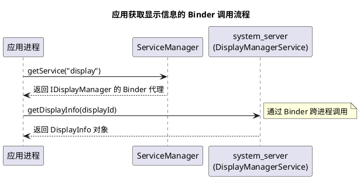
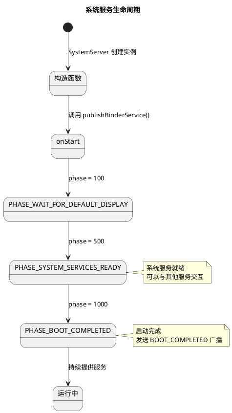

# Android Framework 定制指南

## 目录

1. [概述](#1-概述)
2. [Binder 通信简述](#2-binder-通信简述)
3. [系统服务实战指南](#3-系统服务实战指南)
4. [编译 JAR 供应用开发](#4-编译-jar-供应用开发)
5. [调试技巧与参考资料](#5-调试技巧与参考资料)

---

## 1. 概述

### 1.1 什么是 Android Framework

Android Framework 是 Android 系统架构中的核心层，位于 HAL 层之上、应用层之下，为应用程序提供标准化的 API 接口。

```
┌─────────────────────────────────────────────────────────────────┐
│                    Android 系统架构                              │
├─────────────────────────────────────────────────────────────────┤
│                                                                  │
│   ┌──────────────────────────────────────────────────────────┐  │
│   │                    Applications                           │  │
│   │            (系统应用 + 第三方应用)                          │  │
│   └──────────────────────────────────────────────────────────┘  │
│                              ↓ API 调用                          │
│   ┌──────────────────────────────────────────────────────────┐  │
│   │              Android Framework Layer                      │  │
│   │                                                           │  │
│   │  ┌─────────────────────────────────────────────────────┐ │  │
│   │  │              Java API Framework                      │ │  │
│   │  │  Activity Manager | Window Manager | Package Manager │ │  │
│   │  │  Content Provider | Resource Manager | View System   │ │  │
│   │  └─────────────────────────────────────────────────────┘ │  │
│   │                          ↓                                │  │
│   │  ┌─────────────────────────────────────────────────────┐ │  │
│   │  │           Native System Services                     │ │  │
│   │  │  SurfaceFlinger | AudioFlinger | MediaServer         │ │  │
│   │  └─────────────────────────────────────────────────────┘ │  │
│   │                                                           │  │
│   └──────────────────────────────────────────────────────────┘  │
│                              ↓ Binder IPC                        │
│   ┌──────────────────────────────────────────────────────────┐  │
│   │                 HAL (Hardware Abstraction Layer)          │  │
│   └──────────────────────────────────────────────────────────┘  │
│                              ↓                                   │
│   ┌──────────────────────────────────────────────────────────┐  │
│   │                     Linux Kernel                          │  │
│   └──────────────────────────────────────────────────────────┘  │
│                                                                  │
└─────────────────────────────────────────────────────────────────┘
```

### 1.2 Framework 的核心职责

| 职责 | 说明 |
|------|------|
| **系统服务管理** | 管理各种系统服务（AMS、WMS、PMS 等） |
| **进程间通信** | 通过 Binder 机制实现跨进程通信 |
| **资源管理** | 统一管理系统资源（CPU、内存、网络等） |
| **权限控制** | 实现应用权限检查和授权 |
| **UI 框架** | 提供 View 系统、窗口管理等 UI 基础设施 |
| **应用生命周期** | 管理应用的启动、运行、销毁 |

### 1.3 Framework 源码结构

```
frameworks/
├── base/                          # Framework 核心代码
│   ├── core/                      # 核心 Java 类库
│   │   ├── java/                  # Java 源码
│   │   │   └── android/           # android.* 包
│   │   │       ├── app/           # Activity、Service 等
│   │   │       ├── content/       # ContentProvider、Intent
│   │   │       ├── os/            # Binder、Handler、Looper
│   │   │       ├── view/          # View 系统
│   │   │       └── ...
│   │   ├── jni/                   # JNI 代码
│   │   └── res/                   # 系统资源
│   │
│   ├── services/                  # 系统服务实现
│   │   ├── core/java/             # Java 服务
│   │   │   └── com/android/server/
│   │   │       ├── am/            # ActivityManagerService
│   │   │       ├── wm/            # WindowManagerService
│   │   │       ├── pm/            # PackageManagerService
│   │   │       ├── display/       # DisplayManagerService
│   │   │       └── ...
│   │   └── Android.bp
│   │
│   └── native/                    # Native 服务
│       └── cmds/
│           └── servicemanager/    # ServiceManager
│
└── av/                            # 音视频框架
    └── services/
        └── audioflinger/          # AudioFlinger
```

### 1.4 核心系统服务一览

| 服务 | 全称 | 主要职责 |
|------|------|---------|
| AMS | ActivityManagerService | 管理应用生命周期、进程管理、任务栈 |
| WMS | WindowManagerService | 窗口布局、动画、输入事件分发 |
| PMS | PackageManagerService | 应用安装/卸载、权限管理、Intent 解析 |
| DMS | DisplayManagerService | 显示器管理、分辨率切换 |
| IMS | InputManagerService | 输入设备管理、事件处理 |

### 1.5 本项目定制范围

本项目基于 Amlogic S905X5M 平台，涉及以下 Framework 定制：

| 定制项 | 位置 | 说明 |
|--------|------|------|
| 分辨率管理服务 | `frameworks/base/services/core/` | ResolutionUpdateService |
| Shell 命令执行 | `vendor/xxx/common/libraries/` | stbshellcmd JAR 库 |
| 电源管理 | `frameworks/base/services/core/` | TV 待机模式定制 |
| 输入系统 | `frameworks/base/services/core/` | 遥控器按键映射 |

---

## 2. Binder 通信简述

### 2.1 Binder 是什么

Binder 是 Android 系统的核心 **进程间通信 (IPC)** 机制。Framework 层的系统服务（如 AMS、WMS）运行在 `system_server` 进程中，而应用运行在各自独立的进程中，它们之间的通信就依赖 Binder。

**核心特点**：
- **高效**：只需一次数据拷贝（相比 socket 需要两次）
- **安全**：内核态身份验证（UID/PID）
- **面向对象**：支持远程对象引用，像调用本地方法一样调用远程服务

### 2.2 一个实际例子：应用如何获取显示信息

当应用调用 `getSystemService(DISPLAY_SERVICE)` 获取显示信息时，背后就是 Binder 在工作：



**代码示例**：

```java
// 应用层代码
DisplayManager dm = (DisplayManager) context.getSystemService(Context.DISPLAY_SERVICE);
Display display = dm.getDisplay(Display.DEFAULT_DISPLAY);
Display.Mode[] modes = display.getSupportedModes();

// 看起来是普通的方法调用，但背后：
// 1. getSystemService() 从 ServiceManager 获取 DisplayManagerService 的 Binder 代理
// 2. getSupportedModes() 通过 Binder IPC 调用 system_server 中的 DisplayManagerService
// 3. DisplayManagerService 返回结果，通过 Binder 传回应用进程
```

**关键理解**：
- 应用拿到的 `DisplayManager` 实际是一个 **Binder 代理对象**
- 调用它的方法时，请求会通过 Binder 驱动发送到 `system_server` 进程
- `system_server` 中的真正服务处理请求并返回结果

> **延伸阅读**：如需深入学习 Binder 机制，推荐阅读《Android 开发艺术探索》第 2 章，或访问 [Gityuan 的 Binder 系列文章](http://gityuan.com/2015/10/31/binder-prepare/)。

---

## 3. 系统服务实战指南

本章以本项目中实际添加的 `ResolutionUpdateService` 为例，讲解如何理解和定制系统服务。

### 3.1 系统服务是什么

系统服务是运行在 `system_server` 进程中的后台服务，负责管理系统资源和提供系统功能。

**特点**：
- 开机自动启动，生命周期与系统一致
- 运行在特权进程，可以访问系统级资源
- 通过 Binder 向应用层暴露接口

### 3.2 系统服务的生命周期



### 3.3 实例分析：ResolutionUpdateService

这是本项目添加的自定义服务，用于监听属性变化并自动切换分辨率。

#### 3.3.1 服务代码结构

**文件位置**: `frameworks/base/services/core/java/com/android/server/display/ResolutionUpdateService.java`

```java
package com.android.server.display;

import android.content.BroadcastReceiver;
import android.content.Context;
import android.content.Intent;
import android.content.IntentFilter;
import android.hardware.display.DisplayManager;
import android.os.SystemProperties;
import android.util.Slog;
import android.view.Display;

import com.android.server.SystemService;

import java.util.concurrent.ExecutorService;
import java.util.concurrent.Executors;

/**
 * 分辨率更新服务
 * 监听 persist.sys.resolution.mode 属性变化，自动切换分辨率
 */
public class ResolutionUpdateService extends SystemService {
    private static final String TAG = "ResolutionUpdateService";

    // 监听的属性名
    private static final String PROPERTY_RESOLUTION = "persist.sys.resolution.mode";

    // 广播 Action，用于外部触发
    private static final String ACTION_SET_RESOLUTION = "com.android.server.display.SET_RESOLUTION";

    private DisplayManager mDisplayManager;
    private ExecutorService mExecutorService;

    // ========== 构造函数 ==========
    public ResolutionUpdateService(Context context) {
        super(context);
    }

    // ========== 生命周期：服务启动 ==========
    @Override
    public void onStart() {
        Slog.i(TAG, "ResolutionUpdateService starting");

        // 获取 DisplayManager
        mDisplayManager = mContext.getSystemService(DisplayManager.class);

        // 注册广播接收器
        IntentFilter filter = new IntentFilter(ACTION_SET_RESOLUTION);
        mContext.registerReceiver(mBroadcastReceiver, filter, Context.RECEIVER_EXPORTED);

        // 创建后台线程池
        mExecutorService = Executors.newSingleThreadExecutor();

        // 启动属性监听
        startPropertyWatcher();
    }

    // ========== 生命周期：启动阶段回调 ==========
    @Override
    public void onBootPhase(int phase) {
        switch (phase) {
            case PHASE_SYSTEM_SERVICES_READY:
                Slog.i(TAG, "System services ready");
                break;
            case PHASE_BOOT_COMPLETED:
                Slog.i(TAG, "Boot completed, applying initial resolution");
                applyCurrentResolution();
                break;
        }
    }

    // ========== 属性监听 ==========
    private void startPropertyWatcher() {
        mExecutorService.execute(() -> {
            String lastValue = "";
            while (true) {
                try {
                    String currentValue = SystemProperties.get(PROPERTY_RESOLUTION, "");
                    if (!currentValue.equals(lastValue) && !currentValue.isEmpty()) {
                        lastValue = currentValue;
                        applyResolution(currentValue);
                    }
                    Thread.sleep(1000); // 每秒检查一次
                } catch (InterruptedException e) {
                    break;
                }
            }
        });
    }

    // ========== 广播接收器 ==========
    private final BroadcastReceiver mBroadcastReceiver = new BroadcastReceiver() {
        @Override
        public void onReceive(Context context, Intent intent) {
            if (ACTION_SET_RESOLUTION.equals(intent.getAction())) {
                String mode = intent.getStringExtra("mode");
                if (mode != null) {
                    applyResolution(mode);
                }
            }
        }
    };

    // ========== 核心功能：应用分辨率 ==========
    private void applyResolution(String modeStr) {
        try {
            int modeId = Integer.parseInt(modeStr);
            Display display = mDisplayManager.getDisplay(Display.DEFAULT_DISPLAY);
            Display.Mode[] modes = display.getSupportedModes();

            for (Display.Mode mode : modes) {
                if (mode.getModeId() == modeId) {
                    Slog.i(TAG, "Applying resolution mode: " + modeId);
                    // 调用 DisplayManager 设置分辨率
                    // 实际实现依赖平台 API
                    break;
                }
            }
        } catch (NumberFormatException e) {
            Slog.e(TAG, "Invalid mode: " + modeStr);
        }
    }

    private void applyCurrentResolution() {
        String mode = SystemProperties.get(PROPERTY_RESOLUTION, "");
        if (!mode.isEmpty()) {
            applyResolution(mode);
        }
    }
}
```

#### 3.3.2 关键设计要点

| 要点 | 说明 |
|------|------|
| **继承 SystemService** | 所有系统服务必须继承此基类 |
| **onStart()** | 服务启动时调用，用于初始化 |
| **onBootPhase()** | 不同启动阶段的回调，可以在适当时机执行初始化 |
| **ExecutorService** | 后台线程处理耗时操作，避免阻塞主线程 |
| **BroadcastReceiver** | 提供外部触发能力 |
| **SystemProperties** | 读写系统属性 |

### 3.4 如何添加自己的系统服务

#### 步骤 1: 创建服务类

在 `frameworks/base/services/core/java/com/android/server/` 下创建你的服务：

```java
package com.android.server;

import android.content.Context;
import android.util.Slog;
import com.android.server.SystemService;

public class MyCustomService extends SystemService {
    private static final String TAG = "MyCustomService";

    public MyCustomService(Context context) {
        super(context);
    }

    @Override
    public void onStart() {
        Slog.i(TAG, "MyCustomService starting");
        // 初始化逻辑
    }

    @Override
    public void onBootPhase(int phase) {
        if (phase == PHASE_BOOT_COMPLETED) {
            // 启动完成后的逻辑
        }
    }
}
```

#### 步骤 2: 在 SystemServer 中注册

修改 `frameworks/base/services/java/com/android/server/SystemServer.java`：

```java
// 1. 添加 import
import com.android.server.MyCustomService;

// 2. 在 startOtherServices() 方法中添加启动代码
private void startOtherServices(@NonNull TimingsTraceAndSlog t) {
    // ... 其他服务 ...

    // 启动自定义服务
    t.traceBegin("StartMyCustomService");
    mSystemServiceManager.startService(MyCustomService.class);
    t.traceEnd();

    // ... 其他服务 ...
}
```

#### 步骤 3: 编译验证

```bash
# 编译 framework
m framework-minus-apex

# 或完整编译
m
```

### 3.5 如何修改现有系统服务

以修改 DisplayManagerService 为例：

**文件位置**: `frameworks/base/services/core/java/com/android/server/display/DisplayManagerService.java`

**常见修改场景**：

1. **添加新方法**：
```java
public void setCustomDisplayMode(int displayId, int mode) {
    // 自定义逻辑
}
```

2. **修改现有行为**：
```java
@Override
public void setDisplayProperties(int displayId, ...) {
    // 添加自定义逻辑
    if (shouldUseCustomMode()) {
        applyCustomMode();
        return;
    }
    // 原有逻辑
    super.setDisplayProperties(displayId, ...);
}
```

3. **添加属性监听**：
```java
private void startPropertyObserver() {
    SystemProperties.addChangeCallback(() -> {
        String value = SystemProperties.get("persist.sys.custom.mode", "");
        handleModeChange(value);
    });
}
```

---

## 4. 编译 JAR 供应用开发

本章讲解如何将 Framework 层的功能封装成 JAR 库，供应用在 Android Studio 中使用。

### 4.1 使用场景

- 封装系统级 API，供多个应用复用
- 提供系统签名应用专用的功能接口
- 简化应用对 Framework 功能的调用

### 4.2 实例：stbshellcmd JAR 库

本项目中的 `stbshellcmd` 库封装了 Shell 命令执行功能，让系统应用可以方便地执行需要 root 权限的命令。

#### 4.2.1 目录结构

```
vendor/xxx/common/libraries/hwstbcmdapi/
├── Android.bp              # 构建配置
└── java/
    └── cn/
        └── xxx/
            └── shellcmd/
                └── ShellCmd.java   # API 接口类
```

#### 4.2.2 Android.bp 配置

```python
java_library_static {
    name: "stbshellcmd",

    // 源码路径
    srcs: ["java/**/*.java"],

    // 使用平台 API（可访问 @hide API）
    platform_apis: true,

    // 公开可见性，允许其他模块依赖
    visibility: ["//visibility:public"],

    // 支持 host 编译（用于测试）
    host_supported: true,

    // 不单独安装，仅作为依赖
    installable: false,
}
```

**关键配置说明**：

| 配置项 | 说明 |
|--------|------|
| `java_library_static` | 编译为静态 JAR 库 |
| `platform_apis: true` | 可以访问 `@hide` API |
| `visibility` | 控制哪些模块可以依赖此库 |
| `installable: false` | 不会单独安装到系统，而是被其他模块打包 |

#### 4.2.3 Java API 类

```java
// java/cn/xxx/shellcmd/ShellCmd.java

package cn.xxx.shellcmd;

/**
 * Shell 命令执行工具类
 * 提供系统级命令执行能力
 */
public class ShellCmd {

    // Native 方法声明
    public static native String hsInvokeJni(String cmd, int type);

    // 加载 native 库
    static {
        System.loadLibrary("histbcmdservice_jni");
    }

    /**
     * 执行 Shell 命令
     * @param cmd 要执行的命令
     * @param isReturn 是否返回执行结果
     * @return 命令执行结果
     */
    public static String exec(String cmd, boolean isReturn) {
        // 添加 PATH 环境变量
        String fullCmd = "PATH=/system/bin:/system/xbin:" +
                        "/vendor/bin:/vendor/xbin " + cmd;

        if (isReturn) {
            return hsInvokeJni(fullCmd, 1);  // 返回结果
        } else {
            return hsInvokeJni(fullCmd, 0);  // 不返回结果
        }
    }
}
```

### 4.3 如何在其他模块中使用

#### 4.3.1 Framework 服务中使用

修改 `frameworks/base/services/core/Android.bp`：

```python
java_library_static {
    name: "services.core",
    // ...
    static_libs: [
        // 添加依赖
        "stbshellcmd",
    ],
}
```

在服务代码中使用：

```java
import cn.xxx.shellcmd.ShellCmd;

public class MyService extends SystemService {

    private void executeCommand() {
        // 执行命令并获取结果
        String result = ShellCmd.exec("getprop ro.build.display.id", true);
        Slog.i(TAG, "Build ID: " + result);

        // 执行命令不获取结果
        ShellCmd.exec("ifconfig eth0 up", false);
    }
}
```

#### 4.3.2 系统应用中使用

**方式一：在 Android.bp 中添加依赖**

```python
android_app {
    name: "MySystemApp",
    // ...
    static_libs: [
        "stbshellcmd",
    ],
    platform_apis: true,
}
```

**方式二：导出 JAR 供 Android Studio 使用**

1. **编译生成 JAR**：
```bash
# 编译模块
m stbshellcmd

# JAR 文件位置
# out/target/common/obj/JAVA_LIBRARIES/stbshellcmd_intermediates/classes.jar
```

2. **复制到 Android Studio 项目**：
```bash
cp out/target/common/obj/JAVA_LIBRARIES/stbshellcmd_intermediates/classes.jar \
   /path/to/your/app/libs/stbshellcmd.jar
```

3. **在 build.gradle 中添加依赖**：
```groovy
dependencies {
    implementation files('libs/stbshellcmd.jar')
}
```

4. **在应用代码中使用**：
```java
import cn.xxx.shellcmd.ShellCmd;

public class MainActivity extends Activity {

    @Override
    protected void onCreate(Bundle savedInstanceState) {
        super.onCreate(savedInstanceState);

        // 执行命令
        String result = ShellCmd.exec("ls /data", true);
        Log.d("MainActivity", "Files: " + result);
    }
}
```

> **注意**：使用此 JAR 的应用必须是**系统签名应用**，否则无法加载 native 库和执行特权操作。

### 4.4 创建自己的 JAR 库

#### 步骤 1: 创建目录结构

```bash
mkdir -p vendor/mycompany/libraries/mylib/java/com/mycompany/mylib/
```

#### 步骤 2: 创建 Android.bp

```python
// vendor/mycompany/libraries/mylib/Android.bp

java_library_static {
    name: "mylib",
    srcs: ["java/**/*.java"],
    platform_apis: true,
    visibility: ["//visibility:public"],
    host_supported: true,
    installable: false,
}
```

#### 步骤 3: 创建 Java 类

```java
// java/com/mycompany/mylib/MyApi.java

package com.mycompany.mylib;

import android.os.SystemProperties;

public class MyApi {

    /**
     * 获取系统属性
     */
    public static String getProperty(String key, String defaultValue) {
        return SystemProperties.get(key, defaultValue);
    }

    /**
     * 设置系统属性
     */
    public static void setProperty(String key, String value) {
        SystemProperties.set(key, value);
    }
}
```

#### 步骤 4: 在产品 makefile 中添加

```makefile
# device/amlogic/ross/device.mk

PRODUCT_PACKAGES += \
    mylib
```

#### 步骤 5: 编译验证

```bash
m mylib
```

---

## 5. 调试技巧与参考资料

### 5.1 日志调试

#### 系统服务日志

```java
import android.util.Slog;

// 系统服务中使用 Slog
Slog.v(TAG, "Verbose log");
Slog.d(TAG, "Debug log");
Slog.i(TAG, "Info log");
Slog.w(TAG, "Warning log");
Slog.e(TAG, "Error log");
```

#### 查看日志

```bash
# 查看系统日志
adb logcat -b system

# 按标签过滤
adb logcat -s ResolutionUpdateService:*

# 查看 Framework 相关日志
adb logcat | grep -E "(system_server|ActivityManager)"
```

### 5.2 dumpsys 调试

```bash
# 列出所有服务
adb shell dumpsys -l

# 查看显示服务
adb shell dumpsys display

# 查看窗口管理
adb shell dumpsys window

# 查看包管理
adb shell dumpsys package <package_name>
```

### 5.3 常见问题排查

| 问题 | 排查方法 |
|------|---------|
| 服务未启动 | 检查 SystemServer.java 中是否注册 |
| 编译失败 | 检查 Android.bp 依赖配置 |
| 权限拒绝 | 检查 SELinux 策略 (`adb logcat \| grep avc`) |
| 方法找不到 | 确认 JAR 已正确编译和依赖 |

### 5.4 参考资料

#### 官方文档
- [Android Architecture](https://source.android.com/devices/architecture)
- [System Services](https://source.android.com/devices/architecture/modular-system)

#### 推荐阅读
- [Gityuan - Android 系统源码分析](http://gityuan.com/)
- [CSDN - Android Framework 专栏](https://blog.csdn.net/)
- [稀土掘金 - Android 系统开发](https://juejin.cn/)

#### 源码阅读推荐
- `frameworks/base/services/java/com/android/server/SystemServer.java` - 系统服务启动
- `frameworks/base/services/core/java/com/android/server/SystemService.java` - 服务基类
- `frameworks/base/core/java/android/app/SystemServiceRegistry.java` - 服务注册表

### 5.5 本项目相关文件

| 文件 | 说明 |
|------|------|
| `frameworks/base/services/core/java/com/android/server/display/ResolutionUpdateService.java` | 分辨率管理服务 |
| `vendor/xxx/common/libraries/hwstbcmdapi/` | Shell 命令执行 JAR 库 |
| `vendor/xxx/device-xxx.mk` | XXX 产品配置 |

---
