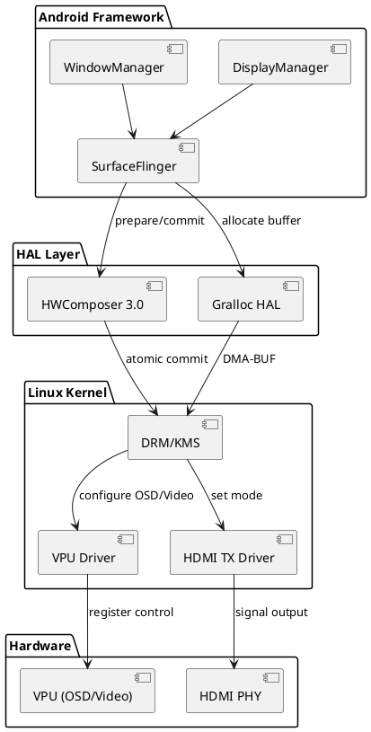
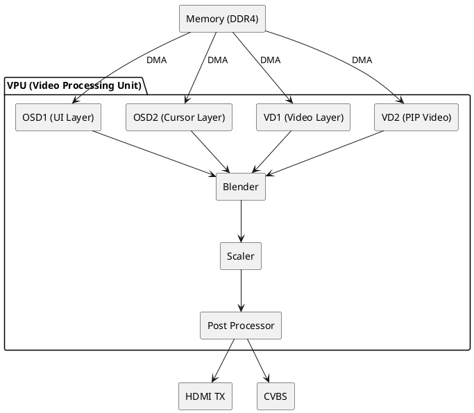
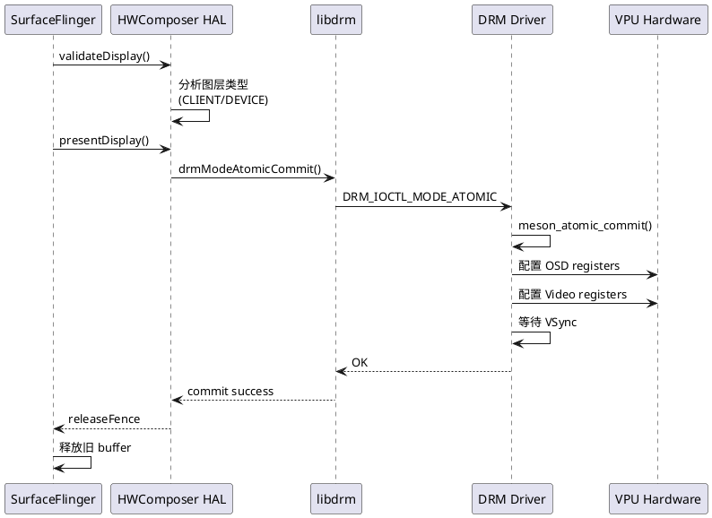

# Display Subsystem 开发指南

> **文档状态**: ✅ 完成
> **适用平台**: Amlogic S905X5M (S7D)
> **Android 版本**: Android 14
> **内核版本**: 5.15
> **最后更新**: 2025-12-12

---

## 目录

1. [概述](#1-概述)
2. [硬件架构](#2-硬件架构)
3. [软件架构](#3-软件架构)
4. [内核显示配置](#4-内核显示配置)
5. [HAL 层实现](#5-hal-层实现)
6. [分辨率与模式管理](#6-分辨率与模式管理)
   - [6.4 屏幕密度与 DPI 配置](#64-屏幕密度与-dpi-配置)
7. [HDMI 功能支持](#7-hdmi-功能支持)
   - [7.4 开机画面定制](#74-开机画面定制)
   - [7.5 CVBS 配置](#75-cvbs-配置)
8. [调试方法](#8-调试方法)
9. [常见问题排查](#9-常见问题排查)
10. [附录](#10-附录)

---

## 1. 概述

### 1.1 显示子系统简介

S905X5M (S7D) 平台的显示子系统基于 **DRM/KMS (Direct Rendering Manager / Kernel Mode Setting)** 架构，负责处理从内核到 Android Framework 的完整显示流程。该子系统支持：

- **多图层混合**: OSD1/OSD2 图层 + VD1/VD2 视频图层
- **4K@120Hz 输出**: HDMI 2.1 支持
- **HDR 显示**: HDR10/HLG/Dolby Vision
- **HDMI CEC/ARC**: 消费电子控制和音频回传
- **动态分辨率切换**: 运行时无缝切换输出模式

### 1.2 关键组件

| 组件层级 | 组件名称 | 文件路径 | 职责 |
|---------|---------|---------|------|
| **内核层** | VPU DRM 驱动 | `common/common_drivers/drivers/drm/meson_vpu.c` | 管理显示硬件资源 |
| | HDMI TX 驱动 | `common/common_drivers/drivers/media/vout/hdmitx21/` | HDMI 信号输出 |
| | Device Tree | `common/common_drivers/arch/arm64/boot/dts/amlogic/` | 硬件配置描述 |
| **HAL 层** | HWComposer | `hardware/amlogic/hwcomposer/hwc3/` | 图层合成策略 |
| | Gralloc | `hardware/amlogic/gralloc/` | 图形缓冲区管理 |
| **Framework** | SurfaceFlinger | `frameworks/native/services/surfaceflinger/` | 图形合成服务 |
| | DisplayManager | `frameworks/base/services/core/java/com/android/server/display/` | 显示模式管理 |

### 1.3 系统架构图



---

## 2. 硬件架构

### 2.1 S7D VPU (Video Processing Unit)

VPU 是 S7D 平台的核心显示处理单元，包含以下模块：



**关键特性**:

- **OSD1/OSD2**: 支持 RGBA8888/RGB565/ARGB1555 格式，用于 UI 显示
- **VD1/VD2**: 支持 NV12/NV21 YUV 格式，用于视频解码输出
- **Alpha Blending**: 硬件支持 4 层混合，每层独立 alpha 通道
- **Scaler**: 支持 4K 下变换到 1080p，或 1080p 上变换到 4K
- **工作频率**: 最高 666.7MHz (clk_level = 8)

### 2.2 HDMI 2.1 TX 模块

| 特性 | 规格 |
|------|------|
| **最大输出** | 4K@120Hz / 8K@30Hz |
| **颜色深度** | 8/10/12 bit |
| **色彩空间** | RGB/YUV444/YUV422/YUV420 |
| **HDR** | HDR10/HLG/Dolby Vision |
| **音频** | LPCM/Dolby/DTS Pass-through |
| **CEC** | HDMI CEC 1.4 |
| **HDCP** | HDCP 1.4/2.2/2.3 |

**Device Tree 配置** (`meson-s7d.dtsi`):

```dts
hdmitx: hdmitx@ff600000 {
    compatible = "amlogic, hdmitx21";
    reg = <0x0 0xff600000 0x0 0x10000>;
    interrupts = <GIC_SPI 57 IRQ_TYPE_EDGE_RISING>;
    clocks = <&clkc CLKID_HDMITX_PCLK>;
    clock-names = "hdmitx_clk_sys";

    /* HDMI 热插拔检测 GPIO */
    hdmi_5v_en-gpios = <&gpio GPIOH_1 GPIO_ACTIVE_HIGH>;
    hpd-gpios = <&gpio GPIOH_2 GPIO_ACTIVE_HIGH>;

    /* 最大刷新率 */
    max_refreshrate = <120>;

    /* HDCP Key 存储区域 */
    hdcp_phy_base = <0x05100000>;
};
```

### 2.3 Display Timing 示例

**4K@60Hz Timing** (从 EDID 解析):

| 参数 | 值 |
|------|------|
| Resolution | 3840x2160 |
| Refresh Rate | 60Hz |
| Pixel Clock | 594MHz |
| HTotal | 4400 |
| VTotal | 2250 |
| HSync | 88 |
| VSync | 10 |
| HFront Porch | 176 |
| VFront Porch | 8 |

---

## 3. 软件架构

### 3.1 DRM/KMS 架构

S7D 平台使用标准 Linux DRM/KMS 框架：



### 3.2 DRM 核心对象

**文件**: `common/common_drivers/drivers/drm/meson_vpu.c`

```c
/* DRM 设备初始化 */
static int meson_drm_bind(struct device *dev)
{
    struct drm_device *drm;
    struct meson_drm *priv;

    drm = drm_dev_alloc(&meson_driver, dev);
    priv = devm_kzalloc(dev, sizeof(*priv), GFP_KERNEL);

    drm->dev_private = priv;
    priv->drm = drm;
    priv->dev = dev;

    /* 初始化 VPU 硬件 */
    meson_vpu_init(priv);

    /* 注册 CRTC/Plane/Encoder */
    meson_plane_create(priv);      // OSD/Video Plane
    meson_crtc_create(priv);       // CRTC (扫描输出)
    meson_encoder_hdmi_init(priv); // HDMI Encoder

    drm_mode_config_reset(drm);
    drm_dev_register(drm, 0);

    return 0;
}
```

**关键概念**:

- **DRM Device** (`/dev/dri/card0`): 应用层访问入口
- **CRTC (Cathode Ray Tube Controller)**: 控制扫描输出时序
- **Plane**: 图层对象 (OSD1/OSD2/VD1/VD2)
- **Encoder**: 信号编码器 (HDMI/CVBS)
- **Connector**: 物理连接器 (HDMI-A-1)

### 3.3 Atomic Commit 流程

**文件**: `common/common_drivers/drivers/drm/meson_crtc.c`

```c
static void meson_crtc_atomic_flush(struct drm_crtc *crtc,
                                    struct drm_atomic_state *state)
{
    struct meson_drm *priv = crtc->dev->dev_private;

    /* 等待 VSync */
    if (crtc->state->event) {
        drm_crtc_vblank_get(crtc);
        priv->pending_event = crtc->state->event;
    }

    /* 更新硬件寄存器 */
    meson_vpu_osd_commit(priv);    // 提交 OSD 配置
    meson_vpu_video_commit(priv);  // 提交 Video 配置
}
```

**Atomic Commit 时序**:

1. `drm_atomic_commit()` - 用户空间发起提交
2. `drm_atomic_helper_prepare_planes()` - 准备 Plane 状态
3. `meson_crtc_atomic_flush()` - 等待 VSync 并更新寄存器
4. `drm_crtc_send_vblank_event()` - 通知用户空间完成

### 3.4 SurfaceFlinger 集成

**文件**: `frameworks/native/services/surfaceflinger/SurfaceFlinger.cpp`

```cpp
void SurfaceFlinger::onMessageRefresh() {
    // 1. 锁定图层树
    mDrawingState = mCurrentState;

    // 2. 调用 HWC validateDisplay
    for (auto& display : mDisplays) {
        display->beginFrame();
        mHwc->validateDisplay(display->getId());
    }

    // 3. 合成 CLIENT 类型图层到 Framebuffer Target
    composeSurfaces(mDisplays[0]);

    // 4. 调用 HWC presentDisplay 提交
    for (auto& display : mDisplays) {
        mHwc->presentDisplay(display->getId(), &releaseFence);
    }

    // 5. 释放旧 buffer
    postComposition();
}
```

---

## 4. 内核显示配置

### 4.1 Device Tree 配置

**主 DTS 文件**: `common/common_drivers/arch/arm64/boot/dts/amlogic/s7d_s905x5m_bm201.dts`

```dts
/ {
    model = "Amlogic S905X5M BM201 Board";
    compatible = "amlogic, s7d";

    /* Framebuffer 内存预留 */
    reserved-memory {
        linux,meson-fb {
            compatible = "amlogic, fb-memory";
            reg = <0x0 0x7f800000 0x0 0x800000>; /* 8MB */
            no-map;
        };

        logo_reserved: logo@0x7f000000 {
            compatible = "amlogic, meson-fb";
            reg = <0x0 0x7f000000 0x0 0x800000>; /* 8MB for logo */
            no-map;
        };
    };

    /* DRM VPU 配置 */
    drm_vpu: drm_vpu@ff900000 {
        compatible = "amlogic, meson-s7d-vpu";
        status = "okay";

        logo_addr = <0x7f000000>; /* logo buffer 物理地址 */

        /* 默认显示尺寸: width height fb_width fb_height bpp */
        display_size_default = <1920 1080 1920 2160 32>;

        /* 内存配置 */
        mem_alloc = <1>; /* 使用 CMA 分配 */
        mem_size = <0x00800000>; /* 8MB */

        /* CRTC 配置 */
        crtc_num = <1>;
        ports {
            port@0 {
                reg = <0>;
                vpu_out: endpoint {
                    remote-endpoint = <&hdmi_in>;
                };
            };
        };
    };
};

/* VPU 时钟配置 */
&vpu {
    clk_level = <8>; /* 666.7 MHz */
};

/* HDMI 输出配置 */
&hdmitx {
    status = "okay";
    pinctrl-names = "default", "hdmi_i2c";
    pinctrl-0 = <&hdmitx_hpd &hdmitx_ddc>;

    /* HDMI 热插拔 GPIO */
    hpd-gpios = <&gpio GPIOH_2 GPIO_ACTIVE_HIGH>;

    ports {
        port@0 {
            reg = <0>;
            hdmi_in: endpoint {
                remote-endpoint = <&vpu_out>;
            };
        };
    };
};
```

### 4.2 Kernel Config 选项

**配置文件**: `common/common14-5.15/common/arch/arm64/configs/meson64_a64_R_defconfig`

```makefile
# DRM 核心
CONFIG_DRM=y
CONFIG_DRM_KMS_HELPER=y
CONFIG_DRM_FBDEV_EMULATION=y

# Meson VPU 驱动
CONFIG_DRM_MESON=y
CONFIG_DRM_MESON_DW_HDMI=y

# HDMI TX 驱动
CONFIG_AMLOGIC_HDMITX21=y
CONFIG_AMLOGIC_HDMITX21_CEC=y

# Video 输出
CONFIG_AMLOGIC_MEDIA_VOUT=y
CONFIG_AMLOGIC_VOUT2_SERVE=y

# OSD 驱动
CONFIG_AMLOGIC_MEDIA_FB=y
CONFIG_AMLOGIC_MEDIA_FB_OSD_SYNC_RENDER=y

# HDCP 支持
CONFIG_AMLOGIC_HDCP=y
```

### 4.3 Kernel 编译

```bash
# 进入 kernel 目录
cd common/common14-5.15/common

# 配置内核
make ARCH=arm64 meson64_a64_R_defconfig

# 启用显示相关选项 (可选手动配置)
make ARCH=arm64 menuconfig
# Device Drivers -> Graphics support -> Direct Rendering Manager
# Device Drivers -> Amlogic Driver -> Media Modules

# 编译
make ARCH=arm64 CROSS_COMPILE=aarch64-linux-gnu- -j$(nproc) Image dtbs
```

---

## 5. HAL 层实现

### 5.1 HWComposer 3.0 架构

**目录**: `hardware/amlogic/hwcomposer/hwc3/`

```
hwc3/
├── Hwc.cpp                # HWC 主接口
├── HwcDisplay.cpp         # Display 管理
├── HwcLayer.cpp           # Layer 管理
├── DrmDisplay.cpp         # DRM 后端
├── DrmPlane.cpp           # Plane 分配
└── gralloc/
    └── GrallocMapper.cpp  # Buffer 映射
```

**核心接口** (`Hwc.cpp`):

```cpp
class Hwc : public IComposer {
public:
    // 验证显示配置
    Error validateDisplay(Display display,
                         std::vector<Layer>& outChangedLayers,
                         uint32_t* outNumTypes) override {
        auto hwcDisplay = getDisplay(display);

        // 遍历所有 Layer
        for (auto& layer : hwcDisplay->getLayers()) {
            // 判断 Layer 是否可以由硬件合成
            if (canHandleByDevice(layer)) {
                layer->setCompositionType(Composition::DEVICE);
            } else {
                layer->setCompositionType(Composition::CLIENT);
                outChangedLayers.push_back(layer->getId());
            }
        }

        return Error::NONE;
    }

    // 提交显示内容
    Error presentDisplay(Display display, int32_t* outRetireFence) override {
        auto hwcDisplay = getDisplay(display);

        // 执行 DRM Atomic Commit
        int ret = hwcDisplay->commit(outRetireFence);

        return ret == 0 ? Error::NONE : Error::BAD_DISPLAY;
    }

private:
    bool canHandleByDevice(HwcLayer* layer) {
        // OSD Plane 可以处理 RGBA 格式
        if (layer->getFormat() == HAL_PIXEL_FORMAT_RGBA_8888)
            return true;

        // Video Plane 可以处理 NV12 格式
        if (layer->getFormat() == HAL_PIXEL_FORMAT_YCbCr_420_888)
            return true;

        // 不支持旋转
        if (layer->getTransform() != Transform::NONE)
            return false;

        return false;
    }
};
```

### 5.2 DRM Plane 分配策略

**文件**: `hardware/amlogic/hwcomposer/hwc3/DrmPlane.cpp`

```cpp
class DrmPlaneAllocator {
public:
    /* 为 Layer 分配 Plane */
    DrmPlane* allocatePlane(HwcLayer* layer) {
        // 优先级: VD1 (视频) > OSD1 (UI) > OSD2 (Cursor)

        // 1. 检查是否为视频 Layer
        if (layer->isVideo()) {
            if (mVideoPlane->isAvailable()) {
                mVideoPlane->setInUse(true);
                return mVideoPlane;
            }
        }

        // 2. 分配 OSD Plane
        if (mOsd1Plane->isAvailable()) {
            mOsd1Plane->setInUse(true);
            return mOsd1Plane;
        }

        if (mOsd2Plane->isAvailable()) {
            mOsd2Plane->setInUse(true);
            return mOsd2Plane;
        }

        // 3. 无可用 Plane,标记为 CLIENT 合成
        return nullptr;
    }

    void reset() {
        mOsd1Plane->setInUse(false);
        mOsd2Plane->setInUse(false);
        mVideoPlane->setInUse(false);
    }

private:
    DrmPlane* mOsd1Plane;   // type: DRM_PLANE_TYPE_PRIMARY
    DrmPlane* mOsd2Plane;   // type: DRM_PLANE_TYPE_OVERLAY
    DrmPlane* mVideoPlane;  // type: DRM_PLANE_TYPE_OVERLAY
};
```

### 5.3 Gralloc HAL

**目录**: `hardware/amlogic/gralloc/`

**关键功能**:

1. **Buffer 分配** (`Allocator.cpp`):

```cpp
Error Allocator::allocate(const BufferDescriptor& descriptor,
                         buffer_handle_t* outBuffer) {
    uint32_t format = descriptor.format;
    uint32_t usage = descriptor.usage;

    // 根据 usage 选择内存类型
    int ion_heap_mask;
    if (usage & GRALLOC_USAGE_HW_VIDEO_ENCODER) {
        ion_heap_mask = ION_HEAP_CODEC_MASK; // Codec 专用内存
    } else if (usage & GRALLOC_USAGE_HW_FB) {
        ion_heap_mask = ION_HEAP_DMA_MASK;   // CMA 内存
    } else {
        ion_heap_mask = ION_HEAP_SYSTEM_MASK; // 系统内存
    }

    // 分配 ION buffer
    int ion_fd = ion_alloc(ion_heap_mask, descriptor.size);

    // 创建 DMA-BUF
    int dma_buf_fd = ion_share(ion_fd);

    // 封装为 buffer_handle_t
    private_handle_t* hnd = new private_handle_t(dma_buf_fd, descriptor.size, format);
    *outBuffer = hnd;

    return Error::NONE;
}
```

2. **Buffer 锁定** (`Mapper.cpp`):

```cpp
Error Mapper::lock(buffer_handle_t buffer, uint64_t usage,
                  const Rect& accessRegion, void** outData) {
    private_handle_t* hnd = (private_handle_t*)buffer;

    // mmap DMA-BUF 到用户空间
    void* cpu_addr = mmap(nullptr, hnd->size,
                         PROT_READ | PROT_WRITE,
                         MAP_SHARED, hnd->fd, 0);

    hnd->base = cpu_addr;
    *outData = cpu_addr;

    return Error::NONE;
}
```

---

## 6. 分辨率与模式管理

### 6.1 DisplayMode 配置

**系统属性** (`device/amlogic/common/products/mbox/s7d/vendor_prop.mk`):

```makefile
# 默认显示模式
PRODUCT_PROPERTY_OVERRIDES += \
    ro.vendor.platform.has.mbxuimode=true \
    ro.vendor.platform.has.realoutputmode=true \
    persist.sys.output.mode=1080p60hz

# 支持的输出模式列表
PRODUCT_PROPERTY_OVERRIDES += \
    ro.hdmi.device_type=4 \
    ro.vendor.hdmimode=1080p60hz
```

### 6.2 分辨率切换流程

**sysfs 接口**: `/sys/class/display/mode`

```bash
# 读取当前模式
cat /sys/class/display/mode
# 输出: 1080p60hz

# 切换到 4K@60Hz
echo 2160p60hz > /sys/class/display/mode

# 获取支持的模式列表
cat /sys/class/amhdmitx/amhdmitx0/disp_cap
```

**DisplayModeService 实现** (`vendor/amlogic/common/apps/DisplayMode/`):

```java
public class DisplayModeService extends Service {
    private static final String DISPLAY_MODE_SYSFS = "/sys/class/display/mode";

    public void setDisplayMode(String mode) {
        // 检查模式是否支持
        if (!isModeSupported(mode)) {
            Log.e(TAG, "Unsupported mode: " + mode);
            return;
        }

        // 写入 sysfs
        writeSysfs(DISPLAY_MODE_SYSFS, mode);

        // 通知 SurfaceFlinger 重新配置
        SystemProperties.set("sys.display.mode", mode);

        // 触发热插拔事件
        sendHotplugEvent();
    }

    private boolean isModeSupported(String mode) {
        String cap = readSysfs("/sys/class/amhdmitx/amhdmitx0/disp_cap");
        return cap.contains(mode);
    }
}
```

### 6.3 EDID 解析

**驱动实现** (`common/common_drivers/drivers/media/vout/hdmitx21/hdmi_tx_edid.c`):

```c
/* 解析 EDID 获取支持的分辨率 */
void hdmitx_edid_parse(struct hdmitx_dev *hdev)
{
    unsigned char *edid_buf = hdev->EDID_buf;
    struct rx_cap *prxcap = &hdev->rxcap;

    /* 解析 CEA-861 扩展块 */
    if (edid_buf[0x7e] > 0) {
        unsigned char *cea_ext = &edid_buf[0x80];

        /* 解析 Video Data Block */
        parse_video_data_block(cea_ext, prxcap);

        /* 解析 Audio Data Block */
        parse_audio_data_block(cea_ext, prxcap);

        /* 解析 HDR Static Metadata */
        parse_hdr_metadata(cea_ext, prxcap);
    }

    /* 打印支持的模式 */
    for (int i = 0; i < prxcap->VIC_count; i++) {
        pr_info("Support VIC: %d (%s)\n",
                prxcap->VIC[i],
                hdmitx_get_vic_name(prxcap->VIC[i]));
    }
}
```

**支持的 VIC 代码** (Video Identification Code):

| VIC | 分辨率 | 刷新率 | 说明 |
|-----|--------|--------|------|
| 16 | 1920x1080 | 60Hz | Full HD |
| 31 | 1920x1080 | 50Hz | PAL Full HD |
| 34 | 1920x1080 | 30Hz | 电影模式 |
| 95 | 3840x2160 | 30Hz | 4K UHD |
| 97 | 3840x2160 | 60Hz | 4K@60Hz |
| 117 | 3840x2160 | 120Hz | 4K@120Hz (HDMI 2.1) |

### 6.4 屏幕密度与 DPI 配置

<!-- source: Amlogics905x 方案合集.md#L578-L596 -->

Android 系统通过屏幕密度 (density) 和 DPI 控制 UI 元素的大小。

**配置文件** (`device/amlogic/<product>/<product>.mk`):

```makefile
# 屏幕参数配置示例 (1080P UI)
ifeq ($(BOARD_COMPILE_ATV), false)
PRODUCT_PRODUCT_PROPERTIES += \
    ro.surface_flinger.max_graphics_width=1920  \
    ro.surface_flinger.max_graphics_height=1080 \
    ro.sf.lcd_density=240
endif
```

**AAPT 配置** (`device/amlogic/<product>/device.mk`):

```makefile
# 资源选择偏好 (xhdpi=320, hdpi=240, mdpi=160)
PRODUCT_AAPT_PREF_CONFIG := xhdpi
```

**常用 DPI 与 density 对照表**:

| density | DPI | 资源后缀 | 典型用途 |
|---------|-----|---------|----------|
| 120 | ldpi | -ldpi | 低分辨率设备 |
| 160 | mdpi | -mdpi | 基准密度 |
| 240 | hdpi | -hdpi | 高密度屏幕 |
| 320 | xhdpi | -xhdpi | 超高密度 |
| 480 | xxhdpi | -xxhdpi | 4K 显示 |

**运行时修改 DPI** (调试用):

```bash
# 临时修改 DPI
adb shell wm density 240

# 恢复默认
adb shell wm density reset

# 查看当前设置
adb shell wm density
```

---

## 7. HDMI 功能支持

### 7.1 HDMI CEC 控制

**sysfs 接口**:

```bash
# CEC 设备节点
/sys/class/cec/cec0/

# 发送 CEC 命令示例: 待机命令 (Standby)
echo "36" > /sys/class/cec/cec0/cmd
# 格式: 源地址(3) + 目标地址(F) + 操作码(36=Standby)

# 读取接收到的 CEC 消息
cat /sys/class/cec/cec0/msg
```

**驱动文件**: `common/common_drivers/drivers/amlogic/media/cec/cec_tx_reg.c`

```c
/* CEC 消息发送 */
void cec_send_msg(unsigned char *msg, unsigned char len)
{
    /* 等待 CEC 总线空闲 */
    while (hdmitx_cec_read(CEC_TX_MSG_STATUS) & TX_BUSY);

    /* 写入消息内容 */
    for (int i = 0; i < len; i++) {
        hdmitx_cec_write(CEC_TX_MSG_0_HEADER + i, msg[i]);
    }

    /* 设置消息长度并触发发送 */
    hdmitx_cec_write(CEC_TX_MSG_LENGTH, len);
    hdmitx_cec_write(CEC_TX_MSG_CMD, TX_REQ_CURRENT);
}
```

### 7.2 HDCP 加密

**HDCP 版本支持**:

- HDCP 1.4: 用于 1080p 及以下分辨率
- HDCP 2.2: 用于 4K 内容
- HDCP 2.3: HDMI 2.1 增强版本

**sysfs 接口**:

```bash
# 读取 HDCP 状态
cat /sys/class/amhdmitx/amhdmitx0/hdcp_mode
# 输出: 14 (HDCP 1.4) 或 22 (HDCP 2.2)

# 强制启用 HDCP 2.2
echo 22 > /sys/class/amhdmitx/amhdmitx0/hdcp_mode

# 查看 HDCP 认证状态
cat /sys/class/amhdmitx/amhdmitx0/hdcp_status
# 输出: 0=未认证, 1=认证成功, 2=认证失败
```

**驱动实现** (`common/common_drivers/drivers/media/vout/hdmitx21/hdmi_tx_hdcp.c`):

```c
/* HDCP 认证流程 */
int hdcp22_auth_start(struct hdmitx_dev *hdev)
{
    /* 1. 加载 HDCP Key (从 secure boot 区域) */
    load_hdcp22_key();

    /* 2. 发送 AKE_Init (认证和密钥交换初始化) */
    hdcp22_send_ake_init();

    /* 3. 等待 Receiver 回复 AKE_Send_Cert */
    ret = wait_for_cert_msg(500); // 500ms 超时
    if (ret < 0) {
        pr_err("HDCP: No Cert received\n");
        return -ETIMEDOUT;
    }

    /* 4. 验证证书并计算 Session Key */
    hdcp22_verify_cert();
    hdcp22_compute_km();

    /* 5. 发送 AKE_Stored_km (存储的主密钥) */
    hdcp22_send_stored_km();

    /* 6. 等待 Authentication 完成 */
    ret = wait_for_auth_done(1000);
    if (ret == 0) {
        pr_info("HDCP 2.2 Authentication Success\n");
        hdev->hdcp_mode = HDCP_MODE22;
    }

    return ret;
}
```

### 7.3 HDR 元数据传输

**HDR 类型**:

- **HDR10**: 静态元数据 (SMPTE ST 2084 EOTF)
- **HLG (Hybrid Log-Gamma)**: 广播标准
- **Dolby Vision**: 动态元数据

**设置 HDR 模式** (通过 sysfs):

```bash
# 读取 HDR 支持能力
cat /sys/class/amhdmitx/amhdmitx0/hdr_cap
# 输出: Traditional SDR: 1
#       Traditional HDR: 1
#       SMPTE ST 2084: 1
#       Hybrid Log-Gamma: 1

# 设置 HDR 模式
echo 2 > /sys/class/amhdmitx/amhdmitx0/attr  # HDR10
echo 3 > /sys/class/amhdmitx/amhdmitx0/attr  # HLG
```

**HDR InfoFrame 发送** (`hdmi_tx_main.c`):

```c
/* 构造并发送 HDR InfoFrame */
void hdmitx_set_hdr_infoframe(enum hdr_type type)
{
    unsigned char hdr_if[32];

    /* InfoFrame Header */
    hdr_if[0] = 0x87; // Type: Dynamic Range and Mastering InfoFrame
    hdr_if[1] = 0x01; // Version
    hdr_if[2] = 26;   // Length

    /* HDR Static Metadata */
    if (type == HDR_TYPE_HDR10) {
        hdr_if[4] = 0x02; // EOTF: SMPTE ST 2084
        hdr_if[5] = 0x00; // Static Metadata Type 1

        /* Display Primaries (BT.2020) */
        hdr_if[6] = 0xC2; hdr_if[7] = 0x33; // Red X,Y
        hdr_if[8] = 0x1C; hdr_if[9] = 0x84; // Green X,Y
        hdr_if[10] = 0x1D; hdr_if[11] = 0x4C; // Blue X,Y
        hdr_if[12] = 0x3D; hdr_if[13] = 0x13; // White Point X,Y

        /* Luminance */
        hdr_if[14] = 0x4C; hdr_if[15] = 0x1D; // Max Luminance (1000 nits)
        hdr_if[16] = 0x00; hdr_if[17] = 0x05; // Min Luminance (0.0005 nits)

        /* Content Light Level */
        hdr_if[18] = 0xE8; hdr_if[19] = 0x03; // MaxCLL (1000 nits)
        hdr_if[20] = 0x90; hdr_if[21] = 0x01; // MaxFALL (400 nits)
    }

    /* 计算校验和 */
    hdr_if[3] = calc_checksum(hdr_if, sizeof(hdr_if));

    /* 发送 InfoFrame */
    hdmitx_send_infoframe(HDMI_INFOFRAME_TYPE_DRM, hdr_if, sizeof(hdr_if));
}
```

### 7.4 开机画面定制

<!-- source: Amlogics905x 方案合集.md#L875-L925 -->

#### 7.4.1 开机 Logo 替换

开机 Logo 是 bootloader 阶段显示的静态图片，在 Android 系统启动之前显示。

**Logo 文件位置**:

| Android 版本 | 路径 |
|--------------|------|
| Android 9 | `device/amlogic/<product>/res_pack/bootup.bmp` |
| Android 11+ | `device/amlogic/<product>/logo_img_files/bootup.bmp` |
| 通用路径 | `device/amlogic/common/logo_img_files/bootup.bmp` |

**BoardConfig.mk 配置**:

```makefile
# 指定 Logo 资源目录
TARGET_AMLOGIC_RES_PACKAGE := device/amlogic/$(PRODUCT_DIR)/logo_img_files
# 或使用通用目录
#TARGET_AMLOGIC_RES_PACKAGE := device/amlogic/common/logo_img_files
```

**Logo 图片要求**:
- 格式: BMP (推荐 24-bit RGB)
- 尺寸: 与输出分辨率匹配或自动缩放
- 背景: 建议使用黑色背景以减少闪烁

**编译 Logo**:

```bash
# 重新生成 logo.img
make logoimage -j$(nproc)

# 单独烧录 logo 分区
adb reboot bootloader
fastboot flash logo out/target/product/<product>/logo.img
fastboot reboot
```

#### 7.4.2 开机动画替换

开机动画是 Android 启动过程中显示的动态画面，由 `bootanimation.zip` 文件控制。

**动画文件位置**:

```
device/amlogic/<product>/
├── bootanimation.zip              # 产品专用动画
└── client_bootanimation.zip       # 客户定制动画
```

**product.mk 配置**:

```makefile
# device/amlogic/common/products/iptv/product_iptv.mk
PRODUCT_COPY_FILES += \
    $(LOCAL_PATH)/client_bootanimation.zip:system/media/bootanimation.zip
```

**bootanimation.zip 结构**:

```
bootanimation.zip
├── desc.txt          # 动画描述文件
├── part0/            # 第一部分帧序列
│   ├── 00000.png
│   ├── 00001.png
│   └── ...
└── part1/            # 第二部分帧序列 (可选，用于循环)
    ├── 00000.png
    └── ...
```

**desc.txt 格式**:

```
1920 1080 30               # 宽度 高度 帧率(fps)
p 1 0 part0                # p=播放, 1=循环次数(1次), 0=暂停帧数, part0=目录
p 0 0 part1                # p=播放, 0=无限循环, 0=暂停帧数, part1=目录
```

**快速验证动画** (无需编译):

```bash
# 推送到特定位置后系统会自动读取
adb root
adb push bootanimation.zip /data/bootanimation/bootanimation.zip
adb reboot
```

**注意**: `/data/bootanimation/` 路径仅用于调试验证，生产版本应使用编译方式。

#### 7.4.3 Logo 调试命令

```bash
# 查看 Logo 状态
cat /sys/class/display/logo_info

# 查看 Logo 内存配置
cat /sys/kernel/debug/meson-fb/logo

# 强制刷新 Logo
echo 1 > /sys/class/display/logo_flush

# 切换 Logo 显示图层
echo osd0 > /sys/class/display/logo_layer   # OSD0
echo osd1 > /sys/class/display/logo_layer   # OSD1

# 关闭 Logo 显示 (进入 Android 前)
echo 0 > /sys/class/display/logo_enable
```

**U-Boot 下 Logo 调试**:
```bash
# 查看 logo 分区信息
imgread res logo ${loadaddr}

# 手动加载并显示 logo
bmp display ${loadaddr}

# 查看 bmp 信息
bmp info ${loadaddr}
```

### 7.5 CVBS 配置

CVBS (Composite Video Baseband Signal) 是模拟视频输出接口，用于连接旧式电视或监控设备。

#### 7.5.1 设备树配置

```dts
// common/common_drivers/arch/arm64/boot/dts/amlogic/s7d_*.dts

&cvbs_out {
    status = "okay";
    cvbs_port = <1>;           // CVBS 输出端口

    /* 制式选择: 0=PAL, 1=NTSC */
    cvbs_format = <0>;         // PAL 制式
};

&vdac {
    status = "okay";
    vdac_vref_adj = <0x2>;     // 输出电压微调
};
```

#### 7.5.2 CVBS 调试命令

```bash
# 查看 CVBS 输出状态
cat /sys/class/display/vdac_power

# 使能/禁用 CVBS 输出
echo 1 > /sys/class/display/vdac_power   # 使能
echo 0 > /sys/class/display/vdac_power   # 禁用

# 切换制式
echo pal > /sys/class/display/cvbs_mode   # PAL 制式
echo ntsc > /sys/class/display/cvbs_mode  # NTSC 制式

# 查看当前制式
cat /sys/class/display/cvbs_mode
```

**注意**: CVBS 和 HDMI 可同时输出，但分辨率需匹配 CVBS 支持的制式 (480i/576i)。

---

## 8. 调试方法

### 8.1 DRM 调试接口

**查看 DRM 状态**:

```bash
# 列出所有 DRM 设备
ls -l /dev/dri/
# card0 -> 主显示设备
# renderD128 -> GPU 渲染节点

# 使用 modetest 工具查看 DRM 配置
modetest -M meson

# 输出示例:
# Connectors:
# id	encoder	status		name		size (mm)	modes	encoders
# 32	31	connected	HDMI-A-1	600x340		29	31
#
# CRTCs:
# id	fb	pos	size
# 40	48	(0,0)	(1920x1080)
#
# Planes:
# id	crtc	fb	CRTC x,y	x,y	gamma size	possible crtcs
# 36	40	48	0,0		0,0	0		0x00000001  # OSD1
# 38	0	0	0,0		0,0	0		0x00000001  # OSD2
# 41	40	52	0,0		0,0	0		0x00000001  # VD1
```

**DRM 调试日志**:

```bash
# 启用 DRM 调试输出
echo 0x1f > /sys/module/drm/parameters/debug
# 0x01: CORE
# 0x02: DRIVER
# 0x04: KMS
# 0x08: PRIME
# 0x10: ATOMIC

# 查看 dmesg 日志
dmesg | grep -i "drm\|vpu\|hdmi"
```

### 8.2 VPU 寄存器调试

**dumpreg 工具** (`common/common_drivers/drivers/drm/meson_vpu_util.c`):

```c
/* VPU 寄存器 dump */
void meson_vpu_reg_dump(void)
{
    pr_info("=== OSD1 Registers ===\n");
    pr_info("VIU_OSD1_CTRL_STAT: 0x%08x\n",
            meson_vpu_read_reg(VIU_OSD1_CTRL_STAT));
    pr_info("VIU_OSD1_BLK0_CFG_W0: 0x%08x\n",
            meson_vpu_read_reg(VIU_OSD1_BLK0_CFG_W0));
    pr_info("VIU_OSD1_BLK0_CFG_W1: 0x%08x\n",
            meson_vpu_read_reg(VIU_OSD1_BLK0_CFG_W1));

    pr_info("=== Video Registers ===\n");
    pr_info("VD1_IF0_GEN_REG: 0x%08x\n",
            meson_vpu_read_reg(VD1_IF0_GEN_REG));

    pr_info("=== HDMI Registers ===\n");
    pr_info("HDMITX_TOP_SW_RESET: 0x%08x\n",
            hdmitx_read_reg(HDMITX_TOP_SW_RESET));
}
```

**sysfs 接口**:

```bash
# 读取 VPU 寄存器 (地址 0x1a2f)
echo 0x1a2f > /sys/class/register/addr
cat /sys/class/register/val
# 输出: 0x12345678

# 写入 VPU 寄存器
echo 0x1a2f > /sys/class/register/addr
echo 0x00000001 > /sys/class/register/val
```

### 8.3 HDMI 信号调试

**HPD (热插拔检测) 调试**:

```bash
# 读取 HPD 状态
cat /sys/class/amhdmitx/amhdmitx0/hpd_state
# 1 = 已连接, 0 = 未连接

# 模拟 HPD 拔插 (用于测试)
echo 0 > /sys/class/amhdmitx/amhdmitx0/hpd_state  # 模拟拔出
sleep 2
echo 1 > /sys/class/amhdmitx/amhdmitx0/hpd_state  # 模拟插入
```

**PHY 参数调试**:

```bash
# 读取 PHY 状态
cat /sys/class/amhdmitx/amhdmitx0/phy
# 输出: phy_addr: 0x3, phy_active: 1

# 调整 PHY 驱动强度 (用于信号完整性优化)
echo "swing 8" > /sys/class/amhdmitx/amhdmitx0/phy
echo "preemphasis 4" > /sys/class/amhdmitx/amhdmitx0/phy
```

### 8.4 HWComposer 日志

**启用 HWC 详细日志**:

```bash
# 通过系统属性启用
adb shell setprop debug.hwc.log 1
adb shell setprop debug.sf.latch_unsignaled 1

# 重启 SurfaceFlinger
adb shell stop
adb shell start

# 查看 HWC 日志
adb logcat | grep -i "hwcomposer\|hwc\|drm"
```

**HWC Dumpsys**:

```bash
# Dump SurfaceFlinger 状态
adb shell dumpsys SurfaceFlinger

# 关键信息:
# - Display: 当前显示配置
# - HWC Layers: 图层合成类型 (DEVICE/CLIENT)
# - Buffer Queue: 缓冲区队列状态
```

### 8.5 性能分析

**GPU 渲染性能**:

```bash
# 启用 GPU 渲染条形图
adb shell setprop debug.hwui.profile visual_bars

# 启用详细性能日志
adb shell setprop debug.hwui.profile true
adb logcat | grep RenderThread
```

**systrace 抓取**:

```bash
# 抓取显示相关 trace (10 秒)
python systrace.py -t 10 -o trace.html gfx view sched freq idle

# 关键事件:
# - SurfaceFlinger: doComposition
# - HWComposer: prepare/commit
# - VSync: VSYNC-app / VSYNC-sf
```

---

## 9. 常见问题排查

### 9.1 无显示输出

**问题**: 开机后屏幕黑屏,无任何显示

**排查步骤**:

1. **检查 HDMI 物理连接**:
   ```bash
   cat /sys/class/amhdmitx/amhdmitx0/hpd_state
   # 应该输出 1,如果是 0 则检查 HDMI 线缆
   ```

2. **检查 VPU 初始化**:
   ```bash
   dmesg | grep "meson-drm"
   # 应该看到: meson-drm ff900000.drm_vpu: bound ff600000.hdmitx (ops 0x...)
   ```

3. **检查 DRM 设备节点**:
   ```bash
   ls -l /dev/dri/card0
   # 如果不存在,说明 DRM 驱动加载失败
   ```

4. **检查 bootlogo 是否显示**:
   ```bash
   # 如果 bootlogo 正常但 Android 启动后黑屏
   # 说明是 HAL 层问题,检查 HWComposer
   logcat | grep "hwc\|composer"
   ```

5. **强制设置输出模式**:
   ```bash
   echo 1080p60hz > /sys/class/display/mode
   ```

### 9.2 分辨率异常

**问题**: 显示分辨率不是预期的 4K,而是 1080p

**排查步骤**:

1. **检查 EDID 解析**:
   ```bash
   cat /sys/class/amhdmitx/amhdmitx0/disp_cap | grep "2160p"
   # 如果没有 2160p 选项,说明 EDID 未正确解析
   ```

2. **手动读取 EDID**:
   ```bash
   cat /sys/class/amhdmitx/amhdmitx0/edid
   # 输出 256 字节 EDID 数据,可使用 edid-decode 工具解析
   ```

3. **检查 HDMI 2.0+ 模式**:
   ```bash
   cat /sys/class/amhdmitx/amhdmitx0/config
   # 应该包含: hdmi20_en: 1
   ```

4. **强制 4K 输出**:
   ```bash
   echo 2160p60hz > /sys/class/display/mode
   setprop persist.sys.output.mode 2160p60hz
   ```

5. **检查 HDMI 线材质量**:
   - 4K@60Hz 需要 HDMI 2.0 高速线材 (18Gbps)
   - 4K@120Hz 需要 HDMI 2.1 超高速线材 (48Gbps)

### 9.3 画面撕裂/闪烁

**问题**: 画面出现水平撕裂线或闪烁

**原因**: VSync 同步问题

**排查步骤**:

1. **检查 VSync 是否启用**:
   ```bash
   adb shell dumpsys SurfaceFlinger | grep -i vsync
   # 应该看到: VSYNC_ENABLED
   ```

2. **检查 VSync 周期**:
   ```bash
   # 对于 60Hz 应该是 ~16.6ms
   adb shell dumpsys SurfaceFlinger | grep "present fences"
   ```

3. **启用三重缓冲**:
   ```bash
   adb shell setprop debug.sf.triple_buffer 1
   adb shell stop && adb shell start
   ```

4. **检查 DRM VBlank 中断**:
   ```bash
   cat /proc/interrupts | grep vpu
   # 中断计数应该持续增加 (每秒 60 次 for 60Hz)
   ```

5. **禁用自适应 VSync** (调试用):
   ```bash
   adb shell setprop debug.sf.nobootanimation 1
   ```

### 9.4 HDR 颜色异常

**问题**: HDR 内容颜色过饱和或过暗

**排查步骤**:

1. **检查 HDR 模式是否启用**:
   ```bash
   cat /sys/class/amhdmitx/amhdmitx0/attr
   # 2 = HDR10, 3 = HLG
   ```

2. **检查电视 HDR 能力**:
   ```bash
   cat /sys/class/amhdmitx/amhdmitx0/hdr_cap
   # 应该显示电视支持的 HDR 类型
   ```

3. **检查 HDR InfoFrame**:
   ```bash
   cat /sys/class/amhdmitx/amhdmitx0/avi_cap
   # 查看 EOTF 和 Color Space 信息
   ```

4. **手动设置 HDR 模式**:
   ```bash
   echo 2 > /sys/class/amhdmitx/amhdmitx0/attr # HDR10
   ```

5. **检查内容源是否为 HDR**:
   ```bash
   # 播放 HDR 视频时查看 MediaCodec 输出格式
   adb logcat | grep "MediaCodec\|OMX"
   # 应该看到: color-format: YUV420Flexible10Bit
   ```

### 9.5 HDCP 认证失败

**问题**: 受保护内容无法播放,提示 HDCP 错误

**排查步骤**:

1. **检查 HDCP 状态**:
   ```bash
   cat /sys/class/amhdmitx/amhdmitx0/hdcp_status
   # 0=未认证, 1=成功, 2=失败
   ```

2. **检查 HDCP Key 是否烧录**:
   ```bash
   cat /sys/class/amhdmitx/amhdmitx0/hdcp_key
   # 如果输出 "no key",需要烧录 HDCP Key
   ```

3. **强制重新认证**:
   ```bash
   echo 0 > /sys/class/amhdmitx/amhdmitx0/hdcp_mode
   sleep 1
   echo 22 > /sys/class/amhdmitx/amhdmitx0/hdcp_mode # 启用 HDCP 2.2
   ```

4. **检查 Repeater 拓扑** (如果使用 HDMI 分配器):
   ```bash
   cat /sys/class/amhdmitx/amhdmitx0/hdcp_topology
   # 显示下游设备数量
   ```

5. **降级到 HDCP 1.4** (兼容性测试):
   ```bash
   echo 14 > /sys/class/amhdmitx/amhdmitx0/hdcp_mode
   ```

### 9.6 CEC 控制失效

**问题**: 无法通过遥控器控制外部设备

**排查步骤**:

1. **检查 CEC 是否启用**:
   ```bash
   cat /sys/class/cec/cec0/enable
   # 应该输出 1
   ```

2. **检查 CEC 物理地址**:
   ```bash
   cat /sys/class/cec/cec0/physical_addr
   # 应该显示类似 "1.0.0.0" 的地址
   ```

3. **测试发送 CEC 命令**:
   ```bash
   # 发送 "Get CEC Version"
   echo "9F" > /sys/class/cec/cec0/cmd
   # 9 = 本地地址, F = 广播, 9F = Get CEC Version

   # 读取响应
   cat /sys/class/cec/cec0/msg
   ```

4. **检查 CEC 线路连接**:
   - CEC 使用 HDMI 13 号引脚
   - 某些便宜 HDMI 线不连接 CEC 线

5. **启用 CEC 调试日志**:
   ```bash
   echo 1 > /sys/module/cec/parameters/debug
   dmesg | grep cec
   ```

---

## 10. 附录

### 10.1 常用命令速查

**显示模式相关**:

```bash
# 查看当前模式
cat /sys/class/display/mode

# 查看支持的模式
cat /sys/class/amhdmitx/amhdmitx0/disp_cap

# 切换模式
echo [mode] > /sys/class/display/mode

# 常用模式列表
# 1080p60hz, 1080p50hz, 1080p30hz
# 2160p60hz, 2160p50hz, 2160p30hz
# 2160p60hz420 (YUV420 色彩空间,带宽较小)
```

**HDMI 调试**:

```bash
# HPD 状态
cat /sys/class/amhdmitx/amhdmitx0/hpd_state

# EDID 数据
cat /sys/class/amhdmitx/amhdmitx0/edid

# HDMI 配置信息
cat /sys/class/amhdmitx/amhdmitx0/config

# HDCP 状态
cat /sys/class/amhdmitx/amhdmitx0/hdcp_status

# HDR 能力
cat /sys/class/amhdmitx/amhdmitx0/hdr_cap
```

**DRM/KMS**:

```bash
# 列出 DRM 设备
ls /dev/dri/

# modetest 工具
modetest -M meson          # 显示完整配置
modetest -M meson -c       # 只显示 Connectors
modetest -M meson -p       # 只显示 Planes

# DRM 调试级别
echo 0x1f > /sys/module/drm/parameters/debug
```

**SurfaceFlinger**:

```bash
# Dump SF 状态
adb shell dumpsys SurfaceFlinger

# 截图 (可验证显示输出)
adb shell screencap -p /sdcard/screen.png
adb pull /sdcard/screen.png

# SF 属性
adb shell getprop | grep sf
```

### 10.2 关键文件路径

**内核驱动**:

```
common/common14-5.15/common/common_drivers/
├── drivers/
│   ├── drm/
│   │   ├── meson_drv.c         # DRM 驱动入口
│   │   ├── meson_vpu.c         # VPU 驱动
│   │   ├── meson_crtc.c        # CRTC 管理
│   │   ├── meson_plane.c       # Plane 管理
│   │   └── meson_encoder_hdmi.c # HDMI Encoder
│   ├── media/vout/
│   │   └── hdmitx21/
│   │       ├── hdmi_tx_main.c  # HDMI TX 主逻辑
│   │       ├── hdmi_tx_hw.c    # HDMI 硬件控制
│   │       └── hdmi_tx_edid.c  # EDID 解析
│   └── amlogic/media/
│       └── cec/                # CEC 驱动
└── arch/arm64/boot/dts/amlogic/
    ├── meson-s7d.dtsi          # S7D 平台 DTSI
    └── s7d_s905x5m_bm201.dts   # BM201 板级 DTS
```

**HAL 层**:

```
hardware/amlogic/
├── hwcomposer/
│   └── hwc3/
│       ├── Hwc.cpp             # HWC 主接口
│       ├── HwcDisplay.cpp      # Display 管理
│       ├── DrmDisplay.cpp      # DRM 后端
│       └── gralloc/            # Gralloc Mapper
└── gralloc/
    ├── Allocator.cpp           # Buffer 分配
    └── Mapper.cpp              # Buffer 映射
```

**系统服务**:

```
vendor/amlogic/common/apps/
├── DisplayMode/                # 分辨率切换服务
├── DroidTvSettings/            # 显示设置 UI
└── Hdmi_CEC/                   # CEC 控制服务
```

**配置文件**:

```
device/amlogic/common/products/mbox/s7d/
├── vendor_prop.mk              # 系统属性
├── s7d.mk                      # 产品配置
└── BoardConfig.mk              # 编译配置
```

### 10.3 术语表

| 术语 | 全称 | 说明 |
|------|------|------|
| **VPU** | Video Processing Unit | 视频处理单元,负责图像合成和显示输出 |
| **OSD** | On-Screen Display | 屏幕显示层,用于 UI 界面 |
| **DRM** | Direct Rendering Manager | Linux 图形子系统框架 |
| **KMS** | Kernel Mode Setting | 内核模式设置,DRM 的一部分 |
| **CRTC** | CRT Controller | 控制扫描输出时序 |
| **Plane** | Display Plane | 显示图层 (硬件概念) |
| **Encoder** | Display Encoder | 将数字信号编码为物理信号 (HDMI/CVBS) |
| **Connector** | Display Connector | 物理连接器 (HDMI-A/VGA/DP) |
| **VSync** | Vertical Sync | 垂直同步信号,用于防止画面撕裂 |
| **HWC** | Hardware Composer | 硬件合成器 HAL |
| **HPD** | Hot Plug Detect | 热插拔检测 |
| **EDID** | Extended Display Identification Data | 显示器标识数据 |
| **CEC** | Consumer Electronics Control | 消费电子控制协议 |
| **HDCP** | High-bandwidth Digital Content Protection | 高清数字内容保护 |
| **HDR** | High Dynamic Range | 高动态范围 |
| **VIC** | Video Identification Code | 视频标识码 (CEA-861 标准) |
| **DMA-BUF** | Direct Memory Access Buffer | 直接内存访问缓冲区 |
| **ION** | In-Out-Navigator | Android 内存管理器 (已废弃,替代为 DMA-BUF Heap) |

### 10.4 参考文档

**官方文档**:

- [DRM/KMS Documentation](https://www.kernel.org/doc/html/latest/gpu/drm-kms.html)
- [HDMI 2.1 Specification](https://www.hdmi.org/spec21Sub/EightK60_FourK120)
- [Android Hardware Composer HAL](https://source.android.com/docs/core/graphics/hwcomposer)

**Amlogic 内部文档**:

- `docs/display/VPU_Programming_Guide.pdf`
- `docs/display/HDMITX21_Integration_Guide.pdf`

**相关代码仓库**:

- [Linux DRM Subsystem](https://git.kernel.org/pub/scm/linux/kernel/git/torvalds/linux.git/tree/drivers/gpu/drm)
- [Mesa 3D Graphics Library](https://gitlab.freedesktop.org/mesa/mesa)

---
