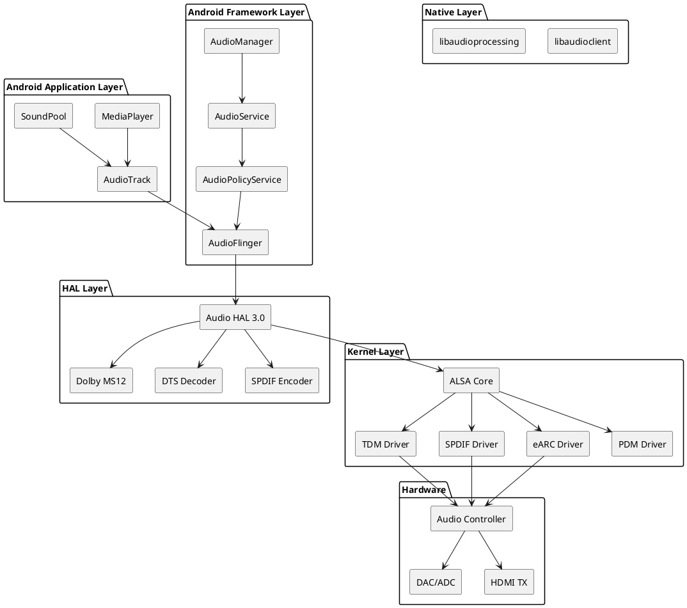
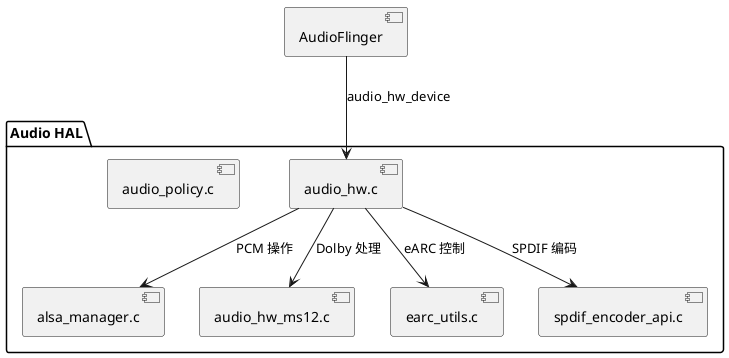
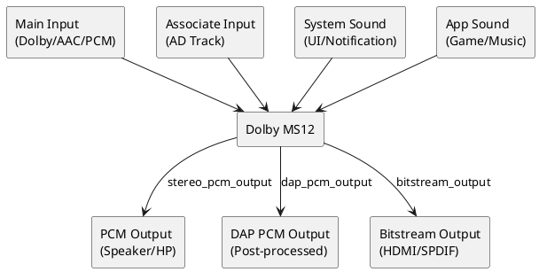
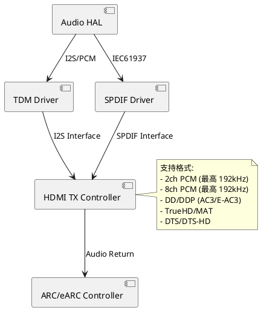
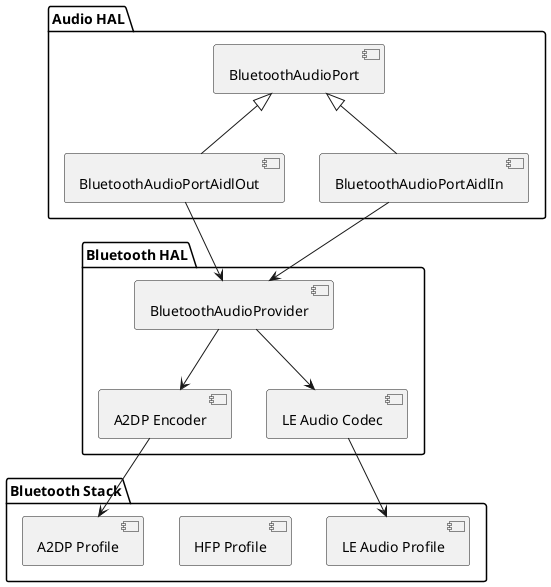

# 音频子系统详解

## 目录

1. [概述](#1-概述)
2. [音频子系统架构](#2-音频子系统架构)
3. [ALSA 驱动框架](#3-alsa-驱动框架)
4. [Audio HAL 实现](#4-audio-hal-实现)
5. [AudioFlinger 服务](#5-audioflinger-服务)
6. [Audio Policy 配置](#6-audio-policy-配置)
7. [Dolby MS12 集成](#7-dolby-ms12-集成)
8. [音频输出通道](#8-音频输出通道)
9. [蓝牙音频](#9-蓝牙音频)
10. [项目音频配置](#10-项目音频配置)
11. [调试与问题排查](#11-调试与问题排查)
12. [附录](#12-附录)

---

## 1. 概述

### 1.1 文档目的

本文档详细介绍 Amlogic S905X5 平台 Android U 系统的音频子系统架构、实现细节和调试方法，帮助开发者深入理解音频数据流和各组件之间的交互关系。

### 1.2 适用范围

- Amlogic S905X5 芯片平台
- Android U (Android 14) 系统
- 内核版本: Linux 5.15 (common14-5.15)

### 1.3 音频子系统特性

| 特性 | 说明 |
|------|------|
| 音频格式支持 | PCM, AC3, E-AC3, DTS, DTS-HD, TrueHD, MAT, AC4, AAC, MPEGH |
| 输出接口 | HDMI (ARC/eARC), SPDIF, I2S, 蓝牙 A2DP/SCO/LE Audio |
| 采样率支持 | 8kHz ~ 192kHz |
| 声道配置 | Mono, Stereo, 5.1, 7.1, Atmos |
| 特色功能 | Dolby MS12 解码器, DTS-HD 解码器, 硬件音视频同步 |

---

## 2. 音频子系统架构

### 2.1 整体架构图



### 2.2 数据流路径

#### 2.2.1 PCM 播放路径

```
App → AudioTrack → AudioFlinger → AudioHAL → TinyALSA → ALSA Driver → I2S/TDM → DAC/HDMI
```

#### 2.2.2 压缩音频播放路径 (Dolby/DTS)

```
App → AudioTrack → AudioFlinger → AudioHAL → MS12/DTS Decoder → TinyALSA → ALSA Driver → HDMI/SPDIF
```

#### 2.2.3 Passthrough 路径

```
App → AudioTrack → AudioFlinger → AudioHAL → SPDIF Encoder → ALSA Driver → HDMI/SPDIF
```

### 2.3 关键组件说明

| 组件 | 位置 | 功能描述 |
|------|------|----------|
| AudioFlinger | frameworks/av/services/audioflinger | 音频服务核心，管理音频流和混音 |
| AudioPolicyManager | frameworks/av/services/audiopolicy | 音频策略管理，设备路由选择 |
| Audio HAL | hardware/amlogic/audio/audio_hal | 硬件抽象层，连接框架与驱动 |
| Dolby MS12 | hardware/amlogic/audio/decoder/libms12_* | Dolby 解码和后处理 |
| ALSA Driver | common/common14-5.15/common/common_drivers/sound/soc/amlogic | 内核音频驱动 |

---

## 3. ALSA 驱动框架

### 3.1 驱动架构

Amlogic 音频驱动基于 ALSA SoC (ASoC) 框架实现，位于：
```
common/common14-5.15/common/common_drivers/sound/soc/amlogic/auge/
```

### 3.2 核心驱动模块

#### 3.2.1 TDM (Time Division Multiplexing) 驱动

**文件**: `tdm.c`, `tdm_hw.c`

TDM 驱动负责 I2S 音频数据传输，是最主要的音频输出接口。

```c
// 核心数据结构 (tdm.c:84-150)
struct aml_tdm {
    struct pcm_setting setting;
    struct pinctrl *pin_ctl;
    struct aml_audio_controller *actrl;
    struct device *dev;
    struct clk *clk;
    struct clk *mclk;
    unsigned int id;
    struct tdm_chipinfo *chipinfo;
    // ... 更多成员
};
```

**主要功能**:
- 支持 PCM 数据传输 (8~192kHz, 16/24/32bit)
- 支持多通道输出 (最高 8 通道)
- 支持与 HDMI TX 的虚拟链接
- 支持 sharebuffer 模式与其他模块共享数据

#### 3.2.2 SPDIF 驱动

**文件**: `spdif.c`, `spdif_hw.c`

```c
// SPDIF 源选择 (spdif.c:59-64)
enum SPDIF_SRC {
    SPDIFIN_PAD = 0,  // 外部 SPDIF 输入
    SPDIFOUT,         // SPDIF 输出环回
    NOAP,             // 无音频包
    HDMIRX            // HDMI RX 音频
};
```

**硬件特性**:
- 支持 IEC958/IEC61937 协议
- 采样率: 8kHz ~ 192kHz
- 支持 PCM 和压缩音频 (AC3, DTS 等)
- 支持双 SPDIF 输出 (spdif_a, spdif_b)

#### 3.2.3 eARC 驱动

**文件**: `hdmirx_arc_iomap.c`

eARC (Enhanced Audio Return Channel) 支持高带宽音频回传：
- 支持 Dolby TrueHD, Dolby Atmos
- 支持 DTS-HD Master Audio
- 最高 192kHz/24bit 多声道 PCM

#### 3.2.4 Sound Card 驱动

**文件**: `card.c`

```c
// 支持的音频格式枚举 (card.c:47-69)
static const char * const audio_format[] = {
    "PCM",
    "DTS_EXPRESS",
    "DOLBY_DIGITAL",
    "DTS",
    "DOLBY_DIGITAL_PLUS",
    "DTS_HD",
    "MULTI_CHANNEL PCM",
    "DOLBY_TRUEHD",
    "DTS_HD_MA",
    "HIFI PCM",
    "DOLBY_AC4",
    "DOLBY_MAT",
    "DOLBY_DDP_ATMOS",
    // ...
};
```

### 3.3 ALSA PCM 设备映射

| PCM 设备 | 用途 | 备注 |
|---------|------|------|
| hw:0,0 | 系统音频输出 | Primary output |
| hw:0,1 | SPDIF 输出 | 数字音频 |
| hw:0,2 | TDM 输出 | 多通道音频 |
| hw:0,3 | eARC 输出 | 高带宽音频 |
| hw:0,4 | 麦克风输入 | 录音 |

### 3.4 时钟配置

音频时钟管理位于 `clks/` 目录，针对不同芯片有专门的时钟配置：

```
clks/
├── audio_clks.c      # 通用音频时钟
├── clk-s5.c          # S905X5 专用时钟
├── clk-g12a.c        # G12A 系列时钟
└── ...
```

**关键时钟参数**:
- MCLK: 主时钟，通常为采样率的 256/512 倍
- BCLK: 位时钟，= 采样率 × 位深 × 通道数
- LRCLK: 帧时钟，= 采样率

---

## 4. Audio HAL 实现

### 4.1 HAL 架构

Audio HAL 位于 `hardware/amlogic/audio/audio_hal/`，实现 Android Audio HAL 3.0 接口。



### 4.2 核心数据结构

#### 4.2.1 音频设备结构

```c
// audio_hw.h:359-656
struct aml_audio_device {
    struct audio_hw_device hw_device;
    pthread_mutex_t lock;

    // 设备状态
    int mode;
    audio_devices_t in_device;
    audio_devices_t out_device;

    // PCM 设备句柄
    struct pcm *pcm_handle[ALSA_DEVICE_CNT];

    // Dolby MS12
    struct dolby_ms12_desc ms12;
    bool dolby_ms12_status;

    // DTS 解码器
    struct dca_dts_dec dts_hd;
    dtsx_dec_t dts_x;

    // 输出格式
    audio_format_t sink_format;
    audio_format_t optical_format;

    // 设备配置
    int digital_audio_mode;  // PCM/DD/DDP/AUTO
    bool spdif_enable;

    // ... 更多成员
};
```

#### 4.2.2 输出流结构

```c
// audio_hw.h:722-965
struct aml_stream_out {
    struct audio_stream_out stream;
    pthread_mutex_t lock;

    // 流配置
    struct audio_config audioCfg;
    struct pcm_config config;
    audio_format_t hal_format;
    unsigned int hal_rate;
    audio_output_flags_t flags;

    // 解码器
    aml_dec_t *aml_dec;

    // 同步
    audio_hwsync_t *hwsync;

    // 音量
    float volume_l;
    float volume_r;

    // ... 更多成员
};
```

### 4.3 支持的音频格式

```c
// audio_hw.h:173-202
enum audio_hal_format {
    TYPE_PCM = 0,
    TYPE_DTS_EXPRESS = 1,
    TYPE_AC3 = 2,
    TYPE_DTS = 3,
    TYPE_EAC3 = 4,
    TYPE_DTS_HD = 5,
    TYPE_MULTI_PCM = 6,
    TYPE_TRUE_HD = 7,
    TYPE_DTS_HD_MA = 8,
    TYPE_PCM_HIGH_SR = 9,
    TYPE_AC4 = 10,
    TYPE_MAT = 11,
    TYPE_DDP_ATMOS = 12,
    TYPE_TRUE_HD_ATMOS = 13,
    TYPE_MAT_ATMOS = 14,
    TYPE_AC4_ATMOS = 15,
    TYPE_DTS_HP = 16,
    TYPE_AAC = 21,
    TYPE_HEAAC = 22,
    TYPE_DTSX = 23,
    TYPE_MPEGH = 24,
};
```

### 4.4 ALSA 设备类型

```c
// audio_hw.h:255-262
typedef enum alsa_device {
    I2S_DEVICE = 0,      // I2S/TDM 输出
    DIGITAL_DEVICE,      // SPDIF A
    TDM_DEVICE,          // TDM 专用
    EARC_DEVICE,         // eARC 输出
    DIGITAL_DEVICE2,     // SPDIF B
    ALSA_DEVICE_CNT
} alsa_device_t;
```

### 4.5 关键 API

#### 4.5.1 ALSA 管理接口

```c
// alsa_manager.h
int aml_alsa_output_open(struct audio_stream_out *stream);
void aml_alsa_output_close(struct audio_stream_out *stream);
size_t aml_alsa_output_write(struct audio_stream_out *stream, void *buffer, size_t bytes);
int aml_alsa_output_pause(struct audio_stream_out *stream);
int aml_alsa_output_resume(struct audio_stream_out *stream);
int aml_alsa_output_get_latency(struct audio_stream_out *stream);
```

#### 4.5.2 SPDIF 编码接口

```c
// spdif_encoder_api.h
int aml_spdif_encoder_open(void **spdifenc_handle, audio_format_t format);
int aml_spdif_encoder_close(void *phandle);
int aml_spdif_encoder_process(void *phandle, const void *buffer, size_t numBytes,
                               void **output_buf, size_t *out_size);
int aml_spdif_encoder_mute(void *phandle, bool bmute);
```

### 4.6 音频流类型

```c
// audio_hw.h:241-253
typedef enum stream_type {
    STREAM_PCM_NORMAL = 0,    // 普通 PCM 流 (混音)
    STREAM_PCM_DIRECT = 1,    // 直接 PCM 流
    STREAM_PCM_HWSYNC = 2,    // 硬件同步 PCM
    STREAM_RAW_DIRECT = 3,    // 直接 RAW 流
    STREAM_RAW_HWSYNC = 4,    // 硬件同步 RAW
    STREAM_PCM_PATCH = 5,     // PCM Patch
    STREAM_RAW_PATCH = 6,     // RAW Patch
    STREAM_PCM_MMAP = 7,      // MMAP 低延迟
    STREAM_PCM_DEEP_BUF = 8,  // 深缓冲
} stream_type_t;
```

---

## 5. AudioFlinger 服务

### 5.1 AudioFlinger 概述

AudioFlinger 是 Android 音频服务的核心，负责：
- 音频流管理
- 混音处理
- 音效处理
- 设备路由

**代码位置**: `frameworks/av/services/audioflinger/AudioFlinger.cpp`

### 5.2 音频线程类型

| 线程类型 | 用途 | 特点 |
|---------|------|------|
| MixerThread | 混音线程 | 处理普通 PCM 流，支持混音 |
| DirectOutputThread | 直接输出线程 | 处理压缩音频或高采样率音频 |
| OffloadThread | 卸载线程 | 硬件解码，低功耗 |
| DuplicatingThread | 复制线程 | 同时输出到多个设备 |
| MmapThread | MMAP 线程 | AAudio 低延迟 |

### 5.3 音频策略配置

音频策略由 AudioPolicyManager 管理：
- **代码位置**: `frameworks/av/services/audiopolicy/managerdefault/AudioPolicyManager.cpp`
- **配置文件**: `audio_policy_configuration.xml`

---

## 6. Audio Policy 配置

### 6.1 配置文件位置

```
device/amlogic/common/audio/audio_policy_configuration_temp.xml
```

### 6.2 主要配置项

#### 6.2.1 模块配置

```xml
<module name="primary" halVersion="3.0">
    <attachedDevices>
        <item>Mute Device</item>
        <item>Speaker</item>
        <item>Built-In Mic</item>
        <item>Echo Reference</item>
        <item>Tuner</item>
    </attachedDevices>
    <defaultOutputDevice>Speaker</defaultOutputDevice>
```

#### 6.2.2 MixPort 配置

| MixPort | 用途 | Flags |
|---------|------|-------|
| primary output | 主输出 | PRIMARY |
| tunnel pcm | 硬件同步 PCM | DIRECT, HW_AV_SYNC |
| compress offload | 压缩音频卸载 | DIRECT, COMPRESS_OFFLOAD |
| direct pcm | 直接 PCM | DIRECT |
| mmap_no_irq_out | AAudio 低延迟 | DIRECT, MMAP_NOIRQ |

#### 6.2.3 设备端口配置

```xml
<devicePort tagName="HDMI Out" type="AUDIO_DEVICE_OUT_AUX_DIGITAL" role="sink"/>
<devicePort tagName="Spdif Out" type="AUDIO_DEVICE_OUT_SPDIF" role="sink">
    <gains>
        <gain name="gain_1" mode="AUDIO_GAIN_MODE_JOINT"
              minValueMB="-100000" maxValueMB="0"
              defaultValueMB="-6000" stepValueMB="100"/>
    </gains>
</devicePort>
<devicePort tagName="Speaker" type="AUDIO_DEVICE_OUT_SPEAKER" role="sink"/>
```

#### 6.2.4 路由配置

```xml
<routes>
    <route type="mix" sink="HDMI Out"
           sources="primary output,tunnel pcm,compress offload,direct output"/>
    <route type="mix" sink="Spdif Out"
           sources="primary output,tunnel pcm,compress offload"/>
    <route type="mix" sink="Speaker"
           sources="primary output,tunnel pcm,direct pcm"/>
</routes>
```

#### 6.2.5 环绕声配置

```xml
<surroundSound>
    <formats>
        <format name="AUDIO_FORMAT_AC3"/>
        <format name="AUDIO_FORMAT_E_AC3"/>
        <format name="AUDIO_FORMAT_E_AC3_JOC"/>
        <format name="AUDIO_FORMAT_DTS"/>
    </formats>
</surroundSound>
```

---

## 7. Dolby MS12 集成

### 7.1 MS12 概述

Dolby MS12 (Multistream Decoder) 是 Amlogic 平台集成的 Dolby 音频解决方案，提供：
- Dolby Digital (AC3) 解码
- Dolby Digital Plus (E-AC3) 解码
- Dolby Atmos 支持
- Dolby Audio Processing (DAP)
- 多流混音

#### 7.1.1 编译时启用音频解码器

<!-- source: Amlogics905x 方案合集.md#L611-L641 -->

在产品的 mk 文件中配置需要启用的音频解码器：

**配置文件** (`device/amlogic/<product>/<product>.mk`):

```makefile
########################################################################
#                          Audio License Decoder
########################################################################

# Dolby MS12 版本 (1 或 2)
TARGET_DOLBY_MS12_VERSION := 2
ifeq ($(TARGET_DOLBY_MS12_VERSION), 2)
    TARGET_BUILD_DOLBY_MS12_V2 := true
else
    #TARGET_BUILD_DOLBY_MS12 := true
endif

# Dolby Digital Plus (E-AC3) 支持
TARGET_BUILD_DOLBY_DDP := true

# DTS-HD 支持 (与 Dolby DDP 二选一)
#TARGET_BUILD_DTSHD := true
```

**注意事项**:
- Dolby 和 DTS 解码器需要相应的授权许可
- 启用 Dolby DDP 后可能需要更新解码库文件：
  ```
  vendor/amlogic/common/prebuilt/libstagefrighthw/lib/libHwAudio_dcvdec.so
  ```
- MS12 V2 提供更好的 Atmos 支持，推荐使用

### 7.2 代码位置

```
hardware/amlogic/audio/decoder/
├── libms12_v1/          # MS12 v1 版本
│   ├── include/
│   │   ├── dolby_ms12.h
│   │   ├── dolby_ms12_config_params.h
│   │   └── dolby_ms12_status.h
│   └── src/
│       ├── dolby_ms12.cpp
│       └── aml_audio_ms12.c
└── libms12_v24/         # MS12 v2.4 版本
```

### 7.3 MS12 配置等级

```c
// audio_hw.h:339-343
enum ms12_config_leveler {
    MS12_CONFIG_Y = 0,  // 不支持 DAP
    MS12_CONFIG_X = 1,  // 支持 DAP，不支持 Atmos
    MS12_CONFIG_Z = 2,  // 支持 DAP 和 Atmos
};
```

### 7.4 MS12 核心 API

```c
// dolby_ms12.h

// 获取 MS12 库句柄
int get_libdolbyms12_handle(char *dolby_ms12_path);
int release_libdolbyms12_handle(void);

// 初始化和释放
void *dolby_ms12_init(int argc, char **argv);
void dolby_ms12_release(void *dolby_mS12_pointer);

// 输入处理
int dolby_ms12_input_main(void *dolby_mS12_pointer,
                          const void *input_main_buffer,
                          size_t audio_stream_out_buffer_size,
                          int audio_stream_out_format,
                          int audio_stream_out_channel_num,
                          int audio_stream_out_sample_rate);

int dolby_ms12_input_associate(void *dolby_mS12_pointer,
                               const void *audio_stream_out_buffer,
                               size_t audio_stream_out_buffer_size,
                               int audio_stream_out_format,
                               int audio_stream_out_channel_num,
                               int audio_stream_out_sample_rate);

int dolby_ms12_input_system(void *dolby_mS12_pointer,
                            const void *audio_stream_out_buffer,
                            size_t audio_stream_out_buffer_size,
                            int audio_stream_out_format,
                            int audio_stream_out_channel_num,
                            int audio_stream_out_sample_rate);
```

### 7.5 MS12 数据流



### 7.6 MS12 输出回调

```c
// audio_hw_ms12.h

// PCM 输出回调
int ms12_output(void *buffer, void *priv_data, size_t size,
                aml_ms12_dec_info_t *ms12_info);

// DAP 处理后 PCM 输出
int dap_pcm_output(void *buffer, void *priv_data, size_t size,
                   aml_ms12_dec_info_t *ms12_info);

// 立体声 PCM 输出
int stereo_pcm_output(void *buffer, void *priv_data, size_t size,
                      aml_ms12_dec_info_t *ms12_info);

// 比特流输出 (DD/DDP)
int bitstream_output(void *buffer, void *priv_data, size_t size);
```

### 7.7 MS12 配置参数

```c
// dolby_ms12_config_params.h

// 设置音频流参数
void dolby_ms12_config_params_set_audio_stream_out_params(
    audio_output_flags_t flags,
    audio_format_t input_format,
    audio_channel_mask_t channel_mask,
    int sample_rate,
    audio_format_t output_format);

// 获取初始化参数
char **dolby_ms12_config_params_get_config_params(int *argc);
```

---

## 8. 音频输出通道

### 8.1 HDMI 音频输出

#### 8.1.1 HDMI TX 架构



#### 8.1.2 HDMI TX 源选择

```c
// aml_audio_config.json 配置
{
    "HDMITX_Src_Select": 3,           // I2S 源选择
    "HDMITX_Multi_CH_Src_Select": 4   // 多通道源选择
}
```

### 8.2 eARC 音频输出

eARC (Enhanced Audio Return Channel) 提供高带宽音频回传能力。

#### 8.2.1 eARC 特性

| 特性 | ARC | eARC |
|------|-----|------|
| 带宽 | ~1 Mbps | ~37 Mbps |
| PCM | 2ch/48kHz | 8ch/192kHz |
| DD | 支持 | 支持 |
| DDP | 支持 | 支持 |
| TrueHD | 不支持 | 支持 |
| DTS-HD MA | 不支持 | 支持 |
| Atmos | 有损 | 无损 |

#### 8.2.2 eARC API

```c
// earc_utils.h
int earcrx_config_latency(struct mixer *pMixer, int latency);
int earctx_fetch_latency(struct mixer *pMixer);
int earcrx_config_cds(struct mixer *pMixer, char *cds_str);
int earctx_fetch_cds(struct aml_mixer_handle *amixer, char *cds_str,
                     int hex, struct aml_arc_hdmi_desc *hdmi_descs);
```

### 8.3 SPDIF 音频输出

#### 8.3.1 SPDIF 特性

- 支持 IEC958 (PCM) 和 IEC61937 (压缩音频)
- 采样率: 32kHz, 44.1kHz, 48kHz, 96kHz, 192kHz
- 支持双 SPDIF 输出 (spdif_a + spdif_b)

#### 8.3.2 支持的压缩格式

| 格式 | IEC61937 包大小 |
|------|----------------|
| AC3 | 0x1800 (6144 bytes) |
| E-AC3 | 0x6000 (24576 bytes) |
| DTS | 根据帧大小 |
| DTS-HD | HBR 模式 |

### 8.4 Speaker 输出 (I2S/TDM)

#### 8.4.1 输出设备类型

```c
// alsa_manager.h:42-49
typedef enum AML_AUDIO_OUT_DEV_TYPE {
    AML_AUDIO_OUT_DEV_TYPE_SPEAKER = 0,    // 扬声器
    AML_AUDIO_OUT_DEV_TYPE_SPDIF = 1,      // SPDIF
    AML_AUDIO_OUT_DEV_TYPE_HEADPHONE = 2,  // 耳机
    AML_AUDIO_OUT_DEV_TYPE_OTHER = 3,      // 其他
} aml_audio_out_dev_type_e;
```

#### 8.4.2 TDM 配置

```c
// 默认配置
#define OUTPUT_ALSA_SAMPLERATE  48000
#define PLAYBACK_PERIOD_COUNT   4
#define OUTPUT_BUFFER_SIZE      (6 * 1024)
```

---

## 9. 蓝牙音频

### 9.1 蓝牙音频架构



### 9.2 支持的蓝牙音频协议

| 协议 | 用途 | 编码格式 |
|------|------|----------|
| A2DP | 立体声音乐 | SBC, AAC, LDAC, aptX |
| HFP | 免提通话 | CVSD, mSBC |
| LE Audio | 低功耗音频 | LC3 |
| SCO | 语音通话 | CVSD |

### 9.3 蓝牙音频 HAL (AIDL)

**文件**: `hardware/amlogic/audio/audio_hal/audio_bt_hw.h`

```cpp
// 蓝牙流状态
enum class BluetoothStreamState : uint8_t {
    DISABLED = 0,  // 流关闭或挂起
    STANDBY,       // 待机
    STARTING,      // 启动中
    STARTED,       // 已启动
    SUSPENDING,    // 挂起中
    UNKNOWN,       // 未知
};

// 默认参数
constexpr unsigned int kBluetoothDefaultSampleRate = 44100;
constexpr audio_format_t kBluetoothDefaultAudioFormatBitsPerSample = AUDIO_FORMAT_PCM_16_BIT;
```

### 9.4 BluetoothAudioPort 接口

```cpp
class BluetoothAudioPort {
public:
    // 初始化和清理
    virtual bool SetUp(audio_devices_t);
    virtual void TearDown();

    // 音频配置
    virtual bool LoadAudioConfig(audio_config_t*) const;

    // 流控制
    virtual bool Start();
    virtual bool Suspend();
    virtual void Stop();

    // 状态和信息
    virtual bool GetPresentationPosition(uint64_t*, uint64_t*, timespec*) const;
    virtual BluetoothStreamState GetState() const;

    // 数据传输
    virtual size_t WriteData(const void* buffer, size_t bytes) const;
    virtual size_t ReadData(void* buffer, size_t bytes) const;

    // 类型判断
    virtual bool IsA2dp() const;
    virtual bool IsLeAudio() const;
};
```

### 9.5 BLE 语音输入

项目支持 BLE 遥控器语音输入功能：

```xml
<!-- audio_policy_configuration.xml -->
<devicePort tagName="BLE-In" type="AUDIO_DEVICE_IN_BLUETOOTH_BLE" role="source">
    <profile name="" format="AUDIO_FORMAT_PCM_16_BIT"
             samplingRates="16000" channelMasks="AUDIO_CHANNEL_IN_MONO"/>
</devicePort>
```

相关提交: `feat(audio): Add BLE remote voice input support via BLEHID device`

---

## 10. 项目音频配置

### 10.1 设备音频配置文件

不同产品的音频配置位于 `device/amlogic/<product>/files/` 目录：

```
device/amlogic/
├── ohm_wv4/files/
│   ├── audio_policy_devices.xml      # 设备端口配置
│   ├── audio_effects.conf            # 音效配置
│   ├── aml_audio_config.json         # Amlogic 专有配置
│   └── aml_audio_config_soundbar.json
├── raman/files/
│   ├── audio_policy_devices.xml
│   ├── audio_policy_devices_sbr.xml  # Soundbar 配置
│   └── aml_audio_config.json
└── ...
```

### 10.2 aml_audio_config.json 配置

```json
{
    "Dolby_MS12_Audio_Config": "y",        // MS12 DAP 开关
    "Dolby_DRC_Audio_Config": 0,           // Dolby DRC UI 开关
    "Passthrough_Audio_Config": 0,         // Passthrough 选项显示
    "Dts_DRC_Audio_Config": 0,             // DTS DRC UI 开关
    "HDMITX_Src_Select": 3,                // HDMI TX 源选择
    "HDMITX_Multi_CH_Src_Select": 4        // 多通道源选择
}
```

### 10.3 audio_policy_devices.xml 配置

```xml
<audioPolicyConfiguration version="1.0">
    <attachedDevices>
        <item>Mute Device</item>
        <item>Speaker</item>
        <item>Built-In Mic</item>
        <item>Echo Reference</item>
        <item>Tuner</item>
    </attachedDevices>
    <devicePorts>
        <item>BT A2DP Headphones</item>
        <item>BT A2DP Speaker</item>
        <item>HDMI Out</item>
        <item>Spdif Out</item>
        <item>Speaker</item>
        <item>USB Device Out</item>
        <item>BLE-In</item>
        <item>BT SCO Headset Mic</item>
        <item>Built-In Mic</item>
    </devicePorts>
</audioPolicyConfiguration>
```

### 10.4 音频输出模式

系统支持多种数字音频输出模式：

```c
// card.c:72-78
enum audio_digital_mode {
    AML_HAL_PCM = 0,     // 强制 PCM 输出
    AML_HAL_DD = 1,      // DD (AC3) 输出
    AML_HAL_AUTO = 2,    // 自动选择
    AML_HAL_BYPASS = 3,  // 直通模式
    AML_HAL_DDP = 4,     // DDP (E-AC3) 输出
};
```

---

## 11. 调试与问题排查

### 11.1 常用调试命令

#### 11.1.1 查看音频设备状态

```bash
# 查看 ALSA 声卡
adb shell cat /proc/asound/cards

# 查看 PCM 设备
adb shell cat /proc/asound/pcm

# 查看音频路由
adb shell dumpsys media.audio_flinger

# 查看音频策略
adb shell dumpsys media.audio_policy
```

#### 11.1.2 TinyALSA 调试工具

```bash
# 列出混音器控件
adb shell tinymix

# 播放 WAV 文件
adb shell tinyplay /sdcard/test.wav

# 录制音频
adb shell tinycap /sdcard/record.wav

# 查看 PCM 信息
adb shell tinypcminfo
```

#### 11.1.3 音频属性调试

```bash
# 查看音频相关属性
adb shell getprop | grep audio
adb shell getprop | grep dolby

# 设置调试属性
adb shell setprop vendor.media.audio.debug 1
```

### 11.2 日志分析

#### 11.2.1 关键日志标签

| 标签 | 模块 |
|------|------|
| audio_hw_hal_primary | Audio HAL 主模块 |
| AudioFlinger | AudioFlinger 服务 |
| AudioPolicyManager | 音频策略管理 |
| audio_hw_ms12 | Dolby MS12 |
| snd_tdm | TDM 驱动 |
| snd_spdif | SPDIF 驱动 |

#### 11.2.2 日志过滤

```bash
# 查看 Audio HAL 日志
adb logcat -s audio_hw_hal_primary

# 查看 Dolby MS12 日志
adb logcat -s audio_hw_ms12

# 查看 ALSA 驱动日志
adb shell dmesg | grep -E "(snd_|aml_audio)"
```

### 11.3 常见问题排查

#### 11.3.1 无声音输出

**检查步骤**:
1. 确认音频路由配置正确
2. 检查 ALSA 设备是否打开成功
3. 确认音量未静音
4. 检查 HDMI/SPDIF 连接状态

```bash
# 检查音频路由
adb shell dumpsys media.audio_flinger | grep -A 20 "Output"

# 检查混音器音量
adb shell tinymix | grep -i volume
```

#### 11.3.2 音视频不同步

**可能原因**:
1. hwsync 未正确配置
2. 音频缓冲区过大
3. 解码器延迟

**调试方法**:
```bash
# 检查 hwsync 状态
adb shell cat /sys/class/tsync/pts_audio
adb shell cat /sys/class/tsync/pts_video

# 查看音频延迟
adb shell dumpsys media.audio_flinger | grep latency
```

#### 11.3.3 Dolby/DTS 无法透传

**检查项**:
1. Sink 设备能力 (EDID)
2. 输出模式配置 (AUTO/BYPASS)
3. MS12 配置参数

```bash
# 查看 HDMI EDID
adb shell cat /sys/class/amhdmitx/amhdmitx0/edid

# 查看 sink 支持格式
adb shell dumpsys media.audio_policy | grep -A 10 "Output devices"
```

#### 11.3.4 蓝牙音频断断续续

**检查项**:
1. 蓝牙连接质量
2. A2DP 编码器配置
3. 缓冲区设置

```bash
# 查看蓝牙音频状态
adb shell dumpsys bluetooth_manager | grep -A 20 "A2DP"
```

### 11.4 音频数据抓取

```bash
# 在 Audio HAL 层抓取数据
adb shell setprop vendor.media.audio.dump 1
# 数据保存到 /data/vendor/audiohal/

# 抓取 ALSA PCM 数据
adb shell cat /dev/snd/pcmC0D0p > /sdcard/audio_dump.pcm
```

---

## 12. 附录

### 12.1 相关提交记录

| 提交 | 描述 |
|------|------|
| 59f763d1884 | feat(audio): Add BLE remote voice input support via BLEHID device |
| b2bd8c86802 | audio: Add xsd DTS_UHD_P2 format |
| efa1f087630 | audio: add aml feature of volume control |
| 0a7a5607ed9 | Audio: merge all auto patch from T to U |
| 8a314980be6 | audio: aac c2 codec, change the DRC Level |
| 59b8e1e7cbb | audio: fix multi channel pcm stream can't pause issue |
| d517d2e43e8 | fix: No audio output due to spdif disabled |
| ff1352f9b6f | audio: open CONFIG_CMD_SND for earc init |
| 3ea1e4c13be | audio: fix submix stuck issues |

### 12.2 关键源码文件索引

| 文件 | 路径 | 说明 |
|------|------|------|
| audio_hw.c | hardware/amlogic/audio/audio_hal/ | HAL 主入口 |
| audio_hw.h | hardware/amlogic/audio/audio_hal/ | HAL 头文件 |
| alsa_manager.c/h | hardware/amlogic/audio/audio_hal/ | ALSA 管理 |
| audio_hw_ms12.c/h | hardware/amlogic/audio/audio_hal/ | MS12 集成 |
| tdm.c | common/.../sound/soc/amlogic/auge/ | TDM 驱动 |
| spdif.c | common/.../sound/soc/amlogic/auge/ | SPDIF 驱动 |
| card.c | common/.../sound/soc/amlogic/auge/ | 声卡驱动 |
| dolby_ms12.h | hardware/amlogic/audio/decoder/libms12_v1/include/ | MS12 API |

### 12.3 参考文档

- [Android Audio Architecture](https://source.android.com/docs/core/audio)
- [ALSA Project Documentation](https://www.alsa-project.org/wiki/Documentation)
- [Dolby MS12 Integration Guide](https://developer.dolby.com/)
- [HDMI 2.1 Specification](https://www.hdmi.org/spec21sub/eARC)

### 12.4 术语表

| 术语 | 全称 | 说明 |
|------|------|------|
| ALSA | Advanced Linux Sound Architecture | Linux 高级音频架构 |
| ASoC | ALSA System on Chip | 嵌入式 ALSA 框架 |
| DAI | Digital Audio Interface | 数字音频接口 |
| TDM | Time Division Multiplexing | 时分复用 |
| SPDIF | Sony/Philips Digital Interface | 数字音频接口标准 |
| eARC | Enhanced Audio Return Channel | 增强音频回传通道 |
| MS12 | Multistream Decoder 12 | Dolby 多流解码器 |
| DAP | Dolby Audio Processing | Dolby 音频处理 |
| HBR | High Bit Rate | 高比特率 |
| MMAP | Memory Mapped | 内存映射 (低延迟) |

---
