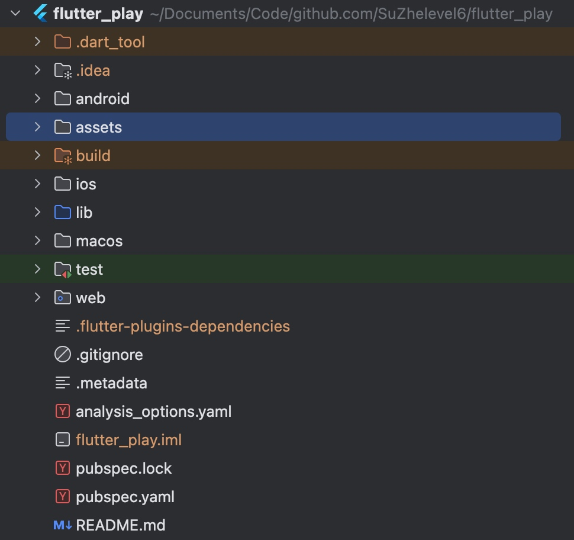

# Flutter笔记

> 本笔记面向 Android 开发者，采用类比 Android 的方式学习 Flutter，重点对比两个框架的差异点。

## 参考文档

**官方文档**
- Flutter 官方文档：https://docs.flutter.dev/ui
- Flutter for Android 开发者：https://docs.flutter.dev/get-started/flutter-for/android-devs
- 安装教程：https://docs.flutter.dev/install/manual

**学习资源**
- 学习博客：https://hanshuliang.blog.csdn.net/article/details/104825048
- 创建和运行程序：https://juejin.cn/post/7428798320405053477
- Flutter 项目配置：https://juejin.cn/post/7306579782853754932
- Flutter 组件库预览 APP：https://github.com/toly1994328/FlutterUnit

**资源库**
- 官方图标库：https://fonts.google.com/icons
- 三方图标库：https://www.fluttericon.com/

---

## 一、Flutter 概述与定位

### 1.1 什么是 Flutter

Flutter 本质上是一个**跨平台的 UI 工具集**，允许在各自操作系统上复用同样的代码，尽可能提供原生体验的高性能应用。

**核心特点：**
- **跨平台支持**：一套代码可以同时运行在 Android、iOS、Windows、Web、macOS、Linux 共 6 大平台
- **自渲染引擎**：使用 Skia 图形引擎，自行实现渲染框架，不依赖原生控件
- **高性能**：
  - 开发时：运行在 VM 上，支持热重载（Hot Reload），保留状态且无需重新编译
  - 发布时：通过 AOT 编译为机器码，性能接近原生应用
- **界面优美**：内置 Material Design 和 Cupertino（iOS 风格）组件库

### 1.2 跨平台方案对比

移动端跨平台技术从核心本质来划分，可分为以下三大类：

| 方案类型 | 代表技术 | 实现原理 | 优势 | 劣势 |
|---------|---------|---------|------|------|
| **Web 技术** | PhoneGap、Cordova、小程序 | 主要依赖 WebView | 开发成本低，迭代快 | 功能受限，性能体验差 |
| **原生渲染** | React Native、Weex | JavaScript 编程，通过中间层转化为原生控件渲染 | 接近原生性能，生态丰富 | 需要维护桥接层，兼容性问题 |
| **自渲染技术** | **Flutter**、Unity | 自行实现渲染框架，调用 Skia 等完成自渲染 | 性能高，跨平台一致性好 | 包体积较大，需要学习新语言 |

**Flutter 的优势：**
1. **快速开发**：热重载功能，修改代码后无需重启应用即可看到效果
2. **真正的跨平台**：一套代码同时构建 Android、iOS 等多平台应用
3. **自渲染保证一致性**：不依赖原生控件，在不同平台上表现一致
4. **性能优秀**：直接调用 Skia 渲染引擎，性能接近原生

**Flutter 的劣势：**
1. **包体积较大**：需要打包 Flutter 引擎，首次安装包会比原生应用大
2. **WebView/PlatformView 问题**：嵌入原生控件（如 WebView、MapView）时会有性能和键盘交互问题
3. **图片处理能力较弱**：单个大图或大量图片列表容易出现内存和 GPU 溢出
4. **混合开发成本高**：Flutter 的控件和页面堆栈脱离原生平台，混合开发维护成本较高
5. **需要学习 Dart**：Dart 语言生态相比 Java/Kotlin 较小

### 1.3 为什么选择 Flutter

**学习建议：**
> 学对自己有用的技术。

对于 Android 开发者，以下场景建议学习 Flutter：
- 需要适配**鸿蒙系统**（Flutter 已支持鸿蒙）
- 需要快速开发多平台应用（特别是中小型应用）
- 团队希望统一 Android 和 iOS 的开发技术栈
- 对 UI 表现力要求高，需要自定义复杂界面

**学习策略：**
- 先建立基础认知（理解 Flutter 的核心概念和架构）
- 在实际项目开发中深化理解
- 通过**类比 Android** 的方式学习（对比两个框架的差异点）

**实际应用建议：**
- **混合开发是正解**：不要一次性用 Flutter 重写整个项目，而是逐步迭代，用 Flutter 重写功能模块
- **渐进式替换**：单个功能模块的测试和验证成本更低，更容易发现问题

---

## 二、核心概念与架构

### 2.1 Flutter 分层架构

Flutter 是一个**可扩展的分层系统**，可被视为各个独立组件的集合。上层组件依赖下层，但上层无法越界访问更下层的组件，框架内各部分是可选可替代的。

从上到下分为三层：**框架层（Framework）**、**引擎层（Engine）**、**嵌入层（Embedder）**


```
┌─────────────────────────────────────────────┐
│            框架层 (Framework)                │
│  Material / Cupertino (UI组件库)            │
│  Widgets (组合抽象层)                        │
│  Rendering (渲染层)                          │
│  Animation / Painting / Gestures (基础层)   │
│  (使用 Dart 语言编写)                        │
├─────────────────────────────────────────────┤
│            引擎层 (Engine)                   │
│  Skia 图形引擎、Text 文本布局                │
│  Dart Runtime (Dart 运行时)                 │
│  (使用 C++ 编写)                             │
├─────────────────────────────────────────────┤
│          嵌入层 (Embedder)                   │
│  Android / iOS / Windows / Web / ...        │
│  (平台特化，使用各平台原生语言)               │
└─────────────────────────────────────────────┘
```

#### 2.1.1 嵌入层（Embedder）- 平台特化

**作用：** 提供程序入口，使 Flutter 应用可以与底层操作系统进行协调。

**职责：**
- 访问底层操作系统服务（文件系统、摄像头、传感器等）
- 管理事件循环队列（触摸事件、绘制事件等）
- 提供平台特定的 API

**实现方式：**
- Android 平台：使用 Java/Kotlin
- iOS 平台：使用 Objective-C/Swift
- Windows 平台：使用 C++
- Web 平台：使用 JavaScript

**集成方式：**
- Flutter 代码可以作为**整个应用的主体**（纯 Flutter 应用）
- 也可以作为**模块集成到现有应用**中（混合开发）

#### 2.1.2 引擎层（Engine）

**作用：** 提供 Flutter 应用所需的底层原语（Primitives）。

**职责：**
- **图形渲染**：当需要绘制新一帧内容时，引擎负责对需要合成的场景进行栅格化
- **文本布局**：提供文本排版和渲染能力
- **Dart 运行时**：提供 Dart VM，负责 Dart 代码的运行

**实现语言：** 主要使用 **C++** 编写

**对外接口：**
- 引擎将底层 C++ 代码包装成 Dart 代码
- 通过 `dart:ui` 库暴露给 Flutter 框架层
- `dart:ui` 暴露最底层的原语，包括用于驱动输入、图形、文本等子系统的类

#### 2.1.3 框架层（Framework）

**作用：** 开发者通过框架层与 Flutter 交互，提供以 Dart 语言编写的现代响应式框架。

**从下到上的子层：**

```
┌──────────────────────────────────────┐
│  Material / Cupertino                │  ← UI 组件库
├──────────────────────────────────────┤
│  Widgets                             │  ← 组合抽象层
├──────────────────────────────────────┤
│  Rendering                           │  ← 渲染层
├──────────────────────────────────────┤
│  Animation / Painting / Gestures     │  ← 基础层
│  Foundation (基础类)                  │
└──────────────────────────────────────┘
```

**各子层说明：**

1. **基础层（Foundation / Animation / Painting / Gestures）**
   - `Foundation`：基础类（如 Key、ValueNotifier 等）
   - `Animation`：动画系统
   - `Painting`：绘画抽象
   - `Gestures`：手势识别

2. **渲染层（Rendering）**
   - 提供操作布局的抽象
   - 可以构建一棵**可渲染对象的树**（RenderObject Tree）
   - 支持动态更新这棵树

3. **Widget 层**
   - 提供**组合的抽象**
   - 每个渲染层中的 RenderObject 在 Widget 层都有对应的类
   - 允许开发者自由组合需要复用的各种类
   - **引入响应式编程模型**

4. **Material 和 Cupertino**
   - 提供全面的 Widget 组合
   - Material：实现 Google Material Design 设计规范
   - Cupertino：实现 Apple iOS 设计规范

**其他高层级功能：**
被拆分到不同的软件包中，如：
- 网络请求
- 本地存储
- 多媒体
- 等等

### 2.2 渲染机制三层架构 ⭐

这是理解 Flutter 最核心的概念！Flutter 的视图渲染由三个层次构成：

```
┌──────────────────────────────────────────────┐
│             Widget (配置层)                   │
│  - 不可变的配置信息                            │
│  - 描述 UI 应该长什么样                        │
│  - 轻量级,可频繁重建                           │
└──────────────────────────────────────────────┘
                    ↓
┌──────────────────────────────────────────────┐
│            Element (桥梁层)                   │
│  - Widget 的实例化对象                        │
│  - 持有 Widget 和 RenderObject                │
│  - 承载视图构建的上下文数据                    │
│  - 跨帧保存 State                             │
└──────────────────────────────────────────────┘
                    ↓
┌──────────────────────────────────────────────┐
│         RenderObject (渲染层)                 │
│  - 负责实际的布局计算                          │
│  - 负责实际的绘制                              │
│  - 真正"干活"的对象                           │
└──────────────────────────────────────────────┘
```

#### 2.2.1 Widget 层 - 配置信息

**Widget 是什么？**
- Widget 是对视图的**结构化描述**
- 存储视图渲染相关的**配置信息**：布局、渲染属性、事件响应等
- **Widget 不是真正的 View**，更像是**配置文件**

**核心特性：不可变（Immutable）**

```dart
/// 编译器会警告: This class is marked as '@immutable'
/// but one or more of its instance fields are not final
class TestWidget extends StatelessWidget {
  final String title;  // ✅ 必须是 final
  int count;           // ❌ 不能是可变的

  TestWidget({this.title, this.count});

  @override
  Widget build(BuildContext context) {
    return Container(
      child: Text("$title $count"),
    );
  }
}
```

**为什么 Widget 必须是 immutable？**
- Widget 是配置信息，每次状态更新都会被**重新构建**
- Widget 的固定状态代表了**一帧静止的画面**
- 当画面发生改变时，对应的 Widget 一定会变化（重新创建新的 Widget 对象）

**Widget 可以复用？**

是的！因为 Widget 只是配置文件，同一个 Widget 实例可以在多个地方使用：

```dart
final testWidget = Text("复用的文本");

Widget build(BuildContext context) {
  return Column(
    children: [
      testWidget,  // 第一次使用
      testWidget,  // 第二次使用
      testWidget,  // 第三次使用
    ],
  );
}
```

这在原生 Android 中是不可能的（一个 View 不能同时加载到多个父容器中），但在 Flutter 中完全没问题，因为 Widget 只是配置，真正的渲染对象会根据这个配置创建多个实例。

#### 2.2.2 Element 层 - 桥梁

**Element 是什么？**
- Widget 的**实例化对象**
- 承载视图构建的**上下文数据**
- 连接 Widget 到最终渲染的**桥梁**

**Element 的职责：**
1. **持有 Widget 和 RenderObject**
   - Element 持有对应的 Widget（配置信息）
   - Element 持有对应的 RenderObject（渲染对象）
   - 当 Widget 变化时，Element 负责更新 RenderObject

2. **跨帧保存状态**
   - State 对象被 Element 持有
   - 即使 Widget 被重建，Element 和 State 仍然存在
   - 这就是为什么 StatefulWidget 可以保存状态的原因

3. **管理生命周期**
   - Element 管理 Widget 和 RenderObject 的生命周期
   - 负责在合适的时机创建、更新、销毁它们

#### 2.2.3 RenderObject 层 - 真正干活

**RenderObject 是什么？**
- 负责实现视图渲染的对象
- 真正执行**布局计算**和**绘制**的地方

**RenderObject 的职责：**
1. **布局（Layout）**：计算自身和子节点的大小和位置
2. **绘制（Paint）**：将内容绘制到 Canvas 上
3. **合成（Composite）**：将绘制结果合成到 Layer 上

**为什么要三层架构？**
- **性能优化**：Widget 可以频繁重建（因为轻量级），但 RenderObject 可以复用（因为重量级）
- **状态保存**：Element 跨帧存在，可以保存 State
- **设计简洁**：Widget 只关注配置，RenderObject 只关注渲染，职责清晰

**类比 Android：**

| Flutter | Android | 说明 |
|---------|---------|------|
| Widget | XML 布局文件 | 配置信息 |
| Element | LayoutInflater 的中间产物 | 连接配置和实例 |
| RenderObject | View 对象 | 真正的渲染对象 |

#### 2.3.4 三者之间的关系

**问题1：什么样的组件才有 RenderObject？**

只有 `RenderObjectWidget` 及其子类才会创建 `RenderObject`。

```
  Widget
  ├── StatelessWidget      ❌ 无 RenderObject
  ├── StatefulWidget       ❌ 无 RenderObject
  ├── InheritedWidget      ❌ 无 RenderObject
  ├── ProxyWidget          ❌ 无 RenderObject
  └── RenderObjectWidget   ✅ 有 RenderObject
      ├── SingleChildRenderObjectWidget  (Container, SizedBox, Padding...)
      ├── MultiChildRenderObjectWidget   (Row, Column, Stack...)
      └── LeafRenderObjectWidget         (RichText, RawImage...)
```
  具体分类

  | 类型         | 说明                    | 例子|
  |------------|-----------------------|-----------------------------------------|
  | 组合型 Widget | 只是组合其他 Widget，不直接参与渲染 | StatelessWidget,StatefulWidget          |
  | 代理型 Widget | 传递数据，不渲染              | InheritedWidget, Theme|
  | 渲染型 Widget | 真正创建 RenderObject     | SizedBox, Container, Text (底层是RichText) |


- Text 看起来简单，但底层是 RichText（RenderObjectWidget）
- Container 是组合型 + 渲染型的混合体：它内部组合了 Padding、DecoratedBox 等
- 在 Inspector 里看到 SizedBox 有 RenderObject，正是因为它继承自
  SingleChildRenderObjectWidget


**问题2：三者的结构关系（数量与持有关系）**

  持有关系图
```
  ┌─────────────────────────────────────────────────────────┐
  │                      Element                            │
  │  ┌─────────────────┐      ┌─────────────────────────┐  │
  │  │  widget (引用)   │      │  renderObject (可选)    │  │
  │  │  ───────────    │      │  ─────────────────────  │  │
  │  │  指向当前 Widget │      │  仅 RenderObjectElement │  │
  │  │                 │      │  才持有                  │  │
  │  └─────────────────┘      └─────────────────────────┘  │
  │                                                         │
  │           parent ↑                                      │
  │           children ↓ (可能多个)                          │
  └─────────────────────────────────────────────────────────┘
```
  数量关系

```
  Widget 树          Element 树           RenderObject 树
  ─────────────      ─────────────        ─────────────────

    Scaffold           Element              (无)
       │                  │
    Column             Element              (无)
     ┌─┴─┐             ┌─┴─┐
   Text  SizedBox    Elem  Elem           RenderParagraph  RenderConstrainedBox
            │              │                                    │
         Image          Element                            RenderImage
```

  关键点：

  | 关系                     | 说明                                    |
  |------------------------|---------------------------------------|
  | Widget : Element       | 1 : 1（但 Widget 可以在多处使用，创建多个 Element）|
  | Element : RenderObject | 1 : 0 或 1（只有 RenderObjectElement 才持有） |
  | Widget 树               | 最多（包含组合型）                             |
  | Element 树              | 与 Widget 树结构相同                        |
  | RenderObject 树         | 最少（只有渲染节点）                            |

  代码验证
```
  class SizedBox extends SingleChildRenderObjectWidget {
    @override
    RenderConstrainedBox createRenderObject(BuildContext context) {
      return RenderConstrainedBox(
        additionalConstraints: _additionalConstraints,
      );
    }
  }

  class StatelessWidget extends Widget {
    @override
    StatelessElement createElement() => StatelessElement(this);
    // 注意：没有 createRenderObject 方法！
  }
```


- Element 是"粘合剂"：它持有 Widget（配置）和 RenderObject（渲染）
- RenderObject 树比 Element 树"扁平"：很多组合型节点被跳过
- 这就是为什么 Flutter 能高效渲染——真正参与布局/绘制的节点更少


  ---
  总结图示
```
                      ┌──────────────┐
                      │   Widget     │  (配置，不可变)
                      │   描述 UI    │
                      └──────┬───────┘
                             │ createElement()
                             ▼
                      ┌──────────────┐
                      │   Element    │  (管理者，可复用)
                      │  持有引用    │
                      │  widget ────────→ Widget
                      │  renderObject ──→ RenderObject (可选)
                      └──────┬───────┘
                             │ createRenderObject()
                             │ (仅 RenderObjectWidget)
                             ▼
                      ┌──────────────┐
                      │ RenderObject │  (渲染，负责布局/绘制)
                      │  实际工作者   │
                      └──────────────┘
```

### 2.3 Widget 嵌套不会带来性能问题

**常见误解：**
"Flutter 的嵌套很恶心，嵌套太深会影响性能。"

**真相：**
一般情况下，Widget 的嵌套**不会**带来严重的性能问题！

**原因：**
1. **Widget 不是真正的 View**
   - Widget 只是配置信息，创建成本很低
   - 嵌套的只是配置，不是真正的渲染对象

2. **RenderObject 可以复用**
   - 不是每个 Widget 都有对应的 RenderObject
   - 很多 Widget 只是组合其他 Widget，不创建新的 RenderObject
   - Flutter 能够以较低成本进行渲染节点的复用

3. **嵌套只是计算偏移**
   - 嵌套的 Padding、Align 这些控件，最后只是 Canvas 绘制时的"偏移计算"
   - 不会创建额外的渲染层

**示例：**

```dart
// 看起来嵌套很深
Container(
  padding: EdgeInsets.all(8),
  child: Center(
    child: Padding(
      padding: EdgeInsets.all(16),
      child: Text("嵌套"),
    ),
  ),
)
```

实际上：
- `Container`、`Center`、`Padding` 大多只是配置信息
- 最终可能只创建了少数几个 RenderObject
- 多个 Padding 最终只是累加偏移量

**参考 Container 的实现：**

`Container` 本身就是一个"嵌套"的组合 Widget：

```dart
// Container 的简化实现
Widget build(BuildContext context) {
  Widget current = child;

  if (alignment != null)
    current = Align(alignment: alignment, child: current);

  if (padding != null)
    current = Padding(padding: padding, child: current);

  if (decoration != null)
    current = DecoratedBox(decoration: decoration, child: current);

  // ...更多组合

  return current;
}
```

所以，**学会像 Container 一样组织代码**，是学习 Flutter 的第一步。

### 2.4 应用剖析

**Flutter 应用的运行流程：**

```
┌───────────────────────────────────────────────┐
│  Dart 应用 (Your Code)                        │
│  将 Widget 合成预期的 UI,实现业务逻辑          │
└───────────────────────────────────────────────┘
                    ↓
┌───────────────────────────────────────────────┐
│  框架 (Framework)                             │
│  提供 API 封装,将应用 Widget 树构建在 Scene 中 │
└───────────────────────────────────────────────┘
                    ↓
┌───────────────────────────────────────────────┐
│  引擎 (Engine)                                │
│  将合成的 Scene 进行栅格化                     │
│  封装 Skia,通过 dart:ui 暴露给框架            │
│  使用嵌入层 API 与平台整合                     │
└───────────────────────────────────────────────┘
                    ↓
┌───────────────────────────────────────────────┐
│  嵌入层 (Embedder)                            │
│  协调底层操作系统服务                          │
│  管理事件循环                                  │
│  暴露平台 API                                  │
└───────────────────────────────────────────────┘
                    ↓
┌───────────────────────────────────────────────┐
│  运行器 (Runner)                              │
│  将嵌入层 API 合成为目标平台可运行的应用包      │
└───────────────────────────────────────────────┘
```

---

## 三、编程范式转变

### 3.1 声明式 vs 命令式 UI

Flutter 和 Android 采用两种不同的编程风格来完成 UI 编程：

| 编程范式 | 代表框架 | 核心思想 | 形象比喻 |
|---------|---------|---------|---------|
| **命令式** | Android 原生开发 | 主动设置控件属性 | 你让 TA 动 |
| **声明式** | Flutter、Jetpack Compose、SwiftUI | 配置状态和界面关系,自动更新 | TA 自己动 |

#### 3.1.1 命令式编程（Android）

**流程：**
1. 在 XML 中定义布局
2. 通过 `findViewById` 获取控件对象
3. 调用控件方法设置属性（如 `setText()`）
4. 数据变化时，手动调用方法更新控件

**示例：**

```xml
<!-- XML 布局 -->
<TextView
    android:id="@+id/textView"
    android:layout_width="wrap_content"
    android:layout_height="wrap_content" />
```

```kotlin
// Kotlin 代码
val textView = findViewById<TextView>(R.id.textView)
textView.text = data.title  // 手动设置

// 数据变化时,需要手动更新
data.title = "新标题"
textView.text = data.title  // 再次手动设置
```

**特点：**
- 需要**持有控件引用**
- 需要**主动调用方法**更新 UI
- UI 更新逻辑分散在代码各处

#### 3.1.2 声明式编程（Flutter）

**流程：**
1. 用代码声明 UI 结构
2. 配置数据和界面的关系
3. 数据变化时，**框架自动更新 UI**

**示例：**

```dart
// Flutter 代码
class MyWidget extends StatelessWidget {
  final Data data;

  MyWidget({required this.data});

  @override
  Widget build(BuildContext context) {
    // 直接用数据构建 UI
    return Text(data.title);
  }
}
```

**数据变化时：**

```dart
// StatefulWidget 中
setState(() {
  data.title = "新标题";  // 只需修改数据
});
// Flutter 会自动调用 build() 重新构建 UI
```

**特点：**
- **不需要持有控件引用**
- **不需要手动调用方法**更新 UI
- 只需要**配置数据和 UI 的关系**
- UI 更新逻辑集中在 `build()` 方法中

#### 3.1.3 与 DataBinding 的区别

**很多人会问：** "这不就是 MVVM 下的 DataBinding 吗？"

**答：** 不完全一样，声明式 UI 是一种**更强的数据绑定**。

**DataBinding 的局限：**

```xml
<!-- DataBinding 只能绑定属性值 -->
<TextView
    android:text="@{data.title}"
    android:visibility="@{data.isVisible ? View.VISIBLE : View.GONE}" />
```

- 控件本身仍然存在，只是改变了属性
- 不能控制控件是否存在

**声明式 UI 的能力：**

```dart
// Flutter 可以控制控件是否存在
Widget build(BuildContext context) {
  return Column(
    children: [
      Text("固定标题"),
      if (show) Text("条件显示"),  // show 为 false 时,这个 Text 根本不存在
    ],
  );
}
```

**关键区别：**

当 `show` 从 `true` 变成 `false` 时：
- **DataBinding**：`setVisibility(GONE)`，控件还在，只是不可见
- **声明式 UI**：`Text()` 在界面代码中**直接消失**，就像界面关闭又重启了一样

**性能保证：**
- Flutter 并不是真的把界面重启
- 它只会刷新那些**需要刷新的部分**
- 自动更新的效率跟手动更新一样高效

### 3.2 响应式编程思维

#### 3.2.1 核心思想

**响应式编程（Reactive Programming）**也叫**声明式编程（Declarative Programming）**。

**核心思想：**
> 你不需要手动更新界面，只需要把界面通过代码"声明"好，然后把数据和界面的关系接好，数据更新了界面自然就更新了。

**从代码层面看：**
- **没有 XML 布局**：布局完全由代码完成，所见即所得
- **不操作界面对象**：不需要获取控件引用去赋值和更新
- **只配置关系**：只需配置数据和界面的关系

#### 3.2.2 思维转变

**Android 开发者需要转变的思维：**

| ❌ 旧思维（Android） | ✅ 新思维（Flutter） |
|------------------|------------------|
| 获取控件对象 | 不需要控件对象 |
| 调用方法更新界面 | 改变数据触发重建 |
| 持有 View 引用 | 持有 Data 引用 |
| UI 在 XML 中 | UI 在代码中 |

**具体例子：**

```dart
// ❌ 错误思维：想要保存 Widget 引用
class _MyPageState extends State<MyPage> {
  Text myText;  // 错误！不要这样做

  void updateText() {
    myText = Text("新文本");  // 错误！这样没有意义
  }
}

// ✅ 正确思维：保存数据,让 Widget 自动重建
class _MyPageState extends State<MyPage> {
  String myData = "初始文本";  // 保存数据

  void updateText() {
    setState(() {
      myData = "新文本";  // 只改数据
    });
    // Flutter 会自动调用 build(),Text 会用新数据重建
  }

  @override
  Widget build(BuildContext context) {
    return Text(myData);  // 用数据构建 UI
  }
}
```

#### 3.2.3 Widget 重建的高效性

**疑问：** "每次都重建 Widget，性能不会很差吗？"

**解答：**

1. **Widget 很轻量**
   - Widget 只是配置信息，创建成本极低
   - 重建 Widget 不等于重新渲染界面

2. **Element 和 RenderObject 会复用**
   - Flutter 会对比新旧 Widget
   - 如果类型相同，复用 Element 和 RenderObject
   - 只更新变化的部分

3. **类比原生 Android**
   ```kotlin
   // Android 中,你也经常这样做:
   textView.text = "文本1"  // 第一次设置
   textView.text = "文本2"  // 第二次设置
   // TextView 对象没有重建,只是更新了内容
   ```

   ```dart
   // Flutter 中:
   Text("文本1")  // 第一次构建
   Text("文本2")  // 第二次构建
   // Text Widget 重建了,但底层 RenderObject 复用了
   ```

#### 3.2.4 放弃控件引用的思维

**核心要点：**
> 在 Flutter 中，持有一个 Widget 控件去修改，大部分时候是没意义的。

**原因：**
1. Widget 是 **immutable**（不可变）的
2. 你持有的 Widget 引用，在下一帧可能就失效了
3. 即使你修改了 Widget 的字段（违反 final 约定），也不会触发界面更新

**正确做法：**
- 持有**数据**（Data）
- 通过 `setState()` 触发重建
- 让 Flutter 用新数据创建新 Widget

**示例对比：**

```dart
// ❌ 错误：想要修改 Widget
Text text = Text("旧文本");
text = Text("新文本");  // 这样做没有意义,界面不会更新

// ✅ 正确：修改数据,触发重建
String data = "旧文本";
setState(() {
  data = "新文本";  // 修改数据
});
// build() 会被调用,创建新的 Text("新文本")
```

---

**总结：**

`★ Insight ─────────────────────────────────────`
1. **Widget 是配置不是对象** - 理解这一点是学习 Flutter 的关键，它解释了为什么 Widget 可以频繁重建、为什么嵌套不影响性能
2. **三层架构是核心** - Widget（配置）→ Element（桥梁）→ RenderObject（渲染），Element 持有 State 实现跨帧保存
3. **声明式思维转变** - 从"持有控件引用主动更新"转变为"持有数据引用自动更新"，这是最难也是最重要的思维转变
`─────────────────────────────────────────────────`

## 四、Dart 语法基础

> Dart 是 Flutter 的开发语言，对于 Java/Kotlin 开发者来说，Dart 的语法非常容易上手。本节重点介绍 Dart 与 Java/Kotlin 的差异点。

### 4.1 Dart 语言特点

**Dart 与 Java/Kotlin 的相似之处：**
- 面向对象，单继承
- 强类型语言（支持类型推导）
- 支持泛型
- 支持接口（抽象类）
- 支持 mixins（类似 Kotlin 的接口默认实现）

**Dart 的独特之处：**
- **单线程模型**：Dart 采用事件循环机制，类似 JavaScript
- **AOT 和 JIT 双模式**：开发时 JIT 支持热重载，发布时 AOT 编译为机器码
- **一切皆对象**：包括数字、函数、null 都是对象
- **支持顶层函数**：函数可以不属于任何类

### 4.2 变量声明

#### 4.2.1 类型推导

```dart
// 使用 var 声明，类型自动推导
var name = "张三";        // 推导为 String
var age = 18;             // 推导为 int
var height = 1.75;        // 推导为 double

// 显式声明类型
String name = "张三";
int age = 18;
double height = 1.75;

// 使用 dynamic 声明动态类型（类似 Object，但可以调用任何方法）
dynamic value = "hello";
value = 123;              // 可以重新赋值为其他类型
```

#### 4.2.2 final 和 const

```dart
// final：运行时常量，只能赋值一次
final String name = "张三";
final now = DateTime.now();  // ✅ 可以是运行时计算的值

// const：编译时常量，值必须在编译时确定
const double pi = 3.14159;
const now = DateTime.now();  // ❌ 错误！DateTime.now() 是运行时值

// const 构造函数
const widget = Text("Hello");  // 创建编译时常量对象
```

**对比 Java/Kotlin：**

| Dart | Java | Kotlin | 说明 |
|------|------|--------|------|
| `final` | `final` | `val` | 运行时常量 |
| `const` | `static final` | `const val` | 编译时常量 |

#### 4.2.3 空安全（Null Safety）

Dart 2.12 引入了空安全，与 Kotlin 类似：

```dart
// 非空类型（默认）
String name = "张三";     // 不能为 null
name = null;              // ❌ 编译错误

// 可空类型
String? name = "张三";    // 可以为 null
name = null;              // ✅ 正确

// 空值断言（类似 Kotlin 的 !!）
String? name = getName();
print(name!.length);      // 断言 name 不为空

// 空值判断运算符
String? name = getName();
print(name?.length);      // 如果 name 为空，返回 null
print(name ?? "默认值");   // 如果 name 为空，返回默认值

// 空值赋值运算符
String? name;
name ??= "默认值";        // 如果 name 为空，才赋值
```

#### 4.2.4 late 延迟初始化

```dart
// late 关键字：延迟初始化非空变量
late String name;

void init() {
  name = "张三";  // 稍后初始化
}

void printName() {
  print(name);    // 使用前必须已初始化，否则运行时错误
}

// 常用场景：在 StatefulWidget 的 initState 中初始化
class _MyWidgetState extends State<MyWidget> {
  late TextEditingController _controller;

  @override
  void initState() {
    super.initState();
    _controller = TextEditingController();
  }
}
```

### 4.3 函数

#### 4.3.1 函数声明

```dart
// 标准函数声明
int add(int a, int b) {
  return a + b;
}

// 箭头函数（单表达式函数）
int add(int a, int b) => a + b;

// 顶层函数（不属于任何类）
void main() {
  print("Hello, Dart!");
}

// 类型可以省略（不推荐）
add(a, b) => a + b;
```

#### 4.3.2 参数类型

```dart
// 必需参数
void greet(String name) {
  print("Hello, $name!");
}

// 可选位置参数（用 [] 包裹）
void greet(String name, [String? title]) {
  print("Hello, ${title ?? ''} $name!");
}
greet("张三");           // Hello,  张三!
greet("张三", "Mr.");    // Hello, Mr. 张三!

// 可选命名参数（用 {} 包裹）⭐ Flutter 中最常用
void greet({required String name, String? title}) {
  print("Hello, ${title ?? ''} $name!");
}
greet(name: "张三");                    // Hello,  张三!
greet(name: "张三", title: "Mr.");      // Hello, Mr. 张三!

// 默认参数值
void greet({String name = "Guest", String title = ""}) {
  print("Hello, $title $name!");
}
```

**对比：**
- Java 没有命名参数，Flutter 的 Widget 构造函数大量使用命名参数
- Kotlin 有命名参数，语法与 Dart 类似

#### 4.3.3 函数作为一等公民

```dart
// 函数可以赋值给变量
var add = (int a, int b) => a + b;
print(add(1, 2));  // 3

// 函数可以作为参数传递
void execute(Function callback) {
  callback();
}
execute(() => print("回调执行"));

// 函数可以作为返回值
Function makeAdder(int addBy) {
  return (int i) => addBy + i;
}
var add2 = makeAdder(2);
print(add2(3));  // 5
```

### 4.4 类与对象

#### 4.4.1 类的定义

```dart
class Person {
  // 实例变量
  String name;
  int age;

  // 构造函数（简化写法）
  Person(this.name, this.age);

  // 命名构造函数
  Person.guest() : name = "Guest", age = 0;

  // 实例方法
  void introduce() {
    print("I'm $name, $age years old.");
  }

  // Getter
  bool get isAdult => age >= 18;

  // Setter
  set newAge(int value) {
    if (value >= 0) age = value;
  }
}

// 使用
var person = Person("张三", 25);
var guest = Person.guest();
print(person.isAdult);  // true
```

#### 4.4.2 构造函数

```dart
class Point {
  double x;
  double y;

  // 标准构造函数（简化写法）
  Point(this.x, this.y);

  // 命名构造函数
  Point.origin() : x = 0, y = 0;

  // 初始化列表
  Point.fromJson(Map<String, double> json)
      : x = json['x']!,
        y = json['y']! {
    print('Point created');
  }

  // 重定向构造函数
  Point.alongXAxis(double x) : this(x, 0);

  // const 构造函数（用于创建编译时常量）
  const Point.constant(this.x, this.y);
}

// const 构造函数使用
const p1 = Point.constant(1, 2);
const p2 = Point.constant(1, 2);
print(identical(p1, p2));  // true，同一个对象
```

#### 4.4.3 继承与接口

```dart
// 继承
class Animal {
  void eat() => print("Eating...");
}

class Dog extends Animal {
  @override
  void eat() {
    super.eat();
    print("Dog is eating");
  }

  void bark() => print("Woof!");
}

// 抽象类（可作为接口使用）
abstract class Flyable {
  void fly();  // 抽象方法
}

class Bird extends Animal implements Flyable {
  @override
  void fly() => print("Flying...");
}

// Mixin（代码复用）
mixin Swimming {
  void swim() => print("Swimming...");
}

class Duck extends Bird with Swimming {
  // Duck 同时拥有 fly() 和 swim()
}
```

#### 4.4.4 密封类（Sealed Class）

Dart 3.0 引入了 `sealed` 关键字，用于创建**密封类**。密封类是一种特殊的抽象类，它要求所有子类必须在**同一个库（文件）**中定义，编译器可以确保穷尽所有可能的子类型。

**核心特性：**
- 密封类自动是抽象类，不能直接实例化
- 所有子类必须在同一文件中定义
- 编译器可以进行**穷尽性检查**（exhaustiveness checking）
- 非常适合实现**代数数据类型**（ADT）和**状态模式**

```dart
// 定义密封类：表示 API 请求的结果状态
sealed class ApiResult<T> {}

// 成功状态
class Success<T> extends ApiResult<T> {
  final T data;
  Success(this.data);
}

// 失败状态
class Error<T> extends ApiResult<T> {
  final String message;
  final int? code;
  Error(this.message, {this.code});
}

// 加载中状态
class Loading<T> extends ApiResult<T> {}

// 使用 sealed class 进行模式匹配
String handleResult(ApiResult<String> result) {
  // 编译器会检查是否处理了所有子类
  return switch (result) {
    Success(data: var data) => 'Success: $data',
    Error(message: var msg) => 'Error: $msg',
    Loading() => 'Loading...',
    // 如果漏掉任何一个子类，编译器会报错！
  };
}

// 使用示例
void main() {
  ApiResult<String> result = Success("数据加载完成");
  print(handleResult(result)); // Success: 数据加载完成

  result = Error("网络错误", code: 404);
  print(handleResult(result)); // Error: 网络错误

  result = Loading();
  print(handleResult(result)); // Loading...
}
```

**与 Kotlin sealed class 对比：**

| 特性 | Dart Sealed Class | Kotlin Sealed Class |
|------|-------------------|---------------------|
| 关键字 | `sealed class` | `sealed class` / `sealed interface` |
| 子类范围 | 必须在同一个文件 | 必须在同一个包（Kotlin 1.5+） |
| 穷尽检查 | ✅ switch 表达式 | ✅ when 表达式 |
| 模式匹配 | ✅ Dart 3.0+ | ✅ 解构声明 |

**实际应用场景：**

1. **UI 状态管理**
```dart
// 定义页面状态
sealed class PageState {}

class Initial extends PageState {}
class Loading extends PageState {}
class Success extends PageState {
  final List<String> items;
  Success(this.items);
}
class Empty extends PageState {}
class Error extends PageState {
  final String message;
  Error(this.message);
}

// 在 Widget 中使用
Widget build(BuildContext context) {
  return switch (pageState) {
    Initial() => Placeholder(),
    Loading() => CircularProgressIndicator(),
    Success(items: var data) => ListView.builder(
      itemCount: data.length,
      itemBuilder: (context, index) => Text(data[index]),
    ),
    Empty() => Text('暂无数据'),
    Error(message: var msg) => Text('错误: $msg'),
  };
}
```

2. **领域模型建模**
```dart
// 支付方式建模
sealed class PaymentMethod {}

class CreditCard extends PaymentMethod {
  final String cardNumber;
  final String cvv;
  CreditCard(this.cardNumber, this.cvv);
}

class Alipay extends PaymentMethod {
  final String account;
  Alipay(this.account);
}

class WechatPay extends PaymentMethod {
  final String openId;
  WechatPay(this.openId);
}

// 处理支付逻辑
void processPayment(PaymentMethod method) {
  switch (method) {
    case CreditCard(cardNumber: var number, cvv: var cvv):
      print('信用卡支付: $number');
    case Alipay(account: var acc):
      print('支付宝支付: $acc');
    case WechatPay(openId: var id):
      print('微信支付: $id');
  }
}
```

3. **事件处理**
```dart
// 用户交互事件
sealed class UserEvent {}

class LoginEvent extends UserEvent {
  final String username;
  final String password;
  LoginEvent(this.username, this.password);
}

class LogoutEvent extends UserEvent {}

class RefreshEvent extends UserEvent {}

// 事件处理器
void handleEvent(UserEvent event) {
  switch (event) {
    case LoginEvent(username: var user, password: var pass):
      // 处理登录
      authenticate(user, pass);
    case LogoutEvent():
      // 处理登出
      clearSession();
    case RefreshEvent():
      // 处理刷新
      refreshData();
  }
}
```

**最佳实践：**

1. **优先使用 sealed class 而非普通继承**，当你有一组固定的子类型时
2. **结合 switch 表达式**使用，充分利用编译器的穷尽性检查
3. **为状态类添加数据**，使用构造函数参数携带状态相关数据
4. **避免在 sealed class 中添加过多逻辑**，保持类的简洁性

**注意事项：**
- Dart 3.0 之前的版本不支持 sealed class
- 在使用 `switch` 时，必须处理所有子类，否则编译错误
- 如果需要添加默认处理，可以使用 `_ => defaultHandler()`

### 4.5 集合类型

#### 4.5.1 List（类似 Java 的 ArrayList）

```dart
// 创建 List
var list = [1, 2, 3];
var list2 = <int>[1, 2, 3];  // 显式指定类型
var list3 = List<int>.filled(3, 0);  // [0, 0, 0]

// 常用操作
list.add(4);
list.addAll([5, 6]);
list.remove(1);
list.removeAt(0);
list.insert(0, 0);
list.contains(2);  // true
list.indexOf(2);   // 索引

// 遍历
for (var item in list) {
  print(item);
}

list.forEach((item) => print(item));

// 函数式操作
var doubled = list.map((e) => e * 2).toList();
var evens = list.where((e) => e % 2 == 0).toList();
var sum = list.reduce((a, b) => a + b);

// 展开操作符
var combined = [...list, ...list2];

// 集合 if 和 for
var items = [
  'Item 1',
  if (showSecond) 'Item 2',
  for (var i in list) 'List $i',
];
```

#### 4.5.2 Map（类似 Java 的 HashMap）

```dart
// 创建 Map
var map = {'name': '张三', 'age': 25};
var map2 = <String, dynamic>{'name': '张三', 'age': 25};
var map3 = Map<String, int>();

// 常用操作
map['name'] = '李四';        // 添加/修改
map.remove('age');           // 删除
map.containsKey('name');     // 是否包含 key
map.containsValue('张三');    // 是否包含 value

// 遍历
map.forEach((key, value) {
  print('$key: $value');
});

for (var entry in map.entries) {
  print('${entry.key}: ${entry.value}');
}

// 展开操作符
var combined = {...map, ...map2};
```

#### 4.5.3 Set（不重复的集合）

```dart
var set = {1, 2, 3};
var set2 = <int>{};
var set3 = Set<int>();

set.add(4);
set.addAll([5, 6]);
set.remove(1);
set.contains(2);

// 集合运算
var union = set.union(set2);        // 并集
var inter = set.intersection(set2); // 交集
var diff = set.difference(set2);    // 差集
```

### 4.6 异步编程

#### 4.6.1 Future（类似 Java 的 CompletableFuture）

```dart
// 创建 Future
Future<String> fetchData() {
  return Future.delayed(Duration(seconds: 2), () => "数据");
}

// 使用 then
fetchData().then((data) {
  print(data);
}).catchError((error) {
  print(error);
});

// 使用 async/await（推荐）
Future<void> loadData() async {
  try {
    String data = await fetchData();
    print(data);
  } catch (e) {
    print(e);
  }
}

// 并行执行多个 Future
Future<void> loadAll() async {
  var results = await Future.wait([
    fetchData(),
    fetchData(),
  ]);
  print(results);
}
```

#### 4.6.2 Stream（数据流）

```dart
// 创建 Stream
Stream<int> countStream(int max) async* {
  for (int i = 0; i < max; i++) {
    await Future.delayed(Duration(seconds: 1));
    yield i;
  }
}

// 监听 Stream
countStream(5).listen((data) {
  print(data);
});

// 使用 await for
Future<void> printStream() async {
  await for (var value in countStream(5)) {
    print(value);
  }
}
```

### 4.7 Dart 特殊语法

#### 4.7.1 级联操作符（..）

```dart
// 级联操作符允许对同一对象连续调用多个方法
var paint = Paint()
  ..color = Colors.blue
  ..strokeWidth = 2.0
  ..style = PaintingStyle.stroke;

// 等价于
var paint = Paint();
paint.color = Colors.blue;
paint.strokeWidth = 2.0;
paint.style = PaintingStyle.stroke;

// 在 Flutter 中的典型应用
Column(
  children: []
    ..add(Text("Item 1"))
    ..add(Text("Item 2"))
    ..addAll([Text("Item 3"), Text("Item 4")]),
)
```

#### 4.7.2 扩展方法（Extension）

```dart
// 为现有类添加方法
extension StringExtension on String {
  String get reversed => split('').reversed.join('');

  bool get isEmail => contains('@');
}

// 使用
print("hello".reversed);  // olleh
print("test@example.com".isEmail);  // true

// 为 int 添加方法
extension IntExtension on int {
  Duration get seconds => Duration(seconds: this);
  Duration get minutes => Duration(minutes: this);
}

// 使用
await Future.delayed(2.seconds);
```

#### 4.7.3 typedef 类型别名

```dart
// 为函数类型定义别名
typedef IntCallback = void Function(int value);
typedef JsonMap = Map<String, dynamic>;

// 使用
void execute(IntCallback callback) {
  callback(42);
}

JsonMap toJson() {
  return {'name': '张三', 'age': 25};
}
```

#### 4.7.4 with 关键字与 Mixin

Dart 是单继承语言，但通过 **Mixin**（混入）机制可以实现类似多继承的代码复用。`with` 关键字用于将 Mixin 混入到类中。

**什么是 Mixin：**
- Mixin 是一种在多个类层次结构中**复用代码**的方式
- 可以理解为"可插拔的功能模块"
- 解决了单继承的局限性，同时避免了多继承的复杂性（菱形继承问题）

**基本语法：**

```dart
// 定义 Mixin（使用 mixin 关键字）
mixin Flyable {
  void fly() {
    print("I can fly!");
  }
}

mixin Swimmable {
  void swim() {
    print("I can swim!");
  }
}

// 使用 with 关键字混入
class Duck extends Animal with Flyable, Swimmable {
  // Duck 同时拥有 fly() 和 swim() 方法
}

// 使用
var duck = Duck();
duck.fly();   // I can fly!
duck.swim();  // I can swim!
```

**Mixin 的约束（on 关键字）：**

```dart
// 限制 Mixin 只能被特定类型使用
mixin CanFly on Bird {
  void fly() {
    print("${super.name} is flying");  // 可以访问 Bird 的成员
  }
}

class Bird {
  String name = "Bird";
}

class Eagle extends Bird with CanFly {}  // ✅ 正确
class Dog with CanFly {}                  // ❌ 错误！Dog 没有继承 Bird
```

**对比 Java/Kotlin：**

| 特性 | Dart | Java | Kotlin |
|-----|------|------|--------|
| 代码复用机制 | `mixin` + `with` | `interface` + `default` | `interface` + 默认实现 |
| 状态（字段） | ✅ 支持 | ❌ 不支持 | ❌ 不支持（需委托） |
| 多个混入 | ✅ 支持 | ✅ 支持 | ✅ 支持 |

**Flutter 中的实际应用：**

```dart
// 1. SingleTickerProviderStateMixin - 提供动画 Ticker
class _MyPageState extends State<MyPage> with SingleTickerProviderStateMixin {
  late AnimationController _controller;

  @override
  void initState() {
    super.initState();
    _controller = AnimationController(
      vsync: this,  // this 就是 TickerProvider
      duration: Duration(seconds: 1),
    );
  }
}

// 2. AutomaticKeepAliveClientMixin - 保持页面状态
class _TabPageState extends State<TabPage> with AutomaticKeepAliveClientMixin {
  @override
  bool get wantKeepAlive => true;  // 必须实现

  @override
  Widget build(BuildContext context) {
    super.build(context);  // 必须调用
    return Text("Tab Content");
  }
}

// 3. WidgetsBindingObserver - 监听应用生命周期
class _AppState extends State<App> with WidgetsBindingObserver {
  @override
  void initState() {
    super.initState();
    WidgetsBinding.instance.addObserver(this);
  }

  @override
  void didChangeAppLifecycleState(AppLifecycleState state) {
    // 处理前后台切换等生命周期事件
  }
}
```

**Mixin 的线性化（Linearization）：**

当多个 Mixin 有同名方法时，Dart 按照 `with` 的顺序从右到左覆盖：

```dart
mixin A {
  String greet() => "A";
}

mixin B {
  String greet() => "B";
}

class MyClass with A, B {}

void main() {
  print(MyClass().greet());  // 输出 "B"（B 在 A 后面，覆盖了 A）
}
```

**class vs mixin vs abstract class：**

| 类型 | 能否实例化 | 能否有构造函数 | 使用方式 |
|-----|----------|--------------|---------|
| `class` | ✅ | ✅ | `extends` / `implements` |
| `abstract class` | ❌ | ✅ | `extends` / `implements` |
| `mixin` | ❌ | ❌ | `with` |

---

## 五、Flutter 基础内容

### 5.1 项目结构

#### 5.1.1 目录结构介绍



以 `flutter_play` 项目为例，一个标准的 Flutter 项目结构如下：

```
flutter_play/
├── .dart_tool/           # Dart 工具配置，自动生成，不需要修改
├── .idea/                # IDE 配置（Android Studio/IntelliJ）
├── android/              # Android 原生项目文件夹
├── ios/                  # iOS 原生项目文件夹
├── macos/                # macOS 平台相关代码
├── web/                  # Web 平台相关代码
├── lib/                  # ⭐ Flutter 源代码目录（主要开发位置）
│   ├── main.dart         # ⭐ 应用程序入口文件
│   ├── model/            # 数据模型
│   ├── network/          # 网络请求
│   ├── screen/           # 页面
│   └── route/            # 路由
├── assets/               # 资源文件
│   └── images/           # 图片资源（PaiMon.png 等）
├── test/                 # 测试文件目录
├── build/                # 构建产物目录，自动生成
├── .metadata             # Flutter 元数据，报错时可删除重新生成
├── analysis_options.yaml # 代码分析配置
├── pubspec.yaml          # ⭐ 项目配置文件（依赖、资源声明）
├── pubspec.lock          # 依赖版本锁定文件
├── flutter_play.iml      # IntelliJ 项目文件
└── README.md             # 项目说明
```

**重点目录说明：**

| 目录/文件 | 作用 | 类比 Android |
|----------|------|-------------|
| `lib/` | 存放 Flutter/Dart 源代码 | `app/src/main/java/` |
| `lib/main.dart` | 应用入口文件 | `MainActivity` |
| `pubspec.yaml` | 项目配置、依赖管理 | `build.gradle` |
| `android/` | Android 平台特定代码 | 整个 Android 项目 |
| `assets/` | 静态资源文件 | `res/` |
| `test/` | 单元测试和 Widget 测试 | `test/` |

#### 5.1.2 入口文件与入口方法

每个 Flutter 项目的 `lib/` 目录下都有一个 `main.dart` 文件，这是 Flutter 应用的入口文件。

```dart
// 标准写法
void main() {
  runApp(MyApp());
}

// 简写（箭头函数）
void main() => runApp(MyApp());
```

**说明：**
- `main()` 是 Dart 的程序入口方法
- `runApp()` 是 Flutter 的应用入口方法，接收一个 Widget 作为应用的根组件
- `MyApp` 是自定义的根组件（通常是 MaterialApp）

### 5.2 Widget 基础

#### 5.2.1 自定义组件

在 Flutter 中，自定义组件就是一个类，需要继承 `StatelessWidget` 或 `StatefulWidget`。

```dart
// 无状态组件
class MyWidget extends StatelessWidget {
  @override
  Widget build(BuildContext context) {
    return Text("Hello");
  }
}

// 有状态组件
class MyStatefulWidget extends StatefulWidget {
  @override
  _MyStatefulWidgetState createState() => _MyStatefulWidgetState();
}

class _MyStatefulWidgetState extends State<MyStatefulWidget> {
  @override
  Widget build(BuildContext context) {
    return Text("Hello");
  }
}
```

**选择标准：**
- `StatelessWidget`：无状态组件，状态不可变（如纯展示的文本、图标）
- `StatefulWidget`：有状态组件，持有的状态可能在 widget 生命周期内改变（如计数器、表单）

**私有类命名：**
- 类名前的下划线 `_` 表示私有类，不能在其他文件中访问
- 如 `_MyStatefulWidgetState` 只能在当前文件中使用

#### 5.2.2 MaterialApp 和 Scaffold

##### MaterialApp

`MaterialApp` 是 Material Design 应用的根组件，封装了实现 Material Design 所需的基础组件，一般作为最顶层 Widget 使用。

```dart
MaterialApp(
  title: 'My App',           // 应用标题
  home: HomePage(),          // 主页
  theme: ThemeData(          // 主题
    primarySwatch: Colors.blue,
  ),
  routes: {                  // 路由表
    '/detail': (context) => DetailPage(),
  },
  debugShowCheckedModeBanner: false,  // 隐藏 debug 标签
)
```

**常用属性：**
- `home`：应用的主页 Widget
- `title`：应用标题（显示在任务管理器中）
- `theme`：应用主题（颜色、字体等）
- `routes`：路由表（页面导航）
- `darkTheme`：暗色主题
- `locale`：语言设置

##### Scaffold

`Scaffold` 是 Material Design 布局结构的基本实现，提供了标准的应用界面框架。

```dart
Scaffold(
  appBar: AppBar(                    // 顶部应用栏
    title: Text("标题"),
  ),
  body: Center(                      // 主体内容
    child: Text("内容"),
  ),
  drawer: Drawer(                    // 左侧抽屉菜单
    child: ListView(...),
  ),
  floatingActionButton: FloatingActionButton(  // 悬浮按钮
    onPressed: () {},
    child: Icon(Icons.add),
  ),
  bottomNavigationBar: BottomNavigationBar(    // 底部导航栏
    items: [...],
  ),
)
```

**Scaffold 属性对照：**

| 属性 | 作用 | 类比 Android |
|-----|------|-------------|
| `appBar` | 顶部应用栏 | `Toolbar` |
| `body` | 主体内容区域 | `FrameLayout` |
| `drawer` | 左侧抽屉菜单 | `DrawerLayout` |
| `floatingActionButton` | 悬浮操作按钮 | `FloatingActionButton` |
| `bottomNavigationBar` | 底部导航栏 | `BottomNavigationView` |
| `bottomSheet` | 底部弹出面板 | `BottomSheet` |

##### 完整示例

```dart
import 'package:flutter/material.dart';

void main() {
  runApp(MaterialApp(
    home: Scaffold(
      appBar: AppBar(
        title: const Text("你好 Flutter"),
      ),
      body: const Center(
        child: Text(
          "我是一个文本",
          style: TextStyle(
            fontSize: 40.0,
            color: Color.fromRGBO(244, 233, 121, 0.5),
          ),
        ),
      ),
      floatingActionButton: FloatingActionButton(
        onPressed: () {
          print("按钮被点击");
        },
        child: const Icon(Icons.add),
      ),
    ),
  ));
}
```

### 5.3 项目创建与配置

> 本节以实际项目 `flutter_play` 为例，展示从项目创建到基本能跑需要经历的完整阶段。

#### 5.3.1 项目初始化阶段

##### 阶段一：创建项目

**方式一：使用 IDE 创建**


1. 打开 Android Studio，选择 "New Flutter Project"
2. 选择 Flutter SDK 路径
3. 填写项目名称（如 `flutter_play`）、位置、包名等信息
4. 点击 Create 创建项目

**方式二：使用命令行创建**

```bash
# 创建项目
flutter create flutter_play

# 创建项目并指定包名（推荐）
flutter create --org com.suzhe flutter_play

# 创建项目并指定平台
flutter create --platforms android,ios,macos,web flutter_play
```

**创建完成后的目录结构：**

```
flutter_play/
├── android/                  # Android 原生代码
├── ios/                      # iOS 原生代码
├── lib/
│   └── main.dart             # 入口文件（包含示例代码）
├── test/                     # 测试文件
├── pubspec.yaml              # 项目配置
└── ...
```

**注意事项：**
- Android Studio 中的 Gradle 按钮默认是没有的，需要单独打开 `android` 目录才会显示
- 不加载 Gradle 也能运行 Flutter 项目（Flutter 有自己的构建系统）

##### 阶段二：首次运行

创建完成后，可以直接运行默认的计数器示例：

```bash
# 运行项目
flutter run

# 或指定设备运行
flutter run -d chrome      # Web
flutter run -d macos       # macOS
flutter run -d <device_id> # 指定设备
```

**验证点：**
- 能够正常编译和运行
- 点击浮动按钮，计数器数字增加
- 热重载功能正常（修改代码后按 `r` 热重载）

#### 5.3.2 基础配置阶段

##### 阶段三：配置 pubspec.yaml

`pubspec.yaml` 是项目的核心配置文件，类似 Android 的 `build.gradle`。

**基础配置示例（参考 flutter_play）：**

```yaml
name: flutter_play
description: "A new Flutter project."
publish_to: 'none'  # 私有项目不发布到 pub.dev

# 版本号配置
# 格式：版本名+版本号，如 1.0.0+1
# Android: versionName + versionCode
# iOS: CFBundleShortVersionString + CFBundleVersion
version: 1.0.0+1

environment:
  sdk: ^3.9.0  # Dart SDK 版本要求

# 运行时依赖
dependencies:
  flutter:
    sdk: flutter
  cupertino_icons: ^1.0.8  # iOS 风格图标

# 开发时依赖
dev_dependencies:
  flutter_test:
    sdk: flutter
  flutter_lints: ^5.0.0    # 代码规范检查

flutter:
  uses-material-design: true  # 启用 Material Design
```

**版本号说明：**
```yaml
version: 1.0.0+1
#        ↑↑↑↑↑ ↑
#        版本名  版本号
# 版本名：给用户看的（如 1.0.0）
# 版本号：给开发者看的（如 1），每次发版必须增加
```

##### 阶段四：创建资源目录

**1. 创建 assets 目录结构**

```bash
mkdir -p assets/images
```

推荐的资源目录结构：
```
assets/
├── images/           # 图片资源
│   ├── PaiMon.png           # 应用图标源图
│   └── PaiMon_Splash.png    # 启动页图片
├── fonts/            # 字体文件（可选）
└── json/             # JSON 数据文件（可选）
```

**2. 在 pubspec.yaml 中声明资源**

```yaml
flutter:
  uses-material-design: true

  # 声明资源文件
  assets:
    - assets/images/

  # 声明自定义字体（可选）
  # fonts:
  #   - family: MyFont
  #     fonts:
  #       - asset: assets/fonts/MyFont-Regular.ttf
```

##### 阶段五：更改应用图标

推荐使用 `flutter_launcher_icons` 插件自动处理所有平台的图标生成。

**1. 准备图标源图**

- 需要一张至少 **512x512 像素**的 PNG 图片
- 放置到 `assets/images/` 目录（如 `PaiMon.png`）

**2. 配置 pubspec.yaml**

```yaml
dev_dependencies:
  flutter_launcher_icons: ^0.13.1

# 图标配置（与 dependencies 同级）
flutter_launcher_icons:
  image_path: "assets/images/PaiMon.png"  # 默认图标路径
  android: true                            # 生成 Android 图标
  ios: true                                # 生成 iOS 图标
  # 也可以为不同平台指定不同图标
  # android:
  #   image_path: "assets/images/android_icon.png"
  # ios:
  #   image_path: "assets/images/ios_icon.png"
  #   remove_alpha: true  # iOS 要求移除透明通道
```

**3. 执行命令生成图标**

```bash
flutter pub get
flutter pub run flutter_launcher_icons
```

**生成结果：**
- Android：`android/app/src/main/res/mipmap-*/ic_launcher.png`（5 种分辨率）
- iOS：`ios/Runner/Assets.xcassets/AppIcon.appiconset/`（多种尺寸）

**4. 修改应用名称**

修改 `android/app/src/main/AndroidManifest.xml`：

```xml
<application
    android:label="派蒙助手"
    android:name="${applicationName}"
    android:icon="@mipmap/ic_launcher">
```

##### 阶段六：自定义启动页

使用 `flutter_native_splash` 插件更换应用启动页（Splash Screen）。

**1. 准备启动页图片**

- 建议尺寸：**384×384 像素**
- 放置到 `assets/images/`（如 `PaiMon_Splash.png`）

**2. 配置 pubspec.yaml**

```yaml
dev_dependencies:
  flutter_native_splash: ^2.3.7

# 启动页配置（与 dependencies 同级）
flutter_native_splash:
  color: "#42a5f5"                              # 背景色
  image: "assets/images/PaiMon_Splash.png"      # 居中图标
  android: true
  android_gravity: center                       # 图标位置
  ios: true
  web: false
```

**3. 生成启动屏配置**

```bash
flutter pub get
flutter pub run flutter_native_splash:create
```

**生成结果：**
- Android：修改 `android/app/src/main/res/` 下的启动相关资源
- iOS：修改 `ios/Runner/Assets.xcassets/LaunchImage.imageset/`

**注意：**
- TV 设备上可能无效
- 如果想要动效，建议在静态启动页后显示一个 SplashScreen Widget

#### 5.3.3 功能开发阶段

##### 阶段七：添加常用依赖

根据项目需求，逐步添加依赖。以 `flutter_play` 为例：

**1. 网络请求（dio）**

```yaml
dependencies:
  dio: ^5.9.0                   # 网络请求库
  pretty_dio_logger: ^1.4.0     # 请求日志拦截器（开发用）
```

**2. JSON 序列化**

```yaml
dependencies:
  json_annotation: ^4.9.0       # JSON 注解

dev_dependencies:
  build_runner: ^2.4.9          # 代码生成器
  json_serializable: ^6.9.0     # JSON 序列化生成
```

使用方式：
```bash
# 生成序列化代码
flutter pub run build_runner build

# 监听文件变化自动生成
flutter pub run build_runner watch
```

**完整的 pubspec.yaml 示例：**

```yaml
name: flutter_play
description: "A new Flutter project."
publish_to: 'none'
version: 1.0.0+1

environment:
  sdk: ^3.9.0

dependencies:
  flutter:
    sdk: flutter
  cupertino_icons: ^1.0.8
  dio: ^5.9.0                       # 网络请求
  pretty_dio_logger: ^1.4.0         # 请求日志
  json_annotation: ^4.9.0           # JSON 注解

dev_dependencies:
  flutter_test:
    sdk: flutter
  flutter_launcher_icons: ^0.13.1   # 图标生成
  flutter_native_splash: ^2.3.7     # 启动页生成
  build_runner: ^2.4.9              # 代码生成
  json_serializable: ^6.9.0         # JSON 序列化
  flutter_lints: ^5.0.0             # 代码规范

flutter_native_splash:
  color: "#42a5f5"
  image: "assets/images/PaiMon_Splash.png"
  android: true
  android_gravity: center
  web: false

flutter_launcher_icons:
  image_path: "assets/images/PaiMon.png"

flutter:
  uses-material-design: true
  assets:
    - assets/images/
```

##### 阶段八：组织代码结构

随着功能增加，建议按以下方式组织 `lib/` 目录：

```
lib/
├── main.dart              # 入口文件
├── model/                 # 数据模型
│   ├── banner_model.dart
│   └── banner_model.g.dart  # 生成的序列化代码
├── network/               # 网络请求
│   └── api_client.dart
├── screen/                # 页面
│   └── home_screen.dart
├── route/                 # 路由
│   └── app_routes.dart
└── widget/                # 公共组件
    └── custom_button.dart
```

#### 5.3.4 项目配置检查清单

在项目能够正常运行前，确保完成以下配置：

| 阶段 | 任务 | 检查点 |
|------|------|--------|
| 1. 创建项目 | `flutter create` | 能够运行默认示例 |
| 2. 配置版本 | 修改 `version` | 版本号正确显示 |
| 3. 创建资源目录 | 创建 `assets/` | 资源文件能被加载 |
| 4. 更换图标 | `flutter_launcher_icons` | 图标正确显示 |
| 5. 配置启动页 | `flutter_native_splash` | 启动页正确显示 |
| 6. 添加依赖 | `flutter pub get` | 依赖正常安装 |
| 7. 修改应用名 | 修改 `AndroidManifest.xml` | 应用名正确显示 |

**常用命令速查：**

```bash
# 获取依赖
flutter pub get

# 生成图标
flutter pub run flutter_launcher_icons

# 生成启动页
flutter pub run flutter_native_splash:create

# 生成序列化代码
flutter pub run build_runner build

# 清理构建缓存
flutter clean

# 检查环境
flutter doctor
```

#### 5.3.5 内置字体图标

Flutter 默认内置一套 Material Design 字体图标，可以在以下地址检索：
- 官方文档：https://api.flutter.dev/flutter/material/Icons-class.html
- Google Fonts：https://fonts.google.com/icons

**使用方式：**

```dart
Column(
  mainAxisAlignment: MainAxisAlignment.center,
  children: [
    // 方式一：通过 Icons 类引用
    Icon(Icons.home, size: 36, color: Colors.blue),
    Icon(Icons.settings, size: 36),
    Icon(Icons.person, size: 36),

    // 方式二：通过码点（Code Point）引用
    Text(
      '\ue8b6 \ue87d \ue885',
      style: TextStyle(
        fontFamily: "MaterialIcons",
        fontSize: 28.0,
        color: Colors.blue,
      ),
    ),
  ],
)
```

### 5.4 常用开源库/插件

以下是 Flutter 开发中常用的开源库：

| 插件名称 | 版本 | 用途 | 链接 |
|---------|------|------|------|
| `flutter_launcher_icons` | ^0.13.1 | 应用图标生成 | - |
| `flutter_native_splash` | ^2.3.7 | 启动页生成 | - |
| `dio` | ^5.9.0 | 网络请求 | [GitHub](https://github.com/cfug/dio/blob/main/dio/README-ZH.md) |
| `json_serializable` | ^6.9.0 | JSON 序列化代码生成 | - |
| `build_runner` | ^2.4.9 | 代码生成工具 | - |
| `event_bus` | ^2.0.1 | 事件总线 | [Pub](https://pub.dev/packages/event_bus) |
| `provider` | latest | 状态管理 | - |
| `shared_preferences` | latest | 本地存储（Key-Value） | - |
| `cached_network_image` | latest | 网络图片缓存 | - |
| `flutter_inappwebview` | latest | WebView | - |

**安装方式：**

```bash
# 方式一：命令行添加
flutter pub add dio
flutter pub add provider

# 方式二：手动添加到 pubspec.yaml
dependencies:
  dio: ^5.9.0
  provider: ^6.0.0

# 然后执行
flutter pub get
```

---

## 六、StatelessWidget 与 StatefulWidget

> 这是 Flutter 开发的核心基础，理解这两种 Widget 的区别和使用场景至关重要。

### 6.1 StatelessWidget 详解

#### 6.1.1 什么是 StatelessWidget

**定义：** StatelessWidget 是**不可变的**（immutable）Widget，一旦创建就不会改变。

**核心特点：**
- 没有内部状态（State）
- build 方法只会在以下情况被调用：
  1. Widget 第一次插入到树中
  2. 父 Widget 改变导致子 Widget 重建
  3. 依赖的 InheritedWidget 改变
- 所有成员变量必须是 `final`

**类比 Android：**
- 类似于 Android 中的纯展示型 View（如固定的 TextView、ImageView）
- 但不同的是，StatelessWidget 会在父组件变化时重建

#### 6.1.2 StatelessWidget 结构

```dart
class MyWidget extends StatelessWidget {
  // 所有成员变量必须是 final
  final String title;
  final int count;

  // 构造函数
  const MyWidget({
    super.key,  // 传递 key 给父类
    required this.title,
    this.count = 0,
  });

  // build 方法：描述 UI 应该长什么样
  @override
  Widget build(BuildContext context) {
    return Text('$title: $count');
  }
}
```

**关键点：**
1. **继承 StatelessWidget**
2. **所有字段都是 final** - 保证不可变性
3. **实现 build 方法** - 返回 Widget 树
4. **构造函数使用 const** - 提升性能（编译时常量）

#### 6.1.3 实际示例：MyApp（参考 flutter_play）

```dart
class MyApp extends StatelessWidget {
  const MyApp({super.key});

  @override
  Widget build(BuildContext context) {
    return MaterialApp(
      title: 'Flutter TV Demo',
      theme: ThemeData(
        useMaterial3: true,
        colorScheme: ColorScheme.fromSeed(seedColor: Colors.deepPurple),
      ),
      home: Scaffold(
        body: Row(
          children: const [
            TVSideBar(),  // 侧边栏组件
            Expanded(
              child: Center(
                child: Text(
                  '主内容区域',
                  style: TextStyle(fontSize: 24),
                ),
              ),
            ),
          ],
        ),
      ),
    );
  }
}
```

**分析：**
- `MyApp` 作为应用的根 Widget，不需要状态变化
- 配置信息（theme、title）是固定的
- 子组件（TVSideBar）虽然有状态，但不影响 MyApp 本身

#### 6.1.4 使用场景

**适合使用 StatelessWidget 的情况：**
- ✅ 纯展示型组件（如静态文本、图标、图片）
- ✅ 配置型组件（如 MaterialApp、Theme）
- ✅ 布局容器（如 Container、Row、Column）
- ✅ 只依赖父组件传入参数的组件

**示例：**
```dart
// ✅ 好的示例：纯展示组件
class UserAvatar extends StatelessWidget {
  final String imageUrl;
  final double size;

  const UserAvatar({
    super.key,
    required this.imageUrl,
    this.size = 50,
  });

  @override
  Widget build(BuildContext context) {
    return CircleAvatar(
      radius: size / 2,
      backgroundImage: NetworkImage(imageUrl),
    );
  }
}
```

#### 6.1.5 生命周期

StatelessWidget 的生命周期非常简单：

```
创建 Widget 实例
    ↓
调用 build() 方法
    ↓
Widget 树插入到屏幕
    ↓
（父组件更新时）重新调用 build()
    ↓
Widget 从树中移除
```

**注意：** StatelessWidget 没有 `initState`、`dispose` 等方法，因为它没有状态需要管理。

---

### 6.2 StatefulWidget 详解

#### 6.2.1 什么是 StatefulWidget

**定义：** StatefulWidget 是**可变的** Widget，拥有可以改变的内部状态（State）。

**核心特点：**
- 有内部状态（State）
- State 对象跨帧保存（Widget 重建时 State 不变）
- 通过 `setState()` 触发 UI 更新
- Widget 本身仍然是 immutable，变化的是 State

**类比 Android：**
- 类似于 Android 中的 Activity 或 Fragment
- 有自己的生命周期（onCreate、onResume、onPause、onDestroy）
- 可以保存和更新状态

#### 6.2.2 StatefulWidget 结构

StatefulWidget 由**两个类**组成：

1. **StatefulWidget 类** - 不可变的配置信息
2. **State 类** - 可变的状态和逻辑

```dart
// 1. StatefulWidget 类
class CounterWidget extends StatefulWidget {
  final String title;  // 配置信息（不可变）

  const CounterWidget({
    super.key,
    required this.title,
  });

  // 创建 State 对象
  @override
  State<CounterWidget> createState() => _CounterWidgetState();
}

// 2. State 类（私有类）
class _CounterWidgetState extends State<CounterWidget> {
  int _counter = 0;  // 状态（可变）

  void _incrementCounter() {
    setState(() {
      _counter++;  // 修改状态
    });
  }

  @override
  Widget build(BuildContext context) {
    // 通过 widget.title 访问 StatefulWidget 的属性
    return Column(
      children: [
        Text(widget.title),
        Text('Count: $_counter'),
        ElevatedButton(
          onPressed: _incrementCounter,
          child: Text('Increment'),
        ),
      ],
    );
  }
}
```

**关键点：**
1. **StatefulWidget** 只负责创建 State 对象
2. **State** 持有可变状态和业务逻辑
3. **widget** 属性用于访问 StatefulWidget 的配置
4. **setState()** 通知 Flutter 重新调用 build()

#### 6.2.3 实际示例：TVSideBar（参考 flutter_play）

```dart
class TVSideBar extends StatefulWidget {
  const TVSideBar({super.key});

  @override
  State<TVSideBar> createState() => _TVSideBarState();
}

class _TVSideBarState extends State<TVSideBar> {
  // 状态变量
  int _selectedIndex = 0;      // 当前选中的菜单项
  bool _isExpanded = false;    // 侧边栏是否展开
  bool _hasFocusInside = false;  // 侧边栏是否有焦点

  final List<SideBarItem> _items = const [
    SideBarItem(Icons.home, '首页', Colors.blue),
    SideBarItem(Icons.explore, '发现', Colors.green),
    SideBarItem(Icons.video_library, '视频', Colors.orange),
    SideBarItem(Icons.settings, '设置', Colors.purple),
    SideBarItem(Icons.person, '我的', Colors.red),
  ];

  @override
  Widget build(BuildContext context) {
    return FocusScope(
      onFocusChange: (hasFocus) {
        // 焦点变化时更新状态
        setState(() {
          _hasFocusInside = hasFocus;
          _isExpanded = hasFocus;
        });
      },
      child: AnimatedContainer(
        duration: const Duration(milliseconds: 250),
        width: _isExpanded ? 240 : 80,  // 根据状态动态改变宽度
        // ...其他代码
      ),
    );
  }
}
```

**分析：**
- `_selectedIndex`、`_isExpanded` 等状态会随用户交互改变
- 通过 `setState()` 触发 UI 更新（宽度变化、选中状态变化）
- State 对象跨帧保存，即使 Widget 重建，状态也不会丢失

#### 6.2.4 State 生命周期

StatefulWidget 的生命周期比 StatelessWidget 复杂得多：

```
┌──────────────────────────────────────┐
│  createState()                       │  ← StatefulWidget 创建 State 对象
└──────────────────────────────────────┘
                ↓
┌──────────────────────────────────────┐
│  initState()                         │  ← State 初始化（只调用一次）
└──────────────────────────────────────┘
                ↓
┌──────────────────────────────────────┐
│  didChangeDependencies()             │  ← 依赖的 InheritedWidget 改变
└──────────────────────────────────────┘
                ↓
┌──────────────────────────────────────┐
│  build()                             │  ← 构建 UI
└──────────────────────────────────────┘
                ↓
        ┌───────────────┐
        │  setState()   │  ← 触发重建
        └───────────────┘
                ↓
┌──────────────────────────────────────┐
│  didUpdateWidget()                   │  ← 父 Widget 重建导致配置改变
└──────────────────────────────────────┘
                ↓
┌──────────────────────────────────────┐
│  deactivate()                        │  ← Widget 从树中移除
└──────────────────────────────────────┘
                ↓
┌──────────────────────────────────────┐
│  dispose()                           │  ← State 对象销毁（只调用一次）
└──────────────────────────────────────┘
```

**详细说明：**

| 生命周期方法 | 调用时机 | 用途 | 对应 Android |
|------------|---------|------|-------------|
| `createState()` | StatefulWidget 创建时 | 创建 State 对象 | - |
| `initState()` | State 对象插入树时（只调用一次） | 初始化状态、订阅 Stream、添加监听器 | `onCreate()` |
| `didChangeDependencies()` | initState 后、依赖变化时 | 响应依赖的 InheritedWidget 变化 | - |
| `build()` | State 插入树后、setState 后、父 Widget 重建后 | 构建 UI | `onDraw()` |
| `didUpdateWidget()` | 父 Widget 重建导致配置改变 | 比较新旧配置，必要时更新状态 | `onConfigurationChanged()` |
| `setState()` | 开发者手动调用 | 通知 Flutter 状态已改变，触发 build() | `invalidate()` |
| `deactivate()` | Widget 从树中移除时 | 清理工作 | - |
| `dispose()` | State 对象销毁时（只调用一次） | 释放资源、取消订阅、移除监听器 | `onDestroy()` |

#### 6.2.5 生命周期示例

```dart
class LifecycleDemo extends StatefulWidget {
  final String title;

  const LifecycleDemo({super.key, required this.title});

  @override
  State<LifecycleDemo> createState() {
    print('1. createState()');
    return _LifecycleDemoState();
  }
}

class _LifecycleDemoState extends State<LifecycleDemo> {
  int _counter = 0;

  @override
  void initState() {
    super.initState();
    print('2. initState() - 初始化状态');
    // ✅ 适合做的事情：
    // - 初始化状态变量
    // - 订阅 Stream
    // - 添加监听器
    // ❌ 不能做的事情：
    // - 使用 BuildContext（此时还没有）
    // - 调用 setState()
  }

  @override
  void didChangeDependencies() {
    super.didChangeDependencies();
    print('3. didChangeDependencies() - 依赖改变');
    // ✅ 适合做的事情：
    // - 访问 InheritedWidget
    // - 根据依赖初始化数据
  }

  @override
  Widget build(BuildContext context) {
    print('4. build() - 构建 UI');
    return Column(
      children: [
        Text(widget.title),  // 访问 StatefulWidget 的属性
        Text('Count: $_counter'),
        ElevatedButton(
          onPressed: () {
            setState(() {
              print('5. setState() - 触发重建');
              _counter++;
            });
          },
          child: Text('Increment'),
        ),
      ],
    );
  }

  @override
  void didUpdateWidget(LifecycleDemo oldWidget) {
    super.didUpdateWidget(oldWidget);
    print('6. didUpdateWidget() - 配置改变');
    // 比较新旧配置
    if (widget.title != oldWidget.title) {
      print('   标题改变：${oldWidget.title} -> ${widget.title}');
    }
  }

  @override
  void deactivate() {
    print('7. deactivate() - Widget 从树中移除');
    super.deactivate();
  }

  @override
  void dispose() {
    print('8. dispose() - State 对象销毁');
    // ✅ 适合做的事情：
    // - 取消订阅 Stream
    // - 移除监听器
    // - 释放资源（如 TextEditingController）
    super.dispose();
  }
}
```

**运行输出：**
```
1. createState()
2. initState()
3. didChangeDependencies()
4. build()
[用户点击按钮]
5. setState()
4. build()
[父 Widget 重建导致配置改变]
6. didUpdateWidget()
4. build()
[Widget 从树中移除]
7. deactivate()
8. dispose()
```

#### 6.2.6 setState() 的工作原理

**核心作用：** 通知 Flutter 框架状态已经改变，需要重新调用 `build()` 方法。

**正确使用：**
```dart
void _incrementCounter() {
  setState(() {
    _counter++;  // 在回调中修改状态
  });
}
```

**错误使用：**
```dart
// ❌ 错误：在 setState 外部修改状态
void _incrementCounter() {
  _counter++;  // 状态改变了，但 UI 不会更新
  setState(() {
    // 回调中没有修改状态
  });
}

// ❌ 错误：在 build 中调用 setState
@override
Widget build(BuildContext context) {
  setState(() {  // 会导致无限循环
    _counter++;
  });
  return Text('$_counter');
}

// ❌ 错误：在 initState 中调用 setState
@override
void initState() {
  super.initState();
  setState(() {  // 此时还没有 build，没必要调用
    _counter = 10;
  });
}
```

**setState() 的工作流程：**
```
1. 开发者调用 setState()
    ↓
2. setState() 标记当前 State 为"脏"（dirty）
    ↓
3. Flutter 调度下一帧的重建
    ↓
4. Flutter 调用 build() 方法
    ↓
5. 对比新旧 Widget 树（Diff 算法）
    ↓
6. 只更新变化的部分到屏幕
```

**性能优化提示：**
```dart
// ✅ 只在 setState 回调中修改状态
setState(() {
  _counter++;  // 最小化回调中的代码
});

// ❌ 避免在 setState 回调中执行耗时操作
setState(() {
  _counter++;
  _loadData();  // ❌ 耗时操作应该放在外面
  _processData();  // ❌
});

// ✅ 正确做法
_loadData();
_processData();
setState(() {
  _counter++;  // 只修改状态
});
```

#### 6.2.7 使用场景

**适合使用 StatefulWidget 的情况：**
- ✅ 需要响应用户交互（如按钮点击、输入框输入）
- ✅ 需要随时间变化（如动画、倒计时）
- ✅ 需要监听数据变化（如 Stream、Future）
- ✅ 需要管理表单状态
- ✅ 需要保存滚动位置、选中状态等

**示例：**
```dart
// ✅ 好的示例：需要保存选中状态
class CheckboxListItem extends StatefulWidget {
  final String title;
  final ValueChanged<bool>? onChanged;

  const CheckboxListItem({
    super.key,
    required this.title,
    this.onChanged,
  });

  @override
  State<CheckboxListItem> createState() => _CheckboxListItemState();
}

class _CheckboxListItemState extends State<CheckboxListItem> {
  bool _isChecked = false;  // 保存选中状态

  @override
  Widget build(BuildContext context) {
    return CheckboxListTile(
      title: Text(widget.title),
      value: _isChecked,
      onChanged: (value) {
        setState(() {
          _isChecked = value ?? false;
        });
        widget.onChanged?.call(_isChecked);
      },
    );
  }
}
```

---

### 6.3 选择标准

如何判断使用 StatelessWidget 还是 StatefulWidget？

#### 6.3.1 决策树

```
是否需要保存状态？
    ├─ 否 → StatelessWidget
    └─ 是 → 状态会改变吗？
            ├─ 否 → StatelessWidget（使用 final 字段）
            └─ 是 → StatefulWidget
```

#### 6.3.2 具体判断标准

| 判断标准 | StatelessWidget | StatefulWidget |
|---------|-----------------|----------------|
| **是否有状态** | 无状态 | 有状态 |
| **状态是否改变** | 不改变（或不需要改变） | 需要改变 |
| **是否响应用户交互** | 不响应（或仅触发回调） | 响应并更新 UI |
| **是否依赖时间** | 不依赖 | 依赖（如动画、倒计时） |
| **是否需要生命周期** | 不需要 | 需要（如初始化、清理） |
| **性能** | 更高（无 State 对象） | 稍低（有 State 对象） |

#### 6.3.3 实际案例对比

**案例 1：显示用户信息**
```dart
// ✅ 使用 StatelessWidget（数据不变）
class UserInfo extends StatelessWidget {
  final String name;
  final String email;

  const UserInfo({
    super.key,
    required this.name,
    required this.email,
  });

  @override
  Widget build(BuildContext context) {
    return Column(
      children: [
        Text('Name: $name'),
        Text('Email: $email'),
      ],
    );
  }
}
```

**案例 2：点赞按钮**
```dart
// ✅ 使用 StatefulWidget（点赞状态会变）
class LikeButton extends StatefulWidget {
  const LikeButton({super.key});

  @override
  State<LikeButton> createState() => _LikeButtonState();
}

class _LikeButtonState extends State<LikeButton> {
  bool _isLiked = false;  // 状态：是否已点赞
  int _likeCount = 0;     // 状态：点赞数

  void _toggleLike() {
    setState(() {
      _isLiked = !_isLiked;
      _likeCount += _isLiked ? 1 : -1;
    });
  }

  @override
  Widget build(BuildContext context) {
    return Row(
      children: [
        IconButton(
          icon: Icon(
            _isLiked ? Icons.favorite : Icons.favorite_border,
            color: _isLiked ? Colors.red : Colors.grey,
          ),
          onPressed: _toggleLike,
        ),
        Text('$_likeCount'),
      ],
    );
  }
}
```

**案例 3：文本输入框**
```dart
// ✅ 使用 StatefulWidget（需要管理输入状态和焦点）
class CustomTextField extends StatefulWidget {
  final String? hint;
  final ValueChanged<String>? onChanged;

  const CustomTextField({
    super.key,
    this.hint,
    this.onChanged,
  });

  @override
  State<CustomTextField> createState() => _CustomTextFieldState();
}

class _CustomTextFieldState extends State<CustomTextField> {
  late TextEditingController _controller;  // 需要在 dispose 中释放
  late FocusNode _focusNode;               // 需要在 dispose 中释放

  @override
  void initState() {
    super.initState();
    _controller = TextEditingController();
    _focusNode = FocusNode();

    // 监听文本变化
    _controller.addListener(() {
      widget.onChanged?.call(_controller.text);
    });
  }

  @override
  void dispose() {
    _controller.dispose();  // 释放资源
    _focusNode.dispose();   // 释放资源
    super.dispose();
  }

  @override
  Widget build(BuildContext context) {
    return TextField(
      controller: _controller,
      focusNode: _focusNode,
      decoration: InputDecoration(hintText: widget.hint),
    );
  }
}
```

#### 6.3.4 常见误区

**误区 1：认为有数据就要用 StatefulWidget**
```dart
// ❌ 错误：数据不变，不需要 StatefulWidget
class UserProfile extends StatefulWidget {
  final User user;
  const UserProfile({super.key, required this.user});

  @override
  State<UserProfile> createState() => _UserProfileState();
}

class _UserProfileState extends State<UserProfile> {
  @override
  Widget build(BuildContext context) {
    return Text(widget.user.name);  // 只显示，不修改
  }
}

// ✅ 正确：使用 StatelessWidget
class UserProfile extends StatelessWidget {
  final User user;
  const UserProfile({super.key, required this.user});

  @override
  Widget build(BuildContext context) {
    return Text(user.name);
  }
}
```

**误区 2：过度使用 StatefulWidget**
```dart
// ❌ 错误：只是触发回调，不需要保存状态
class SubmitButton extends StatefulWidget {
  final VoidCallback onPressed;
  const SubmitButton({super.key, required this.onPressed});

  @override
  State<SubmitButton> createState() => _SubmitButtonState();
}

class _SubmitButtonState extends State<SubmitButton> {
  @override
  Widget build(BuildContext context) {
    return ElevatedButton(
      onPressed: widget.onPressed,  // 只是传递回调
      child: Text('Submit'),
    );
  }
}

// ✅ 正确：使用 StatelessWidget
class SubmitButton extends StatelessWidget {
  final VoidCallback onPressed;
  const SubmitButton({super.key, required this.onPressed});

  @override
  Widget build(BuildContext context) {
    return ElevatedButton(
      onPressed: onPressed,
      child: Text('Submit'),
    );
  }
}
```

**误区 3：在 StatefulWidget 中不使用 late 和 dispose**
```dart
// ❌ 错误：没有释放资源
class _MyWidgetState extends State<MyWidget> {
  TextEditingController controller = TextEditingController();  // 内存泄漏

  @override
  Widget build(BuildContext context) {
    return TextField(controller: controller);
  }
}

// ✅ 正确：使用 late 并在 dispose 中释放
class _MyWidgetState extends State<MyWidget> {
  late TextEditingController _controller;

  @override
  void initState() {
    super.initState();
    _controller = TextEditingController();
  }

  @override
  void dispose() {
    _controller.dispose();  // 释放资源
    super.dispose();
  }

  @override
  Widget build(BuildContext context) {
    return TextField(controller: _controller);
  }
}
```

---

### 6.4 实战：计数器示例深度解析

让我们通过 Flutter 默认生成的计数器示例，深入理解 StatefulWidget 的工作原理。

#### 6.4.1 完整代码

```dart
import 'package:flutter/material.dart';

void main() {
  runApp(const MyApp());
}

// 根 Widget（StatelessWidget）
class MyApp extends StatelessWidget {
  const MyApp({super.key});

  @override
  Widget build(BuildContext context) {
    return MaterialApp(
      title: 'Flutter Demo',
      theme: ThemeData(
        colorScheme: ColorScheme.fromSeed(seedColor: Colors.deepPurple),
        useMaterial3: true,
      ),
      home: const MyHomePage(title: 'Flutter Demo Home Page'),
    );
  }
}

// 主页（StatefulWidget）
class MyHomePage extends StatefulWidget {
  const MyHomePage({super.key, required this.title});

  final String title;  // 配置信息（不可变）

  @override
  State<MyHomePage> createState() => _MyHomePageState();
}

class _MyHomePageState extends State<MyHomePage> {
  int _counter = 0;  // 状态（可变）

  void _incrementCounter() {
    setState(() {
      _counter++;  // 修改状态，触发重建
    });
  }

  @override
  Widget build(BuildContext context) {
    return Scaffold(
      appBar: AppBar(
        backgroundColor: Theme.of(context).colorScheme.inversePrimary,
        title: Text(widget.title),  // 访问 StatefulWidget 的配置
      ),
      body: Center(
        child: Column(
          mainAxisAlignment: MainAxisAlignment.center,
          children: <Widget>[
            const Text(
              'You have pushed the button this many times:',
            ),
            Text(
              '$_counter',  // 显示状态
              style: Theme.of(context).textTheme.headlineMedium,
            ),
          ],
        ),
      ),
      floatingActionButton: FloatingActionButton(
        onPressed: _incrementCounter,  // 点击触发状态更新
        tooltip: 'Increment',
        child: const Icon(Icons.add),
      ),
    );
  }
}
```

#### 6.4.2 代码分析

**1. 为什么 MyApp 是 StatelessWidget？**
- MyApp 只负责配置应用（主题、标题）
- 这些配置在应用运行期间不会改变
- 不需要响应用户交互

**2. 为什么 MyHomePage 是 StatefulWidget？**
- 需要保存计数器的值（`_counter`）
- 计数器会随用户点击而改变
- 需要响应用户交互（按钮点击）

**3. Widget 与 State 的关系**
```
MyHomePage (StatefulWidget)
    ↓ createState()
_MyHomePageState (State)
    ↓ 持有
_counter (状态变量)
```

**4. 点击按钮后发生了什么？**
```
1. 用户点击 FloatingActionButton
    ↓
2. 触发 onPressed 回调 → _incrementCounter()
    ↓
3. 调用 setState(() { _counter++; })
    ↓
4. setState() 标记 State 为"脏"
    ↓
5. Flutter 调度重建
    ↓
6. 调用 build() 方法
    ↓
7. 创建新的 Widget 树（Text('$_counter')）
    ↓
8. Flutter Diff 算法对比新旧 Widget 树
    ↓
9. 只更新变化的部分（计数器文本）到屏幕
```

#### 6.4.3 常见问题

**Q1: 为什么 `_counter` 前面有下划线？**
- 下划线表示私有变量，只能在当前文件中访问
- 防止外部直接修改状态

**Q2: 为什么要通过 `widget.title` 访问 title？**
- `title` 是 `StatefulWidget` 的属性，不是 `State` 的
- `State` 通过 `widget` 属性访问对应的 `StatefulWidget`

**Q3: 为什么不直接 `_counter++`，而要用 `setState()`？**
```dart
// ❌ 错误：状态改变了，但 UI 不会更新
void _incrementCounter() {
  _counter++;  // Flutter 不知道状态变了
}

// ✅ 正确：通过 setState 通知 Flutter
void _incrementCounter() {
  setState(() {
    _counter++;  // Flutter 知道状态变了，会重新 build
  });
}
```

**Q4: build() 方法会被频繁调用吗？**
- 是的，每次 `setState()` 都会调用 `build()`
- 但不用担心性能问题，因为：
  1. Widget 是轻量级的配置信息
  2. Flutter 只会更新变化的部分（Diff 算法）
  3. 重建 Widget ≠ 重新渲染整个界面

**Q5: 为什么不把 `_counter` 放在 `StatefulWidget` 中？**
```dart
// ❌ 错误：StatefulWidget 是不可变的
class MyHomePage extends StatefulWidget {
  int counter = 0;  // 编译错误！必须是 final

  @override
  State<MyHomePage> createState() => _MyHomePageState();
}

// ✅ 正确：状态放在 State 中
class _MyHomePageState extends State<MyHomePage> {
  int _counter = 0;  // 可变状态
}
```

---

### 6.5 最佳实践

#### 6.5.1 性能优化

**1. 优先使用 StatelessWidget**
```dart
// ✅ 如果不需要状态，使用 StatelessWidget
class UserAvatar extends StatelessWidget {
  final String imageUrl;
  const UserAvatar({super.key, required this.imageUrl});

  @override
  Widget build(BuildContext context) {
    return CircleAvatar(backgroundImage: NetworkImage(imageUrl));
  }
}
```

**2. 最小化 setState 的影响范围**
```dart
// ❌ 错误：整个页面都会重建
class _MyPageState extends State<MyPage> {
  int _counter = 0;

  @override
  Widget build(BuildContext context) {
    return Column(
      children: [
        LargeComplexWidget(),  // 不需要更新，但也会重建
        Text('$_counter'),     // 需要更新
        ElevatedButton(
          onPressed: () => setState(() => _counter++),
          child: Text('Increment'),
        ),
      ],
    );
  }
}

// ✅ 正确：把需要更新的部分提取成独立的 StatefulWidget
class _MyPageState extends State<MyPage> {
  @override
  Widget build(BuildContext context) {
    return Column(
      children: [
        LargeComplexWidget(),  // 不会重建
        CounterWidget(),        // 只有这个会重建
      ],
    );
  }
}

class CounterWidget extends StatefulWidget {
  @override
  State<CounterWidget> createState() => _CounterWidgetState();
}

class _CounterWidgetState extends State<CounterWidget> {
  int _counter = 0;

  @override
  Widget build(BuildContext context) {
    return Column(
      children: [
        Text('$_counter'),
        ElevatedButton(
          onPressed: () => setState(() => _counter++),
          child: Text('Increment'),
        ),
      ],
    );
  }
}
```

**3. 使用 const 构造函数**
```dart
// ✅ 使用 const 避免不必要的重建
class MyWidget extends StatelessWidget {
  const MyWidget({super.key});  // const 构造函数

  @override
  Widget build(BuildContext context) {
    return const Text('Hello');  // const Widget
  }
}
```

#### 6.5.2 资源管理

**1. 及时释放资源**
```dart
class _MyWidgetState extends State<MyWidget> {
  late TextEditingController _controller;
  late StreamSubscription _subscription;

  @override
  void initState() {
    super.initState();
    _controller = TextEditingController();
    _subscription = myStream.listen((data) {
      // 处理数据
    });
  }

  @override
  void dispose() {
    _controller.dispose();      // 释放 Controller
    _subscription.cancel();     // 取消订阅
    super.dispose();
  }

  @override
  Widget build(BuildContext context) {
    return TextField(controller: _controller);
  }
}
```

**2. 常见需要释放的资源**
- `TextEditingController`
- `AnimationController`
- `ScrollController`
- `FocusNode`
- `StreamSubscription`
- `Timer`

#### 6.5.3 代码组织

**1. 保持 build 方法简洁**
```dart
// ❌ 错误：build 方法太复杂
@override
Widget build(BuildContext context) {
  return Scaffold(
    appBar: AppBar(
      title: Text('Title'),
      actions: [
        IconButton(icon: Icon(Icons.search), onPressed: () {}),
        IconButton(icon: Icon(Icons.more_vert), onPressed: () {}),
      ],
    ),
    body: Column(
      children: [
        Container(
          padding: EdgeInsets.all(16),
          child: Row(
            children: [
              // ...大量嵌套代码
            ],
          ),
        ),
        // ...更多嵌套代码
      ],
    ),
  );
}

// ✅ 正确：提取成独立方法或 Widget
@override
Widget build(BuildContext context) {
  return Scaffold(
    appBar: _buildAppBar(),
    body: _buildBody(),
  );
}

Widget _buildAppBar() {
  return AppBar(
    title: Text('Title'),
    actions: [
      IconButton(icon: Icon(Icons.search), onPressed: _onSearch),
      IconButton(icon: Icon(Icons.more_vert), onPressed: _onMore),
    ],
  );
}

Widget _buildBody() {
  return Column(
    children: [
      HeaderSection(),  // 提取成独立 Widget
      ContentSection(), // 提取成独立 Widget
    ],
  );
}
```

**2. 合理使用私有方法**
```dart
class _MyWidgetState extends State<MyWidget> {
  // ✅ 以下划线开头表示私有
  int _counter = 0;

  void _incrementCounter() {
    setState(() => _counter++);
  }

  Widget _buildTitle() {
    return Text('Count: $_counter');
  }
}
```

---

`★ Insight ─────────────────────────────────────`
1. **Widget 是配置，State 是状态** - StatefulWidget 本身仍然是不可变的，变化的是其关联的 State 对象
2. **State 跨帧保存** - 即使 Widget 重建，State 对象仍然存在，这就是为什么能保存状态
3. **setState 是性能优化的关键** - 缩小 setState 的影响范围，只重建需要更新的部分
4. **生命周期对应资源管理** - initState 中初始化的资源，必须在 dispose 中释放
`─────────────────────────────────────────────────`

---

## 七、常用基础组件

> Flutter 提供了丰富的内置组件，本章介绍日常开发最常用的基础组件。

### 7.0 Widget 分类体系

在学习具体组件之前，先理解 Flutter Widget 的分类体系，有助于更好地理解各组件的本质。

#### 7.0.1 从继承关系分类

```
Widget (抽象基类)
│
├── StatelessWidget          # 无状态组件
│
├── StatefulWidget           # 有状态组件
│
├── ProxyWidget              # 代理组件（不直接渲染）
│   ├── InheritedWidget      # 数据共享
│   └── ParentDataWidget     # 向父级传递布局信息
│
└── RenderObjectWidget       # 渲染组件（创建 RenderObject）
    ├── LeafRenderObjectWidget         # 叶子节点（无子节点）
    ├── SingleChildRenderObjectWidget  # 单子节点
    └── MultiChildRenderObjectWidget   # 多子节点
```

**核心区分：只有 `RenderObjectWidget` 及其子类才会创建 RenderObject。**

#### 7.0.2 各类型详解

**1. StatelessWidget（无状态组件）**

特点：配置不变，build 方法的输出只依赖于构造参数。

```dart
class MyLabel extends StatelessWidget {
  final String text;
  const MyLabel({required this.text});

  @override
  Widget build(BuildContext context) {
    return Text(text);  // 组合其他 Widget
  }
}
```

常见例子：Icon、Container、自定义的展示组件

**2. StatefulWidget（有状态组件）**

特点：有可变状态，状态变化时调用 `setState()` 触发重建。

```dart
class Counter extends StatefulWidget {
  @override
  State<Counter> createState() => _CounterState();
}

class _CounterState extends State<Counter> {
  int count = 0;  // 可变状态

  @override
  Widget build(BuildContext context) {
    return TextButton(
      onPressed: () => setState(() => count++),
      child: Text('$count'),
    );
  }
}
```

常见例子：Checkbox、TextField、AnimatedContainer

> **注意**：StatelessWidget 和 StatefulWidget 本身都不创建 RenderObject，它们是"组合型"Widget，通过 build() 方法组合其他 Widget，真正的渲染工作由它们 build 出的 RenderObjectWidget 完成。

**3. ProxyWidget（代理组件）**

不渲染任何内容，只是"代理"传递信息。

**InheritedWidget（数据共享）**：跨层级共享数据，子孙节点可直接访问。

```dart
class ThemeData extends InheritedWidget {
  final Color primaryColor;

  @override
  bool updateShouldNotify(ThemeData oldWidget) {
    return primaryColor != oldWidget.primaryColor;
  }
}

// 子孙节点获取数据
final theme = context.dependOnInheritedWidgetOfExactType<ThemeData>();
```

常见例子：Theme、MediaQuery、Provider（底层基于此）

**ParentDataWidget（布局信息传递）**：子组件向父级 RenderObject 传递布局参数。

```dart
// Positioned 就是 ParentDataWidget
Stack(
  children: [
    Positioned(    // 告诉 Stack 如何定位这个子组件
      left: 10,
      top: 20,
      child: Text('Hello'),
    ),
  ],
)

// Flexible/Expanded 也是
Row(
  children: [
    Expanded(      // 告诉 Row 这个子组件应该扩展
      flex: 2,
      child: Container(),
    ),
  ],
)
```

> **注意**：ParentDataWidget 不创建 RenderObject，但会修改子节点的 parentData。这就是为什么 Positioned 只能用在 Stack 中，Expanded 只能用在 Flex 中。

**4. RenderObjectWidget（渲染组件）**

**这是唯一会创建 RenderObject 的 Widget 类型！**

| 子类 | 特点 | 典型例子 |
|-----|------|---------|
| LeafRenderObjectWidget | 无子节点，自己完成所有渲染 | RichText, RawImage |
| SingleChildRenderObjectWidget | 有且仅有一个 child | SizedBox, Padding, Opacity |
| MultiChildRenderObjectWidget | 有多个 children | Row, Column, Stack |

```dart
// SizedBox 的实现（简化）
class SizedBox extends SingleChildRenderObjectWidget {
  final double? width;
  final double? height;

  @override
  RenderConstrainedBox createRenderObject(BuildContext context) {
    return RenderConstrainedBox(
      additionalConstraints: BoxConstraints.tightFor(
        width: width,
        height: height,
      ),
    );
  }
}
```

#### 7.0.3 按功能用途分类

| 分类 | 典型组件 | 说明 |
|-----|---------|------|
| 📦 布局类 | Container, SizedBox, Row, Column, Stack, Padding | 控制子组件的位置和大小 |
| 🎨 绘制类 | DecoratedBox, CustomPaint, ClipRect, Opacity, Transform | 绑制装饰、裁剪、变换 |
| 📝 文本类 | Text, RichText, TextField | 文本显示和输入 |
| 🖼️ 图片类 | Image, Icon | 图片和图标显示 |
| 👆 交互类 | GestureDetector, InkWell, Listener | 手势和点击处理 |
| 📊 数据传递类 | InheritedWidget, Provider | 跨层级数据共享 |

#### 7.0.4 组合型 Widget 示例：Container

Container 是一个典型的**组合型 Widget**，它本身不是 RenderObjectWidget：

```dart
// Container 的 build 方法（简化版）
@override
Widget build(BuildContext context) {
  Widget current = child;

  if (padding != null)
    current = Padding(padding: padding!, child: current);      // 渲染型

  if (decoration != null)
    current = DecoratedBox(decoration: decoration!, child: current);  // 渲染型

  if (constraints != null)
    current = ConstrainedBox(constraints: constraints!, child: current);  // 渲染型

  if (transform != null)
    current = Transform(transform: transform!, child: current);  // 渲染型

  return current;
}
```

> **性能提示**：一个 Container 可能产生多个 RenderObject（Padding + DecoratedBox + ...）。性能敏感时建议直接用 SizedBox、Padding 等单一功能 Widget。

#### 7.0.5 分类总结表

| 分类 | 是否创建 RenderObject | 典型例子 | 职责 |
|------|----------------------|---------|------|
| StatelessWidget | ❌ | Icon, 自定义组件 | 组合其他 Widget |
| StatefulWidget | ❌ | Checkbox, TextField | 组合 + 状态管理 |
| InheritedWidget | ❌ | Theme, MediaQuery | 跨层级数据共享 |
| ParentDataWidget | ❌ | Positioned, Expanded | 传递布局参数给父级 |
| LeafRenderObjectWidget | ✅ | RichText, RawImage | 叶子节点渲染 |
| SingleChildRenderObjectWidget | ✅ | SizedBox, Padding | 单子节点布局/绘制 |
| MultiChildRenderObjectWidget | ✅ | Row, Column, Stack | 多子节点布局 |

---

### 7.1 文本组件

#### 7.1.1 Text - 文本显示

**基本用法：**
```dart
Text('Hello, Flutter!')
```

**常用属性：**
```dart
Text(
  '这是一段文本',
  style: TextStyle(
    fontSize: 24.0,           // 字体大小
    fontWeight: FontWeight.bold,  // 字体粗细
    color: Colors.blue,       // 文本颜色
    letterSpacing: 2.0,       // 字符间距
    height: 1.5,              // 行高（倍数）
    decoration: TextDecoration.underline,  // 下划线
    decorationColor: Colors.red,           // 下划线颜色
  ),
  textAlign: TextAlign.center,  // 文本对齐方式
  maxLines: 2,                  // 最大行数
  overflow: TextOverflow.ellipsis,  // 溢出处理（省略号）
)
```

**TextStyle 详解：**

| 属性 | 类型 | 说明 | 示例 |
|-----|------|-----|------|
| `fontSize` | double | 字体大小 | `fontSize: 24` |
| `fontWeight` | FontWeight | 字体粗细 | `FontWeight.bold` |
| `color` | Color | 文本颜色 | `Colors.red` |
| `fontFamily` | String | 字体 | `fontFamily: 'Roboto'` |
| `letterSpacing` | double | 字符间距 | `letterSpacing: 2.0` |
| `wordSpacing` | double | 单词间距 | `wordSpacing: 5.0` |
| `height` | double | 行高（倍数） | `height: 1.5` |
| `decoration` | TextDecoration | 文本装饰 | `TextDecoration.underline` |
| `decorationStyle` | TextDecorationStyle | 装饰样式 | `TextDecorationStyle.dashed` |

**对齐方式：**
```dart
textAlign: TextAlign.left     // 左对齐
textAlign: TextAlign.center   // 居中
textAlign: TextAlign.right    // 右对齐
textAlign: TextAlign.justify  // 两端对齐
```

**溢出处理：**
```dart
overflow: TextOverflow.clip      // 剪切
overflow: TextOverflow.fade      // 渐隐
overflow: TextOverflow.ellipsis  // 省略号（...）
overflow: TextOverflow.visible   // 不处理（可能溢出）
```

**实际示例：**
```dart
// 标题文本
Text(
  '欢迎使用 Flutter',
  style: TextStyle(
    fontSize: 28,
    fontWeight: FontWeight.bold,
    color: Colors.black87,
  ),
)

// 带省略号的长文本
Text(
  '这是一段很长很长很长很长的文本，可能会超出显示范围',
  maxLines: 1,
  overflow: TextOverflow.ellipsis,
)

// 使用主题样式
Text(
  '使用主题样式',
  style: Theme.of(context).textTheme.headlineMedium,
)
```

#### 7.1.2 RichText - 富文本

用于在一段文本中显示多种样式。

**基本用法：**
```dart
RichText(
  text: TextSpan(
    text: '普通文本 ',
    style: TextStyle(color: Colors.black, fontSize: 16),
    children: <TextSpan>[
      TextSpan(
        text: '加粗文本 ',
        style: TextStyle(fontWeight: FontWeight.bold),
      ),
      TextSpan(
        text: '红色文本',
        style: TextStyle(color: Colors.red),
      ),
    ],
  ),
)
```

**实际示例：点击跳转的文本**
```dart
RichText(
  text: TextSpan(
    text: '已阅读并同意 ',
    style: TextStyle(color: Colors.black, fontSize: 14),
    children: [
      TextSpan(
        text: '《用户协议》',
        style: TextStyle(color: Colors.blue),
        recognizer: TapGestureRecognizer()
          ..onTap = () {
            print('点击了用户协议');
          },
      ),
      TextSpan(text: ' 和 '),
      TextSpan(
        text: '《隐私政策》',
        style: TextStyle(color: Colors.blue),
        recognizer: TapGestureRecognizer()
          ..onTap = () {
            print('点击了隐私政策');
          },
      ),
    ],
  ),
)
```

#### 7.1.3 TextField - 文本输入

用于接收用户输入。

**基本用法：**
```dart
TextField(
  decoration: InputDecoration(
    labelText: '请输入用户名',
    hintText: '用户名',
    prefixIcon: Icon(Icons.person),
  ),
)
```

**常用属性：**
```dart
TextField(
  controller: _controller,         // 控制器（管理输入内容）
  focusNode: _focusNode,           // 焦点节点
  decoration: InputDecoration(
    labelText: '用户名',            // 标签文本
    hintText: '请输入用户名',        // 提示文本
    prefixIcon: Icon(Icons.person), // 前缀图标
    suffixIcon: Icon(Icons.clear),  // 后缀图标
    border: OutlineInputBorder(),   // 边框
  ),
  keyboardType: TextInputType.text,  // 键盘类型
  obscureText: false,                 // 是否隐藏文本（密码）
  maxLines: 1,                        // 最大行数
  maxLength: 20,                      // 最大字符数
  onChanged: (value) {                // 文本变化回调
    print('输入: $value');
  },
  onSubmitted: (value) {              // 提交回调（按回车）
    print('提交: $value');
  },
)
```

**完整示例：登录表单**
```dart
class LoginForm extends StatefulWidget {
  const LoginForm({super.key});

  @override
  State<LoginForm> createState() => _LoginFormState();
}

class _LoginFormState extends State<LoginForm> {
  late TextEditingController _usernameController;
  late TextEditingController _passwordController;

  @override
  void initState() {
    super.initState();
    _usernameController = TextEditingController();
    _passwordController = TextEditingController();
  }

  @override
  void dispose() {
    _usernameController.dispose();
    _passwordController.dispose();
    super.dispose();
  }

  @override
  Widget build(BuildContext context) {
    return Column(
      children: [
        // 用户名输入框
        TextField(
          controller: _usernameController,
          decoration: InputDecoration(
            labelText: '用户名',
            hintText: '请输入用户名',
            prefixIcon: Icon(Icons.person),
            border: OutlineInputBorder(),
          ),
        ),
        SizedBox(height: 16),
        // 密码输入框
        TextField(
          controller: _passwordController,
          obscureText: true,  // 隐藏密码
          decoration: InputDecoration(
            labelText: '密码',
            hintText: '请输入密码',
            prefixIcon: Icon(Icons.lock),
            border: OutlineInputBorder(),
          ),
        ),
        SizedBox(height: 24),
        // 登录按钮
        ElevatedButton(
          onPressed: () {
            print('用户名: ${_usernameController.text}');
            print('密码: ${_passwordController.text}');
          },
          child: Text('登录'),
        ),
      ],
    );
  }
}
```

**键盘类型：**
```dart
keyboardType: TextInputType.text          // 普通文本
keyboardType: TextInputType.number        // 数字
keyboardType: TextInputType.phone         // 电话
keyboardType: TextInputType.emailAddress  // 邮箱
keyboardType: TextInputType.url           // URL
keyboardType: TextInputType.multiline     // 多行文本
```

---

### 7.2 按钮组件

Flutter 3.0 后推荐使用新的按钮组件。

#### 7.2.1 ElevatedButton - 凸起按钮

**基本用法：**
```dart
ElevatedButton(
  onPressed: () {
    print('按钮被点击');
  },
  child: Text('凸起按钮'),
)
```

**自定义样式：**
```dart
ElevatedButton(
  onPressed: () {},
  style: ElevatedButton.styleFrom(
    foregroundColor: Colors.white,     // 文字颜色
    backgroundColor: Colors.blue,      // 背景颜色
    padding: EdgeInsets.symmetric(horizontal: 32, vertical: 16),
    shape: RoundedRectangleBorder(
      borderRadius: BorderRadius.circular(8),  // 圆角
    ),
    elevation: 5,  // 阴影高度
  ),
  child: Text('自定义按钮'),
)
```

**带图标的按钮：**
```dart
ElevatedButton.icon(
  onPressed: () {},
  icon: Icon(Icons.add),
  label: Text('添加'),
)
```

#### 7.2.2 TextButton - 文本按钮

扁平化按钮，没有背景和边框。

```dart
TextButton(
  onPressed: () {},
  child: Text('文本按钮'),
)

// 自定义样式
TextButton(
  onPressed: () {},
  style: TextButton.styleFrom(
    foregroundColor: Colors.blue,
    padding: EdgeInsets.all(16),
  ),
  child: Text('自定义文本按钮'),
)

// 带图标
TextButton.icon(
  onPressed: () {},
  icon: Icon(Icons.edit),
  label: Text('编辑'),
)
```

#### 7.2.3 OutlinedButton - 边框按钮

带边框的扁平按钮。

```dart
OutlinedButton(
  onPressed: () {},
  child: Text('边框按钮'),
)

// 自定义样式
OutlinedButton(
  onPressed: () {},
  style: OutlinedButton.styleFrom(
    foregroundColor: Colors.blue,
    side: BorderSide(color: Colors.blue, width: 2),  // 边框
    padding: EdgeInsets.all(16),
    shape: RoundedRectangleBorder(
      borderRadius: BorderRadius.circular(8),
    ),
  ),
  child: Text('自定义边框按钮'),
)

// 带图标
OutlinedButton.icon(
  onPressed: () {},
  icon: Icon(Icons.share),
  label: Text('分享'),
)
```

#### 7.2.4 IconButton - 图标按钮

只有图标的按钮。

```dart
IconButton(
  icon: Icon(Icons.favorite),
  color: Colors.red,
  iconSize: 32,
  onPressed: () {
    print('收藏');
  },
)

// 带提示文字
IconButton(
  icon: Icon(Icons.settings),
  tooltip: '设置',  // 长按显示
  onPressed: () {},
)
```

#### 7.2.5 FloatingActionButton - 浮动操作按钮

Material Design 风格的圆形浮动按钮。

```dart
FloatingActionButton(
  onPressed: () {},
  child: Icon(Icons.add),
)

// 扩展型（带文字）
FloatingActionButton.extended(
  onPressed: () {},
  icon: Icon(Icons.add),
  label: Text('添加'),
)

// 小尺寸
FloatingActionButton.small(
  onPressed: () {},
  child: Icon(Icons.edit),
)
```

#### 7.2.6 按钮状态

**禁用按钮：**
```dart
ElevatedButton(
  onPressed: null,  // 设置为 null 即禁用
  child: Text('禁用按钮'),
)
```

**加载状态按钮：**
```dart
class LoadingButton extends StatefulWidget {
  @override
  State<LoadingButton> createState() => _LoadingButtonState();
}

class _LoadingButtonState extends State<LoadingButton> {
  bool _isLoading = false;

  Future<void> _handlePress() async {
    setState(() => _isLoading = true);
    await Future.delayed(Duration(seconds: 2));  // 模拟网络请求
    setState(() => _isLoading = false);
  }

  @override
  Widget build(BuildContext context) {
    return ElevatedButton(
      onPressed: _isLoading ? null : _handlePress,
      child: _isLoading
          ? SizedBox(
              width: 20,
              height: 20,
              child: CircularProgressIndicator(strokeWidth: 2),
            )
          : Text('提交'),
    );
  }
}
```

---

### 7.3 图片组件

#### 7.3.1 Image.asset - 本地图片

**1. 添加图片到项目**

在 `pubspec.yaml` 中声明：
```yaml
flutter:
  assets:
    - assets/images/
```

**2. 使用本地图片**
```dart
Image.asset(
  'assets/images/PaiMon.png',
  width: 100,
  height: 100,
  fit: BoxFit.cover,
)
```

#### 7.3.2 Image.network - 网络图片

```dart
Image.network(
  'https://example.com/image.jpg',
  width: 200,
  height: 200,
  fit: BoxFit.cover,
  loadingBuilder: (context, child, loadingProgress) {
    if (loadingProgress == null) return child;
    return Center(
      child: CircularProgressIndicator(
        value: loadingProgress.expectedTotalBytes != null
            ? loadingProgress.cumulativeBytesLoaded /
                loadingProgress.expectedTotalBytes!
            : null,
      ),
    );
  },
  errorBuilder: (context, error, stackTrace) {
    return Icon(Icons.error);
  },
)
```

#### 7.3.3 BoxFit 属性

控制图片如何填充容器。

| BoxFit | 说明 | 类比 Android |
|--------|------|-------------|
| `fill` | 拉伸填充，可能变形 | `FIT_XY` |
| `contain` | 完整显示，可能有空白 | `FIT_CENTER` |
| `cover` | 填充容器，可能裁剪 | `CENTER_CROP` |
| `fitWidth` | 宽度填充 | - |
| `fitHeight` | 高度填充 | - |
| `none` | 原始尺寸 | - |
| `scaleDown` | 缩小以适应，不放大 | - |

**示例对比：**
```dart
// 填充（可能变形）
Image.asset('assets/images/PaiMon.png', fit: BoxFit.fill)

// 完整显示（可能有空白）
Image.asset('assets/images/PaiMon.png', fit: BoxFit.contain)

// 填充容器（可能裁剪）
Image.asset('assets/images/PaiMon.png', fit: BoxFit.cover)
```

#### 7.3.4 圆形图片

**方法一：ClipOval**
```dart
ClipOval(
  child: Image.network(
    'https://example.com/avatar.jpg',
    width: 100,
    height: 100,
    fit: BoxFit.cover,
  ),
)
```

**方法二：CircleAvatar**
```dart
CircleAvatar(
  radius: 50,
  backgroundImage: NetworkImage('https://example.com/avatar.jpg'),
)

// 带边框
CircleAvatar(
  radius: 52,  // 外圈半径
  backgroundColor: Colors.blue,  // 边框颜色
  child: CircleAvatar(
    radius: 50,  // 内圈半径
    backgroundImage: NetworkImage('https://example.com/avatar.jpg'),
  ),
)
```

#### 7.3.5 CachedNetworkImage - 图片缓存

使用 `cached_network_image` 插件实现图片缓存。

**添加依赖：**
```yaml
dependencies:
  cached_network_image: ^3.3.0
```

**使用：**
```dart
CachedNetworkImage(
  imageUrl: 'https://example.com/image.jpg',
  placeholder: (context, url) => CircularProgressIndicator(),
  errorWidget: (context, url, error) => Icon(Icons.error),
  width: 200,
  height: 200,
  fit: BoxFit.cover,
)
```

---

### 7.4 布局组件

#### 7.4.1 Container - 容器

最常用的布局组件，类似 Android 的 LinearLayout + FrameLayout 的结合。

**常用属性：**
```dart
Container(
  width: 200,             // 宽度
  height: 100,            // 高度
  padding: EdgeInsets.all(16),        // 内边距
  margin: EdgeInsets.all(8),          // 外边距
  alignment: Alignment.center,        // 子元素对齐方式
  decoration: BoxDecoration(          // 装饰
    color: Colors.blue,               // 背景色
    borderRadius: BorderRadius.circular(8),  // 圆角
    border: Border.all(color: Colors.black, width: 2),  // 边框
    boxShadow: [                      // 阴影
      BoxShadow(
        color: Colors.grey,
        blurRadius: 5,
        offset: Offset(2, 2),
      ),
    ],
  ),
  child: Text('Container'),
)
```

**EdgeInsets 用法：**
```dart
EdgeInsets.all(8)                      // 所有方向 8
EdgeInsets.symmetric(horizontal: 16, vertical: 8)  // 水平 16，垂直 8
EdgeInsets.only(left: 8, top: 16)     // 指定某些方向
EdgeInsets.fromLTRB(8, 16, 8, 16)     // 左上右下
```

**Alignment 用法：**
```dart
Alignment.topLeft       // 左上
Alignment.topCenter     // 顶部居中
Alignment.topRight      // 右上
Alignment.centerLeft    // 左边居中
Alignment.center        // 中心
Alignment.centerRight   // 右边居中
Alignment.bottomLeft    // 左下
Alignment.bottomCenter  // 底部居中
Alignment.bottomRight   // 右下
```

#### 7.4.2 Padding - 内边距

单纯添加内边距。

```dart
Padding(
  padding: EdgeInsets.all(16),
  child: Text('Padding'),
)
```

#### 7.4.3 Center - 居中

将子元素居中。

```dart
Center(
  child: Text('居中文本'),
)
```

#### 7.4.4 Align - 对齐

控制子元素的对齐方式。

```dart
Align(
  alignment: Alignment.bottomRight,
  child: Text('右下角'),
)
```

#### 7.4.5 SizedBox - 固定尺寸盒子

**固定尺寸：**
```dart
SizedBox(
  width: 100,
  height: 100,
  child: Container(color: Colors.blue),
)
```

**作为间隔：**
```dart
Column(
  children: [
    Text('第一行'),
    SizedBox(height: 16),  // 垂直间隔
    Text('第二行'),
  ],
)

Row(
  children: [
    Text('左'),
    SizedBox(width: 16),  // 水平间隔
    Text('右'),
  ],
)
```

#### 7.4.6 Expanded - 占据剩余空间

在 Row、Column 中占据剩余空间。

```dart
Row(
  children: [
    Text('左侧固定'),
    Expanded(
      child: Container(
        color: Colors.blue,
        child: Text('占据剩余空间'),
      ),
    ),
    Text('右侧固定'),
  ],
)
```

**多个 Expanded（按比例分配）：**
```dart
Row(
  children: [
    Expanded(
      flex: 1,  // 占 1 份
      child: Container(color: Colors.red, height: 50),
    ),
    Expanded(
      flex: 2,  // 占 2 份
      child: Container(color: Colors.blue, height: 50),
    ),
  ],
)
```

#### 7.4.7 Flexible - 弹性布局

与 Expanded 类似，但子元素可以小于分配的空间。

```dart
Row(
  children: [
    Flexible(
      flex: 1,
      child: Container(
        color: Colors.red,
        child: Text('可以小于分配空间'),
      ),
    ),
    Flexible(
      flex: 2,
      child: Container(
        color: Colors.blue,
        child: Text('弹性布局'),
      ),
    ),
  ],
)
```

---

### 7.5 列表组件

#### 7.5.1 ListView - 列表

**基本用法：**
```dart
ListView(
  children: [
    ListTile(title: Text('Item 1')),
    ListTile(title: Text('Item 2')),
    ListTile(title: Text('Item 3')),
  ],
)
```

**ListView.builder（推荐，性能更好）：**
```dart
ListView.builder(
  itemCount: 100,
  itemBuilder: (context, index) {
    return ListTile(
      leading: CircleAvatar(child: Text('$index')),
      title: Text('Item $index'),
      subtitle: Text('Subtitle $index'),
      trailing: Icon(Icons.arrow_forward_ios),
      onTap: () {
        print('点击了 Item $index');
      },
    );
  },
)
```

**ListView.separated（带分隔线）：**
```dart
ListView.separated(
  itemCount: 20,
  itemBuilder: (context, index) {
    return ListTile(title: Text('Item $index'));
  },
  separatorBuilder: (context, index) {
    return Divider();  // 分隔线
  },
)
```

**水平列表：**
```dart
ListView.builder(
  scrollDirection: Axis.horizontal,  // 水平滚动
  itemCount: 10,
  itemBuilder: (context, index) {
    return Container(
      width: 100,
      margin: EdgeInsets.all(8),
      color: Colors.blue,
      child: Center(child: Text('$index')),
    );
  },
)
```

#### 7.5.2 GridView - 网格

**固定列数：**
```dart
GridView.count(
  crossAxisCount: 2,  // 列数
  children: List.generate(20, (index) {
    return Container(
      color: Colors.blue,
      margin: EdgeInsets.all(8),
      child: Center(child: Text('Item $index')),
    );
  }),
)
```

**动态构建：**
```dart
GridView.builder(
  gridDelegate: SliverGridDelegateWithFixedCrossAxisCount(
    crossAxisCount: 3,           // 列数
    mainAxisSpacing: 8,          // 主轴间距
    crossAxisSpacing: 8,         // 交叉轴间距
    childAspectRatio: 1.0,       // 宽高比
  ),
  itemCount: 30,
  itemBuilder: (context, index) {
    return Container(
      color: Colors.primaries[index % Colors.primaries.length],
      child: Center(child: Text('$index')),
    );
  },
)
```

#### 7.5.3 性能优化

**使用 builder 而不是直接创建列表：**
```dart
// ❌ 错误：一次性创建所有子元素
ListView(
  children: List.generate(1000, (index) => ListTile(title: Text('$index'))),
)

// ✅ 正确：按需创建
ListView.builder(
  itemCount: 1000,
  itemBuilder: (context, index) => ListTile(title: Text('$index')),
)
```

---

`★ Insight ─────────────────────────────────────`
1. **Text 是最基础的组件** - 但通过 TextStyle 可以实现丰富的样式，RichText 可以实现富文本
2. **新按钮组件更规范** - ElevatedButton、TextButton、OutlinedButton 替代了旧的 RaisedButton、FlatButton
3. **Container 是万能容器** - 集合了 padding、margin、decoration、alignment 等功能
4. **ListView.builder 是性能关键** - 懒加载机制，只创建可见的 Item
`─────────────────────────────────────────────────`

---

## 八、布局系统

> Flutter 的布局系统基于约束（Constraints），理解约束传递机制是掌握 Flutter 布局的关键。

### 8.1 布局原则

#### 8.1.1 核心原则

**Flutter 布局的黄金法则：**
> Constraints go down. Sizes go up. Parent sets position.

翻译：
1. **约束向下传递** - 父组件告诉子组件"你的尺寸限制是什么"
2. **尺寸向上返回** - 子组件告诉父组件"我选择的尺寸是多少"
3. **父组件设置位置** - 父组件决定子组件放在哪里

**图示：**
```
父组件
  ↓ 传递约束（最小/最大宽高）
子组件
  ↓ 返回尺寸（实际宽高）
父组件
  → 设置位置（x, y）
```

#### 8.1.2 约束类型

**严格约束（Tight Constraints）：**
- 最小尺寸 = 最大尺寸
- 子组件必须使用这个尺寸
- 例如：`SizedBox(width: 100, height: 100)`

**松散约束（Loose Constraints）：**
- 最小尺寸 = 0
- 最大尺寸 = 某个值
- 子组件可以选择尺寸（在范围内）
- 例如：`Center`

**无界约束（Unbounded Constraints）：**
- 最大尺寸 = 无限大
- 需要子组件自己决定尺寸
- 例如：`ListView`、`SingleChildScrollView`

**示例：**
```dart
// 严格约束
SizedBox(
  width: 100,
  height: 100,
  child: Container(color: Colors.blue),  // 必须是 100x100
)

// 松散约束
Center(
  child: Container(
    width: 50,
    height: 50,
    color: Colors.blue,  // 可以选择 50x50（在约束范围内）
  ),
)

// 无界约束（会报错）
Row(
  children: [
    Container(width: 100, color: Colors.blue),  // ✅ 有明确宽度
    Container(color: Colors.red),               // ❌ 宽度无限大，报错！
  ],
)
```

---

### 8.2 线性布局

#### 8.2.1 Row - 水平布局

**基本用法：**
```dart
Row(
  children: [
    Text('左'),
    Text('中'),
    Text('右'),
  ],
)
```

**主轴对齐（MainAxisAlignment）：**
```dart
Row(
  mainAxisAlignment: MainAxisAlignment.start,        // 左对齐（默认）
  mainAxisAlignment: MainAxisAlignment.center,       // 居中
  mainAxisAlignment: MainAxisAlignment.end,          // 右对齐
  mainAxisAlignment: MainAxisAlignment.spaceBetween, // 两端对齐
  mainAxisAlignment: MainAxisAlignment.spaceAround,  // 周围留空
  mainAxisAlignment: MainAxisAlignment.spaceEvenly,  // 均匀分布
  children: [...],
)
```

**交叉轴对齐（CrossAxisAlignment）：**
```dart
Row(
  crossAxisAlignment: CrossAxisAlignment.start,   // 顶部对齐
  crossAxisAlignment: CrossAxisAlignment.center,  // 居中对齐（默认）
  crossAxisAlignment: CrossAxisAlignment.end,     // 底部对齐
  crossAxisAlignment: CrossAxisAlignment.stretch, // 拉伸填充
  children: [...],
)
```

**完整示例：**
```dart
Row(
  mainAxisAlignment: MainAxisAlignment.spaceBetween,
  crossAxisAlignment: CrossAxisAlignment.center,
  children: [
    Container(width: 50, height: 50, color: Colors.red),
    Container(width: 50, height: 100, color: Colors.green),  // 高度不同
    Container(width: 50, height: 75, color: Colors.blue),
  ],
)
```

#### 8.2.2 Column - 垂直布局

用法与 Row 完全相同，只是方向垂直。

```dart
Column(
  mainAxisAlignment: MainAxisAlignment.center,
  crossAxisAlignment: CrossAxisAlignment.start,
  children: [
    Text('第一行'),
    Text('第二行'),
    Text('第三行'),
  ],
)
```

**注意：** Column 的主轴是垂直的，交叉轴是水平的（与 Row 相反）。

#### 8.2.3 对齐方式对比

**MainAxisAlignment（主轴）：**
```
start:        [A][B][C]___________
center:       ______[A][B][C]_____
end:          ___________[A][B][C]
spaceBetween: [A]______[B]______[C]
spaceAround:  __[A]____[B]____[C]__
spaceEvenly:  ___[A]___[B]___[C]___
```

**CrossAxisAlignment（交叉轴）：**
```
start:
┌─────┐
│ A   │
│ B   │
│ C   │
└─────┘

center:
┌─────┐
│  A  │
│  B  │
│  C  │
└─────┘

end:
┌─────┐
│   A │
│   B │
│   C │
└─────┘

stretch:
┌─────┐
│AAAAA│
│BBBBB│
│CCCCC│
└─────┘
```

#### 8.2.4 与 Android LinearLayout 对比

| Flutter Row/Column | Android LinearLayout |
|-------------------|---------------------|
| `mainAxisAlignment` | `gravity` |
| `crossAxisAlignment` | `layout_gravity` |
| `Expanded` | `layout_weight` |
| `mainAxisSize: MainAxisSize.min` | `wrap_content` |
| `mainAxisSize: MainAxisSize.max` | `match_parent` |

**示例对比：**
```dart
// Flutter
Row(
  mainAxisAlignment: MainAxisAlignment.center,
  children: [
    Text('A'),
    Expanded(child: Text('B')),  // 占据剩余空间
    Text('C'),
  ],
)
```

```xml
<!-- Android -->
<LinearLayout
    android:layout_width="match_parent"
    android:layout_height="wrap_content"
    android:gravity="center"
    android:orientation="horizontal">

    <TextView android:text="A" />
    <TextView
        android:text="B"
        android:layout_weight="1" />  <!-- 占据剩余空间 -->
    <TextView android:text="C" />
</LinearLayout>
```

---

### 8.3 层叠布局

#### 8.3.1 Stack - 堆叠布局

类似 Android 的 FrameLayout，子元素可以重叠。

**基本用法：**
```dart
Stack(
  children: [
    Container(width: 200, height: 200, color: Colors.red),
    Container(width: 150, height: 150, color: Colors.green),
    Container(width: 100, height: 100, color: Colors.blue),
  ],
)
```

**对齐方式：**
```dart
Stack(
  alignment: Alignment.center,  // 所有子元素居中对齐
  children: [
    Container(width: 200, height: 200, color: Colors.red),
    Container(width: 100, height: 100, color: Colors.blue),
  ],
)
```

#### 8.3.2 Positioned - 绝对定位

在 Stack 中使用 Positioned 进行精确定位。

```dart
Stack(
  children: [
    // 背景
    Container(width: 300, height: 300, color: Colors.grey[300]),

    // 左上角
    Positioned(
      left: 10,
      top: 10,
      child: Container(width: 50, height: 50, color: Colors.red),
    ),

    // 右下角
    Positioned(
      right: 10,
      bottom: 10,
      child: Container(width: 50, height: 50, color: Colors.blue),
    ),

    // 占满整个 Stack
    Positioned.fill(
      child: Center(child: Text('居中文本')),
    ),

    // 占满宽度，高度50
    Positioned(
      left: 0,
      right: 0,
      bottom: 0,
      child: Container(
        height: 50,
        color: Colors.black54,
        child: Center(child: Text('底部栏')),
      ),
    ),
  ],
)
```

**实际示例：卡片上的角标**
```dart
Stack(
  children: [
    // 卡片
    Container(
      width: 200,
      height: 200,
      decoration: BoxDecoration(
        color: Colors.white,
        borderRadius: BorderRadius.circular(8),
        boxShadow: [
          BoxShadow(
            color: Colors.grey.withOpacity(0.3),
            blurRadius: 5,
            offset: Offset(0, 2),
          ),
        ],
      ),
      child: Center(child: Text('商品卡片')),
    ),

    // 右上角的"新品"角标
    Positioned(
      right: 0,
      top: 0,
      child: Container(
        padding: EdgeInsets.symmetric(horizontal: 8, vertical: 4),
        decoration: BoxDecoration(
          color: Colors.red,
          borderRadius: BorderRadius.only(
            topRight: Radius.circular(8),
            bottomLeft: Radius.circular(8),
          ),
        ),
        child: Text(
          '新品',
          style: TextStyle(color: Colors.white, fontSize: 12),
        ),
      ),
    ),
  ],
)
```

#### 8.3.3 IndexedStack

Stack 的变体，一次只显示一个子元素。

```dart
class TabView extends StatefulWidget {
  @override
  State<TabView> createState() => _TabViewState();
}

class _TabViewState extends State<TabView> {
  int _currentIndex = 0;

  @override
  Widget build(BuildContext context) {
    return Column(
      children: [
        // 底部导航栏
        BottomNavigationBar(
          currentIndex: _currentIndex,
          onTap: (index) => setState(() => _currentIndex = index),
          items: [
            BottomNavigationBarItem(icon: Icon(Icons.home), label: '首页'),
            BottomNavigationBarItem(icon: Icon(Icons.explore), label: '发现'),
            BottomNavigationBarItem(icon: Icon(Icons.person), label: '我的'),
          ],
        ),

        // 内容区域（使用 IndexedStack 保持状态）
        Expanded(
          child: IndexedStack(
            index: _currentIndex,
            children: [
              HomePage(),     // index 0
              ExplorePage(),  // index 1
              ProfilePage(),  // index 2
            ],
          ),
        ),
      ],
    );
  }
}
```

**IndexedStack vs PageView：**
- `IndexedStack`：切换时**保持状态**，不会重建页面
- `PageView`：切换时**可能重建**页面，但支持滑动手势

---

### 8.4 弹性布局

#### 8.4.1 Expanded - 填充剩余空间

在 Row/Column 中使用，占据剩余空间。

```dart
Row(
  children: [
    Container(width: 100, color: Colors.red),    // 固定宽度
    Expanded(
      child: Container(color: Colors.green),     // 占据剩余空间
    ),
    Container(width: 50, color: Colors.blue),    // 固定宽度
  ],
)
```

**flex 属性（按比例分配）：**
```dart
Row(
  children: [
    Expanded(
      flex: 1,  // 占 1 份
      child: Container(color: Colors.red, height: 50),
    ),
    Expanded(
      flex: 2,  // 占 2 份（是第一个的 2 倍宽）
      child: Container(color: Colors.green, height: 50),
    ),
    Expanded(
      flex: 1,  // 占 1 份
      child: Container(color: Colors.blue, height: 50),
    ),
  ],
)
// 结果：红色占 25%，绿色占 50%，蓝色占 25%
```

#### 8.4.2 Flexible - 灵活布局

与 Expanded 类似，但子元素可以小于分配的空间。

```dart
Row(
  children: [
    Flexible(
      flex: 1,
      child: Container(
        width: 50,  // 实际宽度可以小于分配的空间
        color: Colors.red,
        height: 50,
      ),
    ),
    Flexible(
      flex: 2,
      child: Container(color: Colors.green, height: 50),
    ),
  ],
)
```

**Expanded vs Flexible：**

| 特性 | Expanded | Flexible |
|-----|----------|----------|
| **是否必须填满** | 是 | 否（可以小于分配空间） |
| **fit 属性** | `FlexFit.tight`（默认） | `FlexFit.loose`（默认） |
| **使用场景** | 需要填满剩余空间 | 需要弹性伸缩 |

**示例：**
```dart
Row(
  children: [
    // Expanded 会强制填满
    Expanded(
      child: Container(
        width: 10,  // 这个宽度会被忽略
        color: Colors.red,
        height: 50,
      ),
    ),

    // Flexible 可以小于分配空间
    Flexible(
      child: Container(
        width: 10,  // 这个宽度会被采用
        color: Colors.blue,
        height: 50,
      ),
    ),
  ],
)
```

#### 8.4.3 Spacer - 间隔

Spacer 是 Expanded 的简化版，用于创建空白间隔。

```dart
Row(
  children: [
    Text('左'),
    Spacer(),  // 占据所有剩余空间
    Text('右'),
  ],
)

// 等价于
Row(
  children: [
    Text('左'),
    Expanded(child: SizedBox()),  // Spacer 的本质
    Text('右'),
  ],
)
```

**flex 参数：**
```dart
Row(
  children: [
    Text('A'),
    Spacer(flex: 1),  // 占 1 份
    Text('B'),
    Spacer(flex: 2),  // 占 2 份
    Text('C'),
  ],
)
```

---

### 8.5 约束布局

#### 8.5.1 ConstrainedBox - 添加约束

为子组件添加额外的约束。

```dart
ConstrainedBox(
  constraints: BoxConstraints(
    minWidth: 100,   // 最小宽度
    maxWidth: 200,   // 最大宽度
    minHeight: 50,   // 最小高度
    maxHeight: 100,  // 最大高度
  ),
  child: Container(color: Colors.blue),
)
```

**常用约束：**
```dart
// 设置最小宽高
BoxConstraints(minWidth: 100, minHeight: 100)

// 设置最大宽高
BoxConstraints(maxWidth: 200, maxHeight: 200)

// 设置严格约束
BoxConstraints.tight(Size(100, 100))  // 必须是 100x100

// 设置松散约束
BoxConstraints.loose(Size(100, 100))  // 最大是 100x100

// 设置宽度约束
BoxConstraints.tightForFinite(width: 100)
```

#### 8.5.2 UnconstrainedBox - 移除约束

移除父组件的约束，让子组件使用自己的尺寸。

```dart
Container(
  width: 200,
  height: 200,
  color: Colors.grey,
  child: UnconstrainedBox(
    child: Container(
      width: 300,  // 超出父组件尺寸（会溢出）
      height: 100,
      color: Colors.red,
    ),
  ),
)
```

**使用场景：** 当需要子组件不受父组件约束限制时（但可能溢出）。

#### 8.5.3 AspectRatio - 宽高比

保持子组件的宽高比。

```dart
AspectRatio(
  aspectRatio: 16 / 9,  // 宽高比 16:9
  child: Container(color: Colors.blue),
)
```

**实际示例：视频播放器占位**
```dart
Container(
  width: double.infinity,
  child: AspectRatio(
    aspectRatio: 16 / 9,
    child: Container(
      color: Colors.black,
      child: Center(
        child: Icon(Icons.play_circle_outline, size: 64, color: Colors.white),
      ),
    ),
  ),
)
```

#### 8.5.4 FractionallySizedBox - 百分比尺寸

根据父组件的尺寸按百分比设置子组件尺寸。

```dart
FractionallySizedBox(
  widthFactor: 0.5,   // 宽度是父组件的 50%
  heightFactor: 0.3,  // 高度是父组件的 30%
  child: Container(color: Colors.blue),
)
```

---

### 8.6 常见布局问题与解决方案

#### 8.6.1 溢出错误（Overflow）

**问题：**
```dart
// ❌ 错误：Row 中的内容太多，溢出
Row(
  children: [
    Container(width: 200, color: Colors.red),
    Container(width: 200, color: Colors.green),
    Container(width: 200, color: Colors.blue),
  ],
)
```

**解决方案 1：使用 Expanded**
```dart
Row(
  children: [
    Expanded(child: Container(color: Colors.red)),
    Expanded(child: Container(color: Colors.green)),
    Expanded(child: Container(color: Colors.blue)),
  ],
)
```

**解决方案 2：使用 SingleChildScrollView**
```dart
SingleChildScrollView(
  scrollDirection: Axis.horizontal,
  child: Row(
    children: [
      Container(width: 200, color: Colors.red),
      Container(width: 200, color: Colors.green),
      Container(width: 200, color: Colors.blue),
    ],
  ),
)
```

#### 8.6.2 无限高度/宽度错误

**问题：**
```dart
// ❌ 错误：ListView 在 Column 中没有明确高度
Column(
  children: [
    Text('标题'),
    ListView(  // 错误！ListView 需要明确高度
      children: [...],
    ),
  ],
)
```

**解决方案 1：使用 Expanded**
```dart
Column(
  children: [
    Text('标题'),
    Expanded(
      child: ListView(children: [...]),
    ),
  ],
)
```

**解决方案 2：使用 SizedBox**
```dart
Column(
  children: [
    Text('标题'),
    SizedBox(
      height: 300,
      child: ListView(children: [...]),
    ),
  ],
)
```

**解决方案 3：使用 shrinkWrap**
```dart
Column(
  children: [
    Text('标题'),
    ListView(
      shrinkWrap: true,        // ListView 自适应高度
      physics: NeverScrollableScrollPhysics(),  // 禁用 ListView 滚动
      children: [...],
    ),
  ],
)
```

#### 8.6.3 性能问题

**问题：嵌套过深**
```dart
// ❌ 性能不佳：过度嵌套
Container(
  child: Padding(
    padding: EdgeInsets.all(8),
    child: Center(
      child: Container(
        child: Align(
          alignment: Alignment.center,
          child: Text('过度嵌套'),
        ),
      ),
    ),
  ),
)
```

**解决方案：简化嵌套**
```dart
// ✅ 更好：减少嵌套
Container(
  padding: EdgeInsets.all(8),
  alignment: Alignment.center,
  child: Text('简化后'),
)
```

---

`★ Insight ─────────────────────────────────────`
1. **约束是核心** - 理解"约束向下，尺寸向上，父组件设置位置"是掌握 Flutter 布局的关键
2. **Expanded 和 Flexible 的区别** - Expanded 强制填满，Flexible 可以小于分配空间
3. **Stack 类似 FrameLayout** - 但 Positioned 提供了更强大的定位能力
4. **避免过度嵌套** - Container 已经集成了很多功能，不需要额外嵌套 Padding、Align 等
`─────────────────────────────────────────────────`

---

## 九、异步编程

> Dart 的异步编程模型基于 Future 和 Stream，与 Android 的协程、RxJava 有相似之处，但语法更简洁。

### 9.1 为什么需要异步编程

#### 9.1.1 单线程模型

**Dart 是单线程执行的**，类似于 JavaScript 的事件循环机制。

**执行模型：**
```
┌─────────────────────────────────┐
│      Main Isolate (主线程)       │
├─────────────────────────────────┤
│  Event Queue (事件队列)          │
│  ├─ UI事件                       │
│  ├─ I/O回调                      │
│  └─ Timer回调                    │
├─────────────────────────────────┤
│  Microtask Queue (微任务队列)    │
│  └─ Future.microtask()          │
└─────────────────────────────────┘
```

**执行顺序：**
1. 执行主代码（同步代码）
2. 执行 Microtask Queue（微任务队列）
3. 执行 Event Queue（事件队列）
4. 重复 2-3

**类比 Android：**
- Dart 的 Main Isolate ≈ Android 的 UI 线程（Main Thread）
- Dart 的 Event Queue ≈ Android 的 Handler 消息队列
- Dart 的 Isolate ≈ Android 的多线程

#### 9.1.2 异步编程的应用场景

| 场景 | Android 方案 | Dart/Flutter 方案 |
|------|-------------|------------------|
| **网络请求** | Retrofit + Coroutines | dio + async/await |
| **文件读写** | Coroutines / RxJava | dart:io + async/await |
| **数据库操作** | Room + LiveData | sqflite + Future |
| **延时任务** | Handler.postDelayed() | Future.delayed() |
| **事件流** | LiveData / Flow | Stream |
| **计算密集型任务** | WorkManager / Thread | Isolate |

---

### 9.2 Future 详解

#### 9.2.1 什么是 Future

**定义：** Future 代表一个**异步任务**，它会在未来某个时刻完成并返回结果。

**核心概念：**
- Future 是一个泛型类：`Future<T>`
- Future 有三种状态：
  - **Uncompleted**（未完成）- 等待异步操作
  - **Completed with a value**（成功完成）- 返回结果
  - **Completed with an error**（失败）- 返回异常

**类比 Android：**
```
Dart Future          ≈  Kotlin Deferred<T>
Future<String>       ≈  suspend fun(): String
async/await          ≈  Kotlin 协程的 launch/async + await()
Future.then()        ≈  RxJava 的 map/flatMap
```

#### 9.2.2 创建 Future

**方式一：Future.delayed()** - 延时执行
```dart
// 延时 2 秒后返回结果
Future<String> fetchData() {
  return Future.delayed(
    Duration(seconds: 2),
    () => '数据加载完成',
  );
}

// 使用
fetchData().then((result) {
  print(result);  // 2秒后输出：数据加载完成
});
```

**类比 Android：**
```kotlin
// Kotlin 协程
suspend fun fetchData(): String {
    delay(2000)
    return "数据加载完成"
}
```

**方式二：Future.value()** - 立即返回成功结果
```dart
Future<int> getNumber() {
  return Future.value(42);
}
```

**方式三：Future.error()** - 立即返回错误
```dart
Future<String> getError() {
  return Future.error('发生错误');
}
```

**方式四：使用 async 函数** - 最常用 ⭐
```dart
Future<String> fetchUserData() async {
  // 模拟网络请求
  await Future.delayed(Duration(seconds: 1));
  return '用户数据';
}
```

#### 9.2.3 async 和 await 关键字

**async：** 声明这是一个异步函数，返回值自动包装为 Future

**await：** 等待 Future 完成，获取结果（只能在 async 函数内使用）

**基础用法：**
```dart
Future<void> loadData() async {
  print('开始加载');

  // await 会暂停当前函数，等待 Future 完成
  String result = await fetchData();

  print('加载完成: $result');
}

// 执行顺序：
// 1. 打印 "开始加载"
// 2. 等待 fetchData() 完成（2秒）
// 3. 打印 "加载完成: 数据加载完成"
```

**对比：不使用 await**
```dart
void loadData() {
  print('开始加载');

  // 不使用 await，Future 异步执行
  fetchData().then((result) {
    print('加载完成: $result');
  });

  print('继续执行');  // 这行会先执行！
}

// 执行顺序：
// 1. 打印 "开始加载"
// 2. 打印 "继续执行"
// 3. 2秒后打印 "加载完成: 数据加载完成"
```

**类比 Android：**
```kotlin
// Kotlin 协程
suspend fun loadData() {
    println("开始加载")
    val result = fetchData()  // 自动等待，类似 await
    println("加载完成: $result")
}
// Java 回调的例子
public void loadData(Callback callback) {
    fetchData(new Callback() {
        // 需要在回调里面执行异步操作的后续操作，大量代码
        @Override
        public void onSuccess(String result) {
            System.out.println("加载完成: " + result);
            callback.onSuccess(result);
        }
        
        @Override
        public void onError(Exception e) {
            callback.onError(e);
        }
    });
}
```


#### 9.2.4 顺序执行 vs 并行执行

##### 一、异步函数与同步代码的执行关系

**核心问题**：调用一个异步函数后，后面的代码是立即执行，还是等待异步函数完成？

**Dart 的默认行为：不等待，立即继续执行**

```dart
void main() async {
  print('1. 开始');

  // 不加 await：立即继续执行，不等待结果
  fetchFromNetwork();  // 返回 Future，但不等待
  print('2. 这行立即执行');

  // 加 await：等待完成后才继续
  await fetchFromNetwork();
  print('3. 这行等待完成后才执行');
}

Future<String> fetchFromNetwork() async {
  await Future.delayed(Duration(seconds: 2));
  print('网络请求完成');
  return 'data';
}

// 输出顺序：
// 1. 开始
// 2. 这行立即执行
// 网络请求完成（第一次调用）
// 网络请求完成（第二次调用）
// 3. 这行等待完成后才执行
```

**验证：证明 Dart 默认不等待**

```dart
void main() async {
  print('1');
  Future.delayed(Duration(seconds: 1), () => print('2'));
  print('3');
}
// 输出：1, 3, 2（不是 1, 2, 3）
```

**与 Kotlin 协程对比** ⭐

| 特性 | Dart | Kotlin |
|-----|------|--------|
| 默认行为 | **不等待**，立即继续 | **等待**，顺序执行 |
| 显式等待 | `await fetchData()` | 直接调用 `fetchData()` (suspend fun) |
| 显式并发 | 直接调用 `fetchData()` | `launch { fetchData() }` |

```kotlin
// Kotlin：suspend 函数默认等待
suspend fun main() {
    println("1")
    delay(1000)  // suspend fun，会等待
    println("2")
    println("3")
}
// 输出：1, (等1秒), 2, 3

// Kotlin：使用 launch 实现不等待
fun main() = runBlocking {
    println("1")
    launch {
        delay(1000)
        println("2")
    }
    println("3")
}
// 输出：1, 3, (等1秒), 2
```

**对照表：实现相同效果的写法**

```
┌─────────────────────────────────────────────────────────────┐
│                    实现相同效果的对照                         │
├──────────────────────┬──────────────────────────────────────┤
│       Dart           │           Kotlin                     │
├──────────────────────┼──────────────────────────────────────┤
│ fetchData()          │ launch { fetchData() }               │
│ → 不等待，立即继续     │ → 不等待，立即继续                    │
├──────────────────────┼──────────────────────────────────────┤
│ await fetchData()    │ fetchData()  (suspend fun)           │
│ → 等待完成再继续       │ → 等待完成再继续                      │
└──────────────────────┴──────────────────────────────────────┘
```

> **设计哲学差异**：Dart 偏向"显式等待"，Kotlin 偏向"显式并发"。在 Dart 中忘记 `await` 是常见 bug（异步操作被忽略），而 Kotlin 中忘记 `launch` 只是少了并发（代码仍能正确执行）。

---

##### 二、多个异步函数之间的执行关系

**核心问题**：需要调用多个异步函数时，是一个接一个等待（串行），还是同时发起（并行）？

**顺序执行（串行）**- 一个接一个

```dart
Future<void> sequential() async {
  print('开始: ${DateTime.now()}');

  // 等待第一个任务完成（2秒）
  String data1 = await fetchData1();  // 2秒
  print('data1: $data1');

  // 等待第二个任务完成（2秒）
  String data2 = await fetchData2();  // 2秒
  print('data2: $data2');

  print('结束: ${DateTime.now()}');
  // 总耗时：4秒（2+2）
}
```

**并行执行（同时进行）** ⭐ 重要优化

```dart
Future<void> parallel() async {
  print('开始: ${DateTime.now()}');

  // 先创建 Future，不等待（利用 Dart 默认不等待的特性）
  Future<String> future1 = fetchData1();  // 立即返回 Future
  Future<String> future2 = fetchData2();  // 立即返回 Future
  // 此时两个网络请求已经同时发起！

  // 再等待结果
  String data1 = await future1;
  String data2 = await future2;

  print('data1: $data1, data2: $data2');
  print('结束: ${DateTime.now()}');
  // 总耗时：2秒（并行执行，取最长的）
}
```

**使用 Future.wait() 更简洁** ⭐

```dart
Future<void> parallelWithWait() async {
  print('开始: ${DateTime.now()}');

  // Future.wait() 等待多个 Future 同时完成
  List<String> results = await Future.wait([
    fetchData1(),  // 2秒
    fetchData2(),  // 2秒
    fetchData3(),  // 2秒
  ]);

  print('结果: $results');
  print('结束: ${DateTime.now()}');
  // 总耗时：2秒（取决于最慢的那个任务）
}
```

**类比 Kotlin 协程：**

```kotlin
// Kotlin 协程串行执行（默认行为）
suspend fun sequential() {
    val data1 = fetchData1()  // 等待完成
    val data2 = fetchData2()  // 等待完成
    // 总耗时：4秒
}

// Kotlin 协程并行执行（需要显式使用 async）
suspend fun parallel() = coroutineScope {
    val deferred1 = async { fetchData1() }  // 立即返回 Deferred
    val deferred2 = async { fetchData2() }  // 立即返回 Deferred
    println("结果: ${deferred1.await()}, ${deferred2.await()}")
    // 总耗时：2秒
}
```

**执行方式对比总结：**

| 场景 | Dart 写法 | Kotlin 写法 | 耗时 |
|-----|----------|------------|------|
| 串行 | `await a(); await b();` | `a(); b();` | A + B |
| 并行 | `Future.wait([a(), b()])` | `async{a()}; async{b()}` | max(A, B) |

> **性能提示**：当多个异步操作之间没有依赖关系时，应该使用并行执行来优化性能。这是实际开发中非常常见的优化点。

#### 9.2.5 Future 的链式调用

**then() - 处理成功结果**
```dart
fetchData()
  .then((result) {
    print('成功: $result');
    return result.length;  // 可以返回新值
  })
  .then((length) {
    print('长度: $length');
  });
```

**catchError() - 处理错误**
```dart
fetchData()
  .then((result) {
    print('成功: $result');
  })
  .catchError((error) {
    print('错误: $error');
  });
```

**whenComplete() - 无论成功失败都执行**
```dart
fetchData()
  .then((result) => print('成功: $result'))
  .catchError((error) => print('错误: $error'))
  .whenComplete(() => print('完成'));
```

**链式转换**
```dart
Future<int> getDataLength() {
  return fetchData()
    .then((data) => data.length)
    .then((length) => length * 2);
}

// 等价于 async/await 写法（推荐）
Future<int> getDataLength() async {
  String data = await fetchData();
  int length = data.length;
  return length * 2;
}
```

#### 9.2.6 Future 高级 API

**1. Future.any() - 返回第一个完成的结果**
```dart
Future<String> fastest = Future.any([
  fetchFromServer1(),  // 2秒
  fetchFromServer2(),  // 1秒
  fetchFromServer3(),  // 3秒
]);

String result = await fastest;  // 1秒后返回 server2 的结果
```

**应用场景：** 多服务器负载均衡，返回最快响应的服务器结果

**2. Future.forEach() - 遍历执行异步任务**
```dart
List<String> urls = ['url1', 'url2', 'url3'];

await Future.forEach(urls, (String url) async {
  var data = await fetchUrl(url);
  print('Downloaded: $data');
});

// 注意：这是顺序执行，不是并行！
```

**3. Future.doWhile() - 循环执行异步任务**
```dart
int count = 0;
await Future.doWhile(() async {
  count++;
  print('执行第 $count 次');
  await Future.delayed(Duration(seconds: 1));
  return count < 5;  // 返回 true 继续，false 停止
});
```

**应用场景：** 轮询接口，检查任务状态

**4. Future.timeout() - 超时控制**
```dart
try {
  String result = await fetchData().timeout(
    Duration(seconds: 3),
    onTimeout: () => '请求超时',
  );
  print(result);
} catch (e) {
  print('错误: $e');
}
```

**类比 Android：**
```kotlin
// Kotlin 协程超时
withTimeout(3000) {
    fetchData()
}
```

#### 9.2.7 异步错误处理

**方式一：try-catch（推荐）**
```dart
Future<void> loadData() async {
  try {
    String data = await fetchData();
    print('成功: $data');
  } catch (e) {
    print('错误: $e');
  } finally {
    print('清理资源');
  }
}
```

**方式二：catchError()**
```dart
fetchData()
  .then((data) => print('成功: $data'))
  .catchError((e) => print('错误: $e'))
  .whenComplete(() => print('完成'));
```

**捕获特定类型的异常**
```dart
try {
  await fetchData();
} on TimeoutException {
  print('请求超时');
} on HttpException catch (e) {
  print('网络错误: ${e.message}');
} catch (e) {
  print('未知错误: $e');
}
```

#### 9.2.8 实战案例：网络请求

**场景：使用 dio 进行网络请求**

```dart
import 'package:dio/dio.dart';

class ApiService {
  final Dio _dio = Dio();

  // 获取用户信息
  Future<Map<String, dynamic>> getUserInfo(int userId) async {
    try {
      Response response = await _dio.get('/user/$userId');
      return response.data;
    } catch (e) {
      print('请求失败: $e');
      rethrow;  // 重新抛出异常
    }
  }

  // 并行请求多个接口
  Future<Map<String, dynamic>> loadHomePage() async {
    try {
      // 同时请求三个接口
      var results = await Future.wait([
        _dio.get('/banners'),
        _dio.get('/recommend'),
        _dio.get('/hot'),
      ]);

      return {
        'banners': results[0].data,
        'recommend': results[1].data,
        'hot': results[2].data,
      };
    } catch (e) {
      print('加载首页失败: $e');
      return {};
    }
  }

  // 带超时的请求
  Future<String> fetchWithTimeout() async {
    try {
      Response response = await _dio.get('/data').timeout(
        Duration(seconds: 5),
      );
      return response.data;
    } on TimeoutException {
      return '请求超时，请稍后重试';
    } catch (e) {
      return '请求失败';
    }
  }
}
```

**在 Widget 中使用：**
```dart
class UserProfileScreen extends StatefulWidget {
  @override
  State<UserProfileScreen> createState() => _UserProfileScreenState();
}

class _UserProfileScreenState extends State<UserProfileScreen> {
  final ApiService _apiService = ApiService();
  Map<String, dynamic>? _userInfo;
  bool _isLoading = true;

  @override
  void initState() {
    super.initState();
    _loadUserInfo();
  }

  Future<void> _loadUserInfo() async {
    setState(() => _isLoading = true);

    try {
      var data = await _apiService.getUserInfo(123);
      setState(() {
        _userInfo = data;
        _isLoading = false;
      });
    } catch (e) {
      setState(() => _isLoading = false);
      // 显示错误提示
      ScaffoldMessenger.of(context).showSnackBar(
        SnackBar(content: Text('加载失败: $e')),
      );
    }
  }

  @override
  Widget build(BuildContext context) {
    if (_isLoading) {
      return Center(child: CircularProgressIndicator());
    }

    return ListView(
      children: [
        Text('姓名: ${_userInfo?['name']}'),
        Text('邮箱: ${_userInfo?['email']}'),
      ],
    );
  }
}
```

---

### 9.3 Stream 详解

#### 9.3.1 什么是 Stream

**定义：** Stream 代表一个**异步事件序列**，可以持续发送多个数据。

**核心区别：**
- **Future**：返回一个值（或错误）后就结束
- **Stream**：可以持续发送多个值

```
Future:   [发送一个值] → 完成
Stream:   [值1] → [值2] → [值3] → ... → 完成
```

**类比 Android：**
```
Stream               ≈  Kotlin Flow / RxJava Observable
Stream<int>          ≈  Flow<Int>
stream.listen()      ≈  flow.collect()
StreamController     ≈  MutableSharedFlow / Subject
```

#### 9.3.2 Stream 类型

**1. 单订阅流（Single-subscription Stream）**
- 只能有一个监听器（listener）
- 监听器取消后无法重新监听
- 适用场景：文件读取、网络请求

```dart
Stream<int> countStream() async* {
  for (int i = 1; i <= 5; i++) {
    await Future.delayed(Duration(seconds: 1));
    yield i;  // 发送数据
  }
}

// 使用
var stream = countStream();
stream.listen((value) {
  print('收到: $value');  // 每秒输出 1, 2, 3, 4, 5
});

// ❌ 错误：不能重复监听
// stream.listen((value) => print(value));  // 会报错！
```

**2. 广播流（Broadcast Stream）**
- 可以有多个监听器
- 适用场景：事件总线、状态管理

```dart
var controller = StreamController<int>.broadcast();
var stream = controller.stream;

// 监听器1
stream.listen((value) => print('监听器1: $value'));

// 监听器2
stream.listen((value) => print('监听器2: $value'));

// 发送数据
controller.add(1);
controller.add(2);
// 输出：
// 监听器1: 1
// 监听器2: 1
// 监听器1: 2
// 监听器2: 2
```

#### 9.3.3 创建 Stream

**方式一：使用 `async*` 和 yield** ⭐ 推荐
```dart
// async* 声明一个生成器函数（返回 Stream）
Stream<int> numberStream() async* {
  for (int i = 1; i <= 5; i++) {
    await Future.delayed(Duration(seconds: 1));
    yield i;  // 发送一个值
  }
}

// 使用
await for (int value in numberStream()) {
  print('收到: $value');  // 每秒输出一个数字
}
```

**方式二：StreamController**
```dart
// 创建控制器
var controller = StreamController<String>();

// 获取 Stream
Stream<String> stream = controller.stream;

// 监听 Stream
stream.listen((data) {
  print('收到: $data');
});

// 发送数据
controller.add('消息1');
controller.add('消息2');
controller.add('消息3');

// 关闭 Stream
controller.close();
```

**方式三：Stream 构造方法**
```dart
// Stream.fromIterable() - 从集合创建
Stream<int> stream1 = Stream.fromIterable([1, 2, 3, 4, 5]);

// Stream.periodic() - 定时发送
Stream<int> stream2 = Stream.periodic(
  Duration(seconds: 1),
  (count) => count,  // 发送计数值
);

// Stream.fromFuture() - 从 Future 创建
Stream<String> stream3 = Stream.fromFuture(fetchData());
```

#### 9.3.4 监听 Stream

**方式一：listen() 方法**
```dart
var subscription = stream.listen(
  (data) {
    print('收到数据: $data');
  },
  onError: (error) {
    print('发生错误: $error');
  },
  onDone: () {
    print('Stream 完成');
  },
  cancelOnError: false,  // 发生错误后是否取消订阅
);

// 暂停监听
subscription.pause();

// 恢复监听
subscription.resume();

// 取消监听
subscription.cancel();
```

**方式二：await for 循环** ⭐ 推荐
```dart
Future<void> processStream() async {
  await for (var value in numberStream()) {
    print('处理: $value');

    if (value == 3) {
      break;  // 可以提前退出
    }
  }
}
```

#### 9.3.5 Stream 转换操作

**map() - 转换数据**
```dart
Stream<String> stringStream = numberStream()
  .map((number) => '数字: $number');

await for (var str in stringStream) {
  print(str);  // 输出: 数字: 1, 数字: 2, ...
}
```

**where() - 过滤数据**
```dart
Stream<int> evenStream = numberStream()
  .where((number) => number % 2 == 0);

await for (var num in evenStream) {
  print(num);  // 输出: 2, 4
}
```

**take() - 限制数量**
```dart
Stream<int> limited = numberStream().take(3);

await for (var num in limited) {
  print(num);  // 输出: 1, 2, 3（只取前3个）
}
```

**asyncMap() - 异步转换**
```dart
Stream<String> fetchedData = numberStream().asyncMap((number) async {
  // 模拟异步操作
  await Future.delayed(Duration(milliseconds: 500));
  return 'Fetched: $number';
});
```

**链式操作**
```dart
numberStream()
  .where((n) => n % 2 == 0)  // 过滤偶数
  .map((n) => n * 2)          // 乘以2
  .take(2)                    // 只取前2个
  .listen((result) {
    print(result);  // 输出: 4, 8
  });
```

#### 9.3.6 StreamController 详解

**基础用法：**
```dart
class CounterBloc {
  final _counterController = StreamController<int>();

  // 对外暴露 Stream（只读）
  Stream<int> get counterStream => _counterController.stream;

  // 对外暴露 Sink（只写）
  Sink<int> get counterSink => _counterController.sink;

  int _counter = 0;

  void increment() {
    _counter++;
    _counterController.add(_counter);  // 发送新值
  }

  void dispose() {
    _counterController.close();  // 关闭时释放资源
  }
}

// 使用
var bloc = CounterBloc();

bloc.counterStream.listen((count) {
  print('计数: $count');
});

bloc.increment();  // 输出: 计数: 1
bloc.increment();  // 输出: 计数: 2

bloc.dispose();
```

**广播流控制器：**
```dart
var controller = StreamController<String>.broadcast();

// 多个监听器
controller.stream.listen((msg) => print('监听器1: $msg'));
controller.stream.listen((msg) => print('监听器2: $msg'));

controller.add('Hello');
// 输出:
// 监听器1: Hello
// 监听器2: Hello
```

#### 9.3.7 实战案例：搜索功能

**场景：实时搜索，输入防抖**

```dart
import 'dart:async';
import 'package:flutter/material.dart';

class SearchScreen extends StatefulWidget {
  @override
  State<SearchScreen> createState() => _SearchScreenState();
}

class _SearchSearchState extends State<SearchScreen> {
  final _searchController = TextEditingController();
  final _searchStreamController = StreamController<String>();

  List<String> _searchResults = [];
  bool _isLoading = false;

  @override
  void initState() {
    super.initState();

    // 监听搜索输入，添加防抖
    _searchStreamController.stream
      .distinct()  // 去重
      .debounceTime(Duration(milliseconds: 500))  // 防抖500ms
      .listen((query) {
        _performSearch(query);
      });
  }

  // 执行搜索
  Future<void> _performSearch(String query) async {
    if (query.isEmpty) {
      setState(() => _searchResults = []);
      return;
    }

    setState(() => _isLoading = true);

    try {
      // 模拟网络请求
      await Future.delayed(Duration(seconds: 1));
      var results = await searchApi(query);

      setState(() {
        _searchResults = results;
        _isLoading = false;
      });
    } catch (e) {
      setState(() => _isLoading = false);
    }
  }

  @override
  Widget build(BuildContext context) {
    return Scaffold(
      appBar: AppBar(title: Text('搜索')),
      body: Column(
        children: [
          // 搜索框
          TextField(
            controller: _searchController,
            decoration: InputDecoration(hintText: '输入关键词'),
            onChanged: (text) {
              // 将输入发送到 Stream
              _searchStreamController.add(text);
            },
          ),

          // 结果列表
          Expanded(
            child: _isLoading
              ? Center(child: CircularProgressIndicator())
              : ListView.builder(
                  itemCount: _searchResults.length,
                  itemBuilder: (context, index) {
                    return ListTile(
                      title: Text(_searchResults[index]),
                    );
                  },
                ),
          ),
        ],
      ),
    );
  }

  @override
  void dispose() {
    _searchController.dispose();
    _searchStreamController.close();
    super.dispose();
  }
}

// 注意：debounceTime 需要使用 rxdart 包
// dependencies:
//   rxdart: ^0.27.0
import 'package:rxdart/rxdart.dart';
```

---

### 9.4 Isolate - Dart 的多线程

#### 9.4.1 什么是 Isolate

**定义：** Isolate 是 Dart 中的独立执行单元，类似于独立的线程，但**不共享内存**。**Future 只是在同一个线程内的事件循环，想要主线程不卡顿就得切换到其他线程工作，可以使用Isolate。**
特别是一些CPU密集型的任务，如果在主线程执行会导致主线程卡死。

**核心特点：**
- 每个 Isolate 有自己的内存堆
- Isolate 之间通过消息传递通信（不能直接访问对方的变量）
- 避免了锁竞争问题

**类比 Android：**
```
Isolate          ≈  Thread / Coroutine(Dispatchers.Default)
Main Isolate     ≈  Main Thread (UI Thread)
Isolate.spawn()  ≈  thread { } / async(Dispatchers.IO)
```

#### 9.4.2 何时使用 Isolate

**需要使用 Isolate 的场景：**
- ✅ 大数据解析（如解析大型 JSON）
- ✅ 图像处理（压缩、滤镜）
- ✅ 加密解密
- ✅ 复杂计算（排序、搜索大量数据）

**不需要使用 Isolate 的场景：**
- ❌ 网络请求（本身就是异步的）
- ❌ 文件读写（使用 async/await 即可）
- ❌ 数据库操作（sqflite 已经优化）

#### 9.4.3 Isolate 基础用法

**创建 Isolate：**
```dart
import 'dart:isolate';

// 耗时任务（在新 Isolate 中执行）
void heavyTask(SendPort sendPort) {
  // 模拟计算密集型任务
  int sum = 0;
  for (int i = 0; i < 1000000000; i++) {
    sum += i;
  }

  // 发送结果回主 Isolate
  sendPort.send(sum);
}

// 在主 Isolate 中调用
Future<void> runHeavyTask() async {
  // 创建接收端口
  ReceivePort receivePort = ReceivePort();

  // 启动新 Isolate
  await Isolate.spawn(heavyTask, receivePort.sendPort);

  // 等待结果
  var result = await receivePort.first;
  print('计算结果: $result');

  receivePort.close();
}
```

**使用 compute() 函数** ⭐ 更简单
```dart
import 'package:flutter/foundation.dart';

// 耗时任务
int heavyComputation(int max) {
  int sum = 0;
  for (int i = 0; i < max; i++) {
    sum += i;
  }
  return sum;
}

// 调用
Future<void> runComputation() async {
  // compute() 自动处理 Isolate 创建和通信
  int result = await compute(heavyComputation, 1000000000);
  print('结果: $result');
}
```

#### 9.4.4 实战案例：大数据解析

```dart
import 'dart:convert';
import 'package:flutter/foundation.dart';

class User {
  final int id;
  final String name;
  final String email;

  User({required this.id, required this.name, required this.email});

  factory User.fromJson(Map<String, dynamic> json) {
    return User(
      id: json['id'],
      name: json['name'],
      email: json['email'],
    );
  }
}

// 在 Isolate 中解析大量数据
List<User> parseUsers(String jsonString) {
  final List<dynamic> jsonList = jsonDecode(jsonString);
  return jsonList.map((json) => User.fromJson(json)).toList();
}

// 在 Widget 中使用
class UserListScreen extends StatefulWidget {
  @override
  State<UserListScreen> createState() => _UserListScreenState();
}

class _UserListScreenState extends State<UserListScreen> {
  List<User> _users = [];
  bool _isLoading = false;

  Future<void> _loadUsers() async {
    setState(() => _isLoading = true);

    try {
      // 假设从网络获取大量 JSON 数据
      String jsonData = await fetchLargeJsonData();

      // 使用 compute 在后台解析
      List<User> users = await compute(parseUsers, jsonData);

      setState(() {
        _users = users;
        _isLoading = false;
      });
    } catch (e) {
      setState(() => _isLoading = false);
    }
  }

  @override
  Widget build(BuildContext context) {
    return Scaffold(
      appBar: AppBar(title: Text('用户列表')),
      body: _isLoading
        ? Center(child: CircularProgressIndicator())
        : ListView.builder(
            itemCount: _users.length,
            itemBuilder: (context, index) {
              return ListTile(
                title: Text(_users[index].name),
                subtitle: Text(_users[index].email),
              );
            },
          ),
      floatingActionButton: FloatingActionButton(
        onPressed: _loadUsers,
        child: Icon(Icons.refresh),
      ),
    );
  }
}
```

---

### 9.5 异步编程最佳实践

#### 9.5.1 选择合适的异步方案

| 场景 | 推荐方案 | 原因 |
|------|---------|------|
| **单次异步操作** | Future + async/await | 简单直观 |
| **多次异步操作** | Stream + await for | 处理事件流 |
| **并行请求** | Future.wait() | 提升性能 |
| **计算密集型** | Isolate / compute() | 避免卡顿 |
| **状态管理** | StreamController | 响应式编程 |

#### 9.5.2 常见错误与解决方案

**错误1：忘记 await 导致顺序错误**
```dart
// ❌ 错误：没有 await，顺序不确定
void loadData() async {
  var data = fetchData();  // 缺少 await！
  print(data);  // 输出: Instance of 'Future<String>'
}

// ✅ 正确
Future<void> loadData() async {
  var data = await fetchData();
  print(data);  // 输出: 实际数据
}
```

**错误2：在 initState 中使用 await**
```dart
// ❌ 错误：initState 不能是 async
@override
void initState() async {  // 错误！
  super.initState();
  await loadData();
}

// ✅ 正确方式1：不加 await
@override
void initState() {
  super.initState();
  loadData();  // 异步执行
}

// ✅ 正确方式2：创建独立方法
@override
void initState() {
  super.initState();
  _init();
}

Future<void> _init() async {
  await loadData();
}
```

**错误3：忘记关闭 StreamController**
```dart
// ❌ 错误：内存泄漏
class MyWidget extends StatefulWidget {
  final controller = StreamController<int>();
  // 没有 dispose！
}

// ✅ 正确
class MyWidgetState extends State<MyWidget> {
  final controller = StreamController<int>();

  @override
  void dispose() {
    controller.close();  // 释放资源
    super.dispose();
  }
}
```

**错误4：串行执行应该并行的任务**
```dart
// ❌ 性能差：串行执行（4秒）
Future<void> loadData() async {
  var data1 = await fetchData1();  // 2秒
  var data2 = await fetchData2();  // 2秒
}

// ✅ 性能好：并行执行（2秒）
Future<void> loadData() async {
  var results = await Future.wait([
    fetchData1(),
    fetchData2(),
  ]);
}
```

#### 9.5.3 与 Android 协程对比

| Dart | Kotlin Coroutines | 说明 |
|------|-------------------|------|
| `Future<T>` | `Deferred<T>` | 异步结果 |
| `async` | `suspend` | 声明异步函数 |
| `await` | 自动等待 | 等待异步结果 |
| `Stream<T>` | `Flow<T>` | 异步流 |
| `stream.listen()` | `flow.collect()` | 订阅流 |
| `Future.wait()` | `awaitAll()` | 并行等待 |
| `Isolate` | `Dispatchers.Default` | 计算密集型 |
| `compute()` | `withContext(Dispatchers.IO)` | 后台任务 |

---

`★ Insight ─────────────────────────────────────`
1. **async/await 是语法糖** - 本质是将代码转换为 Future 的回调形式，但看起来像同步代码
2. **并行优于串行** - 使用 Future.wait() 可以显著提升多个独立异步任务的执行效率
3. **Stream 适合事件流** - 如果需要持续接收数据（搜索、聊天、传感器），用 Stream 而不是 Future
4. **compute() 防止卡顿** - 大数据处理务必使用 Isolate，否则会阻塞 UI 线程导致卡顿
5. **资源及时释放** - StreamController 和 StreamSubscription 必须在 dispose 中关闭
`─────────────────────────────────────────────────`

---

## 十、Flutter 渲染原理

> 理解 Flutter 的渲染原理，是深入掌握性能优化、自定义组件的基础。本章从架构、三棵树、渲染流程、帧调度四个维度，帮你建立完整的心智模型。

### 10.1 渲染架构概述

Flutter 采用分层架构设计，从上到下分为三层：

```
┌─────────────────────────────────────────────────────────────┐
│                    Framework 层（Dart）                      │
│  ┌─────────────────────────────────────────────────────┐   │
│  │  Material / Cupertino（设计风格组件）                  │   │
│  ├─────────────────────────────────────────────────────┤   │
│  │  Widgets（基础组件：Text, Row, Column...）            │   │
│  ├─────────────────────────────────────────────────────┤   │
│  │  Rendering（渲染层：布局、绘制）                       │   │
│  ├─────────────────────────────────────────────────────┤   │
│  │  Foundation（基础工具：动画、手势）                    │   │
│  └─────────────────────────────────────────────────────┘   │
├─────────────────────────────────────────────────────────────┤
│                    Engine 层（C++）                          │
│  ┌──────────┐  ┌──────────┐  ┌──────────┐  ┌──────────┐   │
│  │  Skia    │  │  Dart VM │  │  文本布局  │  │  dart:ui │   │
│  │ (2D渲染) │  │ (运行时)  │  │          │  │  (桥接)   │   │
│  └──────────┘  └──────────┘  └──────────┘  └──────────┘   │
├─────────────────────────────────────────────────────────────┤
│                   Embedder 层（平台相关）                     │
│  ┌──────────────────┐  ┌──────────────────────────────┐    │
│  │  Surface 创建     │  │  平台插件、输入事件、生命周期   │    │
│  │  线程管理         │  │  (Android/iOS/Web/Desktop)    │    │
│  └──────────────────┘  └──────────────────────────────┘    │
└─────────────────────────────────────────────────────────────┘
```

#### 各层职责

| 层级 | 语言 | 职责 | 关键组件 |
|-----|------|------|---------|
| **Framework** | Dart | 提供开发者使用的 Widget、动画、手势等 API | Widget、Element、RenderObject |
| **Engine** | C++ | 核心渲染引擎，处理绑制、文本、图片 | Skia、Dart VM、dart:ui |
| **Embedder** | 平台语言 | 平台适配，提供渲染表面和系统服务 | FlutterActivity、FlutterViewController |

#### 核心优势：为什么 Flutter 能做到高性能跨平台？

```
传统跨平台方案（WebView / RN）：
  App → JS Bridge → 原生框架 → Skia → GPU
                    ↑
               多了一层转换

Flutter 方案：
  App → dart:ui → Skia → GPU
              ↑
         直接调用，无中间层
```

**关键点**：
1. **自绑自渲染**：不依赖平台 UI 组件，直接通过 Skia 绘制
2. **编译到原生**：Dart AOT 编译成机器码，运行效率高
3. **统一渲染**：所有平台使用同一套渲染逻辑，UI 一致性好

---

### 10.2 三棵树详解

Flutter 渲染系统的核心是**三棵树**：Widget 树、Element 树、RenderObject 树。

#### 10.2.1 三棵树的定位

```
┌─────────────────────────────────────────────────────────────┐
│                        开发者编写                            │
│                           ↓                                 │
│  ┌─────────────────────────────────────────────────────┐   │
│  │              Widget 树（配置/蓝图）                    │   │
│  │         不可变，每次 build 都会重建                    │   │
│  │              描述"UI 应该长什么样"                     │   │
│  └─────────────────────────────────────────────────────┘   │
│                           ↓ createElement()                 │
│  ┌─────────────────────────────────────────────────────┐   │
│  │              Element 树（管理者）                      │   │
│  │         可复用，管理 Widget 和 RenderObject            │   │
│  │              负责"生命周期和更新调度"                   │   │
│  └─────────────────────────────────────────────────────┘   │
│                           ↓ createRenderObject()            │
│  ┌─────────────────────────────────────────────────────┐   │
│  │            RenderObject 树（工作者）                   │   │
│  │         实际执行布局和绘制                             │   │
│  │              负责"怎么画到屏幕上"                      │   │
│  └─────────────────────────────────────────────────────┘   │
│                           ↓                                 │
│                      屏幕像素输出                            │
└─────────────────────────────────────────────────────────────┘
```

#### 10.2.2 三棵树详细对比

| 特性 | Widget | Element | RenderObject |
|-----|--------|---------|--------------|
| **本质** | 配置信息（蓝图） | 实例化的节点（管理者） | 渲染对象（执行者） |
| **可变性** | ❌ 不可变（immutable） | ✅ 可变，可复用 | ✅ 可变 |
| **生命周期** | 短暂，随时重建 | 持久，尽可能复用 | 持久，跟随 Element |
| **创建开销** | 低（轻量对象） | 中等 | 高（包含布局/绑制逻辑） |
| **数量关系** | 最多 | 与 Widget 1:1 | 较少（只有渲染节点） |

#### 10.2.3 为什么需要三棵树？

**核心目的：性能优化**

```dart
// 假设只有 Widget 树，每次 setState 都要：
// 1. 销毁所有旧 Widget
// 2. 创建所有新 Widget
// 3. 重新布局、绘制
// → 性能极差！

// 三棵树的解决方案：
// 1. Widget 可以随便重建（开销小）
// 2. Element 对比新旧 Widget，决定是否复用
// 3. RenderObject 只更新变化的部分
// → 最小化重绘范围！
```

**Element 的复用判断逻辑**：

```dart
// Element.updateChild() 的核心逻辑
static bool canUpdate(Widget oldWidget, Widget newWidget) {
  return oldWidget.runtimeType == newWidget.runtimeType
      && oldWidget.key == newWidget.key;
}

// 类型相同且 key 相同 → 复用 Element，只更新属性
// 否则 → 销毁旧 Element，创建新的
```

#### 10.2.4 三棵树的数量关系

**不是所有 Widget 都有 RenderObject！**

```
Widget 树              Element 树           RenderObject 树
────────────           ────────────         ────────────────

  Scaffold              Element              (无)
     │                     │
  Column                Element              (无)
   ┌─┴─┐               ┌──┴──┐
 Text  SizedBox      Elem   Elem        RenderParagraph  RenderConstrainedBox
          │                  │                                   │
       Image              Element                           RenderImage
```

| Widget 类型 | 是否创建 RenderObject | 例子 |
|------------|---------------------|------|
| StatelessWidget | ❌ | 自定义展示组件 |
| StatefulWidget | ❌ | Checkbox, TextField |
| InheritedWidget | ❌ | Theme, MediaQuery |
| RenderObjectWidget | ✅ | SizedBox, Row, Text(底层) |

> **记忆技巧**：只有继承自 `RenderObjectWidget` 的 Widget 才会创建 RenderObject。StatelessWidget 和 StatefulWidget 只是"组合者"，它们通过 `build()` 方法组合其他 Widget。

---

### 10.3 渲染流程四阶段

当调用 `setState()` 后，Flutter 的渲染流程分为四个阶段：

```
setState() 触发
      ↓
┌─────────────────────────────────────────────────────────────┐
│  1. 布局（Layout）                                           │
│     约束从上往下传，尺寸从下往上返回                            │
│     每个 RenderObject 计算自己的 size 和 position             │
└─────────────────────────────────────────────────────────────┘
      ↓
┌─────────────────────────────────────────────────────────────┐
│  2. 绘制（Paint）                                            │
│     遍历 RenderObject 树，调用 paint() 方法                   │
│     生成绑制指令，记录到 Layer 图层                            │
└─────────────────────────────────────────────────────────────┘
      ↓
┌─────────────────────────────────────────────────────────────┐
│  3. 合成（Composite）                                        │
│     遍历 Layer 树，将多个图层合并                              │
│     应用变换、裁剪、透明度等效果                               │
└─────────────────────────────────────────────────────────────┘
      ↓
┌─────────────────────────────────────────────────────────────┐
│  4. 光栅化（Rasterize）                                      │
│     Skia 引擎将矢量绘制指令转换为像素数据                      │
│     最终输出到屏幕                                            │
└─────────────────────────────────────────────────────────────┘
```

UI 线程生成Layer Tree 之后就会把任务交给 GPU 会在 Raster 线程执行任务：
`Layer Tree → Skia 命令 → GPU 光栅化 → 像素 → 屏幕显示`

  Paint vs Raster 的区别

  | 阶段     | 线程     | 做什么                           | 耗时因素       |
  |--------|--------|-------------------------------|------------|
  | Paint  | UI 线程  | 记录绑制命令（drawPath, drawLine...） | 命令数量       |
  | Raster | GPU 线程 | 真正执行绘制，生成像素                   | 图形复杂度、像素数量 |

Paint 阶段只是记录绘制命令到一个命令列表，非常快。Raster 阶段才是真正的绘制：
  - 贝塞尔曲线需要计算成像素点
  - 抗锯齿需要计算边缘混合
  - 复杂路径需要填充大量像素

如果图像很复杂会在 Raster 阶段耗费大量时间。

#### 10.3.1 布局阶段（Layout）

**核心机制：约束传递**

```
父节点传递约束（Constraints）
         ↓
    ┌─────────┐
    │  Child  │ → 根据约束计算自己的尺寸（Size）
    └─────────┘
         ↓
子节点返回尺寸给父节点
```

```dart
// 约束（BoxConstraints）定义了尺寸的范围
BoxConstraints(
  minWidth: 0,
  maxWidth: 300,    // 最大宽度 300
  minHeight: 0,
  maxHeight: double.infinity,  // 高度不限
)

// RenderObject 的布局方法
@override
void performLayout() {
  // 1. 向子节点传递约束
  child.layout(constraints, parentUsesSize: true);

  // 2. 根据子节点尺寸确定自己的尺寸
  size = Size(
    constraints.constrainWidth(child.size.width + padding),
    constraints.constrainHeight(child.size.height + padding),
  );
}
```

**约束的传递口诀**：
> **Constraints go down, Sizes go up, Parent sets position.**
> （约束向下传，尺寸向上返，父节点定位置）

#### 10.3.2 绑制阶段（Paint）

布局完成后，遍历 RenderObject 树调用 `paint()` 方法：

```dart
@override
void paint(PaintingContext context, Offset offset) {
  final Canvas canvas = context.canvas;

  // 绑制背景
  canvas.drawRect(
    offset & size,
    Paint()..color = Colors.blue,
  );

  // 绘制子节点
  context.paintChild(child, offset);
}
```

**绑制结果保存到 Layer（图层）**：

```
Layer 树结构：
┌─────────────────────────┐
│    TransformLayer       │  ← 变换图层
│  ┌───────────────────┐  │
│  │   ClipRectLayer   │  │  ← 裁剪图层
│  │  ┌─────────────┐  │  │
│  │  │ PictureLayer│  │  │  ← 实际绑制内容
│  │  └─────────────┘  │  │
│  └───────────────────┘  │
└─────────────────────────┘
```

#### 10.3.3 合成阶段（Composite）

将多个 Layer 合并，应用视觉效果：

- **TransformLayer**：应用矩阵变换（旋转、缩放、位移）
- **OpacityLayer**：应用透明度
- **ClipRectLayer**：矩形裁剪
- **BackdropFilterLayer**：背景模糊等滤镜效果

#### 10.3.4 光栅化阶段（Rasterize）

**由 Skia 引擎在 GPU 线程完成**：

```
绘制指令（矢量）  →  Skia  →  像素数据（位图）  →  屏幕显示
   drawRect()                  RGB 像素点
   drawText()
   drawImage()
```

---

### 10.4 Vsync 与帧调度

#### 10.4.1 什么是 Vsync？

**Vsync（垂直同步信号）**：屏幕每次刷新时发出的信号。

```
60Hz 屏幕：每秒刷新 60 次，约 16.67ms 一帧
120Hz 屏幕：每秒刷新 120 次，约 8.33ms 一帧
```

**为什么需要 Vsync？**

```
没有 Vsync 同步时：
┌──────────────────────────────────────────────────┐
│ GPU 输出: │ Frame1 │ Frame2   │ Frame3 │         │
│ 屏幕刷新: │   ↑    │    ↑     │   ↑    │         │
│          └────────┴──────────┴────────┘         │
│          GPU 和屏幕不同步，产生画面撕裂            │
└──────────────────────────────────────────────────┘

有 Vsync 同步时：
┌──────────────────────────────────────────────────┐
│ Vsync:    │  ↓     │    ↓     │   ↓    │         │
│ GPU 输出: │ Frame1 │ Frame2   │ Frame3 │         │
│ 屏幕刷新: │   ↑    │    ↑     │   ↑    │         │
│          └────────┴──────────┴────────┘         │
│          同步输出，画面流畅                        │
└──────────────────────────────────────────────────┘
```

#### 10.4.2 双缓冲与三缓冲

**双缓冲（Double Buffer）**：

```
┌─────────────────────────────────────────────────┐
│  Buffer A（前台）──→ 屏幕显示                     │
│  Buffer B（后台）←── GPU 绑制                     │
│                                                 │
│  Vsync 到来时交换 A 和 B                          │
└─────────────────────────────────────────────────┘
问题：如果 GPU 绘制太慢，Vsync 到来时后台 Buffer 还没画完，就会掉帧
```

**三缓冲（Triple Buffer）**：

```
┌─────────────────────────────────────────────────┐
│  Buffer A（显示中）──→ 屏幕                       │
│  Buffer B（待显示）    等待下次 Vsync             │
│  Buffer C（绘制中）←── GPU                       │
│                                                 │
│  多一个缓冲，CPU/GPU 可以持续工作，减少等待        │
└─────────────────────────────────────────────────┘
```

#### 10.4.3 Flutter 的帧调度机制

Flutter 通过 `SchedulerBinding` 管理帧调度：

```dart
// 帧回调的执行顺序
Vsync 信号到来
      ↓
1. Transient callbacks（临时回调）
   - 动画 Ticker 回调
   - 只执行一次

2. Persistent callbacks（持久回调）
   - build、layout、paint
   - 每帧都可能执行

3. Post-frame callbacks（帧后回调）
   - 帧渲染完成后执行
   - 如 addPostFrameCallback()
```

```dart
// 常用的帧回调 API
// 1. 下一帧执行（常用于获取渲染后的尺寸）
WidgetsBinding.instance.addPostFrameCallback((_) {
  final size = context.size;  // 此时可以获取到正确的尺寸
});

// 2. 动画驱动
Ticker ticker = Ticker((Duration elapsed) {
  // 每帧调用，elapsed 是动画开始后的时间
});
ticker.start();
```

**一帧的时间预算（60fps）**：

```
16.67ms 一帧
├── Build（构建 Widget）        ~2ms
├── Layout（布局计算）          ~2ms
├── Paint（绑制指令生成）        ~2ms
├── Composite（图层合成）       ~1ms
├── Rasterize（光栅化 by GPU）  ~5ms
└── 剩余时间                    ~4ms（余量）

如果总时间超过 16.67ms，就会掉帧（卡顿）
```

---

### 10.5 Flutter vs Android 渲染对比

#### 10.5.1 渲染调用链对比

```
┌─────────────────────────────────────────────────────────────┐
│                    Android 原生渲染                          │
├─────────────────────────────────────────────────────────────┤
│                                                             │
│   Java/Kotlin 代码                                          │
│        ↓                                                    │
│   Android View Framework（View、ViewGroup）                  │
│        ↓                                                    │
│   Canvas API                                                │
│        ↓                                                    │
│   Skia（2D 图形库）                                          │
│        ↓                                                    │
│   OpenGL ES / Vulkan                                        │
│        ↓                                                    │
│   GPU 渲染                                                   │
│                                                             │
└─────────────────────────────────────────────────────────────┘

┌─────────────────────────────────────────────────────────────┐
│                    Flutter 渲染                              │
├─────────────────────────────────────────────────────────────┤
│                                                             │
│   Dart 代码                                                  │
│        ↓                                                    │
│   dart:ui（直接调用 Engine）                                 │
│        ↓                                                    │
│   Skia（2D 图形库）     ← 跳过了 Android 框架层！             │
│        ↓                                                    │
│   OpenGL ES / Vulkan                                        │
│        ↓                                                    │
│   GPU 渲染                                                   │
│                                                             │
└─────────────────────────────────────────────────────────────┘
```

**关键区别**：Flutter **绕过了平台 UI 框架**，直接调用 Skia，减少了一层调用开销。

#### 10.5.2 View 体系 vs Widget 体系

| 对比维度 | Android View | Flutter Widget |
|---------|--------------|----------------|
| **可变性** | 可变（mutable） | 不可变（immutable） |
| **更新方式** | 直接修改属性 `view.text = "xxx"` | 重建 Widget，框架 diff |
| **树结构** | 单棵 View 树 | 三棵树（Widget/Element/RenderObject） |
| **布局系统** | measure → layout → draw | constraints down, sizes up |
| **绑制方式** | `onDraw(Canvas)` | `paint(PaintingContext, Offset)` |
| **复用机制** | ViewHolder（RecyclerView） | Element 自动复用 |

**Android View 的更新方式**：

```kotlin
// Android：直接修改 View 属性
textView.text = "Hello"
textView.setBackgroundColor(Color.RED)
// View 是可变的，直接改属性即可
```

**Flutter Widget 的更新方式**：

```dart
// Flutter：重建整个 Widget，由框架 diff
setState(() {
  _text = "Hello";      // 修改状态
  _color = Colors.red;
});
// build() 会被调用，返回新的 Widget 树
// Element 对比新旧 Widget，只更新变化的部分
```

#### 10.5.3 布局系统对比

**Android 布局流程**：

```
measure pass（测量）
    ↓
layout pass（布局）
    ↓
draw pass（绘制）

问题：measure 和 layout 可能多次遍历（如 RelativeLayout 嵌套）
```

**Flutter 布局流程**：

```
单次遍历：
  父节点传约束 → 子节点返回尺寸 → 父节点确定位置

优势：O(n) 复杂度，无重复测量
```

```dart
// Flutter 的约束模型
// 父节点："你最大只能这么大"
// 子节点："好的，那我要这么大"
// 父节点："行，你就放在这个位置"

@override
void performLayout() {
  // 1. 传递约束给子节点
  child.layout(
    BoxConstraints(maxWidth: 200, maxHeight: 100),
    parentUsesSize: true,
  );
  // 2. 子节点计算完毕，获取其尺寸
  final childSize = child.size;  // 比如 Size(150, 80)
  // 3. 确定子节点位置（通过 parentData）
}
```

#### 10.5.4 为什么 Flutter 比 WebView/RN 快？

```
┌─────────────────────────────────────────────────────────────┐
│                       WebView                               │
├─────────────────────────────────────────────────────────────┤
│  JS 代码 → JS 引擎 → DOM → CSS → 浏览器渲染引擎 → GPU        │
│                      ↑                                      │
│                 多层解析和转换                               │
└─────────────────────────────────────────────────────────────┘

┌─────────────────────────────────────────────────────────────┐
│                    React Native                             │
├─────────────────────────────────────────────────────────────┤
│  JS 代码 → Bridge（序列化/反序列化）→ 原生 View → GPU        │
│                  ↑                                          │
│            JS Bridge 通信开销                                │
└─────────────────────────────────────────────────────────────┘

┌─────────────────────────────────────────────────────────────┐
│                       Flutter                               │
├─────────────────────────────────────────────────────────────┤
│  Dart 代码 → Skia → GPU                                     │
│           ↑                                                 │
│      无中间层，直接绘制                                       │
└─────────────────────────────────────────────────────────────┘
```

| 方案 | 性能瓶颈 | Flutter 优势 |
|-----|---------|-------------|
| WebView | DOM 解析、CSS 计算、JS 单线程 | 无 DOM，编译型语言 |
| React Native | JS Bridge 通信、原生 View 创建 | 无 Bridge，自绘引擎 |
| 原生开发 | 无 | 接近原生，跨平台一致 |

#### 10.5.5 总结对比表

| 维度 | Flutter | Android 原生 | React Native |
|-----|---------|-------------|--------------|
| **渲染方式** | 自绘（Skia） | 系统 View | 原生 View（通过 Bridge） |
| **UI 一致性** | ✅ 完全一致 | - | ❌ 平台差异 |
| **性能** | ⭐⭐⭐⭐ | ⭐⭐⭐⭐⭐ | ⭐⭐⭐ |
| **包体积** | 较大（~5MB） | 最小 | 中等 |
| **热重载** | ✅ 支持 | ❌ 不支持 | ✅ 支持 |
| **学习曲线** | 中等（Dart） | 较陡（Java/Kotlin） | 较低（JS） |
| **平台 API 调用** | 需要插件 | 直接调用 | 需要 Bridge |

---

### 10.6 延伸学习

以下是 Flutter 渲染相关的进阶主题，供感兴趣时深入学习：

#### 性能优化相关

| 主题 | 说明 | 关键词 |
|-----|------|-------|
| **RepaintBoundary** | 隔离重绘区域，减少重绘范围 | 性能优化 |
| **const Widget** | 编译时常量 Widget，避免重建 | 性能优化 |
| **shouldRepaint / shouldRebuild** | 自定义重绘/重建条件 | CustomPainter |
| **Layer 机制** | 图层分离与合成优化 | 合成优化 |

#### 自定义渲染相关

| 主题 | 说明 | 关键词 |
|-----|------|-------|
| **CustomPainter** | 自定义绑制，实现复杂图形 | Canvas API |
| **自定义 RenderObject** | 完全控制布局和绘制 | 高级自定义 |
| **Sliver 协议** | 自定义滚动布局 | CustomScrollView |

#### 源码分析相关

| 主题 | 说明 | 入口文件 |
|-----|------|---------|
| **渲染管线源码** | 从 `runApp()` 到首帧的完整流程 | `binding.dart` |
| **Element 更新机制** | `updateChild()` 的 diff 算法 | `framework.dart` |
| **布局算法** | `performLayout()` 的约束传递 | `box.dart` |

---

`★ Insight ─────────────────────────────────────`
1. **三棵树是性能优化的核心** - Widget 轻量可重建，Element 负责 diff 复用，RenderObject 执行实际渲染
2. **约束传递是布局的本质** - "Constraints down, Sizes up"，单次遍历完成布局
3. **Flutter 快在"少一层"** - 跳过平台 UI 框架，直接调用 Skia 绘制
4. **Vsync 保证流畅** - 同步 GPU 输出和屏幕刷新，避免撕裂和卡顿
5. **理解渲染原理是优化的前提** - 知道瓶颈在哪，才能针对性优化
`─────────────────────────────────────────────────`

---

## 十一、状态管理

> 状态管理是 Flutter 开发的核心话题。随着应用复杂度增加，如何优雅地管理和共享状态，直接影响代码的可维护性和性能。

### 11.1 状态分类与框架总览

#### 11.1.1 状态的分类

Flutter 中的状态按作用范围可分为两类：

```
┌─────────────────────────────────────────────────────────────┐
│                       状态分类                               │
├────────────────────────┬────────────────────────────────────┤
│      短暂状态           │           应用状态                  │
│   (Ephemeral State)    │        (App State)                 │
├────────────────────────┼────────────────────────────────────┤
│ • 单个 Widget 内部使用   │ • 多个 Widget 共享                  │
│ • 生命周期短暂          │ • 需要跨页面/组件传递                │
│ • 不需要持久化          │ • 可能需要持久化                     │
├────────────────────────┼────────────────────────────────────┤
│ 例子：                  │ 例子：                              │
│ • 当前 Tab 索引         │ • 用户登录信息                       │
│ • 动画进度              │ • 购物车数据                         │
│ • 表单输入状态          │ • 全局主题设置                       │
│ • PageView 当前页       │ • 消息通知列表                       │
├────────────────────────┼────────────────────────────────────┤
│ 推荐方案：              │ 推荐方案：                           │
│ setState()             │ Provider / Bloc / Riverpod 等       │
└────────────────────────┴────────────────────────────────────┘
```

#### 11.1.2 状态管理方案演进

```
Flutter 状态管理发展历程：

2018      2019        2020        2021        2022+
  │         │           │           │           │
  ▼         ▼           ▼           ▼           ▼
setState  Provider    Riverpod    Provider2   多元化
    ↓     (官方推荐)   (Provider    (空安全)    选择
InheritedWidget        作者新作)
    ↓
ScopedModel
    ↓
BLoC
    ↓
Redux
```

#### 11.1.3 主流框架对比总览

| 框架 | 类型 | 学习曲线 | 模板代码 | 适用场景 | 核心思想 |
|-----|------|---------|---------|---------|---------|
| **setState** | 内置 | ⭐ | 无 | 简单局部状态 | 直接修改，触发重建 |
| **InheritedWidget** | 内置 | ⭐⭐⭐ | 多 | 理解原理 | 数据向下传递 |
| **Provider** | 官方推荐 | ⭐⭐ | 少 | 中小型项目 | InheritedWidget 封装 |
| **Riverpod** | 社区主流 | ⭐⭐⭐ | 中 | 中大型项目 | 编译时安全，无 Context |
| **Bloc** | 社区主流 | ⭐⭐⭐ | 多 | 大型项目 | 事件驱动，单向数据流 |
| **GetX** | 社区流行 | ⭐ | 少 | 快速开发 | 响应式，全家桶 |
| **Redux** | 社区 | ⭐⭐⭐⭐ | 很多 | 超大型项目 | 单一数据源，纯函数 |
| **MobX** | 社区 | ⭐⭐ | 中（需代码生成） | 中型项目 | 响应式，自动追踪 |

#### 11.1.4 框架选型速查

```
┌─────────────────────────────────────────────────────────────┐
│                    如何选择状态管理框架？                      │
├─────────────────────────────────────────────────────────────┤
│                                                             │
│  项目规模？                                                  │
│     │                                                       │
│     ├── 小型/学习 ──→ setState + Provider                   │
│     │                                                       │
│     ├── 中型 ──→ Provider 或 Riverpod                       │
│     │                                                       │
│     └── 大型/团队 ──→ Bloc 或 Riverpod                      │
│                                                             │
│  团队背景？                                                  │
│     │                                                       │
│     ├── React/Redux 背景 ──→ Redux 或 Bloc                  │
│     │                                                       │
│     ├── 响应式编程背景 ──→ MobX 或 GetX                      │
│     │                                                       │
│     └── Flutter 新手 ──→ Provider（官方推荐）                │
│                                                             │
└─────────────────────────────────────────────────────────────┘
```

---

### 11.2 InheritedWidget 原理

> InheritedWidget 是 Flutter 状态管理的基石，几乎所有状态管理框架都基于它。理解它的原理，才能真正理解状态管理。

#### 11.2.1 InheritedWidget 是什么？

**核心能力**：让子孙节点能够高效地访问祖先节点的数据。

```
普通 Widget 传递数据（层层传递，繁琐）：
┌─────────────────────────────────────────┐
│  GrandParent (data)                     │
│       ↓ 传参                            │
│    Parent (data)  ← 只是传递，不使用      │
│       ↓ 传参                            │
│     Child (data)  ← 真正需要数据         │
└─────────────────────────────────────────┘

InheritedWidget 传递数据（跨层级访问）：
┌─────────────────────────────────────────┐
│  InheritedWidget (data)                 │
│       │                                 │
│    Parent        ← 不需要知道 data       │
│       │                                 │
│     Child ───────→ 直接获取 data         │
└─────────────────────────────────────────┘
```

#### 11.2.2 基本实现

```dart
// 1. 定义 InheritedWidget
class CounterProvider extends InheritedWidget {
  final int count;
  final VoidCallback increment;

  const CounterProvider({
    super.key,
    required this.count,
    required this.increment,
    required super.child,
  });

  // 2. 提供静态方法，方便子孙获取数据
  static CounterProvider of(BuildContext context) {
    return context.dependOnInheritedWidgetOfExactType<CounterProvider>()!;
  }

  // 3. 决定是否通知依赖者更新
  @override
  bool updateShouldNotify(CounterProvider oldWidget) {
    return count != oldWidget.count;  // count 变化时通知
  }
}

// 4. 使用（需配合 StatefulWidget 管理状态）
class CounterApp extends StatefulWidget {
  @override
  State<CounterApp> createState() => _CounterAppState();
}

class _CounterAppState extends State<CounterApp> {
  int _count = 0;

  void _increment() {
    setState(() => _count++);
  }

  @override
  Widget build(BuildContext context) {
    return CounterProvider(
      count: _count,
      increment: _increment,
      child: const CounterDisplay(),
    );
  }
}

// 5. 子孙节点获取数据
class CounterDisplay extends StatelessWidget {
  const CounterDisplay({super.key});

  @override
  Widget build(BuildContext context) {
    // 获取祖先的数据
    final provider = CounterProvider.of(context);
    return Text('Count: ${provider.count}');
  }
}
```

#### 11.2.3 依赖注册机制

**关键方法对比**：

```dart
// 方法1：注册依赖（会在数据变化时重建）
context.dependOnInheritedWidgetOfExactType<CounterProvider>();
// → 当 updateShouldNotify 返回 true 时，这个 Widget 会重建

// 方法2：不注册依赖（只获取数据，不监听变化）
context.getInheritedWidgetOfExactType<CounterProvider>();
// → 即使数据变化，这个 Widget 也不会重建
```

**依赖注册的工作原理**：

```
┌─────────────────────────────────────────────────────────────┐
│                    依赖注册流程                              │
├─────────────────────────────────────────────────────────────┤
│                                                             │
│  1. Child 调用 dependOnInheritedWidgetOfExactType          │
│                      ↓                                      │
│  2. Framework 记录：Child 依赖于 InheritedWidget             │
│                      ↓                                      │
│  3. InheritedWidget 数据变化                                │
│                      ↓                                      │
│  4. updateShouldNotify() 返回 true                         │
│                      ↓                                      │
│  5. Framework 找到所有依赖者                                 │
│                      ↓                                      │
│  6. 标记依赖者需要重建（调用其 didChangeDependencies）        │
│                                                             │
└─────────────────────────────────────────────────────────────┘
```

#### 11.2.4 InheritedWidget 的局限性

| 问题 | 说明 |
|-----|------|
| **模板代码多** | 需要写 InheritedWidget + StatefulWidget 配合 |
| **无法细粒度控制** | 数据变化会通知所有依赖者，无法选择性更新 |
| **状态和 UI 耦合** | 状态必须放在 Widget 树中 |
| **不支持异步** | 没有内置的异步状态处理 |

> 这些局限性正是 Provider、Bloc 等框架要解决的问题。

---

### 11.3 Provider 详解

> Provider 是 Flutter 官方推荐的状态管理方案，本质是对 InheritedWidget 的封装，大大简化了使用方式。

#### 11.3.1 Provider 解决了什么问题？

```
InheritedWidget 的痛点          Provider 的解决方案
─────────────────────          ────────────────────
模板代码多                  →   简洁的 API
需配合 StatefulWidget       →   ChangeNotifier 自动管理
无法细粒度更新              →   Selector / Consumer
类型不安全                  →   编译时类型检查
```

#### 11.3.2 核心概念

```
┌─────────────────────────────────────────────────────────────┐
│                    Provider 核心组件                         │
├─────────────────────────────────────────────────────────────┤
│                                                             │
│  ChangeNotifier          数据模型，变化时通知监听者            │
│       ↓                                                     │
│  ChangeNotifierProvider  将 ChangeNotifier 注入 Widget 树   │
│       ↓                                                     │
│  Consumer / Selector     监听变化，按需重建 UI                │
│       ↓                                                     │
│  context.read / watch    读取数据 / 监听数据                  │
│                                                             │
└─────────────────────────────────────────────────────────────┘
```

#### 11.3.3 基本用法

**步骤1：创建数据模型（ChangeNotifier）**

```dart
class CounterModel extends ChangeNotifier {
  int _count = 0;

  int get count => _count;

  void increment() {
    _count++;
    notifyListeners();  // 通知所有监听者
  }

  void decrement() {
    _count--;
    notifyListeners();
  }
}
```

**步骤2：注入 Provider**

```dart
void main() {
  runApp(
    // 在 Widget 树顶部注入
    ChangeNotifierProvider(
      create: (context) => CounterModel(),
      child: const MyApp(),
    ),
  );
}

// 多个 Provider
void main() {
  runApp(
    MultiProvider(
      providers: [
        ChangeNotifierProvider(create: (_) => CounterModel()),
        ChangeNotifierProvider(create: (_) => UserModel()),
        Provider(create: (_) => ApiService()),  // 不需要通知的对象
      ],
      child: const MyApp(),
    ),
  );
}
```

**步骤3：使用数据**

```dart
class CounterPage extends StatelessWidget {
  @override
  Widget build(BuildContext context) {
    return Column(
      children: [
        // 方式1：context.watch（监听变化，会重建）
        Text('Count: ${context.watch<CounterModel>().count}'),

        // 方式2：Consumer（更细粒度控制）
        Consumer<CounterModel>(
          builder: (context, counter, child) {
            return Text('Count: ${counter.count}');
          },
        ),

        // 方式3：Selector（只监听部分属性）
        Selector<CounterModel, int>(
          selector: (_, model) => model.count,
          builder: (_, count, __) {
            return Text('Count: $count');
          },
        ),

        // 触发操作（不监听，只读取）
        ElevatedButton(
          onPressed: () => context.read<CounterModel>().increment(),
          child: const Text('Increment'),
        ),
      ],
    );
  }
}
```

#### 11.3.4 read vs watch vs select

| 方法 | 是否监听 | 重建范围 | 使用场景 |
|-----|---------|---------|---------|
| `context.read<T>()` | ❌ 不监听 | 不重建 | 事件处理（如按钮点击） |
| `context.watch<T>()` | ✅ 监听 | 整个 Widget | 需要响应所有变化 |
| `context.select<T, R>()` | ✅ 监听 | 仅属性变化时 | 只关心部分属性 |

```dart
// ❌ 错误：在事件处理中使用 watch
onPressed: () {
  context.watch<CounterModel>().increment();  // 会报错！
}

// ✅ 正确：在事件处理中使用 read
onPressed: () {
  context.read<CounterModel>().increment();
}

// ✅ 正确：在 build 中使用 watch
Widget build(BuildContext context) {
  final count = context.watch<CounterModel>().count;
  return Text('$count');
}
```

#### 11.3.5 Provider 类型总览

| Provider 类型 | 用途 | 示例 |
|--------------|------|------|
| `Provider` | 提供不变的对象 | 服务类、配置 |
| `ChangeNotifierProvider` | 提供可变对象（最常用） | 状态模型 |
| `FutureProvider` | 提供异步数据 | 网络请求结果 |
| `StreamProvider` | 提供流数据 | 实时数据 |
| `ProxyProvider` | 依赖其他 Provider | 组合多个状态 |

```dart
// FutureProvider 示例
FutureProvider<User>(
  create: (_) => fetchUser(),
  initialData: null,
  child: const UserPage(),
)

// StreamProvider 示例
StreamProvider<int>(
  create: (_) => Stream.periodic(Duration(seconds: 1), (i) => i),
  initialData: 0,
  child: const TimerPage(),
)

// ProxyProvider 示例（依赖其他 Provider）
ProxyProvider<ApiService, UserRepository>(
  update: (_, api, __) => UserRepository(api),
  child: const MyApp(),
)
```

#### 11.3.6 Provider 的内部原理

```
Provider 本质：InheritedWidget + InheritedNotifier

┌─────────────────────────────────────────────────────────────┐
│  ChangeNotifierProvider                                     │
│       │                                                     │
│       ├── 创建 InheritedProvider（继承自 InheritedWidget）   │
│       │                                                     │
│       ├── 监听 ChangeNotifier.notifyListeners()             │
│       │                                                     │
│       └── 触发 updateShouldNotify → 依赖者重建              │
└─────────────────────────────────────────────────────────────┘
```

---

### 11.4 其他状态管理框架简介

#### 11.4.1 Bloc（Business Logic Component）

**核心思想**：事件驱动 + 单向数据流

```
┌─────────────────────────────────────────────────────────────┐
│                      Bloc 架构                              │
├─────────────────────────────────────────────────────────────┤
│                                                             │
│   UI ──→ Event ──→ Bloc ──→ State ──→ UI                   │
│                      │                                      │
│                   业务逻辑                                   │
│                                                             │
│  用户点击    发送事件   处理事件    产生新状态   UI 更新       │
│  按钮       Increment   count++    count: 1    显示 "1"    │
│                                                             │
└─────────────────────────────────────────────────────────────┘
```

**基本用法**：

```dart
// 1. 定义 Event
abstract class CounterEvent {}
class IncrementEvent extends CounterEvent {}
class DecrementEvent extends CounterEvent {}

// 2. 定义 State
class CounterState {
  final int count;
  const CounterState(this.count);
}

// 3. 定义 Bloc
class CounterBloc extends Bloc<CounterEvent, CounterState> {
  CounterBloc() : super(const CounterState(0)) {
    on<IncrementEvent>((event, emit) {
      emit(CounterState(state.count + 1));
    });
    on<DecrementEvent>((event, emit) {
      emit(CounterState(state.count - 1));
    });
  }
}

// 4. 使用
BlocProvider(
  create: (_) => CounterBloc(),
  child: BlocBuilder<CounterBloc, CounterState>(
    builder: (context, state) {
      return Text('${state.count}');
    },
  ),
)

// 5. 发送事件
context.read<CounterBloc>().add(IncrementEvent());
```

**为什么 Bloc 可以让 StatefulWidget 变成 StatelessWidget？**

```
┌─────────────────────────────────────────────────────────────┐
│          StatefulWidget 的状态管理方式                       │
├─────────────────────────────────────────────────────────────┤
│                                                             │
│  class CounterPage extends StatefulWidget {                 │
│    State createState() => _CounterPageState();              │
│  }                                                          │
│                                                             │
│  class _CounterPageState extends State<CounterPage> {       │
│    int _count = 0;  // ← 状态在 Widget 内部                  │
│                                                             │
│    void _increment() {                                      │
│      setState(() => _count++);  // ← 手动触发重建            │
│    }                                                        │
│                                                             │
│    Widget build(context) {                                  │
│      return Text('$_count');                                │
│    }                                                        │
│  }                                                          │
│                                                             │
│  问题：状态、业务逻辑、UI 全部耦合在一起                       │
│                                                             │
└─────────────────────────────────────────────────────────────┘

┌─────────────────────────────────────────────────────────────┐
│              Bloc 的状态管理方式                             │
├─────────────────────────────────────────────────────────────┤
│                                                             │
│  // 状态和逻辑在 Bloc 中（与 UI 分离）                        │
│  class CounterBloc extends Bloc<Event, State> { ... }       │
│                                                             │
│  // UI 是纯净的 StatelessWidget                              │
│  class CounterPage extends StatelessWidget {                │
│    Widget build(context) {                                  │
│      return BlocBuilder<CounterBloc, CounterState>(         │
│        builder: (context, state) {                          │
│          return Text('${state.count}');                     │
│        },                                                   │
│      );                                                     │
│    }                                                        │
│  }                                                          │
│                                                             │
│  原理：                                                      │
│  • 状态存储在 Bloc 中，不在 Widget 中                         │
│  • BlocBuilder 内部使用 StreamBuilder 监听状态变化            │
│  • 状态变化时，BlocBuilder 触发 builder 重建                  │
│  • Widget 本身不持有状态，所以可以是 StatelessWidget          │
│                                                             │
└─────────────────────────────────────────────────────────────┘
```

**核心原理**：

```dart
// BlocBuilder 的简化实现
class BlocBuilder<B extends Bloc, S> extends StatefulWidget {
  final Widget Function(BuildContext, S) builder;

  @override
  State createState() => _BlocBuilderState<B, S>();
}

class _BlocBuilderState<B extends Bloc, S> extends State<BlocBuilder<B, S>> {
  late S _state;
  StreamSubscription? _subscription;

  @override
  void initState() {
    super.initState();
    final bloc = context.read<B>();
    _state = bloc.state;

    // 监听 Bloc 的状态流
    _subscription = bloc.stream.listen((state) {
      setState(() => _state = state);  // 状态变化时触发重建
    });
  }

  @override
  Widget build(BuildContext context) {
    return widget.builder(context, _state);  // 调用外部的 builder
  }
}
```

**本质**：BlocBuilder 是一个 StatefulWidget，它内部监听 Bloc 的状态流，代替你管理 setState。你写的 Widget 是 StatelessWidget，但 BlocBuilder 帮你处理了状态更新。

#### 11.4.2 Riverpod

**核心思想**：Provider 的进化版，解决 Provider 的痛点

```dart
// Provider 的问题
context.read<CounterModel>();  // 需要 context，不能在 initState 中用
                                // 运行时才能发现类型错误

// Riverpod 的解决方案
final counterProvider = StateNotifierProvider<CounterNotifier, int>((ref) {
  return CounterNotifier();
});

// 使用：无需 context
class CounterPage extends ConsumerWidget {
  @override
  Widget build(BuildContext context, WidgetRef ref) {
    final count = ref.watch(counterProvider);
    return Text('$count');
  }
}
```

**Riverpod vs Provider**：

| 特性 | Provider | Riverpod |
|-----|----------|----------|
| 依赖 Context | ✅ 需要 | ❌ 不需要 |
| 类型安全 | 运行时检查 | 编译时检查 |
| Provider 组合 | ProxyProvider（复杂） | ref.watch（简单） |
| 测试便利性 | 一般 | 很好（可 override） |
| 学习曲线 | 低 | 中 |

**使用方式**:
① 创建一个 全局final 的 Provider实例 来存储 状态/数据，传入一个 初始化状态的方法。
② 使用 ProviderScope 包裹 MyApp 实例。
③ 需要用到状态的 Widget 继承 ConsumerWidget，它的 build() 会提供一个 WidgetRef 类型的参数。
④ 需要 读取状态值，调用 ref.watch(xxxProvider) 来获取，状态值改变，会触发UI更新。
⑤ 需要 修改状态值， 调用 ref.read(xxxProvider.notifier).state = xxx

#### 11.4.3 GetX

**核心思想**：简单、响应式、全家桶

```dart
// 1. 定义 Controller
class CounterController extends GetxController {
  var count = 0.obs;  // .obs 使其响应式

  void increment() => count++;
}

// 2. 使用（无需 Provider 包裹）
class CounterPage extends StatelessWidget {
  final controller = Get.put(CounterController());

  @override
  Widget build(BuildContext context) {
    return Obx(() => Text('${controller.count}'));
  }
}

// 3. 跨页面获取
Get.find<CounterController>().increment();
```

**优点**：API 简洁，上手快，全家桶（路由、依赖注入、国际化）
**缺点**：过于魔法，隐藏了太多细节，大型项目可维护性存疑

#### 11.4.4 Redux

**核心思想**：单一数据源 + 纯函数 + 不可变状态

```dart
// 1. State
class AppState {
  final int count;
  AppState(this.count);
}

// 2. Action
class IncrementAction {}

// 3. Reducer（纯函数）
AppState reducer(AppState state, dynamic action) {
  if (action is IncrementAction) {
    return AppState(state.count + 1);
  }
  return state;
}

// 4. Store
final store = Store<AppState>(reducer, initialState: AppState(0));

// 5. 使用
StoreProvider(
  store: store,
  child: StoreConnector<AppState, int>(
    converter: (store) => store.state.count,
    builder: (context, count) => Text('$count'),
  ),
)
```

**适用场景**：超大型应用，需要时间旅行调试、状态序列化

#### 11.4.5 MobX

**核心思想**：响应式编程，自动追踪依赖

```dart
// 1. 定义 Store（需要代码生成）
part 'counter_store.g.dart';

class CounterStore = _CounterStore with _$CounterStore;

abstract class _CounterStore with Store {
  @observable
  int count = 0;

  @action
  void increment() => count++;
}

// 2. 使用
Observer(
  builder: (_) => Text('${store.count}'),
)
```

**特点**：自动追踪依赖，无需手动订阅，但需要代码生成

---

### 11.5 框架选型建议

#### 11.5.1 决策树

```
┌─────────────────────────────────────────────────────────────┐
│                    状态管理选型决策树                         │
├─────────────────────────────────────────────────────────────┤
│                                                             │
│  是否只是单个 Widget 的局部状态？                             │
│     │                                                       │
│     ├── 是 ──→ setState（足够了）                            │
│     │                                                       │
│     └── 否 ──→ 需要跨组件共享吗？                             │
│                   │                                         │
│                   ├── 是 ──→ 项目规模？                      │
│                   │            │                            │
│                   │            ├── 小型 ──→ Provider        │
│                   │            │                            │
│                   │            ├── 中型 ──→ Provider/Riverpod│
│                   │            │                            │
│                   │            └── 大型 ──→ Bloc/Riverpod   │
│                   │                                         │
│                   └── 否 ──→ 考虑是否需要状态管理              │
│                                                             │
└─────────────────────────────────────────────────────────────┘
```

#### 11.5.2 各框架最佳适用场景

| 框架 | 最佳场景 | 不推荐场景 |
|-----|---------|-----------|
| **setState** | 表单、动画、Tab 切换 | 跨页面状态 |
| **Provider** | 中小型应用、Flutter 入门 | 复杂异步流程 |
| **Bloc** | 大型应用、团队协作、复杂业务 | 简单应用（过度设计） |
| **Riverpod** | 需要测试、依赖注入场景 | 新手入门（概念多） |
| **GetX** | 快速原型、个人项目 | 大型团队项目 |
| **Redux** | 超大型应用、需要时间旅行 | 中小型应用 |

#### 11.5.3 与 Android 状态管理对比

| Flutter | Android | 说明 |
|---------|---------|------|
| setState | 直接修改 View | 最简单，局部状态 |
| Provider | Hilt + ViewModel | 依赖注入 + 状态管理 |
| Bloc | MVI 架构 | 事件驱动，单向数据流 |
| Riverpod | Koin + StateFlow | 依赖注入 + 响应式 |
| GetX | - | Flutter 特有 |
| Redux | Redux on Android | 单一数据源 |

---

`★ Insight ─────────────────────────────────────`
1. **状态分类是选型的起点** - 短暂状态用 setState，应用状态用框架
2. **InheritedWidget 是基石** - 理解它才能理解所有状态管理框架的原理
3. **Provider 是官方推荐** - 简单场景首选，平衡了易用性和功能性
4. **Bloc 的核心价值是分离** - 状态和逻辑从 Widget 中抽离，Widget 变成纯 UI
5. **没有银弹** - 根据项目规模、团队背景、复杂度选择合适的框架
`─────────────────────────────────────────────────`

---

## 十二、BuildContext 深入理解

> BuildContext 是 Flutter 中最常见却最容易被误解的概念之一。每个 `build` 方法都有它，每次获取主题、导航、状态都要用它，但它到底是什么？本章将揭开 BuildContext 的神秘面纱。

### 12.1 BuildContext 本质

#### 12.1.1 BuildContext 是什么？

**一句话定义**：BuildContext 是 **Element 的抽象接口**。

```dart
// Flutter 源码中的定义
abstract class Element implements BuildContext {
  // Element 实现了 BuildContext 接口
  // 所以每个 Element 都是一个 BuildContext
}
```

回顾第二章的三层架构：

```
┌──────────────────────────────────────────────┐
│             Widget (配置层)                   │
│  - 不可变的配置信息                            │
└──────────────────────────────────────────────┘
                    ↓ createElement()
┌──────────────────────────────────────────────┐
│            Element (桥梁层)                   │
│  - Widget 的实例化对象                        │
│  - 实现了 BuildContext 接口  ← 就是这里！      │
└──────────────────────────────────────────────┘
                    ↓ createRenderObject()
┌──────────────────────────────────────────────┐
│         RenderObject (渲染层)                 │
│  - 负责实际的布局和绘制                        │
└──────────────────────────────────────────────┘
```

**当你在 `build` 方法中使用 `context` 时，实际上是在使用当前 Widget 对应的 Element 对象。**

#### 12.1.2 为什么不直接暴露 Element？

既然 BuildContext 就是 Element，为什么 Flutter 要设计一个接口来"包装"它？

```
┌─────────────────────────────────────────────────────────────┐
│                    设计考量                                  │
├─────────────────────────────────────────────────────────────┤
│                                                             │
│  1. 封装性（Encapsulation）                                 │
│     Element 有很多内部方法（mount、unmount、rebuild...）     │
│     这些不应该暴露给普通开发者                                │
│                                                             │
│  2. 最小权限原则（Least Privilege）                          │
│     开发者只需要"查找祖先"、"获取依赖"等能力                  │
│     不需要直接操作 Element 的生命周期                        │
│                                                             │
│  3. 接口隔离（Interface Segregation）                       │
│     BuildContext 只暴露"上下文查询"相关的方法                 │
│     Element 的其他职责被隐藏                                 │
│                                                             │
└─────────────────────────────────────────────────────────────┘
```

**简单理解**：BuildContext 是 Element 的"对外名片"，只展示你需要知道的信息。

#### 12.1.3 BuildContext 接口定义

```dart
// BuildContext 的核心方法（简化版）
abstract class BuildContext {
  /// 当前 Widget
  Widget get widget;

  /// 是否已挂载到树中
  bool get mounted;

  /// 查找祖先 Widget
  T? findAncestorWidgetOfExactType<T extends Widget>();

  /// 查找祖先 State
  T? findAncestorStateOfType<T extends State>();

  /// 获取 InheritedWidget（注册依赖）
  T? dependOnInheritedWidgetOfExactType<T extends InheritedWidget>();

  /// 获取 InheritedWidget（不注册依赖）
  T? getInheritedWidgetOfExactType<T extends InheritedWidget>();

  /// 查找 RenderObject
  RenderObject? findRenderObject();

  /// 获取 Widget 的尺寸
  Size? get size;

  /// 遍历子 Element
  void visitChildElements(ElementVisitor visitor);
}
```

---

### 12.2 BuildContext 在 Widget 树中的位置

#### 12.2.1 每个 Widget 都有自己的 BuildContext

```dart
class MyApp extends StatelessWidget {
  @override
  Widget build(BuildContext context) {  // context A
    return MaterialApp(
      home: Scaffold(
        body: Builder(
          builder: (BuildContext context) {  // context B
            return Text('Hello');
          },
        ),
      ),
    );
  }
}
```

上面的代码中：
- `context A` 是 `MyApp` 对应的 Element
- `context B` 是 `Builder` 对应的 Element
- **它们是不同的对象，代表树中不同的位置**

#### 12.2.2 Context 是 Widget 在树中的"身份证"

```
Widget 树                    Element 树 (每个都是 BuildContext)
──────────                   ─────────────────────────────────

  MyApp                        Element A (context A)
    │                              │
 MaterialApp                   Element
    │                              │
  Scaffold                     Element
    │                              │
  Builder                      Element B (context B)
    │                              │
   Text                        Element
```

**关键理解**：
- Context 代表的是**位置**，不是内容
- 同一个 Widget 类在不同位置会有不同的 Context
- Context 能"看到"的祖先取决于它在树中的位置

#### 12.2.3 Context 的层级关系

```dart
// 通过 context 可以向上查找祖先
Widget build(BuildContext context) {
  // context 能找到的祖先，取决于它在树中的位置

  // ✅ 能找到：在 context 上方的祖先
  final scaffold = Scaffold.of(context);

  // ❌ 找不到：在 context 同级或下方的 Widget
  // 因为 context 只能"向上看"
}
```

```
┌─────────────────────────────────────────────────────────────┐
│                    Context 的可见范围                        │
├─────────────────────────────────────────────────────────────┤
│                                                             │
│      MaterialApp                                            │
│          │                                                  │
│       Scaffold  ←──────┐                                    │
│          │             │                                    │
│        Body            │  context 能"看到"的范围             │
│          │             │  （向上查找祖先）                    │
│       Column           │                                    │
│        ┌─┴─┐           │                                    │
│     Text  Button ──────┘  ← 当前 context 的位置              │
│                                                             │
│     Button 的 context 可以找到:                              │
│     - Column (父)                                           │
│     - Body (祖父)                                           │
│     - Scaffold (曾祖)                                       │
│     - MaterialApp (更高)                                    │
│                                                             │
│     Button 的 context 不能直接访问:                          │
│     - Text (兄弟节点)                                        │
│     - Button 内部的子 Widget                                 │
│                                                             │
└─────────────────────────────────────────────────────────────┘
```

---

### 12.3 常见使用场景速查

BuildContext 最常见的用途是**获取祖先提供的数据或能力**。以下是日常开发中的典型场景：

```dart
// ═══════════════════════════════════════════════════════════
//                    BuildContext 使用场景速查表
// ═══════════════════════════════════════════════════════════

// 📍 导航
Navigator.of(context).push(...);
Navigator.of(context).pop();

// 🎨 主题
Theme.of(context).colorScheme.primary;
Theme.of(context).textTheme.titleLarge;

// 📐 媒体查询（屏幕尺寸、安全区域等）
MediaQuery.of(context).size.width;
MediaQuery.of(context).padding.top;
MediaQuery.of(context).platformBrightness;

// 🌍 国际化
Localizations.of<AppLocalizations>(context, AppLocalizations);
Localizations.localeOf(context);

// 💬 弹窗 / 对话框
showDialog(context: context, builder: ...);
showModalBottomSheet(context: context, builder: ...);
showSnackBar:  ScaffoldMessenger.of(context).showSnackBar(...);

// 📦 状态管理 (Provider)
Provider.of<MyModel>(context);
context.read<MyModel>();    // 读取，不监听
context.watch<MyModel>();   // 读取并监听

// 🏗️ Scaffold 相关
Scaffold.of(context).openDrawer();
ScaffoldMessenger.of(context).showSnackBar(...);

// 🎯 焦点管理
FocusScope.of(context).requestFocus(...);
FocusScope.of(context).unfocus();

// 📝 表单
Form.of(context)?.validate();
Form.of(context)?.save();

// 🖼️ Overlay（悬浮层）
Overlay.of(context).insert(...);

// 📏 获取 Widget 尺寸（需在布局完成后）
(context.findRenderObject() as RenderBox).size;
```

---

### 12.4 BuildContext 的核心 API

#### 12.4.1 向上查找祖先

**查找祖先 Widget**

```dart
// 查找最近的指定类型的祖先 Widget
T? findAncestorWidgetOfExactType<T extends Widget>();

// 示例：查找祖先中的 Scaffold
final scaffold = context.findAncestorWidgetOfExactType<Scaffold>();
if (scaffold != null) {
  print('找到 Scaffold: ${scaffold.backgroundColor}');
}
```

**查找祖先 State**

```dart
// 查找最近的指定类型的祖先 State
T? findAncestorStateOfType<T extends State>();

// 示例：查找祖先的 ScrollableState
final scrollable = context.findAncestorStateOfType<ScrollableState>();
scrollable?.position.jumpTo(0);  // 滚动到顶部
```

**查找 RenderObject**

```dart
// 查找最近的 RenderObject 祖先
RenderObject? findAncestorRenderObjectOfType<T extends RenderObject>();

// 示例：获取祖先的 RenderBox
final renderBox = context.findAncestorRenderObjectOfType<RenderBox>();
```

#### 12.4.2 依赖获取（InheritedWidget 相关）

这是 BuildContext 最重要的能力，也是状态管理的基础。

```dart
// 方法1：获取并注册依赖（会在数据变化时重建）
T? dependOnInheritedWidgetOfExactType<T extends InheritedWidget>();

// 方法2：仅获取，不注册依赖（数据变化时不会重建）
T? getInheritedWidgetOfExactType<T extends InheritedWidget>();
```

**两者的区别**：

```
┌─────────────────────────────────────────────────────────────┐
│          dependOn... vs getInherited... 对比                │
├────────────────────────────┬────────────────────────────────┤
│   dependOnInherited...     │     getInherited...            │
├────────────────────────────┼────────────────────────────────┤
│ 注册依赖关系                │ 不注册依赖                      │
│ 数据变化时会重建            │ 数据变化时不重建                 │
│ 用于需要响应变化的场景       │ 用于只需要读取一次的场景         │
├────────────────────────────┼────────────────────────────────┤
│ 例：显示当前主题颜色        │ 例：initState 中读取配置        │
│ Theme.of(context)          │ 某些一次性初始化场景             │
└────────────────────────────┴────────────────────────────────┘
```

```dart
// 大多数 of(context) 方法内部使用的是 dependOn...
// 例如 Theme.of(context) 的简化实现：
static ThemeData of(BuildContext context) {
  return context.dependOnInheritedWidgetOfExactType<_InheritedTheme>()!.theme.data;
}
```

#### 12.4.3 获取当前 Widget 信息

```dart
// 获取当前 Widget
Widget get widget;

// 获取 Widget 的尺寸（需在布局完成后调用）
Size? get size;

// 判断是否已挂载
bool get mounted;
```

```dart
Widget build(BuildContext context) {
  // 获取当前 Widget
  print(context.widget);  // 输出当前 StatelessWidget 或 StatefulWidget

  // ⚠️ size 在 build 方法中通常为 null，因为布局还未完成
  // 需要在 LayoutBuilder 或 addPostFrameCallback 中获取
  WidgetsBinding.instance.addPostFrameCallback((_) {
    print(context.size);  // 布局完成后才有值
  });
}
```

#### 12.4.4 遍历子树

```dart
// 遍历直接子 Element
void visitChildElements(ElementVisitor visitor);

// 示例：打印所有直接子 Widget
context.visitChildElements((element) {
  print(element.widget);
});
```

#### 12.4.5 API 使用场景对比

| 方法 | 用途 | 典型场景 |
|-----|------|---------|
| `findAncestorWidgetOfExactType` | 查找祖先 Widget | 获取祖先的配置信息 |
| `findAncestorStateOfType` | 查找祖先 State | 调用祖先的方法 |
| `dependOnInheritedWidgetOfExactType` | 获取共享数据（响应式） | Theme、MediaQuery |
| `getInheritedWidgetOfExactType` | 获取共享数据（非响应式） | 一次性读取 |
| `findRenderObject` | 获取渲染对象 | 获取尺寸、位置 |
| `visitChildElements` | 遍历子树 | 调试、特殊场景 |

---

### 12.5 常见陷阱与最佳实践

#### 12.5.1 陷阱1：在 initState 中使用 context 获取依赖

**问题**：`initState` 中使用 `dependOnInheritedWidgetOfExactType` 会报错。

```dart
class MyWidget extends StatefulWidget {
  @override
  State<MyWidget> createState() => _MyWidgetState();
}

class _MyWidgetState extends State<MyWidget> {
  late String theme;

  @override
  void initState() {
    super.initState();
    // ❌ 错误：会抛出异常
    // "dependOnInheritedWidgetOfExactType<...> was called before initState() completed"
    theme = Theme.of(context).brightness.toString();
  }
}
```

**原因**：`initState` 时 Element 还未完全挂载到树中，依赖关系无法建立。

**解决方案**：

```dart
class _MyWidgetState extends State<MyWidget> {
  late String theme;

  @override
  void initState() {
    super.initState();
    // ✅ 方案1：延迟到下一帧
    WidgetsBinding.instance.addPostFrameCallback((_) {
      setState(() {
        theme = Theme.of(context).brightness.toString();
      });
    });
  }

  @override
  void didChangeDependencies() {
    super.didChangeDependencies();
    // ✅ 方案2：在 didChangeDependencies 中获取（推荐）
    theme = Theme.of(context).brightness.toString();
  }

  // ✅ 方案3：直接在 build 中使用（如果不需要缓存）
  @override
  Widget build(BuildContext context) {
    final brightness = Theme.of(context).brightness;
    return Text('$brightness');
  }
}
```

#### 12.5.2 陷阱2：在错误的层级调用 of(context)

**经典问题**：`Scaffold.of(context)` 找不到 Scaffold

```dart
class MyPage extends StatelessWidget {
  @override
  Widget build(BuildContext context) {
    return Scaffold(
      body: Center(
        child: ElevatedButton(
          onPressed: () {
            // ❌ 错误：这个 context 是 MyPage 的，Scaffold 在它下面
            Scaffold.of(context).openDrawer();
          },
          child: Text('Open Drawer'),
        ),
      ),
    );
  }
}
```

**图解问题所在**：

```
Widget 树                     context 能看到的范围
──────────                    ───────────────────

  MyPage  ←── context          ↑ 向上查找
    │                          │
  Scaffold  ← 在 context 下方   │ 找不到！
    │
   Body
    │
  Button
```

**解决方案**：

```dart
// ✅ 方案1：使用 Builder 获取新的 context
class MyPage extends StatelessWidget {
  @override
  Widget build(BuildContext context) {
    return Scaffold(
      body: Builder(
        builder: (BuildContext scaffoldContext) {
          // scaffoldContext 在 Scaffold 下方，可以找到 Scaffold
          return Center(
            child: ElevatedButton(
              onPressed: () {
                Scaffold.of(scaffoldContext).openDrawer();
              },
              child: Text('Open Drawer'),
            ),
          );
        },
      ),
    );
  }
}

// ✅ 方案2：使用 GlobalKey（不推荐，但可行）
final scaffoldKey = GlobalKey<ScaffoldState>();

Scaffold(
  key: scaffoldKey,
  body: ElevatedButton(
    onPressed: () {
      scaffoldKey.currentState?.openDrawer();
    },
    child: Text('Open Drawer'),
  ),
)

// ✅ 方案3：使用 ScaffoldMessenger（显示 SnackBar 的推荐方式）
ScaffoldMessenger.of(context).showSnackBar(...);
```

#### 12.5.3 陷阱3：异步回调中 context 已失效

**问题**：异步操作完成后，Widget 可能已经被销毁。

```dart
class _MyWidgetState extends State<MyWidget> {
  Future<void> loadData() async {
    final data = await fetchFromNetwork();

    // ❌ 危险：此时 Widget 可能已经被销毁
    // 使用已失效的 context 会导致异常
    Navigator.of(context).pop(data);
  }
}
```

**解决方案**：

```dart
class _MyWidgetState extends State<MyWidget> {
  Future<void> loadData() async {
    final data = await fetchFromNetwork();

    // ✅ 检查 mounted 状态
    if (!mounted) return;

    Navigator.of(context).pop(data);
  }
}

// 或者使用更安全的方式
class _MyWidgetState extends State<MyWidget> {
  Future<void> loadData() async {
    final data = await fetchFromNetwork();

    // ✅ 使用 context.mounted (Flutter 3.7+)
    if (!context.mounted) return;

    Navigator.of(context).pop(data);
  }
}
```

#### 12.5.4 陷阱4：不理解 Builder 的作用

**Builder 的核心价值**：创建一个新的 BuildContext。

```dart
// Builder 的简化实现
class Builder extends StatelessWidget {
  final WidgetBuilder builder;

  @override
  Widget build(BuildContext context) {
    return builder(context);  // 传入的是 Builder 自己的 context
  }
}
```

**使用场景**：

```dart
Scaffold(
  appBar: AppBar(title: Text('Demo')),
  body: Builder(
    // 这里的 context 是 Builder 的，在 Scaffold 下方
    builder: (context) {
      return ElevatedButton(
        onPressed: () {
          // ✅ 可以正确找到 Scaffold
          Scaffold.of(context).openEndDrawer();
        },
        child: Text('Open'),
      );
    },
  ),
)
```

#### 12.5.5 最佳实践总结

| 场景 | 推荐做法 |
|-----|---------|
| 获取主题、媒体查询等 | 直接在 `build` 中使用 `Theme.of(context)` |
| 需要在 `initState` 获取依赖 | 使用 `didChangeDependencies` |
| 异步回调后使用 context | 先检查 `mounted` 状态 |
| `of(context)` 找不到祖先 | 使用 `Builder` 获取正确层级的 context |
| 显示 SnackBar | 使用 `ScaffoldMessenger.of(context)` |
| 获取 Widget 尺寸 | 在 `addPostFrameCallback` 中或使用 `LayoutBuilder` |

---

### 12.6 BuildContext 与状态管理

#### 12.6.1 Provider 如何利用 BuildContext

Provider 的核心是对 `InheritedWidget` 的封装，而 `InheritedWidget` 正是通过 `BuildContext` 来工作的。

```dart
// Provider.of 的简化实现
static T of<T>(BuildContext context, {bool listen = true}) {
  if (listen) {
    // 注册依赖，数据变化时重建
    return context.dependOnInheritedWidgetOfExactType<InheritedProvider<T>>()!.value;
  } else {
    // 不注册依赖，只读取
    return context.getInheritedWidgetOfExactType<InheritedProvider<T>>()!.value;
  }
}
```

#### 12.6.2 context.read vs context.watch

```dart
// Provider 为 BuildContext 添加的扩展方法
extension ReadContext on BuildContext {
  // 读取数据，不监听变化（内部使用 getInherited...）
  T read<T>() {
    return Provider.of<T>(this, listen: false);
  }
}

extension WatchContext on BuildContext {
  // 读取数据并监听变化（内部使用 dependOnInherited...）
  T watch<T>() {
    return Provider.of<T>(this, listen: true);
  }
}
```

**使用区别**：

```dart
Widget build(BuildContext context) {
  // ✅ watch：在 build 中使用，需要响应变化
  final count = context.watch<CounterModel>().count;

  return Column(
    children: [
      Text('Count: $count'),
      ElevatedButton(
        onPressed: () {
          // ✅ read：在回调中使用，不需要响应变化
          context.read<CounterModel>().increment();
        },
        child: Text('Add'),
      ),
    ],
  );
}
```

```
┌─────────────────────────────────────────────────────────────┐
│               context.read vs context.watch                 │
├────────────────────────────┬────────────────────────────────┤
│       context.watch        │        context.read            │
├────────────────────────────┼────────────────────────────────┤
│ 在 build 方法中使用         │ 在回调函数中使用                │
│ 会注册依赖                  │ 不注册依赖                     │
│ 数据变化时触发重建           │ 数据变化时不触发重建            │
│ 用于显示数据                │ 用于调用方法                   │
├────────────────────────────┼────────────────────────────────┤
│ 类比：LiveData.observe()   │ 类比：直接读取 ViewModel 属性   │
└────────────────────────────┴────────────────────────────────┘
```

#### 12.6.3 为什么 Riverpod 要"摆脱" BuildContext

Riverpod 是 Provider 作者的新作，其设计理念之一是**减少对 BuildContext 的依赖**。

**Provider 的痛点**：

```dart
// Provider 必须依赖 BuildContext
class MyWidget extends StatelessWidget {
  @override
  Widget build(BuildContext context) {
    // 必须有 context 才能获取 Provider
    final model = context.watch<MyModel>();
    return Text('${model.value}');
  }
}

// 问题1：无法在没有 context 的地方使用（如 Service 类）
// 问题2：依赖关系在运行时确定，编译期无法检查
// 问题3：测试时需要构建完整的 Widget 树
```

**Riverpod 的解决方案**：

```dart
// Riverpod 使用 Ref 而非 BuildContext
final counterProvider = StateProvider<int>((ref) => 0);

// 在 Widget 中使用
class MyWidget extends ConsumerWidget {
  @override
  Widget build(BuildContext context, WidgetRef ref) {
    // ref 替代了 context.watch
    final count = ref.watch(counterProvider);
    return Text('$count');
  }
}

// 在非 Widget 代码中也能使用
final otherProvider = Provider<String>((ref) {
  final count = ref.watch(counterProvider);  // 无需 BuildContext
  return 'Count is $count';
});
```

**Riverpod 的优势**：

| 特性 | Provider | Riverpod |
|-----|----------|----------|
| 依赖 BuildContext | 是 | 否（使用 Ref） |
| 编译时类型安全 | 部分 | 完全 |
| Provider 作用域 | Widget 树 | 全局或局部 |
| 测试便利性 | 需要 Widget 树 | 可独立测试 |
| Provider 覆盖 | 较复杂 | 简单直接 |

---

### 12.7 类比 Android

#### 12.7.1 Flutter BuildContext vs Android Context

两个框架都有 "Context" 的概念，但含义完全不同：

```
┌─────────────────────────────────────────────────────────────┐
│           Flutter BuildContext vs Android Context           │
├────────────────────────────┬────────────────────────────────┤
│    Flutter BuildContext    │       Android Context          │
├────────────────────────────┼────────────────────────────────┤
│ Element 的接口              │ 应用环境的抽象                  │
│ 代表 Widget 在树中的位置     │ 代表应用程序的全局信息          │
│ 每个 Widget 都有自己的      │ Activity/Application 级别      │
│ 轻量级（只是接口）           │ 重量级（持有大量资源）          │
│ 用于向上查找祖先             │ 用于获取系统服务、资源等        │
├────────────────────────────┼────────────────────────────────┤
│ 生命周期短                  │ 生命周期长                     │
│ （跟随 Element）            │ （跟随 Activity/App）          │
└────────────────────────────┴────────────────────────────────┘
```

#### 12.7.2 相似之处

```dart
// Flutter：通过 context 获取主题
final primaryColor = Theme.of(context).colorScheme.primary;

// Android：通过 context 获取主题
val primaryColor = context.getColor(R.color.primary)
```

```dart
// Flutter：通过 context 导航
Navigator.of(context).push(...);

// Android：通过 context 启动 Activity
context.startActivity(intent)
```

#### 12.7.3 本质差异

| 维度 | Flutter BuildContext | Android Context |
|-----|---------------------|-----------------|
| **本质** | Element 的接口 | 应用环境的封装 |
| **作用范围** | 单个 Widget | 整个应用/Activity |
| **获取方式** | build 方法参数 | this / getContext() |
| **主要用途** | 查找 Widget 树中的祖先 | 获取系统服务、资源 |
| **内存占用** | 极小 | 较大 |
| **生命周期问题** | 需检查 mounted | 需注意内存泄漏 |

#### 12.7.4 为什么 Flutter 的 Context 更"轻量"

```
Android Context 的职责（重量级）：
┌─────────────────────────────────────────────────────────────┐
│  • 启动 Activity / Service / BroadcastReceiver             │
│  • 获取系统服务（LocationManager、NotificationManager...）  │
│  • 访问资源（getString、getDrawable...）                    │
│  • 获取文件目录（getFilesDir、getCacheDir...）              │
│  • 获取包信息（PackageManager）                             │
│  • 访问数据库（SQLite）                                     │
│  • 发送广播                                                 │
│  • 权限检查                                                 │
│  • ... 几乎所有系统能力                                     │
└─────────────────────────────────────────────────────────────┘

Flutter BuildContext 的职责（轻量级）：
┌─────────────────────────────────────────────────────────────┐
│  • 查找祖先 Widget / State                                  │
│  • 获取 InheritedWidget 数据                                │
│  • 获取 RenderObject                                        │
│  • 遍历子树                                                 │
│  • 仅此而已                                                 │
└─────────────────────────────────────────────────────────────┘
```

**Flutter 把 Android Context 的职责拆分了**：

| Android Context 功能 | Flutter 对应方案 |
|---------------------|-----------------|
| 获取系统服务 | Platform Channel / 插件 |
| 访问资源 | AssetBundle、rootBundle |
| 导航 | Navigator.of(context) |
| 主题 | Theme.of(context) |
| 国际化 | Localizations.of(context) |
| 文件访问 | path_provider 插件 |

---

`★ Insight ─────────────────────────────────────`
1. **BuildContext 就是 Element** - 理解这一点是理解 Flutter 架构的关键
2. **Context 代表位置，不是内容** - 同一个 Widget 类在不同位置有不同的 Context
3. **向上查找是核心能力** - Theme.of、Navigator.of 等都是向上查找祖先
4. **注意生命周期** - 异步回调中使用 context 前要检查 mounted
5. **Builder 是救星** - 当 of(context) 找不到时，用 Builder 创建新的 context
`─────────────────────────────────────────────────`

---

## 十三、Platform Channel 平台通道

> Flutter 使用 Dart 语言构建 UI，但很多平台能力（如传感器、蓝牙、相机）需要调用原生 API。Platform Channel 就是 Flutter 与原生平台通信的桥梁，对于 Android 开发者来说，这是复用现有原生能力的关键技术。

### 13.1 Channel 概述

#### 13.1.1 为什么需要 Platform Channel？

Flutter 的能力边界：

```
┌─────────────────────────────────────────────────────────────┐
│                    Flutter 能做的                            │
├─────────────────────────────────────────────────────────────┤
│  ✅ UI 渲染（Widget、动画、手势）                             │
│  ✅ 业务逻辑（Dart 代码）                                     │
│  ✅ 网络请求（http、dio）                                     │
│  ✅ 本地存储（shared_preferences、sqflite）                  │
│  ✅ 路由导航                                                 │
└─────────────────────────────────────────────────────────────┘

┌─────────────────────────────────────────────────────────────┐
│                  Flutter 做不了的（需要原生）                  │
├─────────────────────────────────────────────────────────────┤
│  ❌ 硬件访问（相机、蓝牙、NFC、指纹）                          │
│  ❌ 系统 API（通知、电池、WiFi、传感器）                       │
│  ❌ 平台特定功能（Android Service、Broadcast）                │
│  ❌ 第三方原生 SDK（地图、支付、推送）                         │
│  ❌ 后台任务、前台服务                                        │
└─────────────────────────────────────────────────────────────┘
```

**Platform Channel 的作用**：让 Flutter（Dart）和原生平台（Android/iOS）能够相互调用。

#### 13.1.2 通信模型

Platform Channel 采用**异步消息传递**机制：

```
┌──────────────────────────────────────────────────────────────┐
│                     通信模型示意图                             │
├──────────────────────────────────────────────────────────────┤
│                                                              │
│   Flutter (Dart)              Platform (Android/Kotlin)     │
│   ──────────────              ─────────────────────────     │
│                                                              │
│   ┌──────────┐                    ┌──────────┐              │
│   │  Dart    │   ── 消息编码 ──→   │  Kotlin  │              │
│   │  代码    │                    │  代码    │              │
│   │          │   ←── 消息解码 ──   │          │              │
│   └──────────┘                    └──────────┘              │
│        │                               │                    │
│        └───────── Channel ─────────────┘                    │
│              (异步、二进制消息)                               │
│                                                              │
└──────────────────────────────────────────────────────────────┘
```

**核心特点**：
- **异步通信**：调用不阻塞 UI 线程
- **二进制消息**：通过 Codec 编解码
- **双向通信**：Flutter 可以调用原生，原生也可以调用 Flutter

#### 13.1.3 三种 Channel 类型

| Channel 类型 | 通信模式 | 适用场景 | 类比 |
|-------------|---------|---------|------|
| **MethodChannel** | 请求-响应 | 一次性方法调用 | HTTP 请求 |
| **EventChannel** | 事件流 | 持续数据推送 | WebSocket / SSE |
| **BasicMessageChannel** | 双向消息 | 自定义编解码 | 原始 TCP |

```
┌─────────────────────────────────────────────────────────────┐
│                    选择哪种 Channel？                         │
├─────────────────────────────────────────────────────────────┤
│                                                             │
│  需要调用原生方法，获取返回值？                                │
│     └── MethodChannel                                       │
│                                                             │
│  需要持续接收原生事件流？（传感器、广播、推送）                  │
│     └── EventChannel                                        │
│                                                             │
│  需要自定义消息格式或双向主动通信？                            │
│     └── BasicMessageChannel                                 │
│                                                             │
└─────────────────────────────────────────────────────────────┘
```

---

### 13.2 MethodChannel（方法调用）

#### 13.2.1 适用场景

- 获取设备信息（电池电量、设备型号）
- 调用原生 SDK（打开相机、分享）
- 执行一次性操作（保存文件、打开设置）

#### 13.2.2 基本原理

```
Flutter 端                              Android 端
──────────                              ──────────

invokeMethod('getBattery')
        │
        ├──── 方法名 + 参数 ────→  MethodCallHandler
        │                              │
        │                         执行原生代码
        │                              │
        ←──── Result ──────────────────┘
        │
返回 Future<T>
```

#### 13.2.3 完整示例：获取电池电量

**Flutter 端（Dart）**

```dart
import 'package:flutter/services.dart';

class BatteryService {
  // 1. 创建 MethodChannel，名称必须与原生端一致
  static const _channel = MethodChannel('com.example.app/battery');

  // 2. 调用原生方法
  static Future<int> getBatteryLevel() async {
    try {
      // invokeMethod 返回 Future，参数可选
      final int level = await _channel.invokeMethod('getBatteryLevel');
      return level;
    } on PlatformException catch (e) {
      // 处理原生端抛出的异常
      print('获取电池电量失败: ${e.message}');
      return -1;
    }
  }

  // 带参数的调用
  static Future<bool> setBatteryAlarm(int threshold) async {
    final result = await _channel.invokeMethod('setBatteryAlarm', {
      'threshold': threshold,
    });
    return result as bool;
  }
}

// 使用
class BatteryPage extends StatefulWidget {
  @override
  State<BatteryPage> createState() => _BatteryPageState();
}

class _BatteryPageState extends State<BatteryPage> {
  int _batteryLevel = 0;

  Future<void> _getBattery() async {
    final level = await BatteryService.getBatteryLevel();
    setState(() {
      _batteryLevel = level;
    });
  }

  @override
  Widget build(BuildContext context) {
    return Column(
      children: [
        Text('电池电量: $_batteryLevel%'),
        ElevatedButton(
          onPressed: _getBattery,
          child: Text('获取电量'),
        ),
      ],
    );
  }
}
```

**Android 端（Kotlin）**

```kotlin
// MainActivity.kt
package com.example.app

import android.content.Context
import android.content.ContextWrapper
import android.content.Intent
import android.content.IntentFilter
import android.os.BatteryManager
import android.os.Build
import io.flutter.embedding.android.FlutterActivity
import io.flutter.embedding.engine.FlutterEngine
import io.flutter.plugin.common.MethodChannel

class MainActivity : FlutterActivity() {
    // 1. Channel 名称必须与 Flutter 端一致
    private val CHANNEL = "com.example.app/battery"

    override fun configureFlutterEngine(flutterEngine: FlutterEngine) {
        super.configureFlutterEngine(flutterEngine)

        // 2. 注册 MethodChannel
        MethodChannel(flutterEngine.dartExecutor.binaryMessenger, CHANNEL)
            .setMethodCallHandler { call, result ->
                // 3. 根据方法名分发处理
                when (call.method) {
                    "getBatteryLevel" -> {
                        val batteryLevel = getBatteryLevel()
                        if (batteryLevel != -1) {
                            result.success(batteryLevel)  // 返回成功结果
                        } else {
                            result.error("UNAVAILABLE", "电池信息不可用", null)
                        }
                    }
                    "setBatteryAlarm" -> {
                        // 获取参数
                        val threshold = call.argument<Int>("threshold") ?: 20
                        // 执行业务逻辑...
                        result.success(true)
                    }
                    else -> {
                        result.notImplemented()  // 方法未实现
                    }
                }
            }
    }

    // 获取电池电量
    private fun getBatteryLevel(): Int {
        return if (Build.VERSION.SDK_INT >= Build.VERSION_CODES.LOLLIPOP) {
            val batteryManager = getSystemService(Context.BATTERY_SERVICE) as BatteryManager
            batteryManager.getIntProperty(BatteryManager.BATTERY_PROPERTY_CAPACITY)
        } else {
            val intent = ContextWrapper(applicationContext).registerReceiver(
                null, IntentFilter(Intent.ACTION_BATTERY_CHANGED)
            )
            intent?.getIntExtra(BatteryManager.EXTRA_LEVEL, -1) ?: -1
        }
    }
}
```

#### 13.2.4 原生端调用 Flutter

原生端也可以主动调用 Flutter 端的方法：

**Flutter 端（接收调用）**

```dart
class FlutterHandler {
  static const _channel = MethodChannel('com.example.app/native_to_flutter');

  static void init() {
    // 设置接收原生调用的处理器
    _channel.setMethodCallHandler((call) async {
      switch (call.method) {
        case 'onPushReceived':
          final message = call.arguments as String;
          print('收到推送: $message');
          return 'Flutter 已处理';
        default:
          throw PlatformException(code: 'NOT_IMPLEMENTED');
      }
    });
  }
}
```

**Android 端（发起调用）**

```kotlin
// 保存 channel 引用
private lateinit var channel: MethodChannel

override fun configureFlutterEngine(flutterEngine: FlutterEngine) {
    super.configureFlutterEngine(flutterEngine)

    channel = MethodChannel(flutterEngine.dartExecutor.binaryMessenger,
                           "com.example.app/native_to_flutter")
}

// 在需要的地方调用 Flutter
fun notifyFlutter(message: String) {
    // 必须在主线程调用
    runOnUiThread {
        channel.invokeMethod("onPushReceived", message, object : MethodChannel.Result {
            override fun success(result: Any?) {
                Log.d("Channel", "Flutter 返回: $result")
            }
            override fun error(code: String, msg: String?, details: Any?) {
                Log.e("Channel", "调用失败: $msg")
            }
            override fun notImplemented() {
                Log.w("Channel", "Flutter 未实现此方法")
            }
        })
    }
}
```

---

### 13.3 EventChannel（事件流）

#### 13.3.1 适用场景

- 传感器数据（加速度计、陀螺仪）
- 网络状态变化
- 蓝牙设备扫描结果
- 下载/上传进度
- 原生广播事件

#### 13.3.2 基本原理

```
Flutter 端                              Android 端
──────────                              ──────────

receiveBroadcastStream()
        │
        ├──── 订阅 ────────→  StreamHandler.onListen()
        │                              │
        │                         开始发送事件
        │                              │
        ←──── Event 1 ─────────────────┤
        ←──── Event 2 ─────────────────┤
        ←──── Event 3 ─────────────────┤
        │                              │
        ├──── 取消订阅 ────→  StreamHandler.onCancel()
        │
Stream 关闭
```

#### 13.3.3 完整示例：监听网络状态

**Flutter 端（Dart）**

```dart
import 'package:flutter/services.dart';

class NetworkService {
  static const _eventChannel = EventChannel('com.example.app/network_status');

  // 获取网络状态流
  static Stream<String> get networkStatusStream {
    return _eventChannel
        .receiveBroadcastStream()
        .map((event) => event as String);
  }
}

// 使用
class NetworkPage extends StatefulWidget {
  @override
  State<NetworkPage> createState() => _NetworkPageState();
}

class _NetworkPageState extends State<NetworkPage> {
  String _networkStatus = '未知';
  StreamSubscription<String>? _subscription;

  @override
  void initState() {
    super.initState();
    // 订阅网络状态流
    _subscription = NetworkService.networkStatusStream.listen(
      (status) {
        setState(() {
          _networkStatus = status;
        });
      },
      onError: (error) {
        print('网络状态监听错误: $error');
      },
    );
  }

  @override
  void dispose() {
    // 取消订阅，释放资源
    _subscription?.cancel();
    super.dispose();
  }

  @override
  Widget build(BuildContext context) {
    return Text('网络状态: $_networkStatus');
  }
}
```

**Android 端（Kotlin）**

```kotlin
// MainActivity.kt
package com.example.app

import android.content.BroadcastReceiver
import android.content.Context
import android.content.Intent
import android.content.IntentFilter
import android.net.ConnectivityManager
import android.net.Network
import android.net.NetworkCapabilities
import android.os.Build
import io.flutter.embedding.android.FlutterActivity
import io.flutter.embedding.engine.FlutterEngine
import io.flutter.plugin.common.EventChannel

class MainActivity : FlutterActivity() {
    private val CHANNEL = "com.example.app/network_status"
    private var networkCallback: ConnectivityManager.NetworkCallback? = null

    override fun configureFlutterEngine(flutterEngine: FlutterEngine) {
        super.configureFlutterEngine(flutterEngine)

        EventChannel(flutterEngine.dartExecutor.binaryMessenger, CHANNEL)
            .setStreamHandler(object : EventChannel.StreamHandler {

                // Flutter 订阅时调用
                override fun onListen(arguments: Any?, events: EventChannel.EventSink?) {
                    registerNetworkCallback(events)
                }

                // Flutter 取消订阅时调用
                override fun onCancel(arguments: Any?) {
                    unregisterNetworkCallback()
                }
            })
    }

    private fun registerNetworkCallback(events: EventChannel.EventSink?) {
        val connectivityManager = getSystemService(Context.CONNECTIVITY_SERVICE)
            as ConnectivityManager

        if (Build.VERSION.SDK_INT >= Build.VERSION_CODES.N) {
            networkCallback = object : ConnectivityManager.NetworkCallback() {
                override fun onAvailable(network: Network) {
                    runOnUiThread {
                        events?.success(getNetworkType())
                    }
                }

                override fun onLost(network: Network) {
                    runOnUiThread {
                        events?.success("disconnected")
                    }
                }

                override fun onCapabilitiesChanged(
                    network: Network,
                    capabilities: NetworkCapabilities
                ) {
                    runOnUiThread {
                        events?.success(getNetworkType())
                    }
                }
            }
            connectivityManager.registerDefaultNetworkCallback(networkCallback!!)
        }

        // 发送初始状态
        events?.success(getNetworkType())
    }

    private fun unregisterNetworkCallback() {
        networkCallback?.let {
            val connectivityManager = getSystemService(Context.CONNECTIVITY_SERVICE)
                as ConnectivityManager
            connectivityManager.unregisterNetworkCallback(it)
            networkCallback = null
        }
    }

    private fun getNetworkType(): String {
        val connectivityManager = getSystemService(Context.CONNECTIVITY_SERVICE)
            as ConnectivityManager

        if (Build.VERSION.SDK_INT >= Build.VERSION_CODES.M) {
            val network = connectivityManager.activeNetwork ?: return "disconnected"
            val capabilities = connectivityManager.getNetworkCapabilities(network)
                ?: return "disconnected"

            return when {
                capabilities.hasTransport(NetworkCapabilities.TRANSPORT_WIFI) -> "wifi"
                capabilities.hasTransport(NetworkCapabilities.TRANSPORT_CELLULAR) -> "mobile"
                capabilities.hasTransport(NetworkCapabilities.TRANSPORT_ETHERNET) -> "ethernet"
                else -> "other"
            }
        }
        return "unknown"
    }
}
```

#### 13.3.4 EventSink 的方法

```kotlin
events?.success(data)   // 发送成功事件
events?.error(code, message, details)  // 发送错误事件
events?.endOfStream()   // 结束流（关闭 Stream）
```

---

### 13.4 BasicMessageChannel（基础消息）

#### 13.4.1 适用场景

- 需要自定义消息编解码格式
- 双向主动发送消息（不是请求-响应模式）
- 传输复杂的自定义数据结构

#### 13.4.2 与 MethodChannel 的区别

| 特性 | MethodChannel | BasicMessageChannel |
|-----|---------------|---------------------|
| 通信模式 | 方法调用（有方法名） | 纯消息（无方法名） |
| 消息格式 | 固定（方法名+参数） | 自由定义 |
| Codec | StandardMethodCodec | 可自定义 |
| 典型场景 | 调用原生 API | 传输自定义数据 |

#### 13.4.3 简单示例

**Flutter 端**

```dart
import 'package:flutter/services.dart';

class MessageService {
  static const _channel = BasicMessageChannel<String>(
    'com.example.app/message',
    StringCodec(),  // 使用字符串编解码
  );

  // 发送消息
  static Future<String?> sendMessage(String message) async {
    return await _channel.send(message);
  }

  // 接收消息
  static void init() {
    _channel.setMessageHandler((message) async {
      print('收到原生消息: $message');
      return '已收到';  // 返回回复
    });
  }
}
```

**Android 端**

```kotlin
import io.flutter.plugin.common.BasicMessageChannel
import io.flutter.plugin.common.StringCodec

class MainActivity : FlutterActivity() {
    private lateinit var messageChannel: BasicMessageChannel<String>

    override fun configureFlutterEngine(flutterEngine: FlutterEngine) {
        super.configureFlutterEngine(flutterEngine)

        messageChannel = BasicMessageChannel(
            flutterEngine.dartExecutor.binaryMessenger,
            "com.example.app/message",
            StringCodec.INSTANCE
        )

        // 接收 Flutter 消息
        messageChannel.setMessageHandler { message, reply ->
            Log.d("Channel", "收到 Flutter 消息: $message")
            reply.reply("Android 已收到")
        }
    }

    // 主动发送消息给 Flutter
    fun sendToFlutter(message: String) {
        messageChannel.send(message) { reply ->
            Log.d("Channel", "Flutter 回复: $reply")
        }
    }
}
```

---

### 13.5 消息编解码（Codec）

#### 13.5.1 StandardMessageCodec

这是 MethodChannel 和 EventChannel 默认使用的编解码器，支持以下数据类型：

```
┌─────────────────────────────────────────────────────────────┐
│              Dart ↔ Android 数据类型对照表                    │
├────────────────────────┬────────────────────────────────────┤
│         Dart           │             Android                │
├────────────────────────┼────────────────────────────────────┤
│         null           │              null                  │
│         bool           │         java.lang.Boolean          │
│         int            │         java.lang.Integer          │
│                        │   (超出32位时为 java.lang.Long)     │
│        double          │         java.lang.Double           │
│        String          │         java.lang.String           │
│      Uint8List         │             byte[]                 │
│       Int32List        │             int[]                  │
│       Int64List        │            long[]                  │
│      Float64List       │           double[]                 │
│         List           │       java.util.ArrayList          │
│          Map           │        java.util.HashMap           │
└────────────────────────┴────────────────────────────────────┘
```

#### 13.5.2 使用示例

```dart
// Flutter 端发送复杂数据
await channel.invokeMethod('saveUser', {
  'name': '张三',           // String → String
  'age': 25,               // int → Integer
  'scores': [95.5, 88.0],  // List<double> → ArrayList<Double>
  'metadata': {            // Map → HashMap
    'level': 'VIP',
    'points': 1000,
  },
});
```

```kotlin
// Android 端接收
val name = call.argument<String>("name")
val age = call.argument<Int>("age")
val scores = call.argument<List<Double>>("scores")
val metadata = call.argument<Map<String, Any>>("metadata")
```

#### 13.5.3 自定义对象传输

StandardCodec 不支持直接传输自定义对象，需要转换为 Map：

```dart
// Flutter 端
class User {
  final String name;
  final int age;

  User(this.name, this.age);

  Map<String, dynamic> toMap() => {'name': name, 'age': age};

  factory User.fromMap(Map<String, dynamic> map) {
    return User(map['name'], map['age']);
  }
}

// 发送
await channel.invokeMethod('saveUser', user.toMap());

// 接收
final map = await channel.invokeMethod('getUser');
final user = User.fromMap(Map<String, dynamic>.from(map));
```

---

### 13.6 Pigeon：类型安全的代码生成

#### 13.6.1 为什么需要 Pigeon？

手写 Channel 的痛点：

```
┌─────────────────────────────────────────────────────────────┐
│                   手写 Channel 的问题                         │
├─────────────────────────────────────────────────────────────┤
│                                                             │
│  1. 类型不安全                                               │
│     └── call.argument<String>("name") 可能返回 null         │
│     └── 类型错误只能在运行时发现                              │
│                                                             │
│  2. 方法名硬编码                                             │
│     └── "getBatteryLevel" 写错了编译器不会报错               │
│     └── Flutter 和原生两边要保持一致                          │
│                                                             │
│  3. 模板代码多                                               │
│     └── 每个方法都要写 when/switch 分发                      │
│     └── 参数解析代码重复                                     │
│                                                             │
│  4. 维护成本高                                               │
│     └── 接口变更时两边都要改                                  │
│     └── 容易遗漏导致运行时崩溃                                │
│                                                             │
└─────────────────────────────────────────────────────────────┘
```

**Pigeon 的解决方案**：通过定义接口文件，自动生成 Dart 和原生端的类型安全代码。

#### 13.6.2 Pigeon 工作原理

```
                    ┌─────────────────┐
                    │  接口定义文件     │
                    │  (pigeons/*.dart)│
                    └────────┬────────┘
                             │
                      flutter pub run pigeon
                             │
            ┌────────────────┼────────────────┐
            ▼                ▼                ▼
    ┌──────────────┐  ┌──────────────┐  ┌──────────────┐
    │ Dart 生成代码 │  │ Kotlin 生成   │  │ Swift 生成   │
    │ (Flutter端)   │  │ (Android端)   │  │ (iOS端)      │
    └──────────────┘  └──────────────┘  └──────────────┘
```

#### 13.6.3 完整示例：用户信息管理

**Step 1：添加依赖**

```yaml
# pubspec.yaml
dev_dependencies:
  pigeon: ^11.0.0
```

**Step 2：定义接口（pigeons/user_api.dart）**

```dart
import 'package:pigeon/pigeon.dart';

// 配置生成选项
@ConfigurePigeon(PigeonOptions(
  dartOut: 'lib/generated/user_api.g.dart',
  kotlinOut: 'android/app/src/main/kotlin/com/example/app/UserApi.g.kt',
  kotlinOptions: KotlinOptions(
    package: 'com.example.app',
  ),
))

// 定义数据类
class UserInfo {
  String? name;
  int? age;
  String? email;
}

class CreateUserResult {
  bool? success;
  String? userId;
  String? errorMessage;
}

// 定义 Flutter 调用原生的接口
@HostApi()
abstract class UserHostApi {
  /// 获取用户信息
  UserInfo getUser(String userId);

  /// 创建用户
  CreateUserResult createUser(UserInfo user);

  /// 删除用户
  bool deleteUser(String userId);

  /// 异步方法使用 @async 注解
  @async
  List<UserInfo> searchUsers(String keyword);
}

// 定义原生调用 Flutter 的接口
@FlutterApi()
abstract class UserFlutterApi {
  /// 用户信息更新通知
  void onUserUpdated(UserInfo user);
}
```

**Step 3：生成代码**

```bash
flutter pub run pigeon --input pigeons/user_api.dart
```

**Step 4：Flutter 端使用（自动生成的代码）**

```dart
import 'package:your_app/generated/user_api.g.dart';

class UserService {
  final _api = UserHostApi();

  Future<UserInfo> getUser(String userId) async {
    // 类型安全！返回值直接是 UserInfo 对象
    return _api.getUser(userId);
  }

  Future<CreateUserResult> createUser(String name, int age) async {
    final user = UserInfo()
      ..name = name
      ..age = age;
    return _api.createUser(user);
  }

  Future<List<UserInfo?>> searchUsers(String keyword) async {
    return _api.searchUsers(keyword);
  }
}

// 实现 Flutter 端接收原生调用的接口
class UserFlutterApiImpl implements UserFlutterApi {
  @override
  void onUserUpdated(UserInfo user) {
    print('用户更新: ${user.name}');
    // 处理用户更新通知
  }
}

// 注册 Flutter 端实现
void setupFlutterApi() {
  UserFlutterApi.setup(UserFlutterApiImpl());
}
```

**Step 5：Android 端实现（Kotlin）**

```kotlin
// MainActivity.kt
package com.example.app

import io.flutter.embedding.android.FlutterActivity
import io.flutter.embedding.engine.FlutterEngine

class MainActivity : FlutterActivity() {
    private lateinit var flutterApi: UserFlutterApi

    override fun configureFlutterEngine(flutterEngine: FlutterEngine) {
        super.configureFlutterEngine(flutterEngine)

        // 注册 Host API 实现
        UserHostApi.setUp(flutterEngine.dartExecutor.binaryMessenger, UserHostApiImpl())

        // 保存 Flutter API 引用，用于调用 Flutter
        flutterApi = UserFlutterApi(flutterEngine.dartExecutor.binaryMessenger)
    }

    // 示例：通知 Flutter 用户已更新
    fun notifyUserUpdated(user: UserInfo) {
        flutterApi.onUserUpdated(user) {}
    }
}

// 实现 Host API
class UserHostApiImpl : UserHostApi {
    private val userDatabase = mutableMapOf<String, UserInfo>()

    override fun getUser(userId: String): UserInfo {
        return userDatabase[userId] ?: throw FlutterError("NOT_FOUND", "用户不存在", null)
    }

    override fun createUser(user: UserInfo): CreateUserResult {
        val userId = "user_${System.currentTimeMillis()}"
        userDatabase[userId] = user

        return CreateUserResult().apply {
            success = true
            this.userId = userId
        }
    }

    override fun deleteUser(userId: String): Boolean {
        return userDatabase.remove(userId) != null
    }

    override fun searchUsers(keyword: String, callback: (Result<List<UserInfo?>>) -> Unit) {
        // 异步方法通过 callback 返回结果
        val results = userDatabase.values
            .filter { it.name?.contains(keyword) == true }
            .toList()
        callback(Result.success(results))
    }
}
```

#### 13.6.4 Pigeon vs 手写 Channel

| 特性 | 手写 Channel | Pigeon |
|-----|-------------|--------|
| 类型安全 | ❌ 运行时检查 | ✅ 编译时检查 |
| 方法名 | 硬编码字符串 | 自动生成 |
| 数据类 | 手动 Map 转换 | 自动生成 |
| 代码量 | 多 | 少（自动生成） |
| 学习成本 | 低 | 中（需学习 Pigeon） |
| 灵活性 | 高 | 中（受限于生成规则） |
| 推荐场景 | 简单接口 | 复杂接口、团队协作 |

---

### 13.7 Flutter 插件开发

#### 13.7.1 插件 vs 普通项目

```
┌─────────────────────────────────────────────────────────────┐
│              普通 Flutter 项目 vs 插件项目                     │
├────────────────────────────┬────────────────────────────────┤
│        普通项目             │           插件项目              │
├────────────────────────────┼────────────────────────────────┤
│ 构建完整应用                │ 提供可复用的功能模块             │
│ 原生代码在项目内            │ 原生代码可发布给他人使用         │
│ 不能被其他项目依赖           │ 可发布到 pub.dev               │
│ flutter create my_app      │ flutter create --template=plugin│
└────────────────────────────┴────────────────────────────────┘
```

#### 13.7.2 创建插件项目

```bash
# 创建插件（默认支持所有平台）
flutter create --template=plugin --org com.example --platforms=android my_plugin

# 仅支持 Android
flutter create --template=plugin --org com.example --platforms=android my_plugin
```

#### 13.7.3 插件项目结构

```
my_plugin/
├── lib/
│   ├── my_plugin.dart              # 插件的 Dart API
│   └── my_plugin_method_channel.dart
│   └── my_plugin_platform_interface.dart
│
├── android/
│   └── src/main/kotlin/com/example/my_plugin/
│       └── MyPluginPlugin.kt       # Android 原生实现
│
├── example/                        # 示例应用
│   └── lib/main.dart
│
├── test/                           # 单元测试
├── pubspec.yaml
└── README.md
```

#### 13.7.4 实现插件：设备信息获取

**lib/my_plugin_platform_interface.dart（平台接口）**

```dart
import 'package:plugin_platform_interface/plugin_platform_interface.dart';
import 'my_plugin_method_channel.dart';

abstract class MyPluginPlatform extends PlatformInterface {
  MyPluginPlatform() : super(token: _token);
  static final Object _token = Object();
  static MyPluginPlatform _instance = MethodChannelMyPlugin();

  static MyPluginPlatform get instance => _instance;
  static set instance(MyPluginPlatform instance) {
    PlatformInterface.verifyToken(instance, _token);
    _instance = instance;
  }

  Future<String?> getDeviceModel();
  Future<int?> getSdkVersion();
}
```

**lib/my_plugin_method_channel.dart（MethodChannel 实现）**

```dart
import 'package:flutter/services.dart';
import 'my_plugin_platform_interface.dart';

class MethodChannelMyPlugin extends MyPluginPlatform {
  static const _channel = MethodChannel('com.example.my_plugin');

  @override
  Future<String?> getDeviceModel() async {
    return await _channel.invokeMethod<String>('getDeviceModel');
  }

  @override
  Future<int?> getSdkVersion() async {
    return await _channel.invokeMethod<int>('getSdkVersion');
  }
}
```

**lib/my_plugin.dart（对外 API）**

```dart
import 'my_plugin_platform_interface.dart';

class MyPlugin {
  static Future<String?> getDeviceModel() {
    return MyPluginPlatform.instance.getDeviceModel();
  }

  static Future<int?> getSdkVersion() {
    return MyPluginPlatform.instance.getSdkVersion();
  }
}
```

**android/.../MyPluginPlugin.kt（Android 实现）**

```kotlin
package com.example.my_plugin

import android.os.Build
import io.flutter.embedding.engine.plugins.FlutterPlugin
import io.flutter.plugin.common.MethodCall
import io.flutter.plugin.common.MethodChannel
import io.flutter.plugin.common.MethodChannel.MethodCallHandler
import io.flutter.plugin.common.MethodChannel.Result

class MyPluginPlugin : FlutterPlugin, MethodCallHandler {
    private lateinit var channel: MethodChannel

    override fun onAttachedToEngine(binding: FlutterPlugin.FlutterPluginBinding) {
        channel = MethodChannel(binding.binaryMessenger, "com.example.my_plugin")
        channel.setMethodCallHandler(this)
    }

    override fun onMethodCall(call: MethodCall, result: Result) {
        when (call.method) {
            "getDeviceModel" -> {
                result.success(Build.MODEL)
            }
            "getSdkVersion" -> {
                result.success(Build.VERSION.SDK_INT)
            }
            else -> {
                result.notImplemented()
            }
        }
    }

    override fun onDetachedFromEngine(binding: FlutterPlugin.FlutterPluginBinding) {
        channel.setMethodCallHandler(null)
    }
}
```

#### 13.7.5 发布插件到 pub.dev

```bash
# 1. 检查 pubspec.yaml
#    - name, description, version, homepage
#    - 确保 LICENSE 文件存在

# 2. 检查发布内容
flutter pub publish --dry-run

# 3. 正式发布
flutter pub publish

# 4. 发布后可通过以下方式使用
# pubspec.yaml
dependencies:
  my_plugin: ^1.0.0
```

---

### 13.8 最佳实践与常见问题

#### 13.8.1 Channel 命名规范

```dart
// ✅ 推荐：反向域名格式，清晰表达功能
const channel = MethodChannel('com.example.myapp/battery');
const channel = MethodChannel('com.example.myapp/user');

// ❌ 不推荐：过于简单，可能冲突
const channel = MethodChannel('battery');
const channel = MethodChannel('channel1');
```

#### 13.8.2 线程注意事项

```kotlin
// ⚠️ Channel 回调默认在主线程
// 耗时操作需要切到后台线程

override fun onMethodCall(call: MethodCall, result: Result) {
    when (call.method) {
        "heavyTask" -> {
            // ❌ 错误：阻塞主线程
            val data = doHeavyWork()
            result.success(data)

            // ✅ 正确：切到后台线程
            CoroutineScope(Dispatchers.IO).launch {
                val data = doHeavyWork()
                withContext(Dispatchers.Main) {
                    result.success(data)  // 回到主线程返回结果
                }
            }
        }
    }
}
```

#### 13.8.3 错误处理

**Flutter 端**

```dart
try {
  final result = await channel.invokeMethod('someMethod');
} on PlatformException catch (e) {
  // 原生端返回的错误
  print('错误码: ${e.code}');
  print('错误信息: ${e.message}');
  print('详情: ${e.details}');
} on MissingPluginException catch (e) {
  // Channel 未注册（常见于热重载后）
  print('插件未注册: $e');
}
```

**Android 端**

```kotlin
// 返回错误
result.error("ERROR_CODE", "错误描述", mapOf("detail" to "额外信息"))

// 返回未实现
result.notImplemented()
```

#### 13.8.4 大数据传输性能

```
┌─────────────────────────────────────────────────────────────┐
│                    大数据传输建议                             │
├─────────────────────────────────────────────────────────────┤
│                                                             │
│  问题：Channel 传输大数据（如图片、文件）会有性能开销          │
│                                                             │
│  解决方案：                                                  │
│                                                             │
│  1. 传递文件路径而非文件内容                                  │
│     └── Flutter 和原生都可以读取同一个文件                    │
│                                                             │
│  2. 使用 Uint8List 传输二进制数据                            │
│     └── 比 List<int> 效率高                                 │
│                                                             │
│  3. 分块传输                                                │
│     └── 大数据拆分成多次小传输                               │
│                                                             │
│  4. 使用内存映射文件                                         │
│     └── 适合超大文件场景                                     │
│                                                             │
└─────────────────────────────────────────────────────────────┘
```

#### 13.8.5 常见错误排查

| 错误 | 原因 | 解决方案 |
|-----|------|---------|
| MissingPluginException | Channel 未注册 | 检查原生端是否正确注册，尝试完全重启应用 |
| 方法返回 null | 原生端未调用 result | 确保每个分支都调用 result.success/error |
| 类型转换错误 | Dart/原生类型不匹配 | 检查类型对照表，使用正确的类型 |
| 主线程阻塞 | 原生端耗时操作 | 使用协程/线程池处理 |
| 热重载后失效 | Channel 状态丢失 | 完全重启应用（非热重载） |

---

### 13.9 类比 Android

#### 13.9.1 Channel vs AIDL/Binder

```
┌─────────────────────────────────────────────────────────────┐
│              Platform Channel vs AIDL/Binder                 │
├────────────────────────────┬────────────────────────────────┤
│     Platform Channel       │        AIDL/Binder             │
├────────────────────────────┼────────────────────────────────┤
│ Flutter ↔ 原生通信          │ Android 进程间通信 (IPC)       │
│ 同一进程内                  │ 跨进程                         │
│ 异步消息传递                │ 同步/异步调用                   │
│ 二进制序列化                │ Parcel 序列化                  │
│ 简单易用                    │ 复杂，需要定义 AIDL 接口        │
├────────────────────────────┼────────────────────────────────┤
│ 学习成本：低                │ 学习成本：高                    │
└────────────────────────────┴────────────────────────────────┘
```

**相似之处**：
- 都需要定义通信接口
- 都涉及数据序列化/反序列化
- 都是异步的

**本质差异**：
- Channel 是 Flutter 引擎层的机制，不涉及 Linux Binder
- Channel 更轻量，没有 Binder 的复杂性

#### 13.9.2 Channel vs BroadcastReceiver

| 特性 | EventChannel | BroadcastReceiver |
|-----|--------------|-------------------|
| 用途 | Flutter 接收原生事件流 | Android 组件间广播 |
| 范围 | 应用内（Flutter ↔ 原生） | 应用内或跨应用 |
| 注册方式 | Stream 订阅 | registerReceiver |
| 数据格式 | Dart 类型 | Intent/Bundle |
| 生命周期 | 随 Stream 订阅 | 随 Context 或静态注册 |

**典型场景对比**：

```dart
// Flutter EventChannel：监听网络状态
NetworkService.networkStatusStream.listen((status) {
  print('网络状态: $status');
});
```

```kotlin
// Android BroadcastReceiver：监听网络状态
val receiver = object : BroadcastReceiver() {
    override fun onReceive(context: Context, intent: Intent) {
        // 处理网络变化
    }
}
registerReceiver(receiver, IntentFilter(ConnectivityManager.CONNECTIVITY_ACTION))
```

#### 13.9.3 为什么 Channel 更简单

```
┌─────────────────────────────────────────────────────────────┐
│                Channel 设计的简洁性                           │
├─────────────────────────────────────────────────────────────┤
│                                                             │
│  Android IPC 的复杂性：                                      │
│  ┌─────────────────────────────────────────────────────┐   │
│  │  • AIDL 接口定义                                      │   │
│  │  • Binder 驱动                                       │   │
│  │  • Parcelable 序列化                                  │   │
│  │  • 服务绑定/解绑                                      │   │
│  │  • 线程池管理                                         │   │
│  │  • 死亡通知 (DeathRecipient)                          │   │
│  └─────────────────────────────────────────────────────┘   │
│                                                             │
│  Channel 的简洁性：                                          │
│  ┌─────────────────────────────────────────────────────┐   │
│  │  • 一个 Channel 名称                                  │   │
│  │  • invokeMethod / setMethodCallHandler               │   │
│  │  • 自动序列化                                         │   │
│  │  • 完成！                                             │   │
│  └─────────────────────────────────────────────────────┘   │
│                                                             │
│  原因：                                                      │
│  • Flutter 和原生在同一进程，无需跨进程                        │
│  • Flutter 引擎处理了底层通信细节                             │
│  • 专注于 Flutter 场景，不需要通用 IPC 的复杂性               │
│                                                             │
└─────────────────────────────────────────────────────────────┘
```

---

`★ Insight ─────────────────────────────────────`
1. **Channel 是 Flutter 的能力扩展器** - 让 Flutter 能够调用任何原生能力
2. **三种 Channel 各有所长** - MethodChannel 一次性调用，EventChannel 事件流，BasicMessageChannel 自定义
3. **Pigeon 是团队协作利器** - 类型安全，减少沟通成本和运行时错误
4. **插件是 Channel 的最佳封装** - 将原生能力封装为可复用的 Dart API
5. **性能陷阱要注意** - 主线程阻塞、大数据传输、热重载后 Channel 失效
`─────────────────────────────────────────────────`

## 十四、绑制系统

> **关于"绑制"与"绑图"的说明**
>
> 本章节中使用"绑制"而非"绑图"，是因为 Flutter 的绑制系统采用的是**立即模式（Immediate Mode）**绑图。在这种模式下，每次绑制调用都直接"绑定"到当前帧的渲染结果上，绑制完成后不保留任何绑图状态。这与"保留模式（Retained Mode）"形成对比——后者会保留一个场景图（Scene Graph），只需修改节点属性即可更新画面。
>
> "绑制"强调的是：**每一帧都需要重新执行绑制命令**，将图形"绑定"到画布上。这个概念有助于理解为什么 `shouldRepaint` 和 `RepaintBoundary` 对性能如此重要。

### 1. 绑制系统概述

#### 1.1 Flutter 渲染管线

Flutter 的渲染过程可以分为以下几个阶段：

```
用户交互/状态变化
       ↓
   Widget 重建
       ↓
  Element 更新
       ↓
 RenderObject 布局（Layout）
       ↓
 RenderObject 绑制（Paint）
       ↓
   Layer 合成（Compositing）
       ↓
   光栅化（Rasterization）
       ↓
     屏幕显示
```

**各阶段说明：**

| 阶段 | 职责 | 关键类 |
|-----|------|-------|
| Widget | 声明式 UI 描述，不可变配置 | Widget, StatelessWidget, StatefulWidget |
| Element | Widget 的实例化，管理生命周期 | Element, ComponentElement, RenderObjectElement |
| RenderObject | 布局计算和绑制逻辑 | RenderObject, RenderBox, RenderSliver |
| Layer | 绑制结果的缓存和合成 | Layer, ContainerLayer, PictureLayer |

#### 1.2 三棵树的关系

```
Widget 树              Element 树             RenderObject 树
(配置描述)             (实例管理)              (布局绑制)

Container ─────────► ComponentElement
    │                      │
    ▼                      ▼
  Center ──────────► SingleChildRenderObjectElement ──► RenderPositionedBox
    │                      │                                    │
    ▼                      ▼                                    ▼
CustomPaint ───────► SingleChildRenderObjectElement ──► RenderCustomPaint
                                                              │
                                                              ▼
                                                     调用 CustomPainter.paint()
```

**为什么需要三棵树？**

1. **Widget 树**：轻量级，频繁重建开销小
2. **Element 树**：复用机制，避免不必要的重建
3. **RenderObject 树**：重量级，只在必要时更新布局和绑制

#### 1.3 Layer 层级与合成

Flutter 使用 Layer 树来管理绑制结果：

```
Layer 树结构：

         TransformLayer (根层)
              │
     ┌────────┼────────┐
     ▼        ▼        ▼
 OffsetLayer  ClipRectLayer  OpacityLayer
     │             │              │
     ▼             ▼              ▼
PictureLayer PictureLayer   PictureLayer
(背景绑制)    (内容绑制)     (前景绑制)
```

**Layer 的作用：**

- **PictureLayer**：存储实际的绑制命令（Picture）
- **ContainerLayer**：组织子 Layer 的层级关系
- **OffsetLayer**：应用偏移变换
- **ClipRectLayer**：应用矩形裁剪
- **OpacityLayer**：应用透明度
- **TransformLayer**：应用矩阵变换

#### 1.4 RepaintBoundary 与 Layer 的关系

当使用 `RepaintBoundary` 时，Flutter 会创建一个新的 Layer：

```dart
// RepaintBoundary 的核心作用
RepaintBoundary
      ↓
创建独立的 OffsetLayer
      ↓
子树绑制结果缓存到这个 Layer
      ↓
父树重绘时，可以复用这个 Layer 的缓存
```

这就是为什么 `RepaintBoundary` 能够隔离重绘——它让子树拥有独立的绑制缓存。

#### 1.5 立即模式 vs 保留模式

**立即模式（Immediate Mode）** - Flutter/Skia 采用：

```dart
// 每帧都需要重新执行所有绑制命令
void paint(Canvas canvas, Size size) {
  canvas.drawRect(...);   // 绑制矩形
  canvas.drawCircle(...); // 绑制圆形
  canvas.drawPath(...);   // 绑制路径
  // 绑制完成后，这些命令不会被保留
}
```

**保留模式（Retained Mode）** - 如 HTML DOM：

```javascript
// 创建节点后，修改属性即可更新
const rect = document.createElement('div');
rect.style.width = '100px';  // 只需修改属性
rect.style.background = 'red';
// 浏览器自动处理重绘
```

**立即模式的影响：**

| 特点 | 影响 |
|-----|------|
| 每帧重新绑制 | 需要 `shouldRepaint` 优化 |
| 不保留绑制状态 | 需要 `RepaintBoundary` 缓存 |
| 绑制顺序决定层级 | 后绑制的覆盖先绑制的 |
| 完全控制绑制过程 | 灵活但需要手动优化 |

#### 1.6 绑制流程详解

一个 CustomPaint 的完整绑制流程：

```
1. markNeedsPaint() 被调用
        ↓
2. 将 RenderObject 标记为"需要重绘"
        ↓
3. 找到最近的 RepaintBoundary（重绘边界）
        ↓
4. 将该边界加入"脏节点列表"
        ↓
5. 下一帧开始时，遍历脏节点列表
        ↓
6. 调用 RenderObject.paint() 方法
        ↓
7. paint() 内部调用 CustomPainter.paint()
        ↓
8. 绑制命令被记录到 PictureRecorder
        ↓
9. 生成 Picture，存入 PictureLayer
        ↓
10. Layer 树合成，发送到 GPU 光栅化
```

### 2. CustomPainter

#### 2.1 什么是 CustomPainter

CustomPainter 是 Flutter 提供的自定义绑制器抽象类，允许你直接操作 Canvas 进行 2D 图形绑制。它是 Flutter 绑图系统的核心，适用于：

- 绑制自定义图形（线条、形状、路径）
- 实现复杂动画效果
- 绑制图表、波形、手写签名
- 任何 Widget 无法直接实现的视觉效果

#### 2.2 基本结构

```dart
class MyPainter extends CustomPainter {
  @override
  void paint(Canvas canvas, Size size) {
    // 在这里进行绑制操作
  }

  @override
  bool shouldRepaint(covariant MyPainter oldDelegate) {
    // 决定是否需要重绘
    return false;
  }
}
```

**两个核心方法：**

| 方法 | 作用 | 调用时机 |
|-----|------|---------|
| `paint()` | 执行实际绑制逻辑 | 每次需要绑制时 |
| `shouldRepaint()` | 判断是否需要重绘 | 新 Painter 实例替换旧实例时 |

**注意**：当 `shouldRepaint` 返回 true 时，`paint()` 方法会被完整执行一次，遍历并重绘所有内容：

```dart
@override
void paint(Canvas canvas, Size size) {
  // 每次重绘都会遍历整个列表
  for (final stroke in strokes) {
    _drawStroke(canvas, stroke);  // 100条笔迹就绑制100次
  }
}
```

**为什么不能只绑制"变化的部分"？**

因为 Canvas 是立即模式（Immediate Mode）绑图：
- 每次 `paint()` 调用时，画布是空白的
- 之前绑制的内容不会保留
- 必须重新绑制所有内容

因此才需要**分层渲染**来减轻这个问题。

#### 2.3 项目实战：StrokePainter 实现

```dart
// stroke_painter.dart
class StrokePainter extends CustomPainter {
  /// 已完成的笔迹列表
  final List<Stroke> strokes;

  StrokePainter({required this.strokes});

  @override
  void paint(Canvas canvas, Size size) {
    // 遍历所有笔迹并绑制
    for (final stroke in strokes) {
      _drawStroke(canvas, stroke);
    }
  }

  void _drawStroke(Canvas canvas, Stroke stroke) {
    if (stroke.points.isEmpty) return;

    // 1. 创建画笔 Paint
    final paint = Paint()
      ..color = stroke.color           // 颜色
      ..strokeWidth = stroke.strokeWidth // 线条粗细
      ..strokeCap = StrokeCap.round    // 线条端点样式：圆形
      ..strokeJoin = StrokeJoin.round  // 线条连接处样式：圆形
      ..style = PaintingStyle.stroke   // 绑制模式：描边
      ..isAntiAlias = true;            // 抗锯齿

    // 2. 单点情况：画圆点
    if (stroke.points.length == 1) {
      canvas.drawCircle(
        stroke.points.first,
        stroke.strokeWidth / 2,
        paint..style = PaintingStyle.fill,
      );
      return;
    }

    // 3. 多点情况：使用贝塞尔曲线平滑绑制
    final path = StrokeSmoother.smoothPath(stroke.points);
    canvas.drawPath(path, paint);
  }

  @override
  bool shouldRepaint(StrokePainter oldDelegate) {
    // 使用 identical 快速比较引用
    return !identical(strokes, oldDelegate.strokes);
  }
}
```

#### 2.4 shouldRepaint 优化策略

`shouldRepaint` 是性能优化的关键，返回 `false` 可以避免不必要的重绘：

```dart
// 方式1：始终重绘（性能差）
@override
bool shouldRepaint(MyPainter oldDelegate) => true;

// 方式2：永不重绘（静态内容）
@override
bool shouldRepaint(MyPainter oldDelegate) => false;

// 方式3：引用比较（推荐）
@override
bool shouldRepaint(StrokePainter oldDelegate) {
  return !identical(strokes, oldDelegate.strokes);
}

// 方式4：深度比较（列表内容变化时）
@override
bool shouldRepaint(MyPainter oldDelegate) {
  return strokes.length != oldDelegate.strokes.length;
}
```

**选择策略：**

| 场景 | 推荐方式 | 说明 |
|-----|---------|------|
| 静态内容 | 永不重绘 | 如背景网格 |
| 不可变数据 | 引用比较 | 使用 `identical()` |
| 复杂数据 | 深度比较 | 比较关键属性 |
| 动画/高频更新 | 始终重绘 | 配合 RepaintBoundary |

#### 2.5 配合 CustomPaint Widget 使用

```dart
CustomPaint(
  painter: StrokePainter(strokes: strokes),  // 背景绑制器
  foregroundPainter: null,                    // 前景绑制器（可选）
  size: Size.infinite,                        // 尺寸
  child: null,                                // 子 Widget（可选）
)
```

**painter vs foregroundPainter 层级关系：**

```
┌─────────────────────┐
│   foregroundPainter │  ← 最上层
├─────────────────────┤
│       child         │  ← 中间层
├─────────────────────┤
│      painter        │  ← 最下层
└─────────────────────┘
```

#### 2.6 项目实战：分层绑制设计

项目采用多个 CustomPainter 分层绑制：

```dart
// whiteboard_canvas.dart
Stack(
  children: [
    // 第1层：背景（网格）
    RepaintBoundary(
      child: CustomPaint(painter: _BackgroundPainter()),
    ),

    // 第2层：已完成的笔迹
    RepaintBoundary(
      child: CustomPaint(painter: StrokePainter(strokes: strokes)),
    ),

    // 第3层：已完成的形状
    RepaintBoundary(
      child: CustomPaint(painter: ShapePainter(shapes: shapes)),
    ),

    // 第4层：正在绑制的笔迹（预览）
    CustomPaint(painter: PreviewStrokePainter(stroke: currentStroke)),

    // 第5层：正在绑制的形状（预览）
    CustomPaint(painter: PreviewShapePainter(shape: currentShape)),

    // 第6层：橡皮擦轨迹
    CustomPaint(painter: EraserPainter(eraserPath: path, eraserSize: size)),
  ],
)
```

**分层策略：**

| 层 | 更新频率 | 优化方式 |
|---|---------|---------|
| 背景层 | 几乎不变 | RepaintBoundary 隔离 |
| 笔迹层 | 笔迹完成时 | RepaintBoundary + identical 比较 |
| 形状层 | 形状完成时 | RepaintBoundary + identical 比较 |
| 预览层 | 手指移动时（高频） | 独立重绘，不影响其他层 |
| 橡皮擦层 | 擦除时 | 独立重绘 |

#### 2.7 简单示例：绑制一个圆

```dart
import 'package:flutter/material.dart';

class CirclePainter extends CustomPainter {
  final Color color;
  final double radius;

  CirclePainter({required this.color, required this.radius});

  @override
  void paint(Canvas canvas, Size size) {
    final paint = Paint()
      ..color = color
      ..style = PaintingStyle.fill;

    // 在画布中心绑制圆
    final center = Offset(size.width / 2, size.height / 2);
    canvas.drawCircle(center, radius, paint);
  }

  @override
  bool shouldRepaint(CirclePainter oldDelegate) {
    return color != oldDelegate.color || radius != oldDelegate.radius;
  }
}

// 使用
CustomPaint(
  size: Size(200, 200),
  painter: CirclePainter(color: Colors.blue, radius: 50),
)
```

### 3. RepaintBoundary

#### 3.1 什么是 RepaintBoundary

RepaintBoundary 是 Flutter 提供的一个特殊 Widget，它会创建一个独立的绑制层（Layer），将子树的重绘与父树隔离开来。

#### 3.2 为什么需要它

**没有 RepaintBoundary 的情况：**

```
Widget 树结构：
    App
     │
   Stack
   ┌─┴─┬─────┬─────┐
背景层 笔迹层 形状层 预览层

当预览层频繁更新时（手指移动）：
    App        ← 重绘
     │
   Stack       ← 重绘
   ┌─┴─┬─────┬─────┐
背景层 笔迹层 形状层 预览层
  ↑      ↑      ↑      ↑
 重绘   重绘   重绘   重绘   ← 全部重绘！性能浪费
```

**有 RepaintBoundary 的情况：**

```
Widget 树结构：
         App
          │
        Stack
   ┌──────┼──────┬──────┐
   │      │      │      │
  RPB    RPB    RPB   预览层
   │      │      │
背景层  笔迹层  形状层

当预览层频繁更新时：
         App
          │
        Stack
   ┌──────┼──────┬──────┐
   │      │      │      │
  RPB    RPB    RPB   预览层
   │      │      │      ↑
背景层  笔迹层  形状层  只有这里重绘！
  ✓      ✓      ✓
 不重绘  不重绘  不重绘

（RPB = RepaintBoundary）
```

#### 3.3 项目实战：白板分层隔离

```dart
// whiteboard_canvas.dart
Stack(
  children: [
    // 背景层 - 使用 RepaintBoundary 隔离
    const RepaintBoundary(        // ← 创建独立绑制层
      child: _BackgroundLayer(),   // 网格几乎不变，隔离后不会被其他层影响
    ),

    // 笔迹层 - 使用 RepaintBoundary 隔离
    BlocSelector<WhiteboardCubit, WhiteboardState, List<Stroke>>(
      selector: (state) => state.strokes,
      builder: (context, strokes) {
        return RepaintBoundary(   // ← 创建独立绑制层
          child: CustomPaint(
            painter: StrokePainter(strokes: strokes),
            size: Size.infinite,
          ),
        );
      },
    ),

    // 形状层 - 使用 RepaintBoundary 隔离
    BlocSelector<WhiteboardCubit, WhiteboardState, List<Shape>>(
      selector: (state) => state.shapes,
      builder: (context, shapes) {
        return RepaintBoundary(   // ← 创建独立绑制层
          child: CustomPaint(
            painter: ShapePainter(shapes: shapes),
            size: Size.infinite,
          ),
        );
      },
    ),

    // 预览层 - 不需要 RepaintBoundary（本身就是频繁更新的）
    BlocSelector<WhiteboardCubit, WhiteboardState, Stroke?>(
      selector: (state) => state.currentStroke,
      builder: (context, currentStroke) {
        if (currentStroke == null) return const SizedBox.shrink();
        return CustomPaint(       // ← 没有 RepaintBoundary
          painter: PreviewStrokePainter(stroke: currentStroke),
          size: Size.infinite,
        );
      },
    ),
  ],
)
```

#### 3.4 RepaintBoundary 的代价

| 优点 | 缺点 |
|-----|------|
| 隔离重绘，提升性能 | 额外的内存开销（每层都有独立缓存） |
| 减少不必要的绑制 | 过多的层会增加合成开销 |
| 适合更新频率不同的组件 | 不适合频繁变化的内容 |

#### 3.5 使用原则

**✓ 适合使用 RepaintBoundary：**
- 静态内容（背景、网格）
- 更新频率低的内容（已完成的笔迹）
- 与高频更新内容相邻的组件

**✗ 不适合使用 RepaintBoundary：**
- 频繁更新的内容（预览层、动画）
- 很小的组件
- 嵌套过深的位置

#### 3.6 截图功能：toImage

RepaintBoundary 还有一个实用工能——将子树渲染为图片：

```dart
class _ScreenshotWidgetState extends State<ScreenshotWidget> {
  final GlobalKey _boundaryKey = GlobalKey();

  Future<Uint8List?> captureImage() async {
    final boundary = _boundaryKey.currentContext?.findRenderObject()
        as RenderRepaintBoundary?;
    if (boundary == null) return null;

    // 将绑制内容转换为图片
    final image = await boundary.toImage(pixelRatio: 3.0);
    final byteData = await image.toByteData(format: ImageByteFormat.png);
    return byteData?.buffer.asUint8List();
  }

  @override
  Widget build(BuildContext context) {
    return RepaintBoundary(
      key: _boundaryKey,
      child: YourWidget(),
    );
  }
}
```

### 4. Paint 画笔详解

Paint 是画笔配置对象，决定绑制的样式。所有 Canvas 绑制方法都需要一个 Paint 对象。

#### 4.1 基本属性

```dart
final paint = Paint()
  ..color = Colors.black          // 颜色
  ..strokeWidth = 4.0             // 线条宽度
  ..strokeCap = StrokeCap.round   // 端点样式
  ..strokeJoin = StrokeJoin.round // 连接样式
  ..style = PaintingStyle.stroke  // 绑制样式
  ..isAntiAlias = true;           // 抗锯齿
```

#### 4.2 strokeCap 端点样式

线条端点的形状：

```
StrokeCap.butt   ──────    平头（默认），线条在端点处平切
StrokeCap.round  ●─────●   圆头，线条端点为半圆
StrokeCap.square ■─────■   方头，线条端点延伸半个线宽的方形
```

```dart
// 示例：对比三种端点样式
void paint(Canvas canvas, Size size) {
  final y = size.height / 2;

  // butt - 平头
  canvas.drawLine(
    Offset(50, y - 40), Offset(150, y - 40),
    Paint()..strokeWidth = 20..strokeCap = StrokeCap.butt..color = Colors.red,
  );

  // round - 圆头
  canvas.drawLine(
    Offset(50, y), Offset(150, y),
    Paint()..strokeWidth = 20..strokeCap = StrokeCap.round..color = Colors.green,
  );

  // square - 方头
  canvas.drawLine(
    Offset(50, y + 40), Offset(150, y + 40),
    Paint()..strokeWidth = 20..strokeCap = StrokeCap.square..color = Colors.blue,
  );
}
```

#### 4.3 strokeJoin 连接样式

多段线条连接处的形状：

```
StrokeJoin.miter  /\    尖角（默认），连接处为尖角
StrokeJoin.round  ⌒    圆角，连接处为圆弧
StrokeJoin.bevel  ╱╲    斜角，连接处为斜切
```

```dart
// 示例：绘制折线对比连接样式
void paint(Canvas canvas, Size size) {
  final path = Path()
    ..moveTo(50, 100)
    ..lineTo(100, 50)
    ..lineTo(150, 100);

  // miter - 尖角
  canvas.drawPath(path, Paint()
    ..style = PaintingStyle.stroke
    ..strokeWidth = 20
    ..strokeJoin = StrokeJoin.miter
    ..color = Colors.red);
}
```

#### 4.4 style 绑制样式

```
PaintingStyle.stroke  ○    只绑制边框（描边）
PaintingStyle.fill    ●    填充内部（默认）
```

```dart
// 示例：描边 vs 填充
void paint(Canvas canvas, Size size) {
  final rect = Rect.fromLTWH(50, 50, 100, 80);

  // 描边
  canvas.drawRect(rect, Paint()
    ..style = PaintingStyle.stroke
    ..strokeWidth = 4
    ..color = Colors.blue);

  // 填充
  canvas.drawRect(rect.translate(150, 0), Paint()
    ..style = PaintingStyle.fill
    ..color = Colors.blue);
}
```

#### 4.5 高级属性

```dart
final paint = Paint()
  // 着色器（渐变、图片填充）
  ..shader = LinearGradient(
    colors: [Colors.red, Colors.blue],
  ).createShader(rect)

  // 颜色滤镜
  ..colorFilter = ColorFilter.mode(Colors.red, BlendMode.multiply)

  // 遮罩滤镜（模糊效果）
  ..maskFilter = MaskFilter.blur(BlurStyle.normal, 5.0)

  // 图像滤镜
  ..imageFilter = ImageFilter.blur(sigmaX: 2.0, sigmaY: 2.0)

  // 混合模式
  ..blendMode = BlendMode.srcOver

  // 反转颜色
  ..invertColors = false

  // 抖动（用于减少色带）
  ..filterQuality = FilterQuality.high;
```

#### 4.6 渐变填充示例

```dart
void paint(Canvas canvas, Size size) {
  final rect = Rect.fromLTWH(50, 50, 200, 150);

  // 线性渐变
  final linearGradient = LinearGradient(
    begin: Alignment.topLeft,
    end: Alignment.bottomRight,
    colors: [Colors.red, Colors.yellow, Colors.green],
  );

  canvas.drawRect(rect, Paint()
    ..shader = linearGradient.createShader(rect));

  // 径向渐变
  final radialGradient = RadialGradient(
    center: Alignment.center,
    radius: 0.8,
    colors: [Colors.white, Colors.blue],
  );

  canvas.drawOval(rect.translate(0, 180), Paint()
    ..shader = radialGradient.createShader(rect.translate(0, 180)));
}
```

### 5. Canvas 基础 API

Canvas 是 Flutter 绑制系统的核心，提供了丰富的 2D 绑制方法。

#### 5.1 坐标系统

Flutter Canvas 使用**左上角为原点**的坐标系：

```
(0,0) ─────────────────► X 轴
  │
  │
  │
  │
  ▼
Y 轴
```

- X 轴：向右为正
- Y 轴：向下为正
- 单位：逻辑像素（logical pixels）

#### 5.2 基础图形绑制

**绑制点：**

```dart
// 绘制单个点
canvas.drawCircle(Offset(100, 100), 3, paint);

// 绘制多个点
canvas.drawPoints(
  PointMode.points,  // points: 独立点, lines: 两点一线, polygon: 连续线
  [Offset(10, 10), Offset(50, 50), Offset(100, 30)],
  paint,
);
```

**绘制线段：**

```dart
canvas.drawLine(
  Offset(0, 0),      // 起点
  Offset(100, 100),  // 终点
  paint,
);
```

**绘制矩形：**

```dart
// 方式1：使用 Rect
final rect = Rect.fromLTWH(50, 50, 100, 80);  // left, top, width, height
canvas.drawRect(rect, paint);

// 方式2：圆角矩形
final rrect = RRect.fromRectAndRadius(rect, Radius.circular(10));
canvas.drawRRect(rrect, paint);

// 方式3：差异圆角矩形（内外圆角不同）
canvas.drawDRRect(outerRRect, innerRRect, paint);
```

**Rect 的多种构造方式：**

```dart
// 从左上角和宽高
Rect.fromLTWH(left, top, width, height)

// 从左上角和右下角
Rect.fromLTRB(left, top, right, bottom)

// 从中心点和宽高
Rect.fromCenter(center: Offset, width: double, height: double)

// 从两个点
Rect.fromPoints(Offset a, Offset b)

// 从圆心和半径
Rect.fromCircle(center: Offset, radius: double)
```

**绘制圆和椭圆：**

```dart
// 绘制圆
canvas.drawCircle(
  Offset(100, 100),  // 圆心
  50,                // 半径
  paint,
);

// 绘制椭圆（在矩形内绘制）
canvas.drawOval(
  Rect.fromLTWH(50, 50, 150, 100),
  paint,
);
```

**绘制圆弧：**

```dart
canvas.drawArc(
  Rect.fromLTWH(50, 50, 100, 100),  // 外接矩形
  0,                                 // 起始角度（弧度）
  math.pi * 1.5,                     // 扫过角度（弧度）
  true,                              // 是否连接圆心（true=扇形，false=圆弧）
  paint,
);
```

**角度说明：**

```
        -π/2 (270°)
           │
           │
  π (180°) ┼───────── 0 (0°)
           │
           │
        π/2 (90°)

注意：Flutter 使用弧度制，角度转弧度：radians = degrees * π / 180
```

#### 5.3 图片绑制

```dart
// 绘制图片
canvas.drawImage(
  image,           // ui.Image 对象
  Offset(0, 0),    // 左上角位置
  paint,
);

// 绘制图片的一部分到指定区域
canvas.drawImageRect(
  image,
  Rect.fromLTWH(0, 0, 50, 50),      // 源图片区域
  Rect.fromLTWH(100, 100, 100, 100), // 目标区域
  paint,
);

// 九宫格绘制（用于可拉伸图片）
canvas.drawImageNine(
  image,
  Rect.fromLTWH(10, 10, 30, 30),    // 中心不拉伸区域
  Rect.fromLTWH(0, 0, 200, 200),    // 目标区域
  paint,
);
```

**加载图片示例：**

```dart
Future<ui.Image> loadImage(String assetPath) async {
  final data = await rootBundle.load(assetPath);
  final codec = await ui.instantiateImageCodec(data.buffer.asUint8List());
  final frame = await codec.getNextFrame();
  return frame.image;
}
```

#### 5.4 文字绑制

```dart
void paint(Canvas canvas, Size size) {
  // 创建文字段落
  final paragraphBuilder = ui.ParagraphBuilder(
    ui.ParagraphStyle(
      textAlign: TextAlign.left,
      fontSize: 24,
      fontWeight: FontWeight.bold,
    ),
  )
    ..pushStyle(ui.TextStyle(color: Colors.black))
    ..addText('Hello, Flutter!');

  final paragraph = paragraphBuilder.build()
    ..layout(ui.ParagraphConstraints(width: size.width));

  // 绘制文字
  canvas.drawParagraph(paragraph, Offset(50, 50));
}
```

**使用 TextPainter（更常用）：**

```dart
void paint(Canvas canvas, Size size) {
  final textPainter = TextPainter(
    text: TextSpan(
      text: 'Hello, Flutter!',
      style: TextStyle(
        color: Colors.black,
        fontSize: 24,
        fontWeight: FontWeight.bold,
      ),
    ),
    textDirection: TextDirection.ltr,
  )..layout(maxWidth: size.width);

  textPainter.paint(canvas, Offset(50, 50));
}
```

#### 5.5 阴影绘制

```dart
void paint(Canvas canvas, Size size) {
  final rect = Rect.fromLTWH(50, 50, 100, 80);

  // 绘制阴影
  canvas.drawShadow(
    Path()..addRect(rect),
    Colors.black,
    10.0,   // elevation
    true,   // transparentOccluder
  );

  // 绘制主体
  canvas.drawRect(rect, Paint()..color = Colors.white);
}
```

#### 5.6 综合示例：绘制仪表盘

```dart
class GaugePainter extends CustomPainter {
  final double value; // 0.0 ~ 1.0

  GaugePainter({required this.value});

  @override
  void paint(Canvas canvas, Size size) {
    final center = Offset(size.width / 2, size.height / 2);
    final radius = math.min(size.width, size.height) / 2 - 20;

    // 1. 绘制背景圆弧
    final bgPaint = Paint()
      ..color = Colors.grey.shade300
      ..style = PaintingStyle.stroke
      ..strokeWidth = 20
      ..strokeCap = StrokeCap.round;

    canvas.drawArc(
      Rect.fromCircle(center: center, radius: radius),
      math.pi * 0.75,      // 从左下角开始
      math.pi * 1.5,       // 扫过 270°
      false,
      bgPaint,
    );

    // 2. 绘制进度圆弧
    final progressPaint = Paint()
      ..shader = SweepGradient(
        startAngle: math.pi * 0.75,
        endAngle: math.pi * 2.25,
        colors: [Colors.green, Colors.yellow, Colors.red],
      ).createShader(Rect.fromCircle(center: center, radius: radius))
      ..style = PaintingStyle.stroke
      ..strokeWidth = 20
      ..strokeCap = StrokeCap.round;

    canvas.drawArc(
      Rect.fromCircle(center: center, radius: radius),
      math.pi * 0.75,
      math.pi * 1.5 * value,  // 根据值绘制进度
      false,
      progressPaint,
    );

    // 3. 绘制中心文字
    final textPainter = TextPainter(
      text: TextSpan(
        text: '${(value * 100).toInt()}%',
        style: TextStyle(
          fontSize: 32,
          fontWeight: FontWeight.bold,
          color: Colors.black87,
        ),
      ),
      textDirection: TextDirection.ltr,
    )..layout();

    textPainter.paint(
      canvas,
      center - Offset(textPainter.width / 2, textPainter.height / 2),
    );
  }

  @override
  bool shouldRepaint(GaugePainter oldDelegate) => value != oldDelegate.value;
}
```

### 6. Canvas 高级绑制

#### 6.1 坐标变换

Canvas 提供了一系列变换方法，用于改变绑制坐标系：

**平移（translate）：**

```dart
void paint(Canvas canvas, Size size) {
  final paint = Paint()..color = Colors.blue;

  // 原始位置绘制
  canvas.drawRect(Rect.fromLTWH(0, 0, 50, 50), paint);

  // 平移后绘制
  canvas.translate(100, 50);  // 向右移动100，向下移动50
  canvas.drawRect(Rect.fromLTWH(0, 0, 50, 50), paint..color = Colors.red);
}
```

**旋转（rotate）：**

```dart
void paint(Canvas canvas, Size size) {
  final center = Offset(size.width / 2, size.height / 2);
  final paint = Paint()..color = Colors.blue;

  // 先平移到中心点，再旋转，这样旋转中心就是矩形中心
  canvas.translate(center.dx, center.dy);
  canvas.rotate(math.pi / 4);  // 旋转 45°

  // 绘制矩形（以原点为中心）
  canvas.drawRect(
    Rect.fromCenter(center: Offset.zero, width: 100, height: 60),
    paint,
  );
}
```

**缩放（scale）：**

```dart
void paint(Canvas canvas, Size size) {
  final paint = Paint()..color = Colors.blue..style = PaintingStyle.stroke;

  canvas.drawRect(Rect.fromLTWH(50, 50, 100, 80), paint);

  // 缩放 2 倍
  canvas.scale(2.0);  // 或 canvas.scale(2.0, 1.5) 分别设置 x, y 缩放

  canvas.drawRect(Rect.fromLTWH(50, 50, 100, 80), paint..color = Colors.red);
}
```

**倾斜（skew）：**

```dart
void paint(Canvas canvas, Size size) {
  final paint = Paint()..color = Colors.blue;

  canvas.translate(100, 100);
  canvas.skew(0.3, 0);  // X 方向倾斜

  canvas.drawRect(Rect.fromLTWH(0, 0, 100, 80), paint);
}
```

**矩阵变换（transform）：**

```dart
void paint(Canvas canvas, Size size) {
  // 使用 4x4 矩阵进行复杂变换
  final matrix = Matrix4.identity()
    ..translate(100.0, 100.0)
    ..rotateZ(math.pi / 6)
    ..scale(1.5);

  canvas.transform(matrix.storage);
  canvas.drawRect(Rect.fromLTWH(0, 0, 80, 60), Paint()..color = Colors.blue);
}
```

#### 6.2 保存与恢复状态

`save()` 和 `restore()` 用于保存和恢复 Canvas 状态（包括变换矩阵和裁剪区域）：

```dart
void paint(Canvas canvas, Size size) {
  final paint = Paint()..color = Colors.blue;

  // 绘制原始矩形
  canvas.drawRect(Rect.fromLTWH(50, 50, 60, 40), paint);

  // 保存当前状态
  canvas.save();

  // 进行变换
  canvas.translate(150, 0);
  canvas.rotate(math.pi / 4);
  canvas.drawRect(Rect.fromLTWH(0, 50, 60, 40), paint..color = Colors.red);

  // 恢复到保存的状态
  canvas.restore();

  // 此时变换已重置，再绘制的图形回到原始坐标系
  canvas.drawRect(Rect.fromLTWH(50, 150, 60, 40), paint..color = Colors.green);
}
```

**saveLayer 创建独立图层：**

```dart
void paint(Canvas canvas, Size size) {
  final rect = Rect.fromLTWH(50, 50, 200, 150);

  // 创建新图层，可以应用透明度等效果
  canvas.saveLayer(
    rect,
    Paint()..color = Colors.white.withOpacity(0.5),
  );

  // 在新图层上绘制
  canvas.drawRect(rect, Paint()..color = Colors.blue);
  canvas.drawCircle(Offset(150, 125), 50, Paint()..color = Colors.red);

  // 合并图层（应用 saveLayer 中的 Paint 效果）
  canvas.restore();
}
```

#### 6.3 裁剪

**矩形裁剪：**

```dart
void paint(Canvas canvas, Size size) {
  // 设置裁剪区域
  canvas.clipRect(Rect.fromLTWH(50, 50, 150, 100));

  // 只有在裁剪区域内的部分会被绘制
  canvas.drawCircle(
    Offset(125, 100),
    80,
    Paint()..color = Colors.blue,
  );
}
```

**圆角矩形裁剪：**

```dart
void paint(Canvas canvas, Size size) {
  final rrect = RRect.fromRectAndRadius(
    Rect.fromLTWH(50, 50, 150, 100),
    Radius.circular(20),
  );

  canvas.clipRRect(rrect);
  canvas.drawColor(Colors.blue, BlendMode.src);
}
```

**路径裁剪：**

```dart
void paint(Canvas canvas, Size size) {
  // 创建星形路径
  final path = Path();
  final center = Offset(size.width / 2, size.height / 2);
  final radius = 80.0;

  for (int i = 0; i < 5; i++) {
    final angle = (i * 4 * math.pi / 5) - math.pi / 2;
    final point = Offset(
      center.dx + radius * math.cos(angle),
      center.dy + radius * math.sin(angle),
    );
    if (i == 0) {
      path.moveTo(point.dx, point.dy);
    } else {
      path.lineTo(point.dx, point.dy);
    }
  }
  path.close();

  // 使用路径裁剪
  canvas.clipPath(path);

  // 绘制渐变背景（只显示星形区域）
  canvas.drawPaint(Paint()
    ..shader = RadialGradient(
      colors: [Colors.yellow, Colors.orange, Colors.red],
    ).createShader(Rect.fromCircle(center: center, radius: radius)));
}
```

#### 6.4 混合模式（BlendMode）

BlendMode 决定新绘制内容如何与已有内容混合：

```dart
void paint(Canvas canvas, Size size) {
  // 先绘制目标图形（蓝色圆）
  canvas.drawCircle(
    Offset(100, 100),
    60,
    Paint()..color = Colors.blue,
  );

  // 使用不同混合模式绘制源图形（红色圆）
  canvas.drawCircle(
    Offset(140, 100),
    60,
    Paint()
      ..color = Colors.red
      ..blendMode = BlendMode.multiply,  // 正片叠底
  );
}
```

**常用 BlendMode：**

| BlendMode | 效果 | 用途 |
|-----------|------|------|
| `srcOver` | 源覆盖目标（默认） | 普通绑制 |
| `dstOver` | 目标覆盖源 | 绘制到底层 |
| `clear` | 清除 | 橡皮擦效果 |
| `src` | 只显示源 | 替换内容 |
| `dst` | 只显示目标 | 保留原内容 |
| `srcIn` | 源与目标交集，显示源 | 遮罩效果 |
| `dstIn` | 源与目标交集，显示目标 | 遮罩效果 |
| `srcOut` | 源减去交集 | 反遮罩 |
| `dstOut` | 目标减去交集 | 挖空效果 |
| `multiply` | 正片叠底 | 颜色混合 |
| `screen` | 滤色 | 变亮效果 |
| `overlay` | 叠加 | 增强对比 |

**橡皮擦效果示例：**

```dart
void paint(Canvas canvas, Size size) {
  // 需要在 saveLayer 中使用 clear 混合模式
  canvas.saveLayer(Offset.zero & size, Paint());

  // 绘制背景
  canvas.drawRect(
    Rect.fromLTWH(50, 50, 200, 150),
    Paint()..color = Colors.blue,
  );

  // 使用 clear 模式"擦除"一部分
  canvas.drawCircle(
    Offset(150, 125),
    40,
    Paint()..blendMode = BlendMode.clear,
  );

  canvas.restore();
}
```

#### 6.5 综合示例：旋转的加载动画

```dart
class LoadingPainter extends CustomPainter {
  final double progress; // 0.0 ~ 1.0，用于旋转动画

  LoadingPainter({required this.progress});

  @override
  void paint(Canvas canvas, Size size) {
    final center = Offset(size.width / 2, size.height / 2);
    final radius = math.min(size.width, size.height) / 2 - 10;

    // 保存状态
    canvas.save();

    // 移动到中心并旋转
    canvas.translate(center.dx, center.dy);
    canvas.rotate(progress * 2 * math.pi);

    // 绘制多个渐变透明度的圆点
    final dotCount = 12;
    final dotRadius = 6.0;

    for (int i = 0; i < dotCount; i++) {
      final angle = (i / dotCount) * 2 * math.pi;
      final opacity = (i / dotCount);

      final x = (radius - dotRadius) * math.cos(angle);
      final y = (radius - dotRadius) * math.sin(angle);

      canvas.drawCircle(
        Offset(x, y),
        dotRadius,
        Paint()..color = Colors.blue.withOpacity(opacity),
      );
    }

    // 恢复状态
    canvas.restore();
  }

  @override
  bool shouldRepaint(LoadingPainter oldDelegate) {
    return progress != oldDelegate.progress;
  }
}
```

### 7. Path 路径绑制

Path 是 Flutter 绑制系统中最灵活的工具，可以绑制任意复杂的图形。

#### 7.1 Path 基本操作

**移动和绑制直线：**

```dart
final path = Path()
  ..moveTo(50, 50)      // 移动到起点（不绘制）
  ..lineTo(150, 50)     // 绘制直线到点
  ..lineTo(150, 150)    // 继续绘制直线
  ..lineTo(50, 150)     // 绘制直线
  ..close();            // 闭合路径（连接到起点）

canvas.drawPath(path, paint);
```

**相对位置操作：**

```dart
final path = Path()
  ..moveTo(50, 50)
  ..relativeLineTo(100, 0)   // 相对当前点向右移动100
  ..relativeLineTo(0, 100)   // 相对当前点向下移动100
  ..relativeLineTo(-100, 0)  // 相对当前点向左移动100
  ..close();
```

#### 7.2 添加基础图形

```dart
final path = Path()
  // 添加矩形
  ..addRect(Rect.fromLTWH(50, 50, 100, 80))

  // 添加圆角矩形
  ..addRRect(RRect.fromRectAndRadius(
    Rect.fromLTWH(200, 50, 100, 80),
    Radius.circular(15),
  ))

  // 添加椭圆
  ..addOval(Rect.fromLTWH(50, 150, 100, 60))

  // 添加圆
  ..addOval(Rect.fromCircle(center: Offset(250, 180), radius: 40))

  // 添加圆弧
  ..addArc(
    Rect.fromLTWH(50, 250, 100, 100),
    0,           // 起始角度
    math.pi,     // 扫过角度
  )

  // 添加多边形
  ..addPolygon([
    Offset(200, 250),
    Offset(280, 280),
    Offset(250, 350),
    Offset(150, 320),
  ], true);  // true = 闭合
```

#### 7.3 贝塞尔曲线

贝塞尔曲线是绘制平滑曲线的核心工具。

**二次贝塞尔曲线（1个控制点）：**

```dart
// quadraticBezierTo(控制点x, 控制点y, 终点x, 终点y)
final path = Path()
  ..moveTo(50, 150)
  ..quadraticBezierTo(
    150, 50,   // 控制点：决定曲线的弯曲方向
    250, 150,  // 终点
  );

canvas.drawPath(path, paint);

// 可视化控制点
canvas.drawCircle(Offset(150, 50), 5, Paint()..color = Colors.red);
```

```
二次贝塞尔曲线示意：

控制点 ●
      ╱ ╲
     ╱   ╲
    ╱     ╲
起点●───────●终点
   (曲线在两点之间平滑弯曲)
```

**三次贝塞尔曲线（2个控制点）：**

```dart
// cubicTo(控制点1x, 控制点1y, 控制点2x, 控制点2y, 终点x, 终点y)
final path = Path()
  ..moveTo(50, 150)
  ..cubicTo(
    100, 50,   // 控制点1
    200, 250,  // 控制点2
    250, 150,  // 终点
  );

canvas.drawPath(path, paint);
```

```
三次贝塞尔曲线示意：

     控制点1 ●
            ╲
             ╲
起点 ●────────╲────● 终点
                ╲ ╱
                 ●
            控制点2
```

**相对坐标版本：**

```dart
path
  ..relativeQuadraticBezierTo(dx1, dy1, dx2, dy2)
  ..relativeCubicTo(dx1, dy1, dx2, dy2, dx3, dy3);
```

#### 7.4 圆弧绘制

**arcTo - 从当前点绘制圆弧到指定点：**

```dart
final path = Path()
  ..moveTo(50, 100)
  ..arcTo(
    Rect.fromCircle(center: Offset(150, 100), radius: 50),  // 圆弧所在的椭圆
    math.pi,         // 起始角度
    math.pi / 2,     // 扫过角度
    false,           // forceMoveTo：是否移动到圆弧起点而不是绘制连接线
  );
```

**arcToPoint - 更直观的圆弧绘制：**

```dart
final path = Path()
  ..moveTo(50, 100)
  ..arcToPoint(
    Offset(150, 100),      // 终点
    radius: Radius.circular(50),  // 圆弧半径
    clockwise: true,       // 顺时针方向
    largeArc: false,       // 是否取大弧
  );
```

**conicTo - 圆锥曲线（更精确的圆弧）：**

```dart
final path = Path()
  ..moveTo(50, 100)
  ..conicTo(
    100, 50,    // 控制点
    150, 100,   // 终点
    0.707,      // 权重：< 1 椭圆弧，= 1 抛物线，> 1 双曲线
  );
```

#### 7.5 项目实战：平滑手写路径

这是你项目中使用的贝塞尔曲线平滑算法：

```dart
class StrokeSmoother {
  /// 将点集转换为平滑的贝塞尔曲线路径
  static Path smoothPath(List<Offset> points) {
    if (points.isEmpty) return Path();
    if (points.length == 1) {
      return Path()..addOval(
        Rect.fromCircle(center: points.first, radius: 1),
      );
    }
    if (points.length == 2) {
      return Path()
        ..moveTo(points[0].dx, points[0].dy)
        ..lineTo(points[1].dx, points[1].dy);
    }

    final path = Path()..moveTo(points[0].dx, points[0].dy);

    for (int i = 1; i < points.length - 1; i++) {
      // 计算当前点和下一点的中点
      final midPoint = Offset(
        (points[i].dx + points[i + 1].dx) / 2,
        (points[i].dy + points[i + 1].dy) / 2,
      );

      // 使用二次贝塞尔曲线
      // 当前点作为控制点，中点作为终点
      path.quadraticBezierTo(
        points[i].dx,
        points[i].dy,
        midPoint.dx,
        midPoint.dy,
      );
    }

    // 连接到最后一个点
    final lastPoint = points.last;
    path.lineTo(lastPoint.dx, lastPoint.dy);

    return path;
  }
}
```

**算法原理：**

```
原始点集：●──●──●──●──●

传统直线连接：
●───●───●───●───●  (折线，有锯齿)

贝塞尔平滑：
     ●       ●       ●
    ╱ ╲     ╱ ╲     ╱ ╲
   ○   ○   ○   ○   ○   ○
  ╱     ╲ ╱     ╲ ╱     ╲
 ●       ●       ●       ●

○ = 中点（作为曲线终点）
● = 原始点（作为控制点）
```

#### 7.6 Path 组合操作

**路径组合（Boolean 操作）：**

```dart
final path1 = Path()..addCircle(Offset(100, 100), 50);
final path2 = Path()..addCircle(Offset(140, 100), 50);

// 合并两个路径
final union = Path.combine(PathOperation.union, path1, path2);

// 交集
final intersect = Path.combine(PathOperation.intersect, path1, path2);

// 差集（path1 - path2）
final difference = Path.combine(PathOperation.difference, path1, path2);

// 异或（并集 - 交集）
final xor = Path.combine(PathOperation.xor, path1, path2);

// 反向差集（path2 - path1）
final reverseDiff = Path.combine(PathOperation.reverseDifference, path1, path2);
```

**添加另一个路径：**

```dart
final path1 = Path()..addRect(Rect.fromLTWH(50, 50, 100, 100));
final path2 = Path()..addCircle(Offset(200, 100), 50);

// 将 path2 添加到 path1
path1.addPath(path2, Offset.zero);

// 带偏移添加
path1.addPath(path2, Offset(50, 50));
```

#### 7.7 PathMetrics 路径测量

PathMetrics 用于获取路径的长度、提取子路径等：

```dart
void paint(Canvas canvas, Size size) {
  final path = Path()
    ..moveTo(50, 100)
    ..cubicTo(100, 50, 200, 150, 250, 100);

  // 获取路径度量
  final metrics = path.computeMetrics().first;

  // 路径总长度
  final length = metrics.length;

  // 提取路径的一部分（用于路径动画）
  final extractedPath = metrics.extractPath(0, length * 0.5);
  canvas.drawPath(extractedPath, Paint()
    ..style = PaintingStyle.stroke
    ..strokeWidth = 3
    ..color = Colors.blue);

  // 获取路径上某点的位置和切线方向
  final tangent = metrics.getTangentForOffset(length * 0.5);
  if (tangent != null) {
    // 在路径中点绘制一个圆
    canvas.drawCircle(tangent.position, 8, Paint()..color = Colors.red);

    // 绘制切线方向
    final tangentEnd = tangent.position + tangent.vector * 30;
    canvas.drawLine(tangent.position, tangentEnd, Paint()
      ..strokeWidth = 2
      ..color = Colors.green);
  }
}
```

#### 7.8 路径动画示例

```dart
class PathAnimationPainter extends CustomPainter {
  final double progress; // 0.0 ~ 1.0
  final Path fullPath;

  PathAnimationPainter({required this.progress, required this.fullPath});

  @override
  void paint(Canvas canvas, Size size) {
    final paint = Paint()
      ..style = PaintingStyle.stroke
      ..strokeWidth = 4
      ..strokeCap = StrokeCap.round
      ..color = Colors.blue;

    // 计算当前应该绘制的路径长度
    for (final metric in fullPath.computeMetrics()) {
      final extractPath = metric.extractPath(0, metric.length * progress);
      canvas.drawPath(extractPath, paint);
    }
  }

  @override
  bool shouldRepaint(PathAnimationPainter oldDelegate) {
    return progress != oldDelegate.progress;
  }
}

// 使用示例
class PathAnimationDemo extends StatefulWidget {
  @override
  _PathAnimationDemoState createState() => _PathAnimationDemoState();
}

class _PathAnimationDemoState extends State<PathAnimationDemo>
    with SingleTickerProviderStateMixin {
  late AnimationController _controller;
  late Path _path;

  @override
  void initState() {
    super.initState();
    _controller = AnimationController(
      duration: Duration(seconds: 2),
      vsync: this,
    )..repeat();

    // 创建要绘制的路径
    _path = Path()
      ..moveTo(50, 150)
      ..cubicTo(100, 50, 200, 250, 300, 150)
      ..cubicTo(350, 100, 400, 200, 350, 250);
  }

  @override
  Widget build(BuildContext context) {
    return AnimatedBuilder(
      animation: _controller,
      builder: (context, child) {
        return CustomPaint(
          painter: PathAnimationPainter(
            progress: _controller.value,
            fullPath: _path,
          ),
          size: Size(400, 300),
        );
      },
    );
  }

  @override
  void dispose() {
    _controller.dispose();
    super.dispose();
  }
}
```

#### 7.9 其他 Path 属性和方法

```dart
final path = Path()..addRect(Rect.fromLTWH(50, 50, 100, 100));

// 获取路径边界
final bounds = path.getBounds();

// 判断点是否在路径内
final contains = path.contains(Offset(100, 100));

// 重置路径
path.reset();

// 设置填充规则
path.fillType = PathFillType.evenOdd;  // 奇偶规则
path.fillType = PathFillType.nonZero;  // 非零规则（默认）

// 移动整个路径
final shiftedPath = path.shift(Offset(100, 50));

// 变换路径
final matrix = Matrix4.identity()..rotateZ(math.pi / 4);
final transformedPath = path.transform(matrix.storage);
```

**fillType 填充规则说明：**

```
非零规则 (nonZero)：
  所有重叠区域都填充

奇偶规则 (evenOdd)：
  奇数次重叠填充，偶数次不填充
  常用于创建"镂空"效果
```

```dart
// 使用 evenOdd 创建环形
void paint(Canvas canvas, Size size) {
  final center = size.center(Offset.zero);

  final path = Path()
    ..fillType = PathFillType.evenOdd
    ..addCircle(center, 80)      // 外圆
    ..addCircle(center, 40);     // 内圆（会被镂空）

  canvas.drawPath(path, Paint()..color = Colors.blue);
}
```

### 8. 绑制性能优化

#### 8.1 性能优化原则

```
绑制性能优化的核心思路：

1. 减少重绘范围 → RepaintBoundary
2. 减少重绘次数 → shouldRepaint
3. 减少绘制复杂度 → 简化 Path、缓存 Picture
4. 减少内存开销 → 复用对象、及时释放
```

#### 8.2 shouldRepaint 优化

**问题：shouldRepaint 返回 true 太频繁**

```dart
// ❌ 不好：每次都重绘
@override
bool shouldRepaint(MyPainter oldDelegate) => true;

// ❌ 不好：深度比较大列表很慢
@override
bool shouldRepaint(MyPainter oldDelegate) {
  return !listEquals(strokes, oldDelegate.strokes);
}

// ✅ 好：引用比较，O(1) 复杂度
@override
bool shouldRepaint(MyPainter oldDelegate) {
  return !identical(strokes, oldDelegate.strokes);
}

// ✅ 好：比较关键属性
@override
bool shouldRepaint(MyPainter oldDelegate) {
  return strokes.length != oldDelegate.strokes.length ||
         color != oldDelegate.color;
}
```

**配合不可变数据使用：**

```dart
// 状态管理中使用不可变列表
class WhiteboardState {
  final List<Stroke> strokes;

  WhiteboardState({required this.strokes});

  // 添加笔迹时创建新列表
  WhiteboardState addStroke(Stroke stroke) {
    return WhiteboardState(
      strokes: [...strokes, stroke],  // 新列表，新引用
    );
  }
}

// shouldRepaint 只需比较引用
@override
bool shouldRepaint(StrokePainter oldDelegate) {
  return !identical(strokes, oldDelegate.strokes);
}
```

#### 8.3 RepaintBoundary 策略

**何时使用：**

```dart
// ✅ 静态内容
const RepaintBoundary(
  child: BackgroundGrid(),  // 网格几乎不变
)

// ✅ 更新频率低的内容
RepaintBoundary(
  child: CustomPaint(
    painter: CompletedStrokesPainter(strokes: completedStrokes),
  ),
)

// ❌ 不要用于高频更新内容
RepaintBoundary(  // 没用！反而增加开销
  child: CustomPaint(
    painter: PreviewPainter(currentStroke: stroke),  // 每帧都在变
  ),
)
```

**分层策略：**

```dart
Stack(
  children: [
    // 第1层：静态背景
    const RepaintBoundary(child: BackgroundLayer()),

    // 第2层：低频更新（已完成内容）
    RepaintBoundary(child: CompletedContentLayer()),

    // 第3层：高频更新（预览、动画）
    CurrentPreviewLayer(),  // 不需要 RepaintBoundary
  ],
)
```

#### 8.4 Picture 录制与重放

对于复杂但不经常变化的内容，可以录制为 Picture 缓存：

```dart
class CachedPainter extends CustomPainter {
  final List<Stroke> strokes;
  ui.Picture? _cachedPicture;
  List<Stroke>? _cachedStrokes;

  CachedPainter({required this.strokes});

  @override
  void paint(Canvas canvas, Size size) {
    // 检查是否需要重新录制
    if (_cachedPicture == null || !identical(_cachedStrokes, strokes)) {
      _cachedPicture = _recordPicture(size);
      _cachedStrokes = strokes;
    }

    // 直接绘制缓存的 Picture
    canvas.drawPicture(_cachedPicture!);
  }

  ui.Picture _recordPicture(Size size) {
    final recorder = ui.PictureRecorder();
    final canvas = Canvas(recorder);

    // 执行实际绑制
    for (final stroke in strokes) {
      _drawStroke(canvas, stroke);
    }

    return recorder.endRecording();
  }

  void _drawStroke(Canvas canvas, Stroke stroke) {
    // 绑制逻辑...
  }

  @override
  bool shouldRepaint(CachedPainter oldDelegate) {
    return !identical(strokes, oldDelegate.strokes);
  }
}
```

**注意**：Picture 会占用内存，适合内容复杂但变化不频繁的场景。

#### 8.5 对象复用

**复用 Paint 对象：**

```dart
class OptimizedPainter extends CustomPainter {
  // 预创建 Paint 对象
  static final Paint _strokePaint = Paint()
    ..style = PaintingStyle.stroke
    ..strokeCap = StrokeCap.round
    ..strokeJoin = StrokeJoin.round
    ..isAntiAlias = true;

  @override
  void paint(Canvas canvas, Size size) {
    for (final stroke in strokes) {
      // 只修改变化的属性
      _strokePaint
        ..color = stroke.color
        ..strokeWidth = stroke.strokeWidth;

      canvas.drawPath(stroke.path, _strokePaint);
    }
  }
}
```

**复用 Path 对象：**

```dart
class OptimizedPainter extends CustomPainter {
  // 复用 Path 对象
  final Path _reusablePath = Path();

  @override
  void paint(Canvas canvas, Size size) {
    for (final stroke in strokes) {
      _reusablePath.reset();  // 重置而不是创建新对象

      _reusablePath.moveTo(stroke.points.first.dx, stroke.points.first.dy);
      for (int i = 1; i < stroke.points.length; i++) {
        _reusablePath.lineTo(stroke.points[i].dx, stroke.points[i].dy);
      }

      canvas.drawPath(_reusablePath, paint);
    }
  }
}
```

#### 8.6 简化 Path 复杂度

**点采样减少：**

```dart
/// 使用 Ramer-Douglas-Peucker 算法简化路径
List<Offset> simplifyPath(List<Offset> points, double epsilon) {
  if (points.length < 3) return points;

  // 找到距离最远的点
  double maxDistance = 0;
  int maxIndex = 0;

  final start = points.first;
  final end = points.last;

  for (int i = 1; i < points.length - 1; i++) {
    final distance = perpendicularDistance(points[i], start, end);
    if (distance > maxDistance) {
      maxDistance = distance;
      maxIndex = i;
    }
  }

  // 如果最大距离小于阈值，简化为首尾两点
  if (maxDistance <= epsilon) {
    return [start, end];
  }

  // 否则递归简化
  final left = simplifyPath(points.sublist(0, maxIndex + 1), epsilon);
  final right = simplifyPath(points.sublist(maxIndex), epsilon);

  return [...left.sublist(0, left.length - 1), ...right];
}

double perpendicularDistance(Offset point, Offset start, Offset end) {
  final dx = end.dx - start.dx;
  final dy = end.dy - start.dy;

  if (dx == 0 && dy == 0) {
    return (point - start).distance;
  }

  final t = ((point.dx - start.dx) * dx + (point.dy - start.dy) * dy) /
      (dx * dx + dy * dy);
  final nearest = Offset(start.dx + t * dx, start.dy + t * dy);
  return (point - nearest).distance;
}
```

#### 8.7 使用 DevTools 分析绑制性能

```dart
// 在 Debug 模式下查看重绘区域
// 在终端运行：flutter run --profile

// 或在代码中启用
import 'package:flutter/rendering.dart';

void main() {
  debugRepaintRainbowEnabled = true;  // 显示重绘区域（彩色边框）
  debugPaintLayerBordersEnabled = true;  // 显示 Layer 边界

  runApp(MyApp());
}
```

**使用 Flutter DevTools：**

1. 打开 DevTools → Performance
2. 录制一段操作
3. 查看 "Rendering" 时间线
4. 识别绘制耗时过长的帧

#### 8.8 性能优化清单

| 问题 | 解决方案 |
|-----|---------|
| 整个页面频繁重绘 | 使用 RepaintBoundary 隔离 |
| shouldRepaint 比较耗时 | 使用 identical() 引用比较 |
| 绘制内容复杂 | 使用 Picture 缓存 |
| 创建大量对象 | 复用 Paint、Path 对象 |
| Path 点数过多 | 使用路径简化算法 |
| 绘制区域过大 | 使用裁剪只绘制可见区域 |
| 图片绘制慢 | 预加载、使用合适分辨率 |
| 文字绘制慢 | 缓存 TextPainter |

### 9. 其他绑制相关组件

#### 9.1 ClipRect / ClipRRect / ClipPath

裁剪类 Widget，用于限制子组件的绘制区域：

```dart
// 矩形裁剪
ClipRect(
  child: Image.asset('image.png'),
)

// 圆角矩形裁剪
ClipRRect(
  borderRadius: BorderRadius.circular(20),
  child: Image.asset('image.png'),
)

// 圆形裁剪
ClipOval(
  child: Image.asset('avatar.png'),
)

// 自定义路径裁剪
ClipPath(
  clipper: StarClipper(),  // 自定义裁剪器
  child: Image.asset('image.png'),
)

// 自定义裁剪器
class StarClipper extends CustomClipper<Path> {
  @override
  Path getClip(Size size) {
    final path = Path();
    // 创建星形路径...
    return path;
  }

  @override
  bool shouldReclip(StarClipper oldClipper) => false;
}
```

#### 9.2 BackdropFilter（毛玻璃效果）

```dart
Stack(
  children: [
    // 背景图片
    Image.asset('background.png'),

    // 毛玻璃效果
    BackdropFilter(
      filter: ImageFilter.blur(sigmaX: 10, sigmaY: 10),
      child: Container(
        color: Colors.white.withOpacity(0.3),
        child: Text('Frosted Glass'),
      ),
    ),
  ],
)
```

**注意**：BackdropFilter 性能开销较大，避免在滚动列表中使用。

#### 9.3 ShaderMask

使用着色器遮罩子组件：

```dart
// 渐变文字
ShaderMask(
  shaderCallback: (bounds) => LinearGradient(
    colors: [Colors.red, Colors.blue],
  ).createShader(bounds),
  child: Text(
    'Gradient Text',
    style: TextStyle(
      fontSize: 48,
      fontWeight: FontWeight.bold,
      color: Colors.white,  // 必须设置为白色
    ),
  ),
)

// 渐变消失效果
ShaderMask(
  shaderCallback: (bounds) => LinearGradient(
    begin: Alignment.topCenter,
    end: Alignment.bottomCenter,
    colors: [Colors.white, Colors.transparent],
  ).createShader(bounds),
  blendMode: BlendMode.dstIn,
  child: ListView(...),
)
```

#### 9.4 ColorFiltered

对子组件应用颜色滤镜：

```dart
// 灰度效果
ColorFiltered(
  colorFilter: ColorFilter.mode(
    Colors.grey,
    BlendMode.saturation,
  ),
  child: Image.asset('colorful.png'),
)

// 颜色叠加
ColorFiltered(
  colorFilter: ColorFilter.mode(
    Colors.red.withOpacity(0.3),
    BlendMode.srcATop,
  ),
  child: Image.asset('image.png'),
)

// 矩阵滤镜（反色）
ColorFiltered(
  colorFilter: const ColorFilter.matrix([
    -1, 0, 0, 0, 255,
    0, -1, 0, 0, 255,
    0, 0, -1, 0, 255,
    0, 0, 0, 1, 0,
  ]),
  child: Image.asset('image.png'),
)
```

#### 9.5 DecoratedBox 与 BoxDecoration

```dart
DecoratedBox(
  decoration: BoxDecoration(
    // 渐变背景
    gradient: LinearGradient(
      colors: [Colors.blue, Colors.purple],
    ),

    // 圆角
    borderRadius: BorderRadius.circular(16),

    // 边框
    border: Border.all(color: Colors.white, width: 2),

    // 阴影
    boxShadow: [
      BoxShadow(
        color: Colors.black26,
        blurRadius: 10,
        offset: Offset(0, 5),
      ),
    ],

    // 图片
    image: DecorationImage(
      image: AssetImage('pattern.png'),
      fit: BoxFit.cover,
    ),
  ),
  child: Padding(
    padding: EdgeInsets.all(16),
    child: Text('Decorated Box'),
  ),
)
```

#### 9.6 CustomSingleChildLayout

自定义单子组件布局：

```dart
CustomSingleChildLayout(
  delegate: CenterWithOffsetDelegate(offset: Offset(20, 30)),
  child: Container(width: 100, height: 100, color: Colors.blue),
)

class CenterWithOffsetDelegate extends SingleChildLayoutDelegate {
  final Offset offset;

  CenterWithOffsetDelegate({required this.offset});

  @override
  Offset getPositionForChild(Size size, Size childSize) {
    return Offset(
      (size.width - childSize.width) / 2 + offset.dx,
      (size.height - childSize.height) / 2 + offset.dy,
    );
  }

  @override
  bool shouldRelayout(CenterWithOffsetDelegate oldDelegate) {
    return offset != oldDelegate.offset;
  }
}
```

#### 9.7 Flow（高性能多子组件布局）

```dart
Flow(
  delegate: CircleFlowDelegate(animation: _controller),
  children: List.generate(8, (index) {
    return Container(
      width: 40,
      height: 40,
      decoration: BoxDecoration(
        color: Colors.primaries[index % Colors.primaries.length],
        shape: BoxShape.circle,
      ),
    );
  }),
)

class CircleFlowDelegate extends FlowDelegate {
  final Animation<double> animation;

  CircleFlowDelegate({required this.animation}) : super(repaint: animation);

  @override
  void paintChildren(FlowPaintingContext context) {
    final center = Offset(
      context.size.width / 2,
      context.size.height / 2,
    );
    final radius = 80.0;

    for (int i = 0; i < context.childCount; i++) {
      final angle = (i / context.childCount) * 2 * math.pi +
          animation.value * 2 * math.pi;

      final childSize = context.getChildSize(i)!;
      final offset = Offset(
        center.dx + radius * math.cos(angle) - childSize.width / 2,
        center.dy + radius * math.sin(angle) - childSize.height / 2,
      );

      context.paintChild(i, transform: Matrix4.translationValues(
        offset.dx,
        offset.dy,
        0,
      ));
    }
  }

  @override
  bool shouldRepaint(CircleFlowDelegate oldDelegate) => true;
}
```

#### 9.8 RenderObject 自定义（进阶）

当 CustomPainter 无法满足需求时，可以直接实现 RenderObject：

```dart
class MyRenderBox extends RenderBox {
  Color _color;

  MyRenderBox({required Color color}) : _color = color;

  set color(Color value) {
    if (_color != value) {
      _color = value;
      markNeedsPaint();  // 标记需要重绘
    }
  }

  @override
  void performLayout() {
    // 设置自己的尺寸
    size = constraints.biggest;
  }

  @override
  void paint(PaintingContext context, Offset offset) {
    final canvas = context.canvas;
    canvas.drawRect(
      offset & size,
      Paint()..color = _color,
    );
  }

  @override
  bool hitTestSelf(Offset position) => true;
}

// 对应的 Widget
class MyWidget extends LeafRenderObjectWidget {
  final Color color;

  const MyWidget({required this.color});

  @override
  RenderObject createRenderObject(BuildContext context) {
    return MyRenderBox(color: color);
  }

  @override
  void updateRenderObject(BuildContext context, MyRenderBox renderObject) {
    renderObject.color = color;
  }
}
```

---

`★ Insight ─────────────────────────────────────`
**绑制系统核心要点：**
1. **立即模式 vs 保留模式** — Flutter 使用立即模式，每帧重新绑制，因此需要 `shouldRepaint` 和 `RepaintBoundary` 优化
2. **分层渲染是关键** — 将不同更新频率的内容分离到不同层，避免"连带重绘"
3. **Path 是最灵活的工具** — 贝塞尔曲线、路径组合、路径测量能实现几乎任何图形
4. **性能优化三板斧** — 减少重绘范围、减少重绘次数、减少绑制复杂度
`─────────────────────────────────────────────────`
 