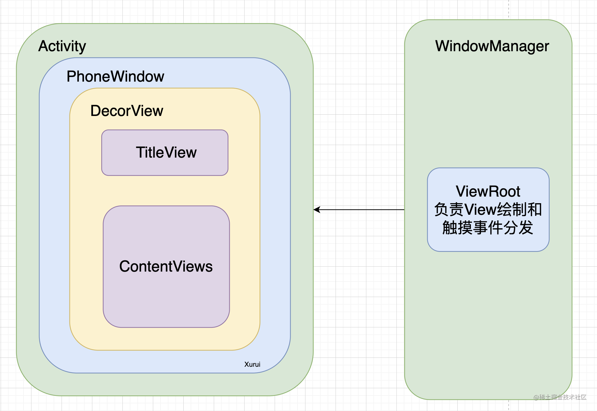

# Andorid

## Activity
**生命周期**：

第七个生命周期：`onCreate` --> `onStart` --> `onResume` --> `onPause` --> `onStop` --> `onDestory`

还有一个 `onRestart()`

**几种特殊情况**:

1. 切桌面：`onRestart()`，也会有 `onSaveInstanceState`
2. 另一个活动切回来：`onRestart()`，也会有 `onSaveInstanceState`
3. 切换横竖屏：先销毁后重建立，额外会在`onPause`之后调用`onSaveInstanceState()`保存当前状态，在`onResume`前再调用`onRestoreInstanceState()`来恢复之前的状态。

**四种启动模式**：

1. `Standard`：标准模式
2. `SingleTop`:栈顶复用模式/单顶模式   例如，通知栏点击进入聊天界面时，聊天界面应该显示现有的聊天内容，而不是启动新的实例。
3. `SingleTask`:栈内复用模式/单任务模式 例如，主界面或设置界面
4. `SingleInstance`:单例模式 ： 单独创建一个新的任务栈  例如，系统设置的某些专用界面或特殊的帮助界面

**taskAffinity**:

每个 Activity 都有一个 taskAffinity 属性，决定了它与哪个任务栈关联。默认情况下，同一应用程序的所有 Activity 共享相同的 taskAffinity，也就是说，它们通常在同一个任务栈中。通过设置不同的 taskAffinity，可以将不同的 Activity 放入不同的任务栈中，从而在同一个应用中创建多个任务栈。

**Intent Flags**：

特定的 Intent 标志（如 FLAG_ACTIVITY_NEW_TASK）如果目标 Activity 不在任何任务栈中，则创建一个新的任务栈并启动这个 Activity；如果该 Activity 已经在某个任务栈中，则将它移动到前台，而不会创建新的实例。因此这个标志可能增加任务栈个数。

活动的调度基于任务栈进行，而服务就不一样了，它是后台组件不依赖栈，和栈没关系。

## Service

Activity是一个有可见界面的，Service则是一个可以在后台长期运行但又不使用用户界面的Android应用组件。

**通过startService启动**

1. 生命周期顺序：onCreate->onStartCommand->onDestroy
2. 直到有其他组件调用stopService()或者自己调用stopSelf()才会结束
3. startService时，如果该服务未创建，则会触发 onCreate 和 onStartCommand，以后在服务运行过程中，每次startService都只会触发onStartCommand；
4. 不论startService多少次，只要调用一次stopService，该服务就会停止；

**通过bindService绑定**

1. 生命周期顺序：onCreate->onBind->onUnBind->onDestroy
2. 不论bindService被调用几次，Service的onCreate和onBind方法只会执行一次
3. 当Activity调用unBindService或者Activity挂掉，则服务会停止；

方式二的生命周期和Activity一致，在Activity的finish方法里面会检查Activity是否存在未注销/解绑的 ServiceConnection，如果有，那么会通知AMS注销/解绑对应的Service，并打印异常信息。

**服务的分类**:

1. 后台服务：默认的服务都是后台服务，也就是startService()启动的服务，服务终止时用户是无法感知的，如天气更新等服务；
2. 前台服务：后台服务优先级较低，可能会被系统杀死，可以将后台服务提高为前台服务，是会在**状态栏显示图标**的服务，如常见的音乐播放服务，服务终止，状态栏的图标也消失；
3. 从Android8.0(AP1级别26)开始，后台服务收到了限制，需要设置为前台服务，或者改用WorkManager（ Jetpack ）

 **如何保证Service不被杀死？**

1. 使用自定义系统服务  init.rc里面
2. 使用系统服务来监控：先弄一个白名单，记录需要监控的应用的包名，再自定义一个系统服务，监控系统里某个应用被杀死，如果该应用在白名单上，则重新拉起应用；
3. 使用双进程Service，在ServiceA和ServiceB相互保护，检测到有一个Service被杀死则重新拉起；
4. 使用闹钟循环拉起服务;

**Activity、Intent、Service 之间的关系**

Activity和Service父类都是Context，一个有UI一个没有。Intent主要负责之间的调度和数据传递。

## Broadcast

静态注册：在AndroidManifest.xml清单文件里直接声明的方式叫做静态注册。

动态注册：代码运行到了才注册广播，手动设置过滤器注册接收器。注意动态广播最好在Activity的onResume()注册、onPause()注销。一旦忘记注销，那么就会造成内存泄露哦。

1. 静态注册不受app是否运行所影响，即使app没有运行，app里静态注册的广播接收者也可以接收广播，因此适合监听系统广播比如开机
2. 动态注册的广播在组件结束之前，也会随之结束（当然是手动注销的），适合只在特殊时刻监听广播。
3. 动态注册的优先级高于静态广播。

有序广播：广播接收器有优先级，先收到的可以拦截或者修改广播

本地广播：广播只会在应用内发，发布出去。BroadcastReceiver是以 **Binder** 通讯方式为底层实现的，而LocalBroadcastManager 是利用应用内部的Handler来实现

## ContentProvider

ContentProvider的底层**结合了Binder机制和匿名****共享内存****机制**，也是一种进程间数据传递的方式（应用间通信）而且适用于 大量数据的传递。 一般来说，Android数据存储的方式有：文件，数据库，网络，SharePreferences，ContentProvider。ContentProvider更准确来说只是一个中间者的身份，真正存储数据的是数据库和文件等形式，这一点要分清楚！

## Context

在Activity 和Service里面经常用到，一般在获取系统属性（Color，String）以及数据存储（文件，SharedPreference，数据库）的时候需要用到。

Context有他的实现类**ContextImpl**和封装类**ContextWrapper**，包装类里面包含实现类的对象。还有一个**ContextThemeWrapper**又是继承于ContextWrapper加了与主题（Theme）相关的接口

Activity 会继承**ContextThemeWrapper**

Service 和APPlication  会继承**ContextWrapper**

一个应用的context个数就由其包含了多少个Activity和Service决定，并且最后再加上自己本身持有的context，即

应用Context数量 = Activity数 + Service数 + 1（Application）；

**不正确使用**:把Context传给其他长久存在的类，导致本身无法被回收造成内存泄露。所以

- 可以使用Application的context则优先使用；
- 注意别让生命周期可能长于actvity的对象持有activity的引用；

**获取方式**:

1. Activity.this
2. getApplication()和getApplicationContext()
3. view.getContext：每个view都需要在安卓的完整工程环境下才能正常显示，操作，因此每个view本身都持有context对象，这个context对象一般是该view所在的Activity实例

**什么情况必须用Activity的Context呢**?启动新的Activity或者弹出一个Dialog，只能用Activity的Context，不能用Application的Context，因为启动Activity需要任务栈，而非Activity的Context是没有的。同时，**Dialog必须基于Activity上弹出。**

## Intent

和startActivity() ，startService()，bindService()，sendBroadcast()，sendOrderedBroadcast() 

Intent 可以启动活动，服务，发出广播。有显式和隐式之分

显示：指定要启动的类， 如SecondActivity.class

隐式：不指定特定的类，使用Intent过滤器直接接受我们想要收到的Intent，然后我们在发送Intent的时候使用addCategory 和 setAction设置好就行

Intent携带数据的大小： 大概在1M左右，超过这个限制就会静默崩溃。

如果 exported 属性设置为 false，那么该 Activity 不会被其他应用访问。只有同一应用内的组件才有权限启动该 Activity。

## Fragment

Fragment碎片可以实现在一个Activity上碎片化加载多个子界面，可以动态的增删替换，比起Activity是轻量级的切换。Fragment是依附于Activity存在的，所以它的生命周期也受到Activity的生命周期影响。

他的生命周期除了Activity的几个之外，还有自己的**onCreateView**()等

**Fragment和Actvity的通讯**

1. 在Activity有对应的Fragment的引用，则直接通过该引用就可以访问Fragment里面的public方法
2. 或者findFragmentById()获得任何Fragment实例对其进行操作
3. 在Fragment里可以通过getActivity()来获取当前绑定的Activity的实例，并对其进行操作；

**Fragment和Fragment的通讯**

不建议Fragment之间直接通讯，最好是借助Activity为中介。实在要传也可以使用REQUEST_CODE和Intent 去传参。

## 设计模式

设计模式的六大原则：

- **单一职责原则**
- **开闭原则**
- **里氏替换原则**
- **依赖倒置原则**
- **接口隔离原则**
- **迪米特原则**

常用的设计模式：

建造者模式：Dialog是安卓源码使用到建造者模式最多的之一，先使用AlertDialog.Builder构建对象然后继续.setTitle  .setMessage 来设置具体的内容，通过**链式调用分布构建**，轻松扩展或修改对话框的构建过程

观察者模式：LiveData，一种一对多的依赖关系

责任链模式：触摸事件、按键事件的传递。触摸事件会一直传递下去，直到事件被消费为止。

##  AMS

ActivityManagerService（以下简称AMS） 主要负责四大组件(Activity、Service、BroadcastReceiver和ContentProvider)的启动、切换、调度以及应用进程的管理和调度工作。

它是一个**服务**，也是一个Binder，可以用来进程间通信，还是一个**线程**

从系统运行的角度看，AMS可以分为**Client端**和**Service端**：

Client端运行在各个app进程，app进程实现了具体的 Activity，Service等，告诉系统我有那些Activity，Service等，并且调用系统接口来完成显示；

Service端**运行在 SystemServer进程**，是系统级别的ActivityManagerService的具体实现，其响应Client端的系统调用请求，并且**管理 Client端各个app进程的生命周期**。

## Activity、Window、DecorView以及ViewRoot之间的层级关系



Activity里面会在activity.attach(）的时候创建一个**PhoneWindow**，内部有一个内部类**DecorView**来加载布局xml文件。这个DecorView就是视图树的根节点，也就是最顶层的View，**DecorView**根据不同的主题，可能加载不同的布局格式。我们平时自定义的布局文件通过**setContentView**方法加载，其实就是加载到DecorView的ContentViews里面，Window 通过WindowManager将DecorView加载其中，并将DecorView交给ViewRoot。

ViewRoot:**连接WindowManagerService和DecorView的纽带**。所有View绘制、触摸事件分发、界面刷新等都是通过它来执行或传递的。ViewRoot对应ViewRootImpl类。Window里面加载DecorView就是通过ViewRootImpl添加的。

他和前面几个的关系是Activity里面会有WindowManager，里面会有ViewRoot

## View的加载流程

**Step1：初始化PhoneWindow和WindowManager**

Activity 是在 ActivityThread 的 **performLaunchActivity** 中进行创建的，并在**attach**()方法中创建了PhoneWindow，并初始化WindowManager。

**Step2：初始化DecorView**

系统执行完attach()方法后，会执行onCreate()方法，在onCreate()方法中执行setContentView()方法将布局xml文件解析为View并设置到DecorView里面的ContentViews控件。

**Step3：ViewRootImpl创建和关联DecorView**

WindowManager的**addView**()方法会创建一个**ViewRootImpl**，把DecorView传给了ViewRootImpl中的setView()方法。

**Step4：建立 PhoneWindow 和 WindowManagerService 之间的连接**

WindowManagerService是所有Window窗口的管理者，负责Window的添加删除、事件派发等。每一个Activity都有一个PhoneWindow对象，操作PhoneWindow对象进行显示等操作，都需要和WindowManagerService进行交互。在上面第三步中的ViewRootImpl的setView()方法中，会执行setView()方法，会调用 requestLayout()方法，并且通过 WindowSession 的 addToDisplay()方法 与 WindowManagerService 进行交互。WindowManagerService 会为每一个 Window 关联一个 WindowStatus。到此，我们已经把DecorView加载到Window中了。

**Step5：建立与SurfaceFlinger的链接**

SurfaceFlinger主要对图层数据进行合成，然后发送到屏幕渲染。在第4步中，WindowStatus会创建一个SurfaceSession，SurfaceSession 会在 Native 层构造一个 SurfaceComposerClient 对象，它是应用程序与 SurfaceFlinger 沟通的桥梁。

**Step6：申请Surface**

View绘制会从ViewRoot的performTraversals()，按照Measure() -> Layout() -> Draw()经典流程完成View绘制。不过在此之前还会执行一个重要的函数relayoutWindow()。

## View的绘制

1. Activity attach()方法中创建了PhoneWindow，并初始化WindowManager
2. 在onCreate()方法中执行setContentView()方法将布局xml文件解析为View并设置到DecorView里面的ContentViews控件。
3. ViewRootImpl创建，关联DecorView
4. View绘制会从ViewRoot的performTraversals()开始

View绘制会先试用relayoutWindow()方法，把Java层的Surface和Native层的Surface关联在一起。然后从ViewRoot，按照Measure() -> Layout() -> Draw()经典流程完成View绘制。

**Measure(测量)**:通过递归的方式测量子view的宽高。有两个贯穿整个流程的变量，**widthMeasureSpec**和**heightMeasureSpec**。这两个参数根据通过**父布局的MeasureSpec**和自身的**布局参数LayoutParams**。这有几种测量模式，如果xml中是match_parent表示父View希望子View的大小是确定的。wrap_content，View的大小不能大于父容器的大小。不确定大小，父View完全依据子View的设计值来决定。

**Layout（布局）**:View的布局主要是通过确定上下左右四个关键点来确定其位置。**值得一说的是**，测量时，先测量子View的宽高，再测量父View的宽高。但是在布局时顺序则相反，是父View先确定自身的布局，再确认子View的布局。

**Draw（绘制）**: 先绘制背景，再绘制父View，最后绘制子View 最后一层层绘制会涉及canvas

## 自定义View

自定义View的绘制从构造函数到**三大绘制方法**。

onMeasure()定义自己的测量方式并遍历测量子View的宽高。

onLayout() 自定义View中，一般不需要重写该方法。但在自定义ViewGroup中可能需要重写，一般做法是循环取出子View，并计算每个子View位置等坐标值，然后使用**child.layout**方法设置子View的位置

onDraw() 需要使用Canvas API函数

**继承系统提供的现有控件的自定义View**:

在定义自定义View的时候可以选择**继承某一个基本的View**，比如MyTextView extends TextView。然后我们就可以根据需要重写onDraw方法。在里面设置画笔颜色和宽度，使用canvasAPI方法绘画 。最后只要在xml文件里直接引用该控件即可

**继承View类的自定义View**:

除了涉及三大绘制方法之外

- **padding属性处理**；
- **wrap_content属性处理；**
- **提供自定义属性，方便自定义View的属性配置；**
- **如果涉及触摸操作，还需要重写onTouchEvent()方法来处理触摸事件；**

**自定义View优化**:

- **onDraw()尽量不分配内存：onDraw()被调用频率很高，如果在此进行内存分配可能会导致GC，从而导致卡顿；**
- 使用含有参数的invalidate()：不带参数的invalidate()会强制重绘整个View，所以如果可能的话，尽量调用含有4个参数的invalidate()方法；
- 减少requestLayout()调用：requestLayout()会使系统遍历整个View树来计算每个View的大小，是费时操作；

## 事件分发

一个事件会经过：按下 --》 滑动 --》抬起，这三个阶段，这些事件会在代码里会封装成一个**MotionEvent**。系统就会将其传递给View树，MotionEvent在View的**层级传递**，并最终得到处理的过程，就是触摸事件分发流程。

Activity/Window --> ViewGroup --> View

onTouch()、onTouchEvent()、onClick()优先级：onTouch() > onTouchEvent() > OnClick()

传递过程中有事件分发、拦截事件、事件处理三个方法。在事件分发的函数里面会调用拦截时间函数判断是否拦截当前事件。不拦截则继续传递，拦截了就会调用事件处理函数去处理当前事件。注意，当调用事件处理函数去处理的时候他可以选择抛给父控件的事件处理函数去处理。

## 序列化

序列化就是将对象之类的信息转化成字节流格式储存下来，进行网络传输或者需要长久存储数据的时候经常用到。Android里面有两种方式实现序列化，一个是Java自带的序列化方法Serializable，另一个就是安卓的Parcelable接口，其实现原理是把对象分解为Intent支持的数据类型，并通过Intent进行传输，其数据可以保存在内存中，相对于Serializable将数据保存在磁盘，效率自然更高。

## Launcher启动Activity/APK的流程

1. 点击桌面App图标，Launcher进程采用**Binder**跨进程机制向**system_server进程**发起startActivity请求；
2. system_server进程接收到请求后，向Zygote进程发送创建进程的请求，**Zygote进程**fork出新的子进程，即新启动的**App进程**；
3. App进程，通过Binder机制向sytem_server进程发起**attach**请求（绑定Application）；attach的作用是**创建 Application** 和 **Context**，**phoneWindow、WindowManager**
4. system_server进程在收到请求后，进行一系列准备工作后，再通过binder机制向App进程发送**scheduleLaunchActivity**请求；
5. App进程的binder线程（ApplicationThread）在收到请求后，通过handler向主线程发送LAUNCH_ACTIVITY消息。主线程在收到Message后，**通过发射机制创建目标Activity，并回调Activity.onCreate()/onStart()/onResume()等方法，经过UI渲染结束后便可以看到App的主界面。**

一孵二绑三准备

## MVC、MVP、MVVM

**MVC**:

1. Model：放数据。
2. View：直接与 Model 交互以获取数据并显示。
3. Controller：调用 Model 的方法来处理业务逻辑，并根据结果更新 View。

**M层和V层还有交互，没有做到完全分离。**

**MVP**:

在MVC的基础上，用Presenter代替Controller，此时MVP具体为：

1. Model：放数据。
2. View：将用户操作传递给 Presenter。
3. Presenter：Presenter 处理逻辑，并更新 Model。Presenter 再通过调用 View 的方法来更新 UI。

**自此视图和数据真正分离了。**

**MVVM: LiveData+DataBinding**

1. View 使用 `observeAsState()` 观察 `LiveData`，通过观察来实现自动更新UI
2. ViewModel中写好方法对数据进行操作
3. 使用DataBinding 将 ViewModel 中的数据直接绑定到 XML 布局中的 UI 元素，是一种**双向绑定**

**DataBinding**代替findViewById()方法

LiveData：是 Jetpack 新推出的基于观察者的消息订阅/分发组件，具有宿主（Activity/Fragment）生命周期感知能力。这种感知能力可确保 LiveData 仅分发消息给与活跃状态的观察者，即只有处于活跃状态的观察者才能收到消息。LiveData 默认支持粘性事件且无法取消（即使事件发送之后，仍然可以被后来订阅的观察者接收）。由此会发生数据倒灌（当新订阅者加入时，接收到大量历史数据）。

## MVI（Model-View-Intent）

出现的目的是为了解决MVVM中双向绑定数据的不足。把双向绑定变成单向数据流。

1. 使用StateFlow代替LiveData存储数据， 将状态集中封装在一个 State 对象中管理。天然适配compose，既可以保证UI状态同步，还不用写`observe` 方法，只需要collectAsState 就可以了。
2. 使用Intent将数据操作的方法封装成数据类。视图的按键出发Intent，ViewModel根据不同的Intent处理数据变化。这种单向数据流避免了双向绑定，减少了潜在的循环依赖和状态不一致的问题。
3. MVI 将状态（ViewState）和事件（ViewEffect）进行分离：

- **`ViewState`**：持久的 UI 状态，控制 UI 的显示，如是否显示 USB 更新按钮。
- **`ViewEffect`**：一次性的、瞬时的事件，如导航操作或显示一个 Toast。

`val uiState by dialogViewModel.uiState.*collectAsState*()`

## Android WMS

Android 中的 WMS 指的是 Window Manager Service（窗口管理服务）。WMS 是 Android 系统中的核心服务，主要分为四大部分，分别是窗口管理，窗口动画，输入系统中转站和 Surface 管理 。负责管理应用程序窗口的创建、移动、调整大小和显示等操作。

在ApplicationThread 启动Activity的时候用attach函数将view和activity绑定，将Window和WMS绑定。绑定完成之后才会调用callActivityOnCreat函数来启动Activity的OnCreat函数，这个时候才会执行setContentView才会把具体的xml加载到Contentview里面。

## Binder-跨进程通信（IPC）

跨进程通信机制，采用服务端/客户端结构，主要包含**服务端、客户端、ServiceManager、Binder驱动**4大部分。

进程之间内核空间共享，用户空间隔离。因此无法直接访问其他进程的数据，Binder使用**内存映射**的方法走内核缓存区的方式实现进程通信。多个进程会将自己的**虚拟内存区域**对同一个**共享对象**进行内存映射。当一个进程操作虚拟内存区域的时候，共享对象会相应的发生变化，同时映射到另一个进程的虚拟内存区域。

一般的进程间通信方式比如消息队列和Socket都需要两次是数据拷贝（发送方->内核->对方缓存区）而Binder只需要一次（发送方->内核缓冲区）。

优势：性能（一次拷贝）安全（鉴定UID/PID来验证身份）稳定（比共享内存稳定）

## Handler

**用途**:

基本用途：比如在子线程执行完耗时操作之后使用Handler在主线程更新UI

高级用法：利用 Looper 判断当前线程是否是主线程；

```Java
Looper.getMainLooper() == Looper.myLooper();
```

涉及四个概念，Handler，MessageQueen，Message，Looper

- Handler：主要作用是发送信息以及处理信息（为何发送还自己处理？），其中发送的信息叫作Message，可以传递数据；会调用自己的**handleMessage**()方法来处理Message，因此自定义的Handler都需要重写handlerMessage方法。继承BaseHandler类
- MessageQueue：消息队列，由一个一个Message汇成，遵循先进先出规则，由Looper进行管理；
- Looper：从MessageQueue里读取消息，并按消息分发机制分配到目标Handler进行消息处理。

**Looper变量的前世今生**:

创造：通过调用**Looper.prepare**()函数，检查是否已经存在Looper，不存在则new一个，存在ThreadLocal里面。

获取：在Handler的构造函数里面会使用**Looper.myLooper**()获取Looper 如果没获取到会RuntimeException提示我们要事先运行Looper.prepare()，在构造函数里面还会关联MessageQueue

主线程能直接使用Handler：因为主线程ActivityThread的main()函数已经自动执行了Looper.prepare()函数。

MessageQueue是在Looper构建函数里生成的。

loop()方法中一直在死循环做三件事：

- 调用next方法从MessageQueue里获取Message；
- 通过dispatchMessage方法将Message分配到目标Handler；有优先级的
- 通过recycleUnchecked方法回收Message；

**dispatchMessage方法中决定谁去处理Message？**

有优先级的，Message里自带的callback优先级最高，其次是Handler的Callback ，最后是Handler的handlerMessage()方法

**Handler发送信息的方法有几种**:

post ： 接收一个**Runable对象转化成Message的callback去调用sendMessageDelayed()，一般会配合lambda表达式**

send： 发送一个Message对象

post和sendMessage本质上没有区别

无论是post还是send，最后都是用SystemClock.uptimeMillis()获取系统开机到当前的时间，加上我们设置的delayMillis时间，并调用sendMessageAtTime()方法做进一步逻辑。

注意：不能用System.currentTimeMilis（系统时间），因为用户很可能自己修改系统时间。

最后都是调用队列的queue.enqueueMessage(msg, uptimeMillis) 方法来加入队列，值得一提的是enqueueMessage会根据消息要执行的时间按来寻找合适的位置插入队列。

**Message的获取：尽量**用Message.obtain()来获得一个Message实例的，因为这种方案是直接从Message的消息池里直接获取，避免了new Message()的重复创建开销。

去除Message的时候如果队列里面，下一条需要执行的消息,队列中消息为空时，则会进行阻塞操作,这个阻塞操作是使用管道实现的。

**Handler 引起的内存泄露原因以及最佳解决方案**

因为Handler一般是作为Activity的内部类，可以发送延迟执行的消息，如果在延迟阶段，我们把Activity关掉，此时因为该Activity还被Handler这个内部类所持有，导致Activity无法被回收，没有真正退出并释放相关资源，因此就造成内存泄漏。解决方法就是将 Handler 定义成静态的内部类，在内部持有 Activity 的弱引用，或者是onDestroy()中调用handler.removeCallbacksAndMessages(null)及时移除所有消息。一般我们都是将Handler抽离出来作为BaseHandler，然后让Activity去继承BaseHandler

**子线程中怎么使用 Handler？**

子线程要使用Handler关键的点在于要执行Looper.prepare() 和 Looper.loop() 然后在这之间放置子线程要执行的任务。

**Looper.loop()死循环一直运行是不是特别消耗CPU资源呢？**

不会，调用queue的next()方法获取下一个消息，如果没有消息会阻塞，释放CPU资源

**Handler的同步屏障**:

就是指屏障消息，是一种特殊的Message，他的target是null就是不指定Handler，用来拦截队列中的同步消息，放行异步消息。原理是在Looper循环取Message队列中的消息的时候进行判断，如果判断到了屏蔽消息就把屏蔽消息后面的异步消息执行，否则就继续找。 总结就是优先执行异步消息

同步消息就是等待执行完成才开始下一步，异步消息就是不等待执行完，并行执行任务。

使用场景：

1. View UI界面更新的逻辑，通过同步屏障+异步消息可以保证消息被优先处理，保证界面的迅速更新。
2. 并行计算: 让多个线程都执行完自己那部分的计算之后，再继续执行下一步

### HandlerThread

HandlerThread 是一个带有消息循环（Looper）的线程，它是 Thread 的子类，专门用于创建一个可以处理异步任务的后台线程。HandlerThread 自带一个 Looper，可以让我们在子线程中使用 Handler 来处理消息。

可以直接拿到looper然后创建Handler执行后台任务

### **IdleHandler**:

IdleHandler 实际上是一个接口，在消息循环空闲的时候（没有消息）进行的回调方法。接口方法的返回值代表是否需要移除当前 IdleHandler。从本质上来说，IdleHandler 的作用就是趁着消息队列空闲的时候干点事情，具体干啥，就要看 IdleHandler 的 queueIdle() 方法了。**在ActivityThread中有一个GCIdleHandler，用于做GC的。**

一般会在消息队列中没有消息的时候执行**IdleHandler**中的任务，然后移出**IdleHandler**

**mIdleHanders 一直不为空时，为什么不会进入死循环？**

只有在 pendingIdleHandlerCount 为 -1 时，才会尝试执行 mIdleHander；

pendingIdlehanderCount 在 next() 中初始时为 -1，执行一遍后被置为 0，所以不会重复执行；

## 安卓跨线程通信

1.  Handler
2.  runOnUiThread方法
3.  View.post(Runnable r) 
4.  AsyncTask

### AsyncTask

是一个轻量级的异步任务类，可以在线程池里执行比较耗时的后台任务（doInBackground），然后把执行的进度和最后的结果传递给主进程，并在主进程中更新UI（onPostExecute()）。可以反馈任务的进度。

上面几个核心方法的调用顺序为： onPreExecute() --> doInBackground() --> publishProgress() --> onProgressUpdate() --> onPostExecute()。

不足之处：

1. 生命周期：需要再onDestroy手动结束
2. 内存泄漏：和Handler一样，如果被声明为非静态内部类，会保留对Activity的引用，导致Activity无法被回收
3. 结果丢失：屏幕旋转或者被后台杀死之后，Activity重建，如果之前运行的AsyncTask是非静态的内部类，此时就会持有之前旧的Activity的引用，UI是无法成功更新的。

## AIDL - 跨进程通信（IPC）

https://blog.csdn.net/qq_32019367/article/details/122342122?spm=1001.2014.3001.5502

AIDL是为了实现跨进程通讯，比如自**不同应用的客户端跨进程通信访问你的Service**，比如我们要传输一个自定义的类，那么就要创建类.aidl,创建 AIDL 接口了。有自己的服务Service，通过Binder进行连接和通信

数据的传输使用了Binder，但是bundle传递数据时只支持基本数据类型，所以在传递对象时，需要先将对象进行**序列化**，转换成可存储或可传输的字节流。

实体类：实现Parcelable接口，可序列化。然后创建AIDL接口

服务器：实现AIDL接口，并重写方法

客户端调用AIDL中定义的方法，接收/返回数据

## JNI和NDK

JNI（Java Native Interface）就是Java本地化接口。用来调用Native层的C++方法的中间件。NDK（Native Development Kit），翻译过来是“本地开发工具” 是用来开发JNI的。JNI有静态注册和动态注册两种方式，本人在实际开发中，多用**动态注册**。

**静态注册**:根据函数名建立Java方法和JNI函数的一一对应关系，这样虚拟机加载so库时，就会将该函数链接到对应的Java层native方法

**动态注册**:使用 JNINativeMethod 结构体指针来保存Java层声明的native方法和Native层函数的关联关系，这样java加载完动态链接库的时候就会动态完成注册

实际上我们创建JNI工程的时候AndroidStudio会自动在Build.gradle里面配置生成.so库的目标平台和 CMake 文件的路径

## 内存优化

内存优化的目的是为了避免出现内存泄漏，**内存溢出（OOM：Over Of Memory)**、内存抖动等问题：

**内存泄漏**：当一个对象A在程序中已经打算释放了，但有其他对象持有对象A的强引用，导致对象A不能正常被系统回收，继续占用着内存，如此反复使实际可使用内存越来越小。

**内存溢出**：当内存使用量超过了虚拟机分配给当前程序的最大值时，就会发生内存溢出。出现这种情况很可能是加载的资源太多，如加载大图片，或者分配了很大的数组等变量，或者是太多的内存泄漏最终导致内存溢出；

**内存抖动**：当内存频繁分配和回收导致内存不稳定，就会出现内存抖动，它通常表现为 **频繁GC**、内存曲线呈锯齿状；

### **内存泄漏**: 

**Handler 内存泄漏**: Acticity让Handler执行延迟任务的途中，Activity关闭了。但是消息队列里面这个消息没有执行完，他就保存着Handler的引用，导致Activity（Handler一般作为Activity的内部类，而非静态内部类会一直持有外部类的引用）也无法被回收。常用的解决方法是：让Handler成为Activity的静态内部类（弱引用）或者在onDestroy()中调用handler.removeCallbacksAndMessages(null)及时移除所有消息。

**非静态内部类的静态实例导致内存泄露**：解决办法同上，设置为静态内部类、将内部类抽取为一个单例、使用Application的Context。

**注册了广播接收器，当Activity销毁时没有注销**

**图片**:Bitmap对象不使用时没有调用recycle()释放内存或者设置为null，也会导致内存泄漏。 

如何检测内存泄漏：

1. 检查整个程序的内存泄露：

运行程序，所有功能跑一遍，确保没有改出问题，完全退出程序，手动触发GC，然后使用adb shell dumpsys meminfo packagename -d命令查看退出界面后Objects下的Views和Activities数目是否为0，如果不是则可能有内存泄露。然后进行更进一步的定位

1. 检查某一个具体Activity的内存泄露：

反复打开关闭页面5次，然后收到GC（点击Profile MEMORY左上角的垃圾桶图标），如果此时total内存还没有恢复到之前的数值，则可能发生了内存泄露。此时，再点击Profile MEMORY左上角的垃圾桶图标旁的heap dump按钮查看当前的内存堆栈情况，选择按包名查找，找到当前测试的Activity，如果引用了多个实例，则表明发生了内存泄露。可以点击垃圾桶图标旁边的 **Heap Dump** 按钮，生成堆快照文件，按包名查找相关的类。

1. 使用LeakCanary监听内存泄露

监听单个对象的内存泄露

### OOM:内存溢出

存放很大的对象。很大的图片

https://juejin.cn/post/6844904096541966350

### 内存抖动：

- **循环中创建占用内存较大的对象**，比如bitmap，最后引起内存抖动；
- 自定义View**在onDraw中创建对象**，因为自定义View的onDraw方法会被频繁调用。如果频繁创建对象，甚至较大的对象，会导致内存增加，甚至内存抖动；

可以在Android Studio的memoryProfile中观察到这一现象

### 减少内存使用

减小对象内存占用：使用轻量级的数据结构

内存对象的复用：线程池、Message的获取

## ANR（Application Not Response）卡顿优化

https://juejin.cn/post/7372913965883637775?searchId=2024090517275867E2C5ECC97CBC12C338

**造成卡顿的原因**:内存占用、CPU使用率、IO操作

**CPU使用情况获取的方法**:top指令、ps指令、dumpsys cpuinfo、读取/proc/stat文件

Application Not Respongding，简称ANR，翻译为中文即是“应用程序无响应”。

造成ANR的原因是活动、服务、广播接收器在规定的时间里没有执行完任务或者没有响应用户操作，可能有以下原因：

- **主线程进行IO操作**，引起阻塞；
- **主线程执行耗时操作**；
- 主线程有错误操作，如Thread.sleep等直接导致主线程阻塞；
- 执行速度缓慢的广播接收器；
- **出现死锁**；
- **主线程使用Binder和另一个进程通讯，另一个进程需要很长时间才返回；**
- 主线程使用 SharedPrederence：SharedPrederence 调用 apply 方法，会创建一个等待锁放到 QueuedWork 中，并将真正数据持久化封装成一个任务放到异步队列中执行，任务执行结束会释放锁。Activity onStop 以及 Service 处理 onStop，onStartCommand 时，执行 QueuedWork.waitToFinish() 等待所有的等待锁释放。其实不管是 commit 还是 apply，都是在主线程进行 IO 操作，那么都是可能会产生 ANR 的。

**改善ANR的方法**:

- 主线程耗时操作导致；
- CPU、内存、IO操作占用资源太高导致；
- 耗时操作在子线程里处理
- 避免在在Activity的onCreate()和onResume()等方法少执行耗时的代码。

**卡顿的分析方法**:

- 当一个进程发生了ANR，系统会在/data/anr目录下创建一个traces.txt文件
- Android Studio的CPU Profiler

## Crash

https://juejin.cn/post/6844903434294919175?searchId=2024090911222306C68092BE1C73B7A503#heading-1

NullPointerException：空指针异常，一般是对象本身没有进行初始化，或者被回收了。

OutOfMemoryError：内存溢出，有可能是内存泄露导致的。

## 启动优化

https://juejin.cn/post/7354233812593246248

https://juejin.cn/post/7359347999309807654

应用的启动有三种类型：冷启动 > 温启动 > 热启动

**冷启动**:创建进程、启动应用、绘制界面，时间是比较长的冷启动一般会作为启动速度的一个衡量标准。**冷启动优化的方向是 Application 和 Activity 的生命周期阶段，这是我们开发者能控制的时间，其他阶段都是系统做的。**

**温启动**:比如应用退回桌面又重新点开,会重新走onCreate()函数重新创建Activity，这时候我们能做的也就只有保证应用的生命周期里面没有耗时操作。

**热启动**:切到后台又切回前台，这里面不需要重新加载布局。

我们一般会查看启动耗时，对比冷启动的耗时。使用**am start -W**，其中显示的TotalTime就是启动的耗时，或者使用**CPU Profiler**，可以清晰地看到方法调用栈一层层所用的时间和CPU占用

项目中遇到的问题：首页显示太慢

优化方案：

1. 在 App 创建的过程中，先展示一个空白页面，让用户体会到点击图标之后立马就有响应。
2. 第三方库懒加载，比如Glide
3. 布局懒加载：Kotlin 中 binding 使用 by lazy

## RecycleView

### 缓存机制

会将移出屏幕的列表项缓存起来不会销毁。这种缓存涉及到多重缓存机制

1. mAttachedScrap  ：当前屏幕内的可见的，为了避免出现像「局部刷新」这一类的操作，比如移除了某一项，其他项不应该被重绘而是位置的变化。
2. mCachedViews ：已经移除屏幕的，大小默认是2个数据
3. mRecyclerPool：缓存池中的项

RecyclerView最多可以缓存 N（屏幕最多可显示的item数） + 2 (屏幕外的缓存) + 5*M (M代表M个ViewType，缓存池的缓存) 只有最后一级的缓存池查找到才会调用bindViewHolder，其他的不会

并且RecycleView还会采用预加载机制异步地预取屏幕外的项目，填充屏幕空白区域，确保这些项目在需要展示时已经被预加载，默认预加载**两屏**

**RecyclerView的缓存机制,滑动10个，再滑回去，会有几个执行onBindView？**

如果一开始滑动的是新数据，那么滑动10个，就会走10个bindview方法。然后滑回去，会走10-2个bindview方法。一共18次调用。

如果一开始滑动的是老数据，那么滑动10-2个，就会走8个bindview方法。然后滑回去，会走10-2个bindview方法。一共16次调用。

### **LinearLayoutManager的预拉取机制**

1. 预拉取指预先拉取待进入屏幕区域内的一部分列表项视图并缓存起来，从而减少因视图创建或数据绑定等耗时操作所引起的卡顿。
2. RecyclerView也把预拉取的实际工作委托给了一个名为GapWorker的
3. 预拉取的三个时机：被拖动、惯性滑动、嵌套滚动
4. 预拉取的数据会缓存在第二级缓存里面，此时第二级缓存的容量变为3。虽然缓存复用的对象和预拉取的对象共用同一个mCachedViews结构，但二者是分组存放的，且缓存复用的对象是排在预拉取的对象前面的
5. 预抓取利用了UI线程绘制完成后将帧发送渲染之后的一段空闲时间安排工作，有一个最后期限，必须在下一帧开始绘制之前完成

## 项目上线后有监听内存泄漏的那种机制吗

LeakCanary ，一个内存泄漏分析框架，只需要引入依赖即可，会自动检测`Activity` 、`Fragment` 、`View` 、`ViewModel` 、`Service` 对象的内存泄漏

##  加载大图需要注意些什么

Android中图片以位图（Bitmap）的形式存在。

加载大图需要注意两个方面，一个是加载耗时，一个是存储空间。加载耗时意味着必须放到子线程中去完成，存储空间则需要涉及缓存机制，分割加载，图片缩放裁剪等问题。

项目中用的最多的也是Glide，它有多级的缓存机制，加载图像。考虑到网络状态可以使用Network Connection Class库去监听网络状态，根据网络情况选择合适的图片质量。

位深：对Bitmap进行压缩存储时存储**每个像素所用的bit数**，位数越多，图像的色彩也就越丰富细腻。常见的是色深32位(ARGB_8888)一个像素占用四个字节的内存

## 开源框架：OKHttp了解源码

特性：

1. 支持基于HTTP/2的共享socket连接
2. 连接池减少请求延迟
3. GZIP压缩减少响应的数据大小
4. 缓存相应内容，避免重复请求
5. 网络出现问题后，OKHttp保持不变，自动从问题中恢复

使用：

1. 封装OkHttpUtils的工具类实现get和post请求的方法，传入url和Callback参数即可
2. 创建OkHttpClient设置超时时间，BasicAuth
3. 创建Request传入url
4. 创建请求call ： Call call = okHttpClient.newCall(request);
5. 设置callback ： call.enqueue(mCallback);

其实这里有性能浪费，每次调用sendGet方法时都会创建一个新的OkHttpClient实例，刚好的情况是使用单例，第一次创建OkHttpClient的实例，后面调用同一个实例。

**拦截器：（责任链模式）**

为了避免请求发送者和多个请求处理者关系耦合，因此将所有请求处理者连成一条引用链。请求发生时沿着链传递，直到有对象处理它为止。在请求的过程中，我们随时可以拦截请求的数据，并插入我们自己的业务代码（**自定义拦截器**）。

**双任务队列**:

分别是等待队列和执行队列，新加入的请求任务 AsyncCall 首先会进入 ReadAsyncCall 队列中，然后进行一系列的判断后，加入 RunningAsyncCall 队列中，然后，利用线程池去执行这个请求任务AsyncCall。

亮点：OkHttp最出彩的地方就是在try/finally中调用了finished函数，可以主动控制等待队列的移动，而不是采用锁或者wait/notify，极大减少了编码复杂性。

**Socket连接池复用机制**:

网络连接的过程中，避免不了 3 次握手和 4 次挥手，而 http 请求，往往都是响应式的请求方式，请求成功之后，连接立马就断掉。下个请求到来，重新去建立连接，这样就造成了一定程度上的浪费。OkHttp 通过 通过**KeepAlive**机制，保活了 5 条链路 5 分钟的生命周期，在这 5 分钟内，若是有请求到来，可以直接使用之前的 链路。

