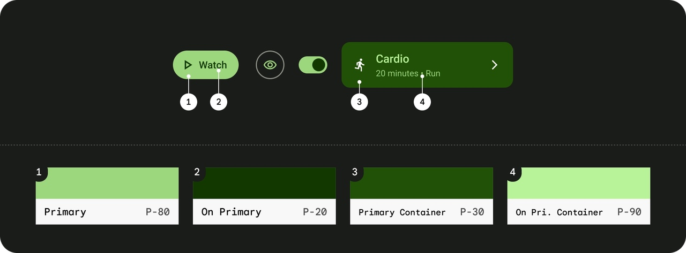
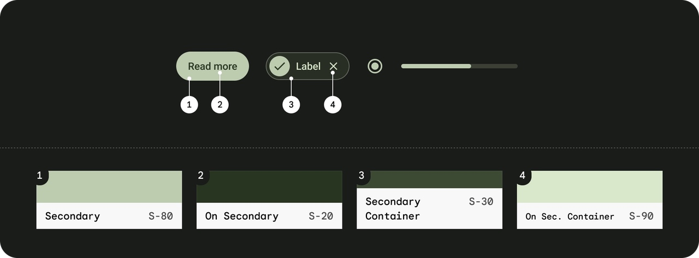
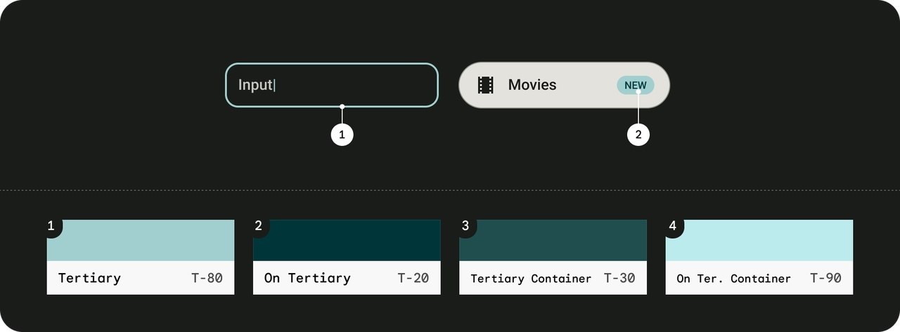
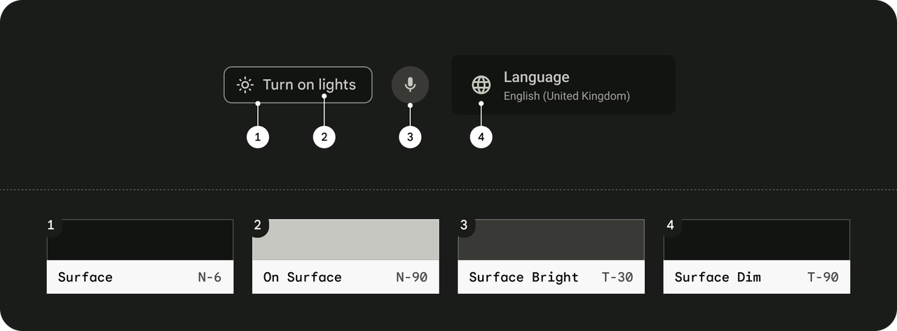
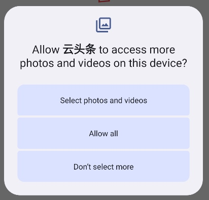

# Kotlin项目开发手册

## 1. 个人技术选择偏好

- 成长路线： https://juejin.cn/post/6847902207627837453里面的词条可以作为个人优势
- Android 开源项目分类汇总：https://github.com/Trinea/android-open-project
- Android 开发最佳实践:https://github.com/futurice/android-best-practices/blob/master/translations/Chinese/README.cn.md
- 实用工具网站：https://it-tools.tech/
- 项目的方方面面：https://juejin.cn/post/7405510539211685914
## 2. 依赖管理 - 推荐TOML

gradle 的依赖管理有多种方式，这里介绍五种：手动管理、ext 全局配置、kotlin + buildSrc、Composing Builds、Version Catalogs(TOML)。现在 Android 官方推荐的是**Version Catalogs(TOML)**。

### 手动管理
```
implementation("androidx.core:core-ktx:1.13.0")
implementation("androidx.lifecycle:lifecycle-runtime-ktx:2.6.2") 
implementation("androidx.activity:activity-ktx:1.9.0") 
implementation("androidx.appcompat:appcompat:1.4.1") 
```

### ext 全局配置（config.gradle）

```
// config.gradle
ext {
    versions = [
        coreKtx: "1.9.0",
        retrofit: "2.9.0"
    ]
    libraries = [
        coreKtx: "androidx.core:core-ktx:$versions.coreKtx",
        retrofit: "com.squareup.retrofit2:retrofit:$versions.retrofit"
    ]
}

// build.gradle (root)
apply from: "config.gradle"

// app/build.gradle
dependencies {
    implementation libraries.coreKtx
    implementation libraries.retrofit
}
```


这种方式统一维护版本号和依赖但是无法跳转

### Kotlin + buildSrc

```typescript
// buildSrc/src/main/java/Dependencies.kt
object Versions {
    const val coreKtx = "1.9.0"
    const val retrofit = "2.9.0"
}

object Libraries {
    const val coreKtx = "androidx.core:core-ktx:${Versions.coreKtx}"
    const val retrofit = "com.squareup.retrofit2:retrofit:${Versions.retrofit}"
}

// app/build.gradle.kts
dependencies {
    implementation(Libraries.coreKtx)
    implementation(Libraries.retrofit)
}
```


支持自动补全和导航

### Composing Builds（includeBuild）

```
// my-dependencies/build.gradle.kts
plugins { id("java-library") }

dependencies {
    api("androidx.core:core-ktx:1.9.0")
    api("com.squareup.retrofit2:retrofit:2.9.0")
}

// settings.gradle
includeBuild("my-dependencies")

// app/build.gradle.kts
dependencies {
    implementation(project(":my-dependencies"))
}
```


### Version Catalogs（TOML 文件）​

```sql
// gradle/libs.versions.toml
[versions]
coreKtx = "1.9.0"
retrofit = "2.9.0"

[libraries]
androidx-core = { group = "androidx.core", name = "core-ktx", version.ref = "coreKtx" }
retrofit = { group = "com.squareup.retrofit2", name = "retrofit", version.ref = "retrofit" }

// app/build.gradle.kts
dependencies {
    implementation(libs.androidx.core)
    implementation(libs.retrofit)
}
```


### Compose 项目依赖示例

```toml
[versions]
# ===== Android Build Tools =====
agp = "8.13.0"                # Android Gradle Plugin
kotlin = "2.2.21"             # Kotlin 版本

# ===== AndroidX Core =====
coreKtx = "1.17.0"            # Core KTX 扩展
lifecycleRuntimeKtx = "2.9.4" # Lifecycle 运行时
activityCompose = "1.11.0"    # Compose Activity 集成

# ===== Testing =====
junit = "4.13.2"              # JUnit 4 测试框架
junitVersion = "1.3.0"        # Android JUnit 扩展
espressoCore = "3.7.0"        # Espresso UI 测试

# ===== Compose =====
composeBom = "2025.10.01"     # Compose BOM
navigationCompose = "2.9.5"   # Navigation Compose 版本

# ===== Hilt =====
hiltAndroid = "2.57.2"        # Hilt 核心库
hiltNavigationCompose = "1.3.0" # Hilt 与 Navigation Compose 集成

[libraries]
# ===== AndroidX Core =====
androidx-core-ktx = { group = "androidx.core", name = "core-ktx", version.ref = "coreKtx" }
androidx-lifecycle-runtime-ktx = { group = "androidx.lifecycle", name = "lifecycle-runtime-ktx", version.ref = "lifecycleRuntimeKtx" }

# ===== Testing =====
junit = { group = "junit", name = "junit", version.ref = "junit" }
androidx-junit = { group = "androidx.test.ext", name = "junit", version.ref = "junitVersion" }
androidx-espresso-core = { group = "androidx.test.espresso", name = "espresso-core", version.ref = "espressoCore" }

# ===== Compose =====
androidx-activity-compose = { group = "androidx.activity", name = "activity-compose", version.ref = "activityCompose" }
androidx-compose-bom = { group = "androidx.compose", name = "compose-bom", version.ref = "composeBom" }
androidx-compose-ui = { group = "androidx.compose.ui", name = "ui" }
androidx-compose-ui-graphics = { group = "androidx.compose.ui", name = "ui-graphics" }
androidx-compose-ui-tooling-preview = { group = "androidx.compose.ui", name = "ui-tooling-preview" }
androidx-compose-ui-tooling = { group = "androidx.compose.ui", name = "ui-tooling" }
androidx-compose-material3 = { group = "androidx.compose.material3", name = "material3" }
androidx-lifecycle-runtime-compose = { group = "androidx.lifecycle", name = "lifecycle-runtime-compose", version.ref = "lifecycleRuntimeKtx" }
androidx-lifecycle-viewmodel-compose = { group = "androidx.lifecycle", name = "lifecycle-viewmodel-compose", version.ref = "lifecycleRuntimeKtx" }
androidx-navigation-compose = { group = "androidx.navigation", name = "navigation-compose", version.ref = "navigationCompose" }

# ===== Compose Testing =====
androidx-compose-ui-test-junit4 = { group = "androidx.compose.ui", name = "ui-test-junit4" }
androidx-compose-ui-test-manifest = { group = "androidx.compose.ui", name = "ui-test-manifest" }

# ===== Hilt =====
hilt-android = { module = "com.google.dagger:hilt-android", version.ref = "hiltAndroid" }
hilt-compiler = { module = "com.google.dagger:hilt-android-compiler", version.ref = "hiltAndroid" }
hilt-navigation-compose = { module = "androidx.hilt:hilt-navigation-compose", version.ref = "hiltNavigationCompose" }

[plugins]
# ===== Android =====
android-application = { id = "com.android.application", version.ref = "agp" }

# ===== Kotlin =====
kotlin-android = { id = "org.jetbrains.kotlin.android", version.ref = "kotlin" }

# ===== Compose =====
kotlin-compose = { id = "org.jetbrains.kotlin.plugin.compose", version.ref = "kotlin" }

# ===== Hilt =====
hilt-android = { id = "com.google.dagger.hilt.android", version.ref = "hiltAndroid" }
```

build.gradle.kts

```kotlin
plugins {
    alias(libs.plugins.android.application)
    alias(libs.plugins.kotlin.android)
    alias(libs.plugins.hilt.android)  // Added Hilt plugin
    alias(libs.plugins.kotlin.compose)
    kotlin("kapt")  // Added for annotation processing
}

android {
    namespace = "com.suzhe.composeplay"
    compileSdk = 36

    defaultConfig {
        applicationId = "com.suzhe.composeplay"
        minSdk = 34
        targetSdk = 36
        versionCode = 1
        versionName = "1.0"

        testInstrumentationRunner = "androidx.test.runner.AndroidJUnitRunner"
        vectorDrawables {
            useSupportLibrary = true
        }
    }

    buildTypes {
        release {
            isMinifyEnabled = false
            proguardFiles(
                getDefaultProguardFile("proguard-android-optimize.txt"),
                "proguard-rules.pro"
            )
        }
    }
    compileOptions {
        sourceCompatibility = JavaVersion.VERSION_17  // Updated to Java 17
        targetCompatibility = JavaVersion.VERSION_17
    }
    kotlinOptions {
        jvmTarget = "17"  // Updated to match Java version
    }
    buildFeatures {
        compose = true
    }
    composeOptions {
        kotlinCompilerExtensionVersion = "1.5.3"  // Added for Compose compiler
    }
    packaging {
        resources {
            excludes += "/META-INF/{AL2.0,LGPL2.1}"
        }
    }
}

dependencies {
    // Core Android
    implementation(libs.androidx.core.ktx)
    implementation(libs.androidx.lifecycle.runtime.ktx)

    // Compose
    implementation(libs.androidx.activity.compose)
    implementation(platform(libs.androidx.compose.bom))
    implementation(libs.androidx.compose.ui)
    implementation(libs.androidx.compose.ui.graphics)
    implementation(libs.androidx.compose.ui.tooling.preview)
    implementation(libs.androidx.compose.material3)
    implementation(libs.androidx.lifecycle.runtime.compose)  // Added for Compose-aware lifecycle
    implementation(libs.androidx.lifecycle.viewmodel.compose)  // Added for ViewModel in Compose

    // Navigation
    implementation(libs.androidx.navigation.compose)  // Added for navigation

    // Hilt
    implementation(libs.hilt.android)
    kapt(libs.hilt.compiler)
    implementation(libs.hilt.navigation.compose)  // Added for Hilt navigation integration

    // Testing
    testImplementation(libs.junit)
    androidTestImplementation(libs.androidx.junit)
    androidTestImplementation(libs.androidx.espresso.core)
    androidTestImplementation(platform(libs.androidx.compose.bom))
    androidTestImplementation(libs.androidx.compose.ui.test.junit4)

    // Debug
    debugImplementation(libs.androidx.compose.ui.tooling)
    debugImplementation(libs.androidx.compose.ui.test.manifest)
}
```

## 3. MVVM 搭建

### 依赖和结构


先在libs.versions.toml文件中添加这两个依赖

```toml
androidx-lifecycle-viewmodel-compose = { group = "androidx.lifecycle", name = "lifecycle-viewmodel-compose", version.ref = "lifecycleRuntimeKtx" }
androidx-lifecycle-runtime-compose = { group = "androidx.lifecycle", name = "lifecycle-runtime-compose", version.ref = "lifecycleRuntimeKtx" }
```


这里面第一个依赖是为了能够使用：

```kotlin
// 这个需要 lifecycle-viewmodel-compose
@Composable
fun MyScreen(viewModel: MyViewModel = viewModel()) { ... }
```


它的作用是 在 Composable 函数中安全地获取或创建 ViewModel 实例​，并确保它和当前的 LifecycleOwner（如 Activity或 Fragment）绑定。**千万不能直接 val viewModel = MyViewModel()**

```kotlin
@Composable
fun MyScreen() {
    val viewModel = MyViewModel() // ❌ 错误！每次重组都会创建新实例
    // ...
}
```


### 推荐做法

关于 ViewModel 的创建有两种方案：

在 Android 开发中，将 ViewModel 创建在 Activity 中和使用依赖注入（如 Hilt） 各有优缺点，具体选择取决于项目规模、架构复杂度和团队偏好。以下是详细对比和推荐场景：

**1. 直接在 Activity 中创建 ViewModel**
​​✅ 优点
- 简单直接，无需额外依赖，生命周期绑定明确
- 不需要引入 Hilt 或 Dagger，减少库的复杂度。
- ViewModel 直接绑定到 Activity/Fragment，生命周期管理清晰。
​
​​❌ 缺点
- **难以跨模块共享依赖**，如果多个模块需要同一个 ViewModel，需手动传递或重复创建。
- **测试时需要 Mock ViewModel**，在单元测试中，需手动替换 ViewModel 依赖。
- 代码耦合度高，Activity/Fragment 需要直接知道 ViewModel 的具体实现。

**2. 使用Hilt依赖注入（推荐）​​**
​
​​✅ 优点
- 解耦和模块化，ViewModel 的依赖由 Hilt 管理，Activity/Fragment 无需关心具体实现。
- 跨模块共享依赖
- 通过 @Inject或 @Provides轻松共享 Repository 或其他服务。
- 便于测试，通过 Hilt 的测试支持（如 @UninstallModules）可以轻松替换依赖。
- 自动生命周期管理，@HiltViewModel会自动绑定到当前的 ViewModelStoreOwner（Activity/Fragment）。
​​
​​❌ 缺点
- 增加复杂度
- 需要配置 Hilt，理解 DI 概念（如 @Module、@Component）。

### 依赖注入 - Hilt注解

注意 Hilt 版本和 kotlin 版本以及 Compose 版本的兼容性

https://juejin.cn/post/6902009428633698312

1. 首先添加依赖
2. 添加入口点
- Application：@HiltAndroidApp
- Activity：@AndroidEntryPoint
- Fragment：@AndroidEntryPoint
- View：@AndroidEntryPoint
- Service：@AndroidEntryPoint
- BroadcastReceiver：@AndroidEntryPoint

3. 给ViewModel 并添加 Hilt 注解 @HiltViewModel

## 4. 单元测试 - Mockk


## 5. 颜色与主题管理

颜色与主题的管理方式：传统的管理方式和最新的 Compose 方式有所不同

### 传统方式：

```
app/src/main/res/values
├── colors.xml
├── strings.xml
└── themes.xml
```


### compose 方式:

```
app/src/main/java/com/suzhe/composeplay/ui/theme/
├── Color.kt
├── Theme.kt
└── Type.kt
```


Compose 把 **主题/颜色作为 Kotlin 代码的一等公民**，方便声明式使用、类型安全和运行时动态变换；而 res/values 仍然保留用于兼容旧代码、资源限定（qualifiers）、平台主题属性与非-Compose 代码的共享。

因此，旧的 xml 布局可以用 res/ 而使用 Compose 的地方则使用ui.theme

### 图片资源：

图片资源文件应该放在：drawable 。当应用构建为.apk的情况下, drawable和mipmap文件夹下的资源表现无差异, 不论是应用内表现还是在启动器(应用图标)中表现.

https://blog.csdn.net/Android23333/article/details/128654278

### Styles样式文件：里面定义的是一些组件的样式，比如：

```xml
<style name="QDCommonTitle">
    <item name="android:layout_width">match_parent</item>
    <item name="android:layout_height">wrap_content</item>
    <item name="android:layout_marginBottom">6dp</item>
    <item name="android:textColor">?attr/qmui_config_color_gray_1</item>
    <item name="android:textSize">17sp</item>
    <item name="android:textStyle">bold</item>
    <item name="qmui_skin_text_color">?attr/app_skin_common_title_text_color</item>
</style>
```


使用方式则是在 xml 布局文件中指定

```bash
<TextView
    style="@style/QDCommonTitle"  
    android:text="设置 setChangeAlphaWhenPressed(true) 在点击时改变整体 alpha" />
```


### 颜色的定义和使用：

颜色的存储和取用方式有以下几种：

方式一：集中管理色彩资源文件 - colors.xml

颜色定义：在 res/values/colors.xml 文件中统一定义颜色值，支持 ARGB （透明度、红、绿、蓝）格式或 HCT （色调、色度、色调）格式。

```xml
<color name="primary_color">#FF6200EE</color> <!-- ARGB格式 -->
<color name="secondary_color">#6200EE</color> <!-- RGB格式 -->
```


颜色调用：

```xml
在代码中：
ContextCompat.getColor(context, R.color.primary_color)
getColor(R.color.primary_color)

在xml文件中：
android:background="@color/transparent"
```


方式二：定义在主题中 - themes.xml

颜色定义：在res/values/themes.xml文件中定义 item，指向colors.xml中的颜色

```xml
<item name="qmui_config_color_white">@color/white</item>
```


颜色调用:

```xml
在 xml 文件中：
android:background="?attr/qmui_config_color_white"

也可以在themes.xml 中
<item name="qmui_skin_support_tab_bg">@color/qmui_config_color_white</item>

还可以在代码中
builder.border(R.attr.qmui_skin_support_color_separator)```
```

方式三：直接设置 ARGB

```xml
int color = Color.parseColor("#f4b974"); // 支持 #RGB、#ARGB、#RRGGBB、#AARRGGBB
int color = Color.rgb(244, 185, 116); // 不带透明度
int colorWithAlpha = Color.argb(255, 244, 185, 116); // 带透明度（0~255）
```


### Themes主题颜色：

要适配白天和夜间的颜色，需要在attrs.xml中设置item，引用类型的颜色定义

```xml
<!--Toolbar背景颜色-->
<attr name="colorToolbar" format="color" />
```


然后在values/themes.xml 和values-night/themes.xml中配置

```xml
<!--Toolbar背景颜色-->
<item name="colorToolbar">@color/black17</item>

<!--Toolbar背景颜色-->
<item name="colorToolbar">@color/white</item>
```


也可以自定义多个主题：

```bash
<style name="AppTheme" parent="Theme.Material3.DayNight.NoActionBar">

<style name="app_skin_dark" parent="AppTheme">

<style name="app_skin_white" parent="AppTheme">
```


### Material3

由于我们的主题继承Material3，因此可以通过一些特殊值的定义来改变如按钮等的默认颜色：

#### 颜色列表

1. 强调色组（Accent Colors）
Primary 组 - 显眼组件
 colorPrimary：按钮背景。
 colorOnPrimary：按钮文字、图标。
 colorPrimaryContainer：卡片或大按钮的背景。
 colorOnPrimaryContainer：卡片或大按钮的文本。
 colorPrimaryInverse：用于需要反转主色效果的场景，比如深浅主题转换时的色彩反差。
 colorPrimaryFixed / colorPrimaryFixedDim：常用于某些组件中需要使用固定不变的主色（或其暗调版本），如特定状态下的视觉保持。
 colorOnPrimaryFixed / colorOnPrimaryFixedVariant：常用于固定主色背景上显示内容，确保固定色调下的可读性。



Secondary 组 - 不显眼组件
 colorSecondary：次要按钮。
 colorOnSecondary：次要按钮文本。
 colorSecondaryContainer：次要按钮背景容器。
 colorOnSecondaryContainer：次要容器背景上的内容。
 colorSecondaryFixed / colorSecondaryFixedDim：在特定场景下固定显示次要色（及其暗调变体），例如特定状态或组件背景。
 colorOnSecondaryFixed / colorOnSecondaryFixedVariant：用于固定次要色背景上显示文字或图标，保持足够对比。



Tertiary 组 - 高亮
 colorTertiary：常用于补充主色和次色之外的第三强调色，给界面增加层次感，适用于装饰性或细节强调。
 colorOnTertiary：用于在 colorTertiary 背景上显示内容。
 colorTertiaryContainer：常用于大面积或承载 tertiary 色调的背景容器。
 colorOnTertiaryContainer：用于在 tertiary 容器上显示文字和图标。
 colorTertiaryFixed / colorTertiaryFixedDim：用于需要固定显示 tertiary 色调（或其暗调版本）的组件。
 colorOnTertiaryFixed / colorOnTertiaryFixedVariant：用于固定 tertiary 色背景上显示内容，确保信息清晰。



2. 辅助颜色（Additional Colors）
状态颜色
 colorError：常用于错误状态的背景，如错误提示或警告信息。
 colorOnError：常用于在错误色背景上显示的文字和图标，确保信息突出。
 colorErrorContainer：用于错误信息的容器背景色，常见于需要包裹错误内容的组件中。
 colorOnErrorContainer：用于在错误容器背景上显示文本或图标。
边框与分隔线
 colorOutline：常用于组件的边框或分隔线，帮助区分组件区域。
 colorOutlineVariant：用于提供边框的变体效果，适用于细微分割或装饰用途。


背景和表面颜色 
 colorBackground：常用于整个应用或屏幕的背景色，构成主要的背景环境。
 colorOnBackground：用于在 colorBackground 上显示文字和图标，确保内容的可读性。
 colorSurface：常用于卡片、对话框、按钮等组件的表面背景色。
 colorOnSurface：用于在表面背景上显示内容，保证对比效果。
 colorSurfaceVariant：用于在表面背景上提供轻微变化的色调，以区分不同的视觉层次。
 colorOnSurfaceVariant：用于在变体表面上显示文本和图标。
 colorInverseSurface：用于反转表面颜色的场景，例如深浅主题切换中需要的反色处理。
 colorOnSurfaceInverse：用于在反转表面上显示内容。
 colorSurfaceBright：用于需要明亮表面效果的场景，增强亮部视觉效果。
 colorSurfaceDim：常用于需要较暗表面效果的场景，用以降低背景亮度。



Tonal Surface Containers（承载不同海拔效果）
 colorSurfaceContainer：常用于大部分组件的容器背景色，是默认的表面颜色。
 colorSurfaceContainerLow：常用于较低海拔效果的背景，表现较弱的阴影或层次。
 colorSurfaceContainerLowest：用于最低层次的容器背景色，适用于最基础的背景填充。
 colorSurfaceContainerHigh：常用于高海拔效果的容器背景色，表现明显的层次和阴影。
 colorSurfaceContainerHighest：用于最高层次的背景色，强调最突出的视觉层次感。

使用方式

```bash
android:textColor="?attr/colorSurfaceContainer"
```


#### 颜色设计

我们可以通过将它们添加到我们刚创建的主题中，来更改默认颜色的值。在这里，您可以查看 Material 3 的所有角色并决定要覆盖哪种颜色。

颜色列表：https://github.com/material-components/material-components-android/blob/master/docs/theming/Color.md

颜色生成：https://material-foundation.github.io/material-theme-builder/ 直接生成 好看的颜色的xml 文件

在应用中启用 Dynamic Colors（ Android TV 不支持）：

`DynamicColors.applyToActivitiesIfAvailable(application);`

- 这会在 所有 Activity 里启用 动态颜色。
- DynamicColors 读取系统存储的 monet_colors 并自动更新 UI 主题。

### 文字大小

示例

```
Text(
    text = "今日推荐",
    style = MaterialTheme.typography.displayLarge,
    color = Color.White
)

Spacer(modifier = Modifier.height(24.dp))

// 分区标题 —— 使用 HeadlineLarge（不要再用 Display）
Text(
    text = "科幻大片",
    style = MaterialTheme.typography.headlineLarge,
    color = Color.White
)
```


包含 15 种字体层级的对象，分为五个族：Display、Headline、Title、Body、Label，每个族有 Large、Medium、Small 三个尺寸。


| 名称            | 用途               | 默认大小 (sp) | 字重     | 示例用途                           |
|-----------------|--------------------|---------------|----------|------------------------------------|
| displayLarge    | 屏幕主标题         | 57            | Regular  | 启动页标题、频道页主标题           |
| displayMedium   | 主视觉文本         | 45            | Regular  | 数字、页眉                         |
| displaySmall    | 副标题 / 大号数字  | 36            | Regular  | 子频道页标题                       |
| headlineLarge   | 模块标题           | 32            | Regular  | “热门电影”、“继续观看”            |
| headlineMedium  | 模块副标题         | 28            | Regular  | “推荐给你”                         |
| headlineSmall   | 次级模块标题       | 24            | Regular  | “你可能喜欢”                       |
| titleLarge      | 内容块标题         | 22            | Medium   | 卡片标题、详细页小标题             |
| titleMedium     | 小号标题           | 16            | Medium   | 表单标题、分组名                   |
| titleSmall      | 细小标题           | 14            | Medium   | 标注、卡片副标题                   |
| bodyLarge       | 主体文字           | 16            | Regular  | 正文段落                           |
| bodyMedium      | 次级正文           | 14            | Regular  | 次要说明、标签                     |
| bodySmall       | 细小正文           | 12            | Regular  | 版权信息、提示                     |
| labelLarge      | 主要按钮文字       | 14            | Medium   | 按钮、Tab 标签                     |
| labelMedium     | 次级标签文字       | 12            | Medium   | 次级按钮、小标签                   |
| labelSmall      | 极小标签文字       | 11            | Medium   | Badge、辅助信息                    |


## 6. 组件设计步骤

- 在 Material3 中寻找想要的组件
链接：https://m3.material.io/components

- 根据你的项目类型(compose,Flutter,xml)跳转到对应的官方教程
- 参考官方教程构建你的组件
组件速查：

Compose：https://developer.android.com/develop/ui/compose/components?hl=zh-cn

Flutter：https://docs.flutter.dev/ui/widgets/material


## 7. 生命周期方法

### Applications

注意：Compose 新项目中不再默认提供Application类，因为Compose 项目默认生成的模板是极简架构（Single Activity + Compose）

Compose 世界提倡的模式是：

- 把“状态初始化”放在 Composition Local 或 ViewModel 层
- 全局依赖交给 Hilt 的 @HiltAndroidApp

因此，在最新的 Compose 项目中可以不写Applications 了。

attachBaseContext方法

```xml
override fun attachBaseContext(base: Context?) {
    super.attachBaseContext(base)
    XCrash.init(this)
}
```
- attachBaseContext：这是Application类的一个生命周期方法，在应用创建时最早被调用。这里调用了XCrash.init(this)，用于初始化XCrash库。
- XCrash：xCrash是爱奇艺开源的在android平台上面捕获异常的开源库。xCrash能为安卓 APP提供捕获Java崩溃异常，native崩溃异常和ANR异常。
- 可以参考：https://blog.csdn.net/cxmfzu/article/details/102624295

### AppCompatActivity

onPostCreate方法：在onCreate方法后面调用


## 8. 界面布局Layout 一览

### 布局的分类：

- 简单线性排列：LinearLayout。
- 复杂相对定位：RelativeLayout。
- 高效复杂布局：ConstraintLayout。
- 叠加视图：FrameLayout。
- 表格布局：TableLayout 或 GridLayout。
- 滚动内容：ScrollView 或 HorizontalScrollView。
- 卡片式设计：CardView。
- 分页滑动：ViewPager。
- 复杂交互：CoordinatorLayout。
- 列表数据：RecyclerView。
- 特殊Toolbar：AppBarLayout ：https://blog.csdn.net/weixin_43636084/article/details/123804793
### 1. LinearLayout

- 特点：
- 子视图以线性方式排列（水平或垂直）。
- 可以通过 android:orientation 属性设置方向（vertical 或 horizontal）。
- 子视图可以通过 layout_weight 属性分配剩余空间。
适用场景：

需要简单线性排列的场景，比如按钮组或表单。

### 2. RelativeLayout

- 特点：
- 子视图可以相对于其他视图或父布局定位。
- 通过属性如 android:layout_toRightOf、android:layout_below 等实现相对定位。
- 适用场景：
- 需要复杂布局，且视图之间有相对位置关系的场景。
### 3. ConstraintLayout

- 特点：
- 是一种灵活且高效的布局，适用于复杂布局。
- 子视图通过约束（Constraints）与父布局或其他视图绑定。
- 支持链式布局（Chains）和分组（Groups）。
- 适用场景：
- 需要复杂布局，但又希望避免嵌套过多的布局层级。
### 4. FrameLayout

- 特点：
- 子视图默认堆叠在一起（重叠）。
- 通常用于需要覆盖视图的场景，比如在图片上显示文字。
- 适用场景：
- 需要简单叠加视图的场景，比如弹窗或覆盖层。
### 5. TableLayout

- 特点：
- 子视图以表格形式排列（行和列）。
- 每一行是一个 TableRow，可以包含多个子视图。
- 适用场景：
- 需要表格形式的布局，比如显示数据表格。
### 6. GridLayout

- 特点：
- 子视图以网格形式排列。
- 可以通过行列跨度（Span）控制子视图的大小。
- 适用场景：
- 需要网格布局，比如图标网格或游戏棋盘。
### 7. ScrollView

- 特点：
- 允许子视图超出屏幕时可以滚动。
- 通常只包含一个直接子视图（通常是 LinearLayout 或 ConstraintLayout）。
- 适用场景：
- 需要滚动的长内容，比如表单或文章。
### 8. HorizontalScrollView

- 特点：
- 允许子视图水平滚动。
- 适用场景：
- 需要水平滚动的内容，比如横向菜单。
### 9. ViewPager

- 特点：
- 用于实现滑动切换页面的布局。
- 通常与 PagerAdapter 配合使用。
- 适用场景：
- 需要分页滑动的场景，比如引导页或标签页。
### 10. CoordinatorLayout

- 特点：
- 是一种高级布局，用于协调多个子视图的行为。
- 常与 AppBarLayout 和 FloatingActionButton 配合使用。
- 适用场景：
- 需要复杂交互的场景，比如悬浮按钮与工具栏的联动。
### 11. CardView

- 特点：
- 用于显示卡片式内容，支持圆角和阴影。
- 适用场景：
- 需要卡片式设计的场景，比如列表项或信息卡片。
### 12. RecyclerView

- 特点：
- 用于高效显示大量数据，支持水平或垂直滚动。
- 需要配合 LayoutManager 和 Adapter 使用。
- 适用场景：
- 需要滚动列表的场景，比如新闻列表或商品列表。

## 9. UI组件

### SplashScreen

启动画面除了可以使用一个 Activity 之外还可以使用官方的SplashScreen组件

链接：https://developer.android.com/develop/ui/views/launch/splash-screen?hl=zh-cn


### ConstraintLayout

ConstraintLayout与RelativeLayout有些类似，是一个布局管理器（ViewGroup），但要强大许多，用来解决解决嵌套层级过深的问题和应对复杂布局的设计需求（提供了链（Chains）、屏障（Barriers）、引导线（Guidelines）等高级功能）我们使用的时候一般是为了让布局能够根据屏幕大小调整（按比例伸缩）。

链：在某一个方向上有着相互约束的一组子View就是一个链，可以在头部子View上设置样式改变所有子View之间的约束（均分，比例分配）。

组：避免子View的排列方式会产生相互依赖，会有牵一发动全身的情况出现。现在用Group了

使用场景：

- 当线性布局使用（as LinearLayout）可以减少嵌套层级，链式布局（Chains）可以很好的实现动态调整间距比例。
- 当层叠布局使用（as FrameLayout）可换可不换，不用杀鸡用牛刀
- 当相对布局使用（as RelativeLayout）凡是用到RelativeLayout的地方都应该换成ConstaintLayout。引入基线对齐、角度定位（如圆形约束）和Guideline参照线，支持更精确的布局控制
- 在性能上，ConstraintLayout不需要两次测量，性能更优秀

### ViewPager

ViewPager（及其升级版 ViewPager2）是一个用于实现页面滑动切换的核心组件。

它的经典应用场景有三个：

1. 引导页：ViewPager+Indicator 应用首次启动时的功能介绍页面。左右滑动切换图文说明页，配合 Indicator 显示进度
2. 图片轮播（Banner）：自动循环播放广告或焦点图。使用 Glide 加载图片，配合 RecyclerView.Adapter 实现无限循环
3. 多标签页布局：ViewPager+TabLayout结合实现多标签页布局（如新闻类 APP）

### 引导页轮播图实现-ViewPager+Indicator

```kotlin
ViewPager->GuideAdapter->GuideFragment->ImageView
```


这里实现的轮播图，本质上一张图就是一个带有ImageView控件的Frament。包括这些个Frament则是一个ViewPager

图片数据则是Int类型的数组 `MutableList<Int>`

这里使用的是旧版的ViewPager搭配FragmentStatePagerAdapter，在标签页布局中使用了新版的ViewPager2搭配FragmentStateAdapter。这里记住，没有 Pager 的是新版的。

这里需要注意Adapter要使用FragmentStatePagerAdapter 而不是FragmentPagerAdapter ，因为当 ViewPager 中包含大量页面（例如 10 个或更多页面）时，FragmentPagerAdapter 会将所有已经初始化的 Fragment 驻留在内存中。如果每个 Fragment 都包含大量的数据、视图层级或资源（如图片、视频），这种方式会占用大量的内存，导致内存泄漏。特别是当设备内存有限时，可能会触发系统强制回收内存（OOM）。

而且会保存所有实例化的Fragment，即使不被使用。

FragmentStatePagerAdapter 的核心思想是只保留当前活动页面及其相邻页面的 Fragment 实例，而将其他页面的 Fragment 销毁，并保存它们的状态（如 Bundle 数据）。当用户再次滑动到这些页面时，Fragment 会根据保存的状态重新实例化。

### ViewPager的实现：

- adapter绑定ViewPager
```kotlin
//创建适配器
adapter = GuideAdapter(this, supportFragmentManager)

//设置适配器到ViewPager
binding.list.adapter = adapter
```


- 图片数据准备好之后添加到适配器
```kotlin
//准备数据
val datum: MutableList<Int> = ArrayList()
datum.add(R.drawable.guide1)
datum.add(R.drawable.guide2)
datum.add(R.drawable.guide3)
datum.add(R.drawable.guide4)
datum.add(R.drawable.guide5)

//设置数据到适配器
adapter.setDatum(datum)
```


- 适配器根据传入数据返回不同GuideFragment实例
```kotlin
override fun getItem(position: Int): Fragment {
    return GuideFragment.newInstance(getData(position))
}
```


- GuideFragment实例具体实现：设置数据到视图
```kotlin
class GuideFragment : BaseViewModelFragment<FragmentGuideBinding>() {
    override fun initDatum() {
        super.initDatum()
        val data = requireArguments().getInt(Constant.ID)//拿到数据
        binding.icon.setImageResource(data)//设置数据
    }

    companion object {
        /**
         * 创建方法
         */
        fun newInstance(data: Int): GuideFragment {
            val args = Bundle()
            args.putInt(Constant.ID, data)

            val fragment = GuideFragment()//实例化
            fragment.arguments = args//传参
            return fragment
        }
    }
}
```


这里使用了静态工厂方法newInstance()创建 GuideFragment 实例，是根据不同数据显示同一个类型不同内容的Fragment。


**Indicator的实现：**

轮播图指示器：这里使用的是第三方框架。me.relex.circleindicator.CircleIndicator

```kotlin
//让指示器根据列表控件配合工作
binding.indicator.setViewPager(binding.list)

//适配器注册数据源观察者
adapter.registerDataSetObserver(binding.indicator.dataSetObserver)
```


### 多标签页布局-ViewPager2+TabLayout

大布局：是ViewPager2+TabLayout的线性布局形式

```kotlin
<androidx.viewpager2.widget.ViewPager2
        android:id="@+id/pager"
        android:layout_width="match_parent"
        android:layout_height="0dp"
        android:layout_weight="1" />

<include layout="@layout/divider_small" />

<com.angcyo.tablayout.DslTabLayout
        android:id="@+id/indicator"
        android:layout_width="match_parent"
        android:layout_height="50dp"
        app:tab_convex_background="?attr/colorTabBar"
        app:tab_deselect_color="?attr/colorOnSurface"
        app:tab_draw_badge="true"
        app:tab_icon_view_id="@id/content"
        app:tab_indicator_color="?attr/colorOnSurface"
        app:tab_indicator_height="3dp"
        app:tab_item_is_equ_width="true"
        app:tab_select_color="?attr/colorPrimary"
        app:tab_text_view_id="@id/content"
        tools:tab_default_index="0">
</com.angcyo.tablayout.DslTabLayout>
```


TabLayout的实现：

- TabLayout布局item_tab.xml，图片+文字
```kotlin
<ImageView
    android:id="@+id/icon"
    android:layout_width="23dp"
    android:layout_height="23dp"
    android:layout_centerInParent="true"
    android:src="@drawable/selector_tab_video" />

<TextView
    android:id="@+id/content"
    android:layout_width="wrap_content"
    android:layout_height="wrap_content"
    android:layout_below="@id/icon"
    android:layout_centerInParent="true"
    android:text="@string/discovery"
    android:textSize="@dimen/s12" />
```


- TabLayout数据：文本，图标
```kotlin
private val indicatorTitles =
    intArrayOf(
        R.string.discovery,
        R.string.video,
        R.string.category,
        R.string.me
    )
private val indicatorIcons = intArrayOf(
    R.drawable.selector_tab_discovery,
    R.drawable.selector_tab_video,
    R.drawable.selector_tab_category,
    R.drawable.selector_tab_me
)
```


- TabLayout数据文本绑定
```kotlin
for (i in indicatorTitles.indices){
    ItemTabBinding.inflate(layoutInflater).apply {
        content.setText(indicatorTitles[i])
        icon.setImageResource(indicatorIcons[i])
        binding.indicator.addView(root)//添加到大布局的DslTabLayout
    }
}
```


### ViewPager的实现：

1. adapter绑定ViewPager2
```kotlin
binding.apply {
    pager.offscreenPageLimit = indicatorTitles.size//设置左右两侧预加载的页面数量。
    pager.adapter = MainAdapter(hostActivity,indicatorTitles.size)
}
```


设置左右两侧预加载的页面数量为页面总数量。是因为不希望用户滑动到这个页面才去加载。默认是1，在引导页轮播图中并未设置。

2. 根据position返回不同的Fragment，这里是根据不同数据显示不同的Fragment
```kotlin
class MainAdapter(fragmentActivity: FragmentActivity, private val count: Int) :
    FragmentStateAdapter(fragmentActivity) {
    override fun getItemCount(): Int {
        return count
    }

    override fun createFragment(position: Int): Fragment {
        return when (position) {
            1 -> ShortVideoFragment.newInstance()
            2 -> CategoryFragment.newInstance()
            3 -> MeFragment.newInstance()
            else -> DiscoveryFragment.newInstance()
        }
    }
}
```


3. DiscoveryFragment实例中的具体实现
```kotlin
class DiscoveryFragment : BaseViewModelFragment<FragmentDiscoveryBinding>(){
    override fun initDatum() {
        super.initDatum()
        binding.apply {
            pager.adapter =  DiscoveryAdapter(requireActivity(), DataUtil.categories)
            TabLayoutViewPager2Mediator(indicator, pager) { indicator, pager ->}.attach()
        }
    }
    //实际上这里没有数据传入
    companion object{
        fun newInstance(): DiscoveryFragment {
            val args = Bundle()
            val fragment = DiscoveryFragment()
            fragment.arguments = args
            return fragment
        }
    }
}
```


### 嵌套ViewPager2的实现

紧接上面，DiscoveryFragment 本身就是ViewPager2中诞生的Fragment，但是他自身又需要使用多标签页布局，因此产生了嵌套。

大布局：

大布局还是TabLayout+ViewPager2，只不过这里**为了解决嵌套问题，将ViewPager2使用NestedScrollableHost包裹，通过自定义 View 重写触摸式事件，水平滑动则拦截事件并触发页面切换，垂直滑动则交给父容器（如 ScrollView）处理**

滑动冲突：Android 的触摸事件分发遵循"父容器优先"原则。当父 ViewPager（外）和子 ViewPager（内）同时监听水平滑动时，父容器默认会拦截所有滑动事件，导致子 ViewPager 无法响应

```kotlin
    <LinearLayout
            android:layout_width="match_parent"
            android:layout_height="wrap_content"
            android:gravity="center_vertical"
            android:paddingHorizontal="@dimen/padding_meddle">

        <com.google.android.material.tabs.TabLayout
                android:id="@+id/indicator"
                android:layout_width="0dp"
                android:layout_height="@dimen/d40"
                android:layout_weight="1"
                app:tabIndicatorColor="?attr/colorPrimary"
                android:background="?android:attr/colorBackground"
                app:tabMode="scrollable"
                app:tabSelectedTextColor="?attr/colorPrimary"
                app:tabTextAppearance="@style/TabLayoutTextStyle"
                app:tabTextColor="?attr/colorOnSurface" />

        <ImageView
                android:layout_width="@dimen/d30"
                android:layout_height="@dimen/d30"
                android:layout_marginLeft="@dimen/padding_meddle"
                android:src="@drawable/baseline_menu" />
    </LinearLayout>

    <!-- 内容 -->
    <com.suzhe.news.view.NestedScrollableHost
            android:layout_width="match_parent"
            android:layout_height="0dp"
            android:layout_weight="1">

        <androidx.viewpager2.widget.ViewPager2
                android:id="@+id/pager"
                android:layout_width="match_parent"
                android:layout_height="match_parent" />
    </com.suzhe.news.view.NestedScrollableHost>
</LinearLayout>
```


### ViewPager的实现：

1. adapter绑定ViewPager2，这就顺带传入数据了
```kotlin
pager.adapter =  DiscoveryAdapter(requireActivity(), DataUtil.categories)
```


2. 适配器根据传入数据返回不同ContentFragment实例
```kotlin
class DiscoveryAdapter (fragmentActivity: FragmentActivity, private val datum: List<Category>) :
    FragmentStateAdapter(fragmentActivity) {
    override fun getItemCount(): Int {
        return datum.size
    }

    override fun createFragment(position: Int): Fragment {
        return ContentFragment.newInstance(datum[position].id)
    }
}
```


3. ContentFragment的具体实现
略

### RecyclerView的使用

RecyclerView是用于高效展示大数据集列表网格的核心组件，相比传统的ListView和GridView,它通过视图回收机制和灵活的布局管理显著提升性能。

**核心要素：**

- 布局：本身的布局以及里面指定的子项的布局
- 适配器：需要实现两个方法onBindViewHolder和onCreateViewHolder
- ViewHolder：适配器的内部类，绑定数据和视图
- 布局管理器：LayoutManager
基础使用

使用步骤：

1. 添加依赖
```kotlin
implementation 'androidx.recyclerview:recyclerview:1.3.2'
```


2. 本身布局，如 fragment_content.xml中的RecyclerView
```kotlin
<androidx.recyclerview.widget.RecyclerView
        android:id="@+id/list"
        android:layout_width="match_parent"
        android:layout_height="match_parent"
        tools:itemCount="2"
        tools:listitem="@layout/item_content" />
```


3. 子项布局，如item_content.xml
```javascript
    <androidx.recyclerview.widget.RecyclerView
        android:id="@+id/list"
        android:layout_width="match_parent"
        android:layout_height="wrap_content"
        android:layout_marginTop="@dimen/padding_small"
        android:visibility="gone" />
```


4. 适配器，如ContentAdapter
RecyclerView 的适配器一般是继承自RecyclerView.Adapter，但是在我们的项目中使用第三方的BaseQuickAdapter，二者的比较可以参考：https://blog.csdn.net/gqg_guan/article/details/143437538

```cpp
class ContentAdapter(val viewModel: ContentViewModel) :
    BaseQuickAdapter<Content, ContentAdapter.ViewHolder>() {
    
    override fun onBindViewHolder(holder: ViewHolder, position: Int, data: Content?) {
        holder.bindData(data!!)
    }

    override fun onCreateViewHolder(context: Context,parent: ViewGroup,viewType: Int): ViewHolder {
        return ViewHolder(ItemContentBinding.inflate(LayoutInflater.from(context), parent, false))
    }

    inner class ViewHolder(val binding: ItemContentBinding) :
        RecyclerView.ViewHolder(binding.root) { ... }
```


这里只需要重写onBindViewHolder和onCreateViewHolder两个方法，以及一个ViewHolder内部类。

当然在Adapter特别简单的情况下，可以使用QuickViewHolder，如ImageAdapter

```kotlin
class ImageAdapter : BaseQuickAdapter<Any, QuickViewHolder>() {
    override fun onBindViewHolder(holder: QuickViewHolder, position: Int, data: Any?) {
       ...
    }

    override fun onCreateViewHolder(context: Context,parent: ViewGroup,viewType: Int): QuickViewHolder {
        return QuickViewHolder(R.layout.item_image, parent)
    }
}
```


5. 布局管理器
一般有LinearLayoutManager 和 GridLayoutManager，在Activity 或者 Fragment 的 initViews 方法中创建并绑定到 RecyclerView 上。特殊情况如嵌套 RecyclerView 的时候在外层 Adapter 中去创建和绑定。

### 嵌套RecyclerView

在 Item 里面还要嵌套RecyclerView的场景十分常见，单独使用RecyclerView的不同在于，里层的RecyclerView的布局管理器，等操作会写在外层的 Adapter 里面。以ContentFragment的 RecyclerView为例

1. 布局：本身布局item_content，子项布局R.layout.item_image（二者在QuickViewHolder创建时绑定）
2. 适配器：ImageAdapter : BaseQuickAdapter<Any, QuickViewHolder>()
3. ViewHolder：QuickViewHolder(R.layout.item_image, parent)
4. 布局管理器：GridLayoutManager(binding.list.context, spanCount)
5. 分割线：拷贝第三方的GridDividerItemDecoration

### 图片九宫格

图片九宫格本质上是一个RecyclerView。

1. 动态显示列数：显示的列数可以通过布局管理器设置。因此我们可以根据数据的数量来决定要显示的列数，如:大于等于三张图片时，显示三列，否则显示两列。
```kotlin
var spanCount = 2
if (data.icons!!.size >= 3) {
    //大于等于3张图片显示3列
    spanCount = 3
}

//设置布局管理器
val layoutManager = GridLayoutManager(binding.list.context, spanCount)
binding.list.layoutManager = layoutManager
```


2. 分割线：图片之间需要一定的分割线，因此我们可以自定义分割线移除已有的 itemDecoration 并添加新的 GridDividerItemDecoration，确保 RecyclerView 的项之间有分隔线
```kotlin
if (binding.list.itemDecorationCount > 0) {
    binding.list.removeItemDecorationAt(0)
}
val itemDecoration = GridDividerItemDecoration(
    binding.list.context,
    DensityUtil.dip2px(binding.list.context, 5f).toInt()
)
binding.list.addItemDecoration(itemDecoration)//分割线
if (binding.list.itemDecorationCount > 0) {
    binding.list.removeItemDecorationAt(0)
}
val itemDecoration = GridDividerItemDecoration(
    binding.list.context,
    DensityUtil.dip2px(binding.list.context, 5f).toInt()
)
binding.list.addItemDecoration(itemDecoration)
```


3. 点击图片预览：我们在 ViewModel 中对图片添加点击事件的监听，在点击的时候将图片的list，位置信息发送到 Fragment 里面。Fragment会使用PhotoViewer框架来显示图片
```kotlin
private fun previewMedias(data: PreviewMediaPageData) {
    //将List转为ArrayList
    //因为图片框架需要的是ArrayList
    val medias = Lists.newArrayList<String>(data.medias)

    PhotoViewer.setData(medias)
        //设置当前位置
        .setCurrentPage(data.position)
        //他需要容器的目的是显示缩放动画
        .setImgContainer(data.view)
        //设置图片加载回调
        .setShowImageViewInterface(object : PhotoViewer.ShowImageViewInterface {
            override fun show(iv: ImageView, url: String) {
                ImageUtil.show(
                    iv,
                    url
                )
            }
        }) //启动界面
        .start(this)
})}
```


### WebView

https://www.jianshu.com/p/fc7909e24178

核心功能
1. 多源内容加载  
  - 支持加载远程 URL 或本地 HTML 字符串，适配不同场景需求（如网页、富文本展示）。
  - 写静态方法来区分是 url 加载还是本地 html 字符串加载，不同的加载方式设置不同的参数作为区分。
2. 全屏交互支持  
  - 自动处理 HTML5 视频全屏请求，动态切换横竖屏并隐藏/显示状态栏，适配沉浸式体验。
  - 在onConfigurationChanged中处理横竖屏的操作。
3. 动态标题与进度  
  - 根据网页标题自动更新界面标题，实时显示加载进度条，提升用户反馈。
  - 使用me.jingbin.progress.WebProgress伪进度条
4. 配置化启动  
  - 通过静态方法 start() 和 startWithData() 简化调用，支持传递标题、URL 或 HTML 数据。
注意点
WebView 有webViewClient和webChromeClient两个重要属性，一个处理页面加载（只加载 http 和 https）一个处理处理进度/标题/全屏等效果

### 浮层


这里浮层的渐入渐出可以使用补间动画

下拉菜单是DropDownMenu

### ToolBar悬浮标题

https://blog.csdn.net/weixin_43636084/article/details/123804793

### CoordinatorLayout + AppbarLayout

需要用到：CoordinatorLayout 和 AppbarLayout 的配合，以及实现了 NestedScrollView 的布局或控件。AppbarLayout 是一种支持响应滚动手势的app bar布局，CollapsingToolbarLayout 则是专门用来实现子布局内不同元素响应滚动细节的布局。

与 AppbarLayout 组合的滚动布局 (RecyclerView，NestedScrollView等) 需要设置app:layout_behavior-"@string/appbar_scrolling_view_behavior"，没有设置的话，AppbarLayout 将不会响应滚动布局的滚动事件

AppbarLayout可以实现当某个ScrollView发生滚动时，你可以定制你的“顶部栏”应该执行哪些动作（如跟着一块滚动、保持不动等等）。

默认效果：随着文本往上滚动，顶部的Toolbar也往上滚动，直到消失。随着文本往下滚动，一直滚到文本的第一行露出来，Toolbar也逐渐露出来。

我们可以通过给Appbar下的子View添加 app:layout_scrollFlags 来设置各子View执行的动作，scrollFlags可以设置的动作如下：

- scroll：跟着一起动。当 ScrollView 滚动时，这个 View 也会跟着一起移动。
- enterAlways：一直跟着下。当 ScrollView 往下滚动时，这个 View 会一直跟着往下滚动，不管 ScrollView 滚动到哪个位置。
- exitUntilCollapsed：缩到一定程度就停。当这个 View 往上逐渐“消失”时，它会一直往上滑动，直到剩下的高度达到它的最小高度。之后，它就不再响应 ScrollView 的向上滑动事件，让 ScrollView 自己去滑动。
- enterAlwaysCollapsed：先缩到最小再下。这个值一般和 enterAlways 一起使用。当 View 往下“出现”时，先是 enterAlways 的效果，当 View 的高度达到最小高度时，它就暂时不再往下滚动。只有当 ScrollView 滚动到顶部不再滑动时，View 才会继续往下滑动，直到滑到 View 的顶部。
例如：app:layout_scrollFlags="scroll|enterAlways|enterAlwaysCollapsed"

- snap：松手就吸。Child View 滚动时，不会只显示一部分。当我们松开手指时，Child View 要么完全滚出屏幕，要么完全滚进屏幕，就像 ViewPage 的左右滑动一样。
CoordinatorLayout + AppbarLayout +CollapsingToolbarLayout

CollapsingToolbarLayout是用来对Toolbar进行再次包装的ViewGroup，主要是用于实现折叠（其实就是看起来像伸缩）的AppBar效果。它需要放在AppBarLayout布局里面，并且作为AppBarLayout的直接子View。CollapsingToolbarLayout主要包括几个功能：

折叠Title（Collapsing title）：当布局内容全部显示出来时，title是最大的，但是随着View逐步溢出屏幕顶部，title变得越来越小。你可以通过调用setTitle方法来设置title。

内容纱布（Content Scrim）：根据滚动的位置是否到达一个阈值，来决定是否对View“盖上纱布”。可以通过setContentScrim(Drawable)来设置纱布的图片，默认contentScrim是colorPrimary的色值。

状态栏纱布（Status bar Scrim）：根据滚动位置是否到达一个阈值决定是否对状态栏“盖上纱布”，你可以通过setStatusBarScrim(Drawable)来设置纱布图片。默认statusBarScrim是colorPrimaryDark的色值。

视差滚动子View（Parallax scrolling children）：子view可以选择在当前的布局当时是否以“视差”的方式来跟随滚动。（其实就是让这个View的滚动的速度比其他正常滚动的View速度稍微慢一些）。将布局参数app:layout_collapseMode设为：parallax。

将子View位置固定（Pinned position children）：子View可以选择是否在全局空间上固定位置，这对于Toolbar来说非常有用，因为当布局在移动时，可以将Toolbar固定位置而不受移动的影响。将app:layout_collapseMode设为：pin。

```xml
<androidx.coordinatorlayout.widget.CoordinatorLayout xmlns:android="http://schemas.android.com/apk/res/android"
    xmlns:app="http://schemas.android.com/apk/res-auto"
    android:layout_width="match_parent"
    android:layout_height="match_parent">

    <com.google.android.material.appbar.AppBarLayout
        android:id="@+id/appBarLayout"
        android:layout_width="match_parent"
        android:layout_height="100dp">

        <com.google.android.material.appbar.CollapsingToolbarLayout
            android:id="@+id/collapsing"
            android:layout_width="match_parent"
            android:layout_height="match_parent"
            app:contentScrim="?attr/colorPrimary"
            app:expandedTitleTextColor="@color/black"
            app:layout_scrollFlags="scroll|exitUntilCollapsed">
            
            <com.google.android.material.appbar.MaterialToolbar
                android:id="@+id/toolbar"
                android:layout_width="match_parent"
                android:layout_height="?attr/actionBarSize"
                android:elevation="4dp"
                android:gravity="center"
                app:layout_collapseMode="pin"
                app:title="Kongzue DialogX" />


        </com.google.android.material.appbar.CollapsingToolbarLayout>
    </com.google.android.material.appbar.AppBarLayout>

<androidx.core.widget.NestedScrollView xmlns:android="http://schemas.android.com/apk/res/android"
    android:layout_width="match_parent"
    android:layout_height="match_parent"
    app:layout_behavior="@string/appbar_scrolling_view_behavior">
    
    </androidx.coordinatorlayout.widget.CoordinatorLayout>
```


### CollapsingToolbarLayout添加控件

CollapsingToolbarLayout是个ViewGroup，可以添加控件比如ImageView，

## 10. 开源框架

MVN 仓库查询：https://mvnrepository.com/

开发规范：https://github.com/Blankj/AndroidStandardDevelop

开发者工具：https://paonet.com/a/7777777777777707973

流行框架速查: https://www.jianshu.com/p/2a92becdcaec

2024 流行框架：https://juejin.cn/post/7342861726000791603

#### 流行框架
**特别推荐**

1. [AndroidUtilCode](https://github.com/Blankj/AndroidUtilCode)：非常全的 Android 常用 util 工具库。
2. [SwipePanel](https://github.com/Blankj/SwipePanel)：简单易用的侧滑返回控件。

**缓存框架**

1. [DiskLruCache](https://github.com/JakeWharton/DiskLruCache)：Java 实现的基于 LRU 的磁盘缓存。
2. [ASimpleCache](https://github.com/yangfuhai/ASimpleCache)：轻量级 Android 缓存库，仅一个 Java 文件。

**图片加载**

1. [Android Universal Image Loader](https://github.com/nostra13/Android-Universal-Image-Loader)：老牌多特性图片加载与缓存库。
2. [Picasso](https://github.com/square/picasso)：强大的图片下载与缓存库。
3. [Fresco](https://github.com/facebook/fresco)：Facebook 出品的高性能图片加载与内存管理库。
4. [Glide](https://github.com/bumptech/glide)：高效优秀的 Android 媒体加载框架。
5. [Coil](https://github.com/coil-kt/coil)：现代 Kotlin-first 的 Android 图片加载库。

**图片处理**

1. [Picasso-transformations](https://github.com/wasabeef/picasso-transformations)：Picasso 的图片变换扩展库。
2. [Glide-transformations](https://github.com/wasabeef/glide-transformations)：Glide 的图片变换扩展库。
3. [Android-gpuimage](https://github.com/cats-oss/android-gpuimage)：强大的 GPU 图像处理与滤镜库。
4. [ImageFilterForAndroid](https://github.com/daimajia/AndroidImageFilter)：代震军开源的滤镜框架。

**序列化**

1. [Moshi](https://github.com/square/moshi)：Square 推出的现代 JSON 序列化库，常与 Retrofit 配合。
2. [Kotlin Serialization](https://github.com/Kotlin/kotlinx.serialization)：官方 Kotlin 序列化方案。

**网络请求**

1. [Android Async HTTP](https://github.com/android-async-http/android-async-http)：Android 异步 HTTP 库。
2. [AndroidAsync](https://github.com/koush/AndroidAsync)：基于 NIO 的 Socket/HTTP/WebSocket 库。
3. [OkHttp](https://github.com/square/okhttp)：现代化的 HTTP/HTTP2 客户端。
4. [Retrofit](https://github.com/square/retrofit)：REST 风格的网络请求封装库。
5. [Ktor](https://github.com/ktorio/ktor)：JetBrains Kotlin 的异步网络框架。
6. [Volley](https://github.com/google/volley)：Google 推出的异步网络请求与图片加载库。
7. [Android Lite Http](https://github.com/litesuits/android-lite-http)：国人开发的智能 HTTP 客户端。
8. [HttpCache](https://github.com/Trinea/android-common/blob/master/src/cn/trinea/android/common/service/impl/HttpCache.java)：Trinea 的 HTTP 缓存工具。
9. [Http Request](https://github.com/kevinsawicki/http-request)：简单易用的 Java HTTP 请求库。
10. [Ion](https://github.com/koush/ion)：异步网络与图片加载库。

**网络解析**

1. [Gson](https://github.com/google/gson)：Java 的 JSON 序列化与反序列化库。
2. [Jackson](https://github.com/FasterXML/jackson)：性能出色的 JSON/XML 序列化工具。
3. [Fastjson](https://github.com/alibaba/fastjson)：阿里开源的高性能 JSON 库。
4. [HtmlParser](https://htmlparser.org/)：轻量级 HTML 解析器。
5. [Jsoup](https://github.com/jhy/jsoup)：基于 DOM、CSS、jQuery 的 HTML 解析库。

**数据库**

1. [DataStore](https://developer.android.com/topic/libraries/architecture/datastore)：现代替代 SharedPreferences 的数据存储方案。
2. [EncryptedSharedPreferences](https://developer.android.com/topic/security/data#shared-preferences)：加密版 SharedPreferences。
3. [ROOM](https://developer.android.com/jetpack/androidx/releases/room)：Jetpack 官方 ORM。
4. [OrmLite](https://github.com/j256/ormlite-android)：轻量 Java ORM，支持 Android。
5. [Sugar](https://github.com/chennaione/sugar)：简化 Android 数据库存储。
6. [GreenDAO](https://github.com/greenrobot/greenDAO)：轻量、高性能 ORM 库。
7. [ActiveAndroid](https://github.com/pardom/ActiveAndroid)：ActiveRecord 风格 ORM。
8. [SQLBrite](https://github.com/square/sqlbrite)：基于 SQLiteOpenHelper 的轻量封装。
9. [Realm](https://github.com/realm/realm-java)：面向移动端的现代数据库。
10. [DBFlow](https://github.com/agrosner/DBFlow)：功能强大且快速的 ORM 库。

**依赖注入**

1. [Hilt](https://dagger.dev/hilt/)：Android 官方推荐依赖注入框架。
2. [Koin](https://github.com/InsertKoinIO/koin)：Kotlin 优雅的依赖注入容器。
3. [Dagger2](https://github.com/google/dagger)：高性能依赖注入框架。
4. [ButterKnife](https://github.com/JakeWharton/butterknife)：基于注解的 View 绑定工具。
5. [AndroidAnnotations](https://github.com/androidannotations/androidannotations)：编译期注解加速 Android 开发。
6. [RoboGuice](https://github.com/roboguice/roboguice)：Android 版 Google Guice。

**图表库**

1. [WilliamChart](https://github.com/diogobernardino/WilliamChart)：优雅的 Android 图表库。
2. [HelloCharts](https://github.com/lecho/hellocharts-android)：兼容 API 8 的图表库。
3. [MPAndroidChart](https://github.com/PhilJay/MPAndroidChart)：功能最强的 Android 图表库之一。
4. [EazeGraph](https://github.com/blackfizz/EazeGraph)：易用的图表库。
5. [AndroidCharts](https://github.com/HackPlan/Charts)：包含折线/饼图/柱状图等图表动画库。

**后台处理**

1. [Tape](https://github.com/square/tape)：轻量级文件 FIFO 队列。
2. [Android Priority Job Queue](https://github.com/yigit/android-priority-jobqueue)：用于 Android 的任务调度队列。

**事件总线**

1. [EventBus](https://github.com/greenrobot/EventBus)：Android 优化的事件总线。
2. [Otto](https://github.com/square/otto)：基于 Guava 的事件总线。
3. [AndroidEventBus](https://github.com/hehonghui/AndroidEventBus)：结合 EventBus 与 Otto 优点的框架。

**响应式编程**

1. [RxJava](https://github.com/ReactiveX/RxJava)：JVM 上的响应式扩展。
2. [RxJavaJoins](https://github.com/ReactiveX/RxJavaJoins)：RxJava 的 Joins 操作扩展。
3. [RxAndroid](https://github.com/ReactiveX/RxAndroid)：Android 上的线程调度扩展。
4. [RxBinding](https://github.com/JakeWharton/RxBinding)：UI 事件与 RxJava 绑定。
5. [Agera](https://github.com/google/agera)：Google 超轻量响应式库。
6. [RxLifecycle](https://github.com/trello/RxLifecycle)：管理 Rx 生命周期。
7. [RxPermissions](https://github.com/tbruyelle/RxPermissions)：RxJava 实现的权限管理。
8. [RxFile](https://github.com/andyxialm/RxFile)：基于 RxJava 的文件缩略图处理。
9. [xBus](https://github.com/shaohui10086/XBus)：轻量化 RxBus 实现。
10. [Retrolambda](https://github.com/evant/gradle-retrolambda)：Android 使用 Lambda 表达式的工具。

**Log 框架**

1. [Logger](https://github.com/orhanobut/logger)：漂亮可扩展的日志工具。
2. [Hugo](https://github.com/JakeWharton/hugo)：调试版本中用注解记录方法日志。
3. [Timber](https://github.com/JakeWharton/timber)：灵活的日志工具。
4. [DebugLog](https://github.com/LitePalFramework/DebugLog)：更易读的调试日志工具。

**测试框架**

1. [Mockk](https://mockk.io/)：现代 Kotlin Mock 框架。
2. [Mockito](https://github.com/mockito/mockito)：Java Mock 框架。
3. [Robotium](https://github.com/RobotiumTech/robotium)：Android UI 自动化测试。
4. [Robolectric](https://github.com/robolectric/robolectric)：Android 单元测试框架。
5. [JUnit / Monkeyrunner / UiAutomator / Espresso](https://developer.android.com/training/testing)：Android 官方测试工具集。

**调试框架**

1. [Stetho](https://github.com/facebook/stetho)：Chrome DevTools 调试 Android 应用。

**性能优化**

1. [LeakCanary](https://github.com/square/leakcanary)：内存泄漏检测工具。
2. [ACRA](https://github.com/ACRA/acra)：应用崩溃报告框架。

**Android 插件化**

1. [DynamicAPK](https://github.com/CtripMobile/DynamicAPK)：多 apk/dex 加载。
2. [AndroidDynamicLoader](https://github.com/mmin18/AndroidDynamicLoader)：点评的插件化实现。
3. [dynamic-load-apk](https://github.com/singwhatiwanna/dynamic-load-apk)：基于 ClassLoader 的热部署。
4. [android-pluginmgr](https://github.com/houkx/android-pluginmgr)：无需 API 约束的动态加载方案。
5. [DroidPlugin](https://github.com/Qihoo360/DroidPlugin)：360 开源的插件化框架。

**热修补框架**

1. [Dexposed](https://github.com/alibaba/dexposed)：基于 Xposed 的 AOP/热修复。
2. [AndFix](https://github.com/alibaba/AndFix)：阿里热修复方案。
3. [Nuwa](https://github.com/jasonross/Nuwa)：纯 Java 热修复方案。
4. [HotFix](https://github.com/dodola/HotFix)：动态修复框架。
5. [DroidFix](https://github.com/dodola/DroidFix)：Android 热修复方案。
6. [AnoleFix](https://github.com/alibaba/ANRHelper)：类似 Robust/InstantRun 的热修复。
7. [Amigo](https://github.com/eleme/Amigo)：饿了么热修复方案。
8. [Tinker](https://github.com/Tencent/tinker)：微信开源热修复框架。

**视频处理**

1. [ExoPlayer](https://github.com/google/ExoPlayer)：可扩展的 Android 媒体播放器。
2. [VideoPlayerManager](https://github.com/danylovolokh/VideoPlayerManager)：简化 MediaPlayer 使用。
3. [Easy Video Player](https://github.com/afollestad/easy-video-player)：易用视频播放器。
4. [ijkplayer](https://github.com/bilibili/ijkplayer)：基于 FFmpeg，支持硬解码。
5. [mp4parser](https://github.com/sannies/mp4parser)：MP4 文件读写工具。
6. [AndroidFFmpeg](https://github.com/kevinlawler/ffmpeg-android-java)：FFmpeg 视频处理示例。
7. [Vitamio](https://github.com/yixia/VitamioBundle)：跨平台媒体框架，支持多协议与硬件解码。

**Camera 操作**

1. [cwac-camera](https://github.com/commonsguy/cwac-camera)：简化 Camera 使用。
2. [SquareCamera](https://github.com/boxme/SquareCamera)：正方形拍摄相机。
3. [CameraModule](https://github.com/Yalantis/CameraModule)：自动聚焦等扩展功能的相机。
4. [OpenCamera](https://sourceforge.net/projects/opencamera/)：功能完整的开源相机。
5. [StickerCamera](https://github.com/wujingchao/StikkyCamera)：包含贴纸、裁剪等功能的相机应用。

**动画**

1. [Android View Animations](https://github.com/daimajia/AndroidViewAnimations)：强大的 UI 动画库。
2. [RecyclerView Animators](https://github.com/wasabeef/recyclerview-animators)：RecyclerView 专用动画库。
3. [lottie-android](https://github.com/airbnb/lottie-android)：展示 AE 导出 JSON 动画的库。
4. [Material-Animations](https://github.com/lgvalle/Material-Animations)：场景切换动画框架。

**日期 & 时间**

1. [TimesSquare for Android](https://github.com/square/android-times-square)：优雅的日历控件。
2. [Material Calendar View](https://github.com/prolificinteractive/material-calendarview)：MD 风格日历控件。

**文件**

1. [Android-FilePicker](https://github.com/hedzr/android-file-chooser)：设备文件/目录选择器。
2. [Material File Picker](https://github.com/nbsp-team/MaterialFilePicker)：Material 风格文件选择器。

**手势**

1. [Sensey](https://github.com/nisrulz/sensey)：简单好用的手势识别库。
2. [PeekView](https://github.com/klinker24/Android-3DTouch-PeekView)：实现类似 iOS 3D Touch 效果。

**蓝牙**

1. [Android-BluetoothSPPLibrary](https://github.com/akexorcist/Android-BluetoothSPPLibrary)：蓝牙串口通信库。
2. [RxAndroidBle](https://github.com/Polidea/RxAndroidBle)：基于 Rx 的 BLE 库。

**UI 界面**

1. [material-dialogs](https://github.com/afollestad/material-dialogs)：高度定制化对话框框架。
2. [flexbox-layout](https://github.com/google/flexbox-layout)：Google 官方弹性盒布局。
3. [AndroidSwipeLayout](https://github.com/daimajia/AndroidSwipeLayout)：强大滑动布局框架。
4. [BaseRecyclerViewAdapterHelper](https://github.com/CymChad/BaseRecyclerViewAdapterHelper)：多功能 RecyclerView 适配器。
5. [MaterialDrawer](https://github.com/mikepenz/MaterialDrawer)：灵活且美观的侧滑抽屉框架。
6. [Android-ObservableScrollView](https://github.com/ksoichiro/Android-ObservableScrollView)：提供多种炫酷滚动效果。
7. [AppIntro](https://github.com/AppIntro/AppIntro)：快速制作应用欢迎页/引导页。
8. [ViewPagerIndicator](https://github.com/JakeWharton/ViewPagerIndicator)：经典的 ViewPager 指示器组件。
9. [MotionLayout](https://developer.android.com/training/constraint-layout/motionlayout)：流畅强大的动画布局机制。


#### 👍Dialog UI 组件

https://github.com/kongzue/DialogX

使用方式：

```json
// Dialog工具DialogX// https://github.com/kongzue/DialogXimplementation ("com.kongzue.dialogx:DialogX:0.0.49")implementation ("com.kongzue.dialogx.style:DialogXIOSStyle:0.0.49")implementation ("com.kongzue.dialogx.style:DialogXKongzueStyle:0.0.49")implementation ("com.kongzue.dialogx.style:DialogXMIUIStyle:0.0.49")implementation ("com.kongzue.dialogx.style:DialogXMaterialYouStyle:0.0.49")
```


MessageDialog.show

#### BRVAH

BaseRecyclerViewAdapterHelper
在activity 中

```typescript
①创建 Adapter
private val homeAdapter by lazy(LazyThreadSafetyMode.NONE) {
    HomeAdapter(homeItemData)
}
②创建 Helper 并且设置 Adapter
private val helper by lazy(LazyThreadSafetyMode.NONE) {
    QuickAdapterHelper.Builder(homeAdapter)
        .build()
        .addBeforeAdapter(HomeTopHeaderAdapter())// 这里加载 Banner 图片
}
...
③绑定 RV 和 Adapter
// 从 QuickAdapterHelper 获取 adapter，设置给 RecycleView
binding.recyclerView.adapter = helper.adapter

```


#### UI 框架qmui

```kotlin
//UI框架
//https://github.com/Tencent/QMUI_Android
implementation ("com.qmuiteam:qmui:2.1.0")
```


2022年升级到了2.1.0版本，项目中主要用QMUIStatusBarHelper来实现沉浸式状态栏。

可以参考：https://juejin.cn/post/6844903519716130830

MotionLayout 是 Android 中基于 ConstraintLayout 的高级布局容器，在 ConstraintLayout 2.0 版本中引入的。专门用于管理复杂的视图动画和过渡效果。它通过声明式 XML 或代码定义视图的运动路径、关键帧动画和交互行为，适用于实现高度动态的 UI 交互（如折叠效果、滑动抽屉、复杂转场动画等）。


QMUI 框架总共有 27 种 UI 组件，分别是：
* 圆角按钮：QMUIRoundButton
* 对话框和浮层：QMUIDIalog
* 悬浮布局：QMUIFloatLayout
* 加载 view：QMUIEmptyView
* 标签布局：QMUITabSegment
* 进度条：QMUIProgressBar
* 底部弹片：QMUIBottomSheet
* 列表布局：QMUIGroupListView
* 提示框：QMUITipDialog
* 图片框: QMUIRadiusImageView
* 垂直排版文本：QMUIVerticalTextView
* 刷新框架：QMUIPullRefreshLayout
* 弹出浮层：QMUIPopup
* 触摸文本框：QMUISpanTouchFixTextView，用于修正嵌套情况下的事件传递
* 数字识别文本框：QMUILinkTextView，自动识别 url/Mail/Tel
* 表情组件：QMUIQQFaceView
* Span：Span
* TopBar：QMUICollapsingTopBarLayout
* ViewPager:QMUIViewPager
* 立体阴影组件：QMUILayout
* 权重布局：QMUIPriorityLinearLayout
* 粘性截面布局:QMUIStickySectionLayout
* 连续嵌套布局:QMUIContinuousNestedTopView
* 拖动进度条：QMUISlider
* 拖动布局：QMUIPullLayput
* 可拖动滚动条：QMUIRVDraggableScrollBar
* 滑动删除操作：QMUIRVItemSwipeAction

还有很多的帮助工具类：
QMUIColorHelper：设置颜色alpha 值，按比例混合两个颜色，将颜色转化为字符串
QMUIDeviceHelper：判断手机是什么设备
QMUIDrawableHelper：bitmap，画图片
QMUIStatusBarHelper：沉浸式状态栏
QMUIViewHelper：背景闪动动画
QMUINotchHelper：无触碰时沉浸

其他我认为很有用的功能：
1. 打开 APP 时默认加载最近一次打开的 Activity：QMUILatestVisit
2. 全局悬浮球：QMUIRadiusImageView2 + QMUIViewOffsetHelper
3. QMUISkinManager的单例实现：

```kotlin
private static ArrayMap<String, QMUISkinManager> sInstances = new ArrayMap<>();

@MainThread
public static QMUISkinManager defaultInstance(Context context) {
    context = context.getApplicationContext();
    return of(DEFAULT_NAME, context.getResources(), context.getPackageName());
}

@MainThread
public static QMUISkinManager of(String name, Resources resources, String packageName) {
    QMUISkinManager instance = sInstances.get(name);
    if (instance == null) {
        instance = new QMUISkinManager(name, resources, packageName);
        sInstances.put(name, instance);
    }
    return instance;
}
```
从静态的 sInstances 缓存（一个 Map）中查找是否已经存在指定 name 的实例。返回查找到的或新创建的实例。如果缓存中没有找到实例，则新建一个 QMUISkinManager 对象

#### 权限框架PermissionX
```
//权限框架
//https://github.com/guolindev/PermissionX
implementation ("com.guolindev.permissionx:permissionx:1.7.1")
```
使用方法：
首先在 AndroidManifest.xml 中声明需要的权限，然后使用以下代码请求：
```
PermissionX.init(this).permissions(
    Manifest.permission.CAMERA,
    Manifest.permission.RECORD_AUDIO,
    Manifest.permission.ACCESS_COARSE_LOCATION,
    Manifest.permission.ACCESS_FINE_LOCATION,
    Manifest.permission.READ_PHONE_STATE,
    Manifest.permission.WRITE_EXTERNAL_STORAGE,
    Manifest.permission.READ_EXTERNAL_STORAGE,
).request { allGranted, grantedList, deniedList ->
    // 处理权限请求结果
    if (allGranted) {
        // 所有权限被授予，继续后续操作
        Toast.makeText(this, "All permissions are granted", Toast.LENGTH_LONG).show()
    } else {
        Toast.makeText(this, "These permissions are denied: $deniedList", Toast.LENGTH_LONG).show()
        }
    }

    }
}
```
将任意FragmentActivity或者Fragment的实例传入init方法，并在permissions方法中指定需要请求的权限，然后调用request方法进行实际请求。
请求结果会在请求lambda中回调，allGranted表示你请求的所有权限是否都被用户授予，可能是true或者false，grantedList保存所有授予的权限，deniedList保存所有被拒绝的权限。


全部授予权限后可以显示一个Toast


更多用法：
还可以使用onExplainRequestReason来显示一个理由对话框来向用户解释为什么我们需要这个权限。

#### 键值对存储框架MMKV

```
//腾讯开源的高性能keyValue存储，用来替代系统的SharedPreferences
//https://github.com/Tencent/MMKV
implementation ("com.tencent:mmkv-static:1.2.16")
```
特征
- 高效。MMKV 使用 mmap 保持内存与文件同步，并使用 protobuf 对值进行编码/解码，充分利用 Android 来实现最佳性能。
  - 多进程并发：MMKV 支持进程间并发读写访问。
- 易于使用。您可以随时使用 MMKV。所有更改都会立即保存，无需sync拨打apply电话。
- 小的。
  - 少量文件：MMKV 包含进程锁、编码/解码辅助程序和 mmap 逻辑，仅此而已。它真的很整洁。
  - 二进制大小约为 50K：MMKV 在应用程序大小上每架构增加约 50K，压缩（APK）时则少得多。
用法：
1. 自定义的 Application 类中初始化 MMKV
```
// 初始化 MMKV，默认存储路径为 context.getFilesDir().getAbsolutePath() + "/mmkv"
MMKV.initialize(this);
//如果需要自定义存储路径
String rootDir = getFilesDir().getAbsolutePath() + "/mmkv_custom";
MMKV.initialize(rootDir);
```
2. 获取实例
```
MMKV mmkv = MMKV.defaultMMKV();
```
3. 存数据
```
// 存储布尔值
mmkv.encode("isLogin", true);
// 存储整数
mmkv.encode("userId", 100);
// 存储字符串
mmkv.encode("username", "John");
// 存储浮点数
mmkv.encode("height", 175.5f);
// 存储字节数组
byte[] data = {65, 66, 67};
mmkv.encode("data", data);
```
4. 取数据

```
// 读取布尔值
boolean isLogin = mmkv.decodeBool("isLogin", false); // 第二个参数为默认值
// 读取整数
int userId = mmkv.decodeInt("userId", 0);
// 读取字符串
String username = mmkv.decodeString("username", "");
// 读取浮点数
float height = mmkv.decodeFloat("height", 0.0f);
// 读取字节数组
byte[] data = mmkv.decodeBytes("data");

```
5. 删除数据

```
mmkv.removeValueForKey("isLogin");

String[] keys = {"userId", "username"};
mmkv.removeValuesForKeys(keys);
```


#### 圆形指示器circleindicator

```kotlin
//圆形指示器
//https://github.com/ongakuer/CircleIndicator
implementation ("me.relex:circleindicator:2.1.6")
```


这里指的是引导界面轮播图的指示器me.relex.circleindicator.CircleIndicator，依赖之后再xml文件中引入就好。

github 的 README 介绍了用法

```java
ViewPager2 viewpager = view.findViewById(R.id.viewpager);
viewpager.setAdapter(mAdapter);

CircleIndicator3 indicator = view.findViewById(R.id.indicator);
indicator.setViewPager(viewpager);

// optional
adapter.registerAdapterDataObserver(indicator.getAdapterDataObserver());
```


#### 网络请求框架okhttp+retrofit

```kotlin
//region 请求网络相关
//提示：region这种语法是最新的，推荐使用这种，也更容易阅读，不建议在同一个文件同时使用
//因为可能会显示出错
//okhttp
//https://github.com/square/okhttp
implementation ("com.squareup.okhttp3:okhttp:4.10.0")

//用来打印okhttp请求日志
//当然也可以自定义
implementation("com.squareup.okhttp3:logging-interceptor:4.9.3")

//retrofit
//https://github.com/square/retrofit
implementation ("com.squareup.retrofit2:retrofit:2.9.0")

//使用gson解析json
//https://github.com/google/gson
implementation ("com.google.code.gson:gson:2.9.1")

//适配retrofit使用gson解析
//版本要和retrofit一样
implementation ("com.squareup.retrofit2:converter-gson:2.9.0")
//endregion
```


可以实现GET，POST等请求，文件上传，文件下载，还可以自定义拦截器。

实际开发中建议结合 Retrofit使用。

1. NetworkModule：提供 OkHttp 和 Retrofit 实例
```kotlin
object NetworkModule {
    //提供OkHttp实例
    fun provideOkHttpClient(): OkHttpClient {...}
    //提供Retrofit 实例
    fun provideRetrofit(okHttpClient: OkHttpClient?): Retrofit {...}
}
```


2. DefaultNetworkService：定义 API 接口
```kotlin
interface DefaultNetworkService {
    /**
     * 内容列表
     */
    @GET("v1/contents")
    suspend fun contents(
        @Query(value = "last") last: String?,
        @Query(value = "category_id") categoryId: String?,
        @Query(value = "user_id") userId: String?,
        @Query(value = "size") size: Int,
        @Query(value = "style") style: Int? = null,
    ): ListResponse<Content>

    @GET("v1/contents/{id}")
    suspend fun contentDetail(@Path("id") id: String): DetailResponse<Content>

    companion object {
        fun create(): DefaultNetworkService {
            return NetworkModule.provideRetrofit(NetworkModule.provideOkHttpClient())
                .create(DefaultNetworkService::class.java)
        }
    }
}
```


3. DefaultNetworkRepository：对外提供方法
```kotlin
object DefaultNetworkRepository {

    private val service: DefaultNetworkService by lazy {
        DefaultNetworkService.create()
    }

    suspend fun contents(
        last: String? = null,
        categoryId: String? = null,
        userId: String? = null,
        size: Int = 10,
        style: Int? = null
    ): ListResponse<Content> {
        return service.contents(last, null, userId, size, style)
    }
}
```


4. 具体使用的时候
```kotlin
fun loadMore(lastId: String?=null) {
    viewModelScope.launch(Dispatchers.IO) {
        var r = DefaultNetworkRepository.contents(lastId,categoryId = categoryId)
        _data.emit(r.data!!)
    }
}
```


#### 底部标签控件DslTabLayout

```kotlin
//类似TabLayout的控件
//https://github.com/angcyo/DslTabLayout
implementation ("com.github.angcyo.DslTablayout:TabLayout:3.5.3")
implementation ("com.github.angcyo.DslTablayout:ViewPager2Delegate:3.5.3")
```


这个 TabLayout 有非常多的款式，另外这个作者的另一个库也十分强大：https://github.com/angcyo/DslAdapter

- 情感图效果：加载项，推上去之后会固定最近一个项的标题栏
- 加载更多示例：下拉刷新和底部加载条
- 线性布局群组：可折叠
- 网格布局群组：可折叠
- 单选多选功能
- 树状结构功能
- 侧滑菜单
- 拖拽排序块菜单
- RecyclerView悬停效果

#### 封装BaseRecyclerViewAdapterHelper

```kotlin
//封装了RecyclerView
//提供更高层次的接口
//https://github.com/CymChad/BaseRecyclerViewAdapterHelper
implementation ("io.github.cymchad:BaseRecyclerViewAdapterHelper:4.0.0-beta04")
```


这个在项目中使用了BaseQuickAdapter。

基础类型Adapter：BaseQuickAdapter

多类型布局 Adapter：BaseMultiItemAdapter

还有多种类型

#### apache common lang3工具包

```kotlin
//apache common lang3工具包
//提供了StringUtils等这样的类
//http://commons.apache.org/proper/commons-lang/
implementation ("org.apache.commons:commons-lang3:3.8")
```


这个项目中使用了它的StringUtils.isBlank方法，其实为了简单单独提出来作为一个方法更好。

其他更多的使用技巧可以参考:https://blog.csdn.net/qq_23091073/article/details/126743040


#### 图片加载框架glide

```kotlin
//图片加载框架，还引用他目的是，coil有些功能不好实现
//https://github.com/bumptech/glide
implementation ("com.github.bumptech.glide:glide:4.15.1")
implementation ("androidx.appcompat:appcompat:1.4.1")
annotationProcessor ("com.github.bumptech.glide:compiler:4.15.1")
```


项目中用来加载图片和选择图片，实践中是写了一个 GlideEngine 继承自ImageEngine，然后结合图片选择框架PictureSelector一起使用


#### 日期时间，运算，解析格式化框架joda-time

```kotlin
//更方便的日期时间，运算，解析格式化框架
//https://www.joda.org/joda-time/index.html
implementation ("joda-time:joda-time:2.12.2")
```


主要用于将ISO8601字符串转为其他格式（几秒钟前）以及时间戳的解析等等

https://blog.csdn.net/weixin_43767602/article/details/127446608


#### 集合工具类collections4

```kotlin
//集合工具类
// https://mvnrepository.com/artifact/org.apache.commons/commons-collections4
implementation ("org.apache.commons:commons-collections4:+")
```


这里也是用他的集合类来判断集合是否为空。CollectionUtils.isNotEmpty

https://blog.csdn.net/weixin_39033358/article/details/144202856


#### OKHttp 拦截器

```typescript
//通过OkHttp的拦截器机制
//实现在应用通知栏显示网络请求功能
//https://github.com/ChuckerTeam/chucker
debugImplementation "com.github.chuckerteam.chucker:library:3.5.2"
releaseImplementation "com.github.chuckerteam.chucker:library-no-op:3.5.2"
```


#### 网络请求debug工具chucker

```kotlin
//通过OkHttp的拦截器机制
//实现在应用通知栏显示网络请求功能
//https://github.com/ChuckerTeam/chucker
debugImplementation ("com.github.chuckerteam.chucker:library:3.5.2")
releaseImplementation ("com.github.chuckerteam.chucker:library-no-op:3.5.2")
```


#### 下拉刷新框架SmartRefreshLayout

```kotlin
//下拉刷新框架
//https://github.com/scwang90/SmartRefreshLayout
implementation ("io.github.scwang90:refresh-layout-kernel:2.0.5")
implementation ("io.github.scwang90:refresh-header-classics:2.0.5")     //经典刷新头
implementation ("io.github.scwang90:refresh-footer-classics:2.0.5")    //经典加载头
```

这是用来在多标签也布局中的ViewPager里面实现刷新的，有多种刷新动效


#### Android事件分发框架Channel

```
//基于协程跨界面通讯
//https://github.com/liangjingkanji/Channel
implementation 'com.github.liangjingkanji:Channel:1.1.5'
```


不支持粘性事件

发送：sendEvent("任何对象")

接收：

```java
receiveEvent<String>() {    tv.text = it}
```


如果类型重复, 可以通过加标签来区分事件

Channel.receiveEvent支持自动注销, 当然也支持手动注销

使用receiveEventLive指定仅在App前台时接收事件, 如果后台就延迟到前台时接收

可以在任何线程发送事件，可以在任何线程接收事件, 回调永远在主线程

使用协程函数可以切换回调的线程(也被称为调度器)

#### 输入框控件SplitEditText

```typescript
//类似滴滴出行验证码输入框控件
//https://github.com/jenly1314/SplitEditText
implementation 'com.github.jenly1314:splitedittext:1.1.0'
```


#### IO 工具类commons-io

```typescript
//通用IO相关工具类
//http://commons.apache.org/proper/commons-io/
implementation 'commons-io:commons-io:2.0'
```


#### 闪光效果shimmer

```typescript
//给任意控件添加闪光效果
//这里主要用到广告界面，打开广告按钮
//https://github.com/facebook/shimmer-android
implementation 'com.facebook.shimmer:shimmer:0.5.0'
```


#### 腾讯播放器

```typescript
//腾讯播放器
implementation project(':super-player-kit')
```


#### WebView进度条WebProgress

```typescript
//webview进度条
//https://github.com/youlookwhat/WebProgress
implementation 'com.github.youlookwhat:WebProgress:1.2.0'
```


#### 日志框架timber

```typescript
//日志框架
//https://github.com/JakeWharton/timber
implementation 'com.jakewharton.timber:timber:5.0.1'
```


#### 图片选择框架PictureSelector

```typescript
//图片选择
//https://github.com/LuckSiege/PictureSelector
implementation 'io.github.lucksiege:pictureselector:v3.10.8'
implementation 'io.github.lucksiege:compress:v3.10.8'
implementation 'io.github.lucksiege:ucrop:v3.10.8'
```


#### JAVA核心工具类guava

```java
//Google实现的Java核心工具类
//相对于Apache的工具包来说
//Apache更多的用在Java Web项目
//而Guava在Android中用的更多
//具体的性能这里就不比较了
//大家感兴趣可以搜索下
//https://github.com/google/guava
implementation 'com.google.guava:guava:31.1-android'
```


#### 阿里云 OSS

```java
//阿里云oss
//官方文档：https://help.aliyun.com/document_detail/32043.html
//sdk地址：https://github.com/aliyun/aliyun-oss-android-sdk
implementation 'com.aliyun.dpa:oss-android-sdk:2.9.13'
```


#### 加载对话框loadingdialog

```java
//加载对话框
//https://github.com/ydstar/loadingdialog
implementation project(path: ':loading-dialog')
```


Android普通样式加载框和精仿iOS加载框

#### 安卓常用工具类AndroidUtilCode

```bash
dependencies {
    //android常用工具类
    //https://github.com/Blankj/AndroidUtilCode
    api('com.blankj:utilcodex:1.31.1', {
        exclude group: 'com.google.code.gson', module: 'gson'
    })
}
```


#### 地区选择器

安卓选择器类库，包括日期及时间选择器（可用于出生日期、营业时间等）、单项选择器（可用于性别、民族、职业、学历、星座等）、二三级联动选择器（可用于车牌号、基金定投日期等）、城市地址选择器（分省级、地市级及区县级）、数字选择器（可用于年龄、身高、体重、温度等）、日历选日期择器（可用于酒店及机票预定日期）、颜色选择器、文件及目录选择器、图片选择器等……

```xml
https://github.com/gzu-liyujiang/AndroidPicker
```


## 11. 常见问题

竞态问题

https://juejin.cn/post/7130144715063689253

简单来说， 竞态问题就是用户短时间内重复地触发同一个动作产生多个异步请求，而由于请求的响应时延是不稳定的，可能会出现早发起的请求反而比晚发起的请求慢响应的情况，导致界面呈现效果出现混乱、重复、覆盖等异常。

比如在请求版本更新日志的时候要根据客户、机型、事件等进行筛选，会发送不同的筛选条件给服务器，竞态问题可能会展示旧类型数据，或重复展现多个状态的数据；

解决方案：

方案 1 - 破坏异步请求条件： 在前一个请求的响应返回（成功或失败）前，限制用户触发请求的交互动作（Loading、禁止点击），从而将多个异步请求转换为多个同步请求；

方案 2 - 忽略过期响应： 在响应的数据结构中增加标识 ID，在响应返回后，先检查标识 ID 是否与最新状态的 ID 是否相同。如果不相同则直接将该响应丢弃。

方案 3 - 取消过期请求： 在同位竞争的请求中增加同一个标识 TAG，在发起新请求时，先取消相同标识 TAG 的请求。相较于忽略过期响应，取消过期请求有可能拦截未发送的请求，对服务端比较友好。


我们采取方案三：取消过期请求

在 BaseViewModel 中维护一个 Job 缓存池​（ConcurrentHashMap），每个请求通过唯一 Key 关联 Job。当发起新请求时：

- 取消旧请求​：若缓存池中存在相同 Key 的 Job，取消并移除。
- 启动新请求​：将新 Job 存入缓存池，确保后续相同 Key 的请求可被覆盖。
- 自动清理​：当 Job 完成或取消时，从缓存池中移除，避免内存泄漏。
而且在 UI 同一时间只展示一种分类的场景下，确保每次发起新请求时，自动取消所有旧分类请求，可以直接使用同一个key

```typescript
// ProductViewModel.kt
class ProductViewModel : BaseViewModel() {
    private val _products = MutableStateFlow<List<Product>>(emptyList())
    val products: StateFlow<List<Product>> = _products

    fun fetchProducts(categoryId: String) {
        // 使用固定 Key 发起请求
        launchWithKey("category") {
            val result = api.getProducts(categoryId)
            if (isActive) {
                _products.value = result
            }
        }
    }
}

//调用
// 用户快速切换分类时，旧请求自动取消
viewModel.fetchProducts("electronics")  // 请求 A（Key="category"）
viewModel.fetchProducts("clothing")      // 取消 A，发起请求 B（Key="category"）
viewModel.fetchProducts("cosmetics")     // 取消 B，发起请求 C（Key="category"）
```


## 12. 设计模式

MVVM

以ContentFragment为例，介绍 MVVM 架构的实现。

视图绑定：通过指定泛型，在BaseViewModelFragment中使用反射创建了 binding

ViewModel

ViewModel 的职能：

数据管理

ViewModel 的创建：

ViewModel 的创建我们使用的是工厂模式，以ContentViewModelFactory为例：

```cpp
class ContentViewModelFactory(private val categoryId: String?, val index: Int) :    ViewModelProvider.Factory {    override fun <T : ViewModel> create(modelClass: Class<T>): T {        if (modelClass.isAssignableFrom(ContentViewModel::class.java)) {            return ContentViewModel(categoryId, index) as T        }        throw IllegalArgumentException("Unknown ViewModel class")    }val viewModelFactory =    ContentViewModelFactory(        requireArguments().getString(Constant.ID),        extraInt(Constant.STYLE)    )viewModel = ViewModelProvider(this, viewModelFactory).get(ContentViewModel::class.java)}
```


创建的时候需要使用如下代码创建

```cpp
val viewModelFactory = ContentViewModelFactory(        requireArguments().getString(Constant.ID),        extraInt(Constant.STYLE)    )viewModel = ViewModelProvider(this, viewModelFactory).get(ContentViewModel::class.java)
```


使用工厂模式的原因：

- 需要传参数给 viewModel，在我们的例子中就接受了两个参数
- 共享 viewModel，多个 Fragment 或 Activity 需要共享同一个 ViewModel的时候通过工厂保证获取的是同一个 viewModel。
ViewModel 的注意事项：

- 变量分为内部使用和外部使用两种，内部使用的以_开头，外部的去掉下划线。内部变量的类型一般有MutableSharedFlow和 MutableStateFlow。
- 所有的耗时操作都要使用协程，返回的数据可以对数据进行拓展，直接发射数据。

## 13. Android TV 设计

现在 Android TV APP 推荐使用 Compose 去构建

TV 设计导览：https://developer.android.com/training/tv?hl=zh-cn

组件库：https://developer.android.com/design/ui/tv/guides/components?hl=zh-cn

androidx.tv.material3 API 文档：https://developer.android.com/reference/
kotlin/androidx/tv/material3/package-summary

Compose TV 示例：https://github.com/android/tv-samples/tree/main/JetStreamCompose


## 14. 有趣的知识

Android 启动页的一些坑-多图杀猫： https://xiaozhuanlan.com/topic/4793216508


