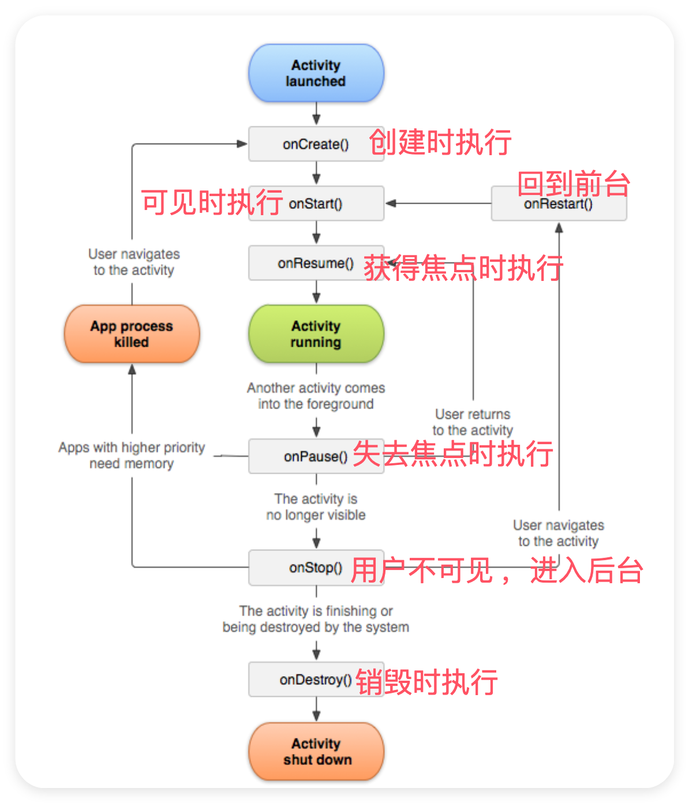
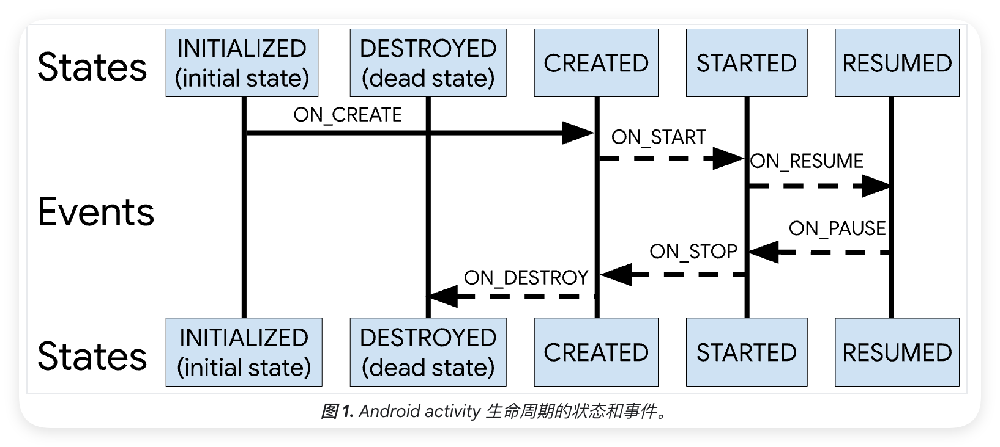

## Activity基础概念与核心机制
::: tip 核心要点
Activity 作为 Android 四大组件之一，承担着用户界面交互的核心职责
:::

在android中，Activity相当于一个页面，可以在 Activity中添加 Button、CheckBox 等控件，一个android程序有多个Activity组成。
 
* 一个 Activity 通常就是一个单独的屏幕(窗口)
* Activity 之间通过 Intent 进行通信。
* Android 应用中每一个 Activity 都必须要在 `AndroidManifest.xml` 配置文件中声明，否则系统将不识别也不执行该Activity。在 android stdio会自动生成。

### Activity 的创建与继承

```kotlin
class TestActivity : AppCompatActivity() {
    override fun onCreate(savedInstanceState: Bundle?) {
        super.onCreate(savedInstanceState)
        setContentView(R.layout.activity_test)
    }
}
```
以上是一个最简单的Activity，该Activity的名字叫做TestActivity，继承自AppCompatActivity 这个基类，并且设置了自己的视图为`R.layout.activity_test`。

* 这里的`AppCompatActivity`是最常用的父类，继承自 Activity，其包名为`androidx.appcompat.app.AppCompatActivity`。提供了对旧版本 Android 的兼容性支持，支持 ActionBar 和 Material Design 的功能。
* `AppCompatActivity`的详细继承路径为
    ```
    AppCompatActivity -> FragmentActivity -> ComponentActivity -> Activity
    ```
    由此可见AppCompatActivity 实际上做了多层的封装，对于初学者来说只需要知道我们的 Activity 最常继承自AppCompatActivity 即可。
* 其余可以继承的 Activity 还有：Activity、FragmentActivity、ListActivity(deprecated)、PreferenceActivity、(deprecated)

### 在 AndroidManifest.xml 中声明 Activity

一、 **Activity 的声明**
一个 Activity 的最简单的声明如下：
```
<activity
    android:name=".component.demo.TestActivity"
    android:exported="false" />
```
其中 name指定 Activity 的完整类名，exported指定 Activity 是否可以被其他应用启动。

稍微复杂一些的Activity 的声明如下：
```
<activity
    android:name=".component.demo.TestActivity"
    android:label="@string/test_activity_label"
    android:icon="@drawable/ic_test_activity"
    android:theme="@style/Theme.AppCompat.Light.DarkActionBar"
    android:exported="false"
    android:enabled="true"
    android:allowTaskReparenting="true"
    android:alwaysRetainTaskState="true"
    android:autoRemoveFromRecents="false"
    android:clearTaskOnLaunch="false"
    android:configChanges="orientation|keyboardHidden|screenSize|mcc|mnc|locale|touchscreen|keyboard|navigation|fontScale|uiMode|screenLayout|density"
    android:excludeFromRecents="false"
    android:finishOnTaskLaunch="false"
    android:hardwareAccelerated="true"
    android:iconifiedByDefault="false"
    android:launchMode="singleTask"
    android:lockTaskMode="never"
    android:multiWindowCategory="default"
    android:noHistory="false"
    android:parentActivityName=".MainActivity"
    android:permission="com.example.permission.ACCESS_TEST_ACTIVITY"
    android:process=":test_process"
    android:resizeableActivity="true"
    android:screenOrientation="portrait"
    android:stateNotNeeded="false"
    android:supportsPictureInPicture="true"
    android:taskAffinity="com.example.test.affinity"
    android:uiOptions="splitActionBarWhenNarrow"
    android:windowSoftInputMode="adjustResize|stateVisible">
    
    <!-- 意图过滤器 -->
    <intent-filter>
        <action android:name="android.intent.action.VIEW" />
        <category android:name="android.intent.category.DEFAULT" />
        <category android:name="android.intent.category.BROWSABLE" />
        <data android:scheme="http" android:host="example.com" />
    </intent-filter>
    
    <!-- 元数据 -->
    <meta-data
        android:name="com.example.metadata.TEST_KEY"
        android:value="test_value" />
</activity>
```

二、 **AndroidManifest.xml属性详解**
完整的介绍可以查看：[官网对`<activity>`的介绍](https://developer.android.com/guide/topics/manifest/activity-element?hl=zh-cn#reparent)
下面是可以被设置的各种属性：
```
1. 基本属性
android:name：指定 Activity 的完整类名（如 .component.demo.TestActivity）。
android:label：指定 Activity 的标题（显示在任务管理器或启动器中）。
android:icon：指定 Activity 的图标（显示在任务管理器或启动器中）。
android:banner：指定 Activity 的横幅资源。
android:theme：指定 Activity 的主题（如 @style/Theme.AppCompat.Light.DarkActionBar）。
2. 行为控制
android:exported：是否允许其他应用通过 Intent 启动此 Activity（true 或 false）。
android:enabled：是否允许系统实例化此 Activity（true 或 false）。
android:launchMode：指定启动模式（standard、singleTop、singleTask、singleInstance、singleInstancePerTask）。
android:taskAffinity：指定 Activity 属于哪个任务栈。
android:allowTaskReparenting：是否允许 Activity 在任务间重新关联（true 或 false）。
android:alwaysRetainTaskState：是否始终保留任务状态（true 或 false）。
android:clearTaskOnLaunch：是否在启动任务时清除任务栈中的其他 Activity（true 或 false）。
android:excludeFromRecents：是否将 Activity 从最近任务列表中排除（true 或 false）。
android:finishOnTaskLaunch：是否在任务启动时自动销毁 Activity（true 或 false）。
android:noHistory：是否将 Activity 从任务栈中移除（true 或 false）。
android:persistableMode：指定 Activity 是否可以持久化（persistRootOnly、persistAcrossReboots、persistNever）。
3. 配置变化
android:configChanges：指定 Activity 在配置变化（如屏幕旋转）时的行为（如 orientation、keyboardHidden 等）。
android:screenOrientation：强制 Activity 的屏幕方向（如 portrait、landscape）。
android:resizeableActivity：是否支持多窗口模式（true 或 false）。
android:configChanges：指定 Activity 在配置变化时的行为（如 colorMode、density、fontScale 等）。
4. 窗口和主题 
android:theme：指定 Activity 的主题（如 @style/Theme.AppCompat.Light.DarkActionBar）。
android:windowSoftInputMode：指定软键盘的行为（如 adjustResize、stateVisible）。
android:uiOptions：指定 UI 选项（如 splitActionBarWhenNarrow）。
android:immersive：是否启用沉浸式模式（true 或 false）。
5. 权限和安全
android:permission：指定启动 Activity 所需的权限。
android:lockTaskMode：指定是否锁定任务模式（normal、never、if_whitelisted、always）。
android:directBootAware：是否支持直接启动（true 或 false）。
android:requireContentUriPermissionFromCaller：指定调用者需要的 URI 权限（none、read、readAndWrite 等）。
6. 性能优化
android:hardwareAccelerated：是否启用硬件加速（true 或 false）。
android:supportsPictureInPicture：是否支持画中画模式（true 或 false）。
android:autoRemoveFromRecents：是否自动从最近任务列表中移除（true 或 false）。
android:stateNotNeeded：是否不需要保存状态（true 或 false）。
7. 其他
android:documentLaunchMode：指定文档启动模式（intoExisting、always、none、never）。
android:parentActivityName：指定父 Activity 的名称（用于返回导航）。
android:process：指定 Activity 运行的进程名。
android:showForAllUsers：是否对所有用户显示（true 或 false）。
android:colorMode：指定颜色模式（hdr、wideColorGamut）。
android:canDisplayOnRemoteDevices：是否可以在远程设备上显示（true 或 false）。
android:enabledOnBackInvokedCallback：是否启用回调（true 或 false）。
android:relinquishTaskIdentity：是否放弃任务身份（true 或 false）。
android:maxRecents：指定最近任务列表中显示的最大数量。
android:maxAspectRatio：指定最大宽高比。
android:multiprocess：是否允许多进程（true 或 false）。
8. **意图过滤器**
`<intent-filter>`：定义 Activity 可以响应的 Intent 类型。
`<action>`：指定 Intent 的动作（如 VIEW）。
`<category>`：指定 Intent 的类别（如 DEFAULT、BROWSABLE）。
`<data>`：指定 Intent 的数据（如 http://example.com）。
元数据
`<meta-data>`：附加的键值对信息，用于传递额外的配置。
```
三、**android:configChanges 属性的含义及常见值选择**
    `android:configChanges` 用于指定哪些配置变化不会导致 Activity 被重新创建。当设备的某些配置发生变化（如屏幕方向、语言、屏幕大小等）时，默认情况下，系统会销毁当前 Activity 并重新创建它。通过设置 android:configChanges，可以告诉系统在指定的配置变化发生时，不重新创建 Activity，而是调用 onConfigurationChanged() 方法。之所以这里强调出来是因为它比较复杂但是又常常使用。
    
以下是 android:configChanges 的常见值及其具体含义：
| 值 | 含义 | 
| --- | --- | 
| orientation | 屏幕方向变化（如横屏/竖屏切换）。 | 
| screenSize | 屏幕大小变化（适用于 Android 3.2 及以上版本）。 | 
| smallestScreenSize | 实际物理屏幕尺寸变化（如连接到外部显示器）。 | 
| keyboardHidden | 软键盘显示或隐藏。 | 
| keyboard | 键盘类型变化（如插入外接键盘）。 | 
| locale | 语言或地区变化。 | 
| layoutDirection | 布局方向变化（如从左到右或从右到左）。 | 
| fontScale | 字体缩放比例变化。 | 
| uiMode | 界面模式变化（如夜间模式）。 | 
| density | 屏幕密度变化。 | 
| mcc | 国际移动用户识别码所属国家代号变化。 | 
| mnc | 国际移动用户识别码的移动网号码变化。 | 
| navigation | 导航类型变化（如轨迹球或方向键）。 | 
| touchscreen | 触摸屏类型变化。 | 

我一般喜欢：
`android:configChanges="orientation|keyboardHidden|screenSize|mcc|mnc|locale|touchscreen|keyboard|navigation|fontScale"`

## Activity 的五种启动模式与taskAffinity 属性

一、五种启动模式

在 Android 开发中，Activity 的启动模式决定了它在任务栈中的行为。
**任务栈**：（Task Stack）是 Android 系统用来管理 Activity 的一种机制，它以栈的形式存储 Activity 的实例。当用户启动一个 Activity 时，它会被推入栈顶；当用户按下返回键时，栈顶的 Activity 会被弹出。任务栈确保了用户的操作符合“后进先出”（LIFO）的逻辑。

1. standard（默认模式）
**行为**：每次启动一个新的 Activity 时，都会创建一个新的实例，并将其推入任务栈的顶部。
**适用场景**：适用于大多数情况，尤其是每个 Activity 的实例都需要独立运行时。
`android:launchMode="standard"`
2. singleTop(栈顶复用模式)
行为：如果 Activity 已经位于任务栈的顶部，则不会创建新的实例，而是直接调用 onNewIntent() 方法。如果 Activity 不在栈顶，则创建新的实例。
适用场景：适用于需要避免重复创建 Activity 的情况，但仍然允许在任务栈中存在多个实例。
例如，通知栏点击进入聊天界面时，聊天界面应该显示现有的聊天内容，而不是启动新的实例。
`android:launchMode="singleTop"`
3. singleTask（栈内复用模式）
**行为**：如果 Activity 已经存在于任务栈中，则不会创建新的实例，而是直接调用 onNewIntent() 方法，**并将任务栈中该 Activity 之上的所有 Activity 都销毁**。
**适用场景**：适用于需要确保 Activity 在任务栈中只有一个实例的情况，通常用于“主页面”或“入口页面”。
例如，主界面或设置界面
`android:launchMode="singleTask"`
4. singleInstance（单例模式 ）
**行为**：以singleInstance模式启动的Activity具有全局唯一性，即整个系统中只会存在一个这样的实例。会**独自占用一个任务**，被他开启的任何activity都会运行在其他任务中。被singleInstance模式的Activity开启的其他activity，能够开启一个新任务，但不一定开启新的任务，也可能在已有的一个任务中开启。
**适用场景**：适用于需要完全独立运行的 Activity，例如系统级别的设置页面。
`android:launchMode="singleInstance"`
例如，系统设置的某些专用界面或特殊的帮助界面

以前是四种启动模式。不过，在 Android 12 中，新增了一种启动模式[singleInstancePerTask](https://developer.android.com/guide/topics/manifest/activity-element?hl=zh-cn#reparent)，如今Android已经有了五种启动模式

5. singleInstancePerTask（单例任务模式）
**行为**：singleInstancePerTask 允许一个 Activity 作为任务栈的根 Activity 来运行，并且它只会在这个任务栈中有一个实例。不过，与 singleTask 不同的是，singleInstancePerTask 可以在不同的任务栈中创建多个实例。如果启动该 Activity 时设置了 FLAG_ACTIVITY_MULTIPLE_TASK 或 FLAG_ACTIVITY_NEW_DOCUMENT 标志，那么每次启动时都会创建新的任务栈。
**总结**：singleInstance 确保整个系统中只有一个实例，并且该 Activity 独占一个任务栈。singleInstancePerTask 则允许多个任务栈中存在多个实例，但每个任务栈中只能有一个该 Activity 的实例。
`android:launchMode="singleInstancePerTask"`
其更多介绍可以参考：https://blog.csdn.net/u011897062/article/details/142921132

这五种启动模式可以通过设置 launchMode 属性来实现，也可以通过在 Intent 中添加相应的标志来实现类似的效果。

二、taskAffinity 属性

taskAffinity属性一般和上面的 launcherMode 结合使用，当一个 Activity 设置为 singleTask 的时候只是会被标识为可以在一个新的任务中启动，至于是否在一个新任务中启动，还要受taskAffinity的限制。
* 每个 Activity 都有一个 taskAffinity 属性，决定了它与哪个任务栈关联。
* 默认情况下，同一应用程序的所有 Activity 共享相同的 taskAffinity（默认是应用的包名），也就是说，如果没有特别设置，应用中的所有 Activity 都会属于同一个任务。
* 通过设置不同的 taskAffinity，可以将不同的 Activity 放入不同的任务栈中，从而在同一个应用中创建多个任务栈。

关于Activity 任务与启动模式的更多实验可以参考：[Android中Activity四种启动模式和taskAffinity属性详解](https://blog.csdn.net/w1142203475/article/details/134975029)

## Intent与Activity

Intent 是 Android 中的一种消息传递对象，用于请求执行某个操作。它可以用于启动 Activity、服务（Service）或广播接收器（BroadcastReceiver）。Intent 的主要作用是：
- **组件间通信**：Intent 可以在不同的组件之间传递信息。
- **启动组件**：通过 Intent 可以启动 Activity、服务或发送广播。

更多关于Intent的内容将会在后续展开，这里先介绍Intent与Activity的相互作用。

一、Intent启动Activity

Intent启动Activity分为显式和隐式两种，这并不是我这里想提到的重点。这点将会在以后Intent 部分介绍。我这里想介绍的是Intent 标志定义
显式 Intent 通过明确指定目标 Activity 的类名来启动 Activity。这是最常用的方式之一。
```java
// 在当前 Activity 中启动另一个 Activity
Intent intent = new Intent(this, TargetActivity.class);
intent.addFlags(Intent.FLAG_ACTIVITY_NEW_TASK);
startActivity(intent);
```
看到这里的addFlags 了吗？在 Android 开发中，可以通过在 Intent 中添加标志（Flags）来修改 Activity 的默认启动行为。具体可以添加的 Flag 实在是太多了，我这里只介绍五种启动模式对应的：
1.standard 模式：无需特定标识
2.singleTop 模式：FLAG_ACTIVITY_SINGLE_TOP
3.singleTask 模式：Intent.FLAG_ACTIVITY_NEW_TASK | Intent.FLAG_ACTIVITY_CLEAR_TOP
4.singleInstance 模式：Intent.FLAG_ACTIVITY_NEW_TASK，并且需要确保 Activity 的 taskAffinity 设置为空。
5.singleInstancePerTask模式：FLAG_ACTIVITY_MULTIPLE_TASK ｜ FLAG_ACTIVITY_NEW_TASK

## Activity的生命周期

### 生命周期简介
生命周期： onCreate()->onStart()->onResume()->onPause()->onStop()->onDestory()这六个生命周期是**两两对应**的。第七个生命周期onRestart()是单独的。
1. onCreate( )：进入"已创建"状态，初始化 UI 和数据
2. onstart( ) ：进入"已启动"状态，Activity 对用户可见
3. onResume( )：进入“已恢复”状态，Activity 开始与用户交互
4. onpause( ) ：进入"已暂停"状态，Activity 暂停，保存数据
5. onStop( )：进入"已停止"状态，Activity 完全不可见，释放资源，位于后台
6. onDestroy( )：进入"已销毁"状态，Activity 销毁，释放资源。
7. onRestart( ) ：Activity 从后台重新启动


几种特殊情况：
1. 切桌面：OnRestart()，也会有 onSaveInstanceState
2. 另一个活动切回来：OnRestart()，也会有 onSaveInstanceState
3. 切换横竖屏：先销毁后重建立，额外会在onPause之后调用onSaveInstanceState()保存当前状态，在onResume前再调用onRestoreInstanceState()来恢复之前的状态。

切换横竖屏时会重新走一遍生命周期：onPause()->onSaveInstanceState()-> onStop()->onDestroy()->onCreate()->onStart()->onRestoreInstanceState->onResume()
其中onSaveInstanceState和onRestoreInstanceState是两个重要的回调函数。当Activity异常退出时，系统调用onSaveInstanceState()来保存Activity当前状态。同样的，当该Activity重新创建时，会调用onRestoreInstanceState()来恢复之前的状态。

另外的，在我们的 AppCompatActivity 中还有很多其他与生命周期有关的方法，在使用第三方库或者自己封装一些内容的时候可能会用到：
1. onPostResume：在 onResume() 方法之后调用，用于在 Activity 恢复后执行一些额外的操作。
2. onUserInteraction：在用户与 Activity 交互时调用，用于处理用户交互事件。
3. onUserLeaveHint：在用户按下 Home 键或切换到其他应用时调用，用于保存用户离开时的状态。
4. onConfigurationChanged：在设备配置发生变化时调用，用于处理屏幕旋转等配置变化。
5. onSaveInstanceState：在 Activity 被销毁前调用，用于保存 Activity 的状态。
6. onRestoreInstanceState：在 Activity 被重新创建时调用，用于恢复 Activity 的状态。
7. onAttachedToWindow：在 Activity 被附加到窗口时调用，用于初始化与窗口相关的资源。
8. onDetachedFromWindow：在 Activity 从窗口中分离时调用，用于释放与窗口相关的资源。
9. onContentChanged：在 setContentView() 或 addContentView() 方法执行完毕时调用，用于处理布局变化。
10. onPostCreate：在 onCreate() 和 onStart() 方法之后调用，用于初始化那些依赖于视图已创建的组件。

例如：XCrash需要在attachBaseContext 中的初始化、多层 initView 的封装要在onPostCreate 中等等。

### 生命周期和状态

前面我们提到进入"已创建"状态(CREATED状态)，这里的状态如下图所示：

方法和状态之间存在这样的流转关系。Lifecycle将会监控和管理生命周期，这部分的更多内容应该进入[Lifecycle章节](https://suzhelevel6.github.io/suzhe_blog/study-notes/jetpack/Lifecycle.html)进行学习，这里就不展开了。


