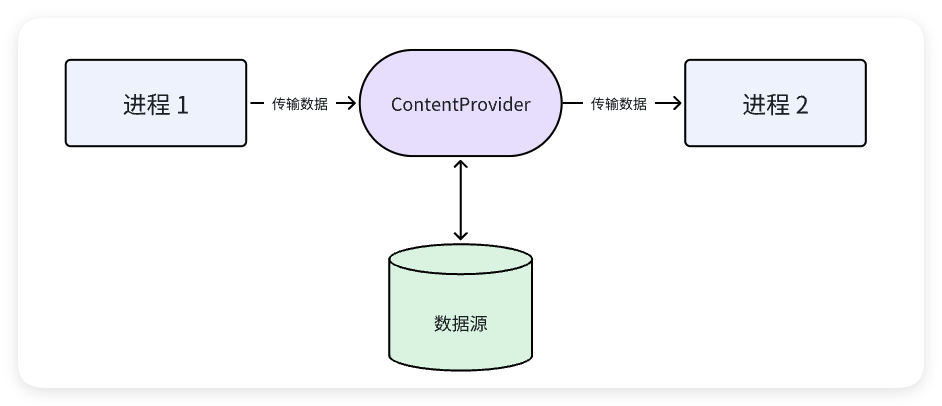

# ContentProvider 知识点总结

## ContentProvider 是什么？

ContentProvider是Android系统中的一个组件，用于在不同的应用程序之间共享数据。它提供了一种统一的接口，使得应用程序可以访问和修改其他应用程序中的数据，同时还可以对数据进行安全性和权限控制。
简单来说就是实现进程间的数据交互 & 共享，即跨进程通信。


注意：
1. ContentProvider=中间者角色(搬运工) 真正存储和操作数据的数据源还是原来存储数据的方式(数据库、文件、xml或网络)
2. 数据源可以是:数据库(如Sqlite)、文件、XML、网络等等
3. ContentProvider通过Binder机制来实现跨进程通信。[点击查看Binder 介绍](https://suzhelevel6.github.io/suzhe_blog/study-notes/android/theory/%E8%BF%9B%E7%A8%8B%E9%80%9A%E4%BF%A1%E6%9C%BA%E5%88%B6Binder.html)


## URI 和 MIME
要了解ContentProvider 的工作原理首先就要了解统一资源标识符（URI）和多用途互联网邮件扩展类型(MIME)

### RUI

**定义**：ContentProvider 使用 URI（Uniform Resource Identifier，统一资源标识符）来标识数据，每个数据都有一个唯一的 URI 来访问。URI 是系统中每个资源的名字，用于唯一标识 ContentProvider 和其中的数据。

**作用**：URI 为系统中的每一个资源赋予一个名字，使得外界进程可以通过 URI 找到对应的 ContentProvider 中的数据，并进行数据操作。

#### 分类：
**系统预置 URI**
系统预置 URI 对应系统内置的数据，如通讯录、日程表等。例如：
- 管理联系人的 URI：`ContactsContract.Contacts.CONTENT_URI`
- 管理联系人电话的 URI：`ContactsContract.CommonDataKinds.Phone.CONTENT_URI`
- 管理联系人 Email 的 URI：`ContactsContract.CommonDataKinds.Email.CONTENT_URI`
- 发信箱中的短信 URI：`Content://sms/outbox`
- 收信箱中的短信 URI：`Content://sms/sent`
- 草稿中的短信 URI：`Content://sms/draft`

**自定义 URI**
自定义 URI 对应自定义数据库。例如：
```kotlin
val uri = Uri.parse("content://com.henry.provider/User/1")
```
* content：主题名，表示这是一个 ContentProvider 的 URI。
* com.henry.provider：授权信息，ContentProvider 的唯一标识符。
* User：表名，表示要操作的数据库中的表名。
* 1：记录 ID，表示表中的某个记录。若无指定，则返回全部记录。

**URI 的格式解读**
URI 的格式如下：
```
content://com.ags.myprovider/tablename/id
```
* scheme：标准前缀 content://，表示这是一个 ContentProvider 控制的数据。
* host:port：授权信息，用于唯一标识 ContentProvider，外部调用可以根据这个标识来找到它。
* path：路径，可以理解为要操作的数据库中的表名。
* query：记录 ID，如果 URI 中包含表示需要获取的记录的 ID，则返回该 ID 对应的数据，如果没有 ID，则表示返回全部。

#### 常用API

1. UriMatcher

UriMatcher 可以根据传入的 URI 决定执行的操作（如查询、插入、更新或删除）。

主要功能
* 将传入的 URI 与预定义的 URI 模式进行匹配。
* 根据匹配结果返回一个代码（通常是整数），用于标识 URI 的类型。

```kotlin
class MyContentProvider {

    // 定义 URI 匹配的代码
    private companion object {
        const val CODE_ALL = 100 // 匹配所有记录
        const val CODE_SINGLE = 200 // 匹配单条记录
        const val AUTHORITY = "com.example.myprovider"
    }

    // 创建 UriMatcher 对象
    private val uriMatcher = UriMatcher(UriMatcher.NO_MATCH).apply {
        // 添加 URI 匹配规则
        addURI(AUTHORITY, "items", CODE_ALL) // 匹配 "content://com.example.myprovider/items"
        addURI(AUTHORITY, "items/#", CODE_SINGLE) // 匹配 "content://com.example.myprovider/items/123"（# 表示 ID）
    }

    fun match(uri: Uri): Int {
        return when (uriMatcher.match(uri)) {
            CODE_ALL -> {
                Log.d("MyProvider", "匹配所有记录")
                CODE_ALL
            }
            CODE_SINGLE -> {
                Log.d("MyProvider", "匹配单条记录，ID: ${uri.lastPathSegment}")
                CODE_SINGLE
            }
            else -> {
                Log.d("MyProvider", "未匹配到任何 URI")
                UriMatcher.NO_MATCH
            }
        }
    }
}
```

2. ContentUris

ContentUris 是一个辅助类，用于处理 URI 和 ID 的关系。它提供了一些静态方法，方便拼接 URI 和 ID。

主要功能
* 将一个基础 URI 和一个 ID 拼接成一个新的 URI。
* 从 URI 中提取 ID。

```kotlin
class ContentUrisExample {

    companion object {
        private const val AUTHORITY = "com.example.myprovider"
        private const val PATH = "items"
        val CONTENT_URI = Uri.parse("content://$AUTHORITY/$PATH")
    }

    fun appendIdToUri() {
        // 基础 URI
        val baseUri = CONTENT_URI
        Log.d("ContentUris", "基础 URI: $baseUri")

        // 拼接 ID 到 URI
        val id = 123L
        val newUri = ContentUris.withAppendedId(baseUri, id)
        Log.d("ContentUris", "拼接后的 URI: $newUri")
    }

    fun parseIdFromUri() {
        // 包含 ID 的 URI
        val uriWithId = Uri.parse("content://com.example.myprovider/items/456")
        val id = ContentUris.parseId(uriWithId)
        Log.d("ContentUris", "从 URI 提取的 ID: $id")
    }
}
```

3. ContentObserver

观察 Uri引起 ContentProvider 中的数据变化 & 通知外界（即访问该数据访问者）
当ContentProvider 中的数据发生变化（增、删 、改）时，就会触发该 ContentObserver类的onchange方法

使用步骤
1. 创建 ContentObserver 子类：继承 ContentObserver 并重写 onChange() 方法。
2. 注册 ContentObserver：使用 ContentResolver 的 registerContentObserver() 方法注册观察者。
3. 注销 ContentObserver：在不再需要观察时，使用 ContentResolver 的 unregisterContentObserver() 方法注销观察者。

```
    private lateinit var contentObserver: MyContentObserver

    override fun onCreate(savedInstanceState: Bundle?) {
        super.onCreate(savedInstanceState)
        setContentView(R.layout.activity_main)

        // 创建 ContentObserver
        contentObserver = MyContentObserver(this)

        // 注册 ContentObserver
        contentResolver.registerContentObserver(
            ContactsContract.Contacts.CONTENT_URI, // 要观察的 URI
            true, // 是否通知本地变化
            contentObserver
        )
    }

    override fun onDestroy() {
        super.onDestroy()
        // 注销 ContentObserver
        contentResolver.unregisterContentObserver(contentObserver)
    }
```

### MIME

**定义**：MIME（Multipurpose Internet Mail Extensions）是一种互联网标准，用于指定文件的类型和格式。它最初用于电子邮件系统，但现在也广泛应用于浏览器和服务器之间传递数据类型信息

**作用**：MIME 类型用于标识数据的类型和格式，帮助客户端应用程序正确解析和处理数据。例如，指定 `.html` 文件采用文本应用程序打开，`.pdf` 文件采用 PDF 应用程序打开。

#### MIME 类型的组成
每种 MIME 类型由两部分组成：
- **类型**：表示数据的通用类别，如 `text`、`image`、`audio`、`video`、`application` 等。
- **子类型**：表示数据的具体格式，如 `plain`、`html`、`jpeg`、`png`、`mpeg` 等。

**示例**：
- `text/plain`：纯文本数据
- `text/html`：HTML 格式数据
- `image/jpeg`：JPEG 格式图像数据
- `audio/mpeg`：MP3 格式音频数据
- `video/mp4`：MP4 格式视频数据
- `application/json`：JSON 格式数据
- `application/xml`：XML 格式数据

在 Android 开发中，ContentProvider 使用 MIME 类型来标识数据的类型和格式。开发者需要正确指定数据的 MIME 类型，以确保数据能够被正确处理。

ContentProvider 提供了 `getType(Uri uri)` 方法，用于返回与指定 URI 对应的 MIME 类型。

#### MIME 在 ContentProvider 使用中的注意事项
- **vnd**：表示这些类型和子类型具有非标准的、供应商特定的形式。
- **集合与单条记录**：Android 中的 MIME 类型已经固定，开发者需要根据返回数据的性质选择合适的类型。
- **ContentProvider 与 Intent**：ContentProvider 在使用 Intent 时会用到 MIME 类型，根据 MIME 类型打开符合条件的活动。

#### 具体示例 - 音频播放器的xml

下面是VLC播放器的AndroidManifest.xml 的节选，我们从MIME的角度分析一下：
```
<intent-filter>
    <action android:name="android.intent.action.VIEW" />
    <category android:name="android.intent.category.DEFAULT" />
    <category android:name="android.intent.category.BROWSABLE" />
    <data android:scheme="file" />
    <data android:scheme="content" />
    <data android:scheme="http" />
    <data android:scheme="https" />
    <data android:mimeType="video/*" />
    <data android:mimeType="*/avi" />
    <data android:mimeType="application/mpeg*" />
    
</intent-filter>
```
* video/*: 表示可以处理所有的视频文件
* */avi: 表示可以处理 AVI 格式的视频数据
* application/mpeg*：表示可以处理 MPEG 格式的多媒体数据
* http 和 https：用于处理通过 HTTP 或 HTTPS 协议访问的网络资源。
* file：用于处理本地文件系统中的资源。
* content：用于处理通过 ContentProvider 提供的资源。

## ContentProvider三剑客

1. ContentProvider
**定义**：ContentProvider 是 Android 四大组件之一，用于在不同应用程序之间共享数据。它提供了一组标准的 API，用于对数据进行 CRUD（创建、读取、更新、删除）操作。
**作用**：作为数据的提供者，ContentProvider 封装了数据的存储和检索逻辑，使得其他应用程序可以通过统一的接口访问数据。

2. ContentResolver
**定义**：ContentResolver 是 Android 提供的一个类，用于与 ContentProvider 进行交互。它提供了方法来查询、插入、更新和删除数据。
**作用**：作为数据的访问者，ContentResolver 负责与 ContentProvider 通信，获取或修改数据。它通过 URI 来定位 ContentProvider 中的数据。

3. ContentObserver
**定义**：ContentObserver 是一个抽象类，用于监听 ContentProvider 中数据的变化。当数据发生变化时，系统会调用 ContentObserver 的 onChange() 方法，通知注册的观察者数据已更新。
**作用**：作为数据变化的监听者，ContentObserver 允许应用程序在数据变化时执行特定的逻辑，如更新 UI 或执行其他操作。

三者之间的关系

* ContentProvider：提供数据。
* ContentResolver：访问数据。
* ContentObserver：监听数据变化。

