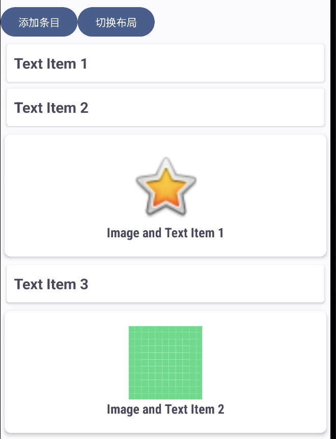
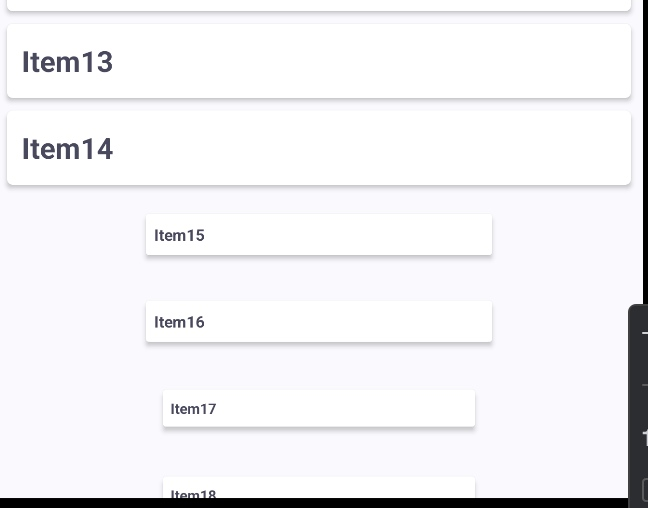
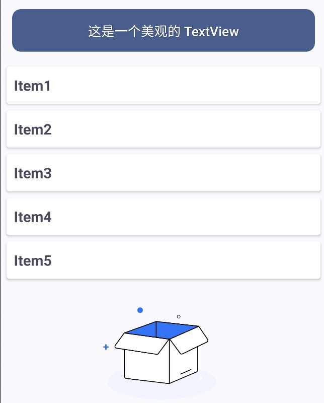
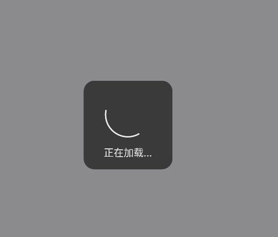
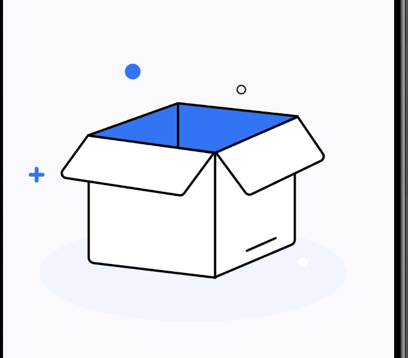
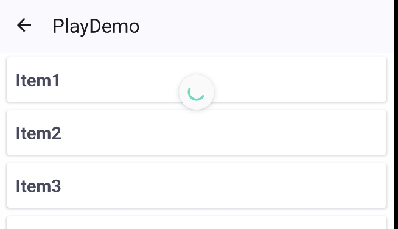
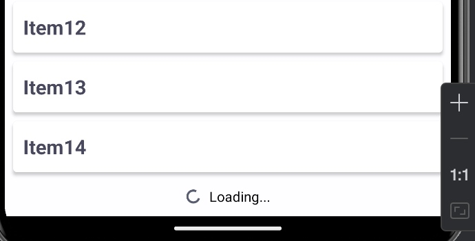
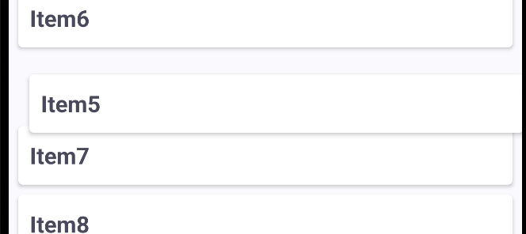
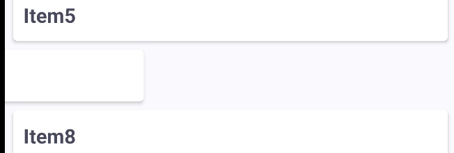

# RecyclerView实战

## 基础概念

RecyclerView是用于高效展示大数据集列表网格的核心组件，相比传统的ListView和GridView,它通过视图回收机制和灵活的布局管理显著提升性能。

ListView 在处理大量数据时会面临性能瓶颈，因为它每次滚动时都会重新加载所有的视图。而 RecyclerView 则通过 ViewHolder 进行视图复用，不仅能显著提高性能，还支持多种布局管理器（LayoutManager）和动画效果。

### 核心要素
RecyclerView 的实现主要依赖于以下三个核心组件：

* Adapter：Adapter 是数据源与 RecyclerView 之间的桥梁，负责将数据绑定到视图上。
* ViewHolder：ViewHolder 是对 RecyclerView 中每个条目视图的缓存，它避免了每次滑动时都要重新查找视图的性能问题。
* LayoutManager：LayoutManager 决定了 RecyclerView 中条目的排列方式，它支持多种布局类型，如 LinearLayoutManager（线性布局）、GridLayoutManager（网格布局）、StaggeredGridLayoutManager（瀑布流布局）等。

其使用方式分为四步走：
1. 创建子母布局
2. 创建Adapter
3. 创建ViewHolder
4. 关联到RecyclerView并设置LayoutManager

## 实现示例

### 基础实现

**第一步：创建子母布局**

母布局指的是RecyclerView本身所在的布局，子布局是指里面具体的Item的布局。

本身的布局：
```xml
        <androidx.recyclerview.widget.RecyclerView
            android:id="@+id/rv"
            android:layout_width="match_parent"
            android:layout_height="match_parent"
            android:fadingEdge="none"
            app:layoutManager="androidx.recyclerview.widget.LinearLayoutManager" />
```
- 一般只需要指定id、layout_width、layout_height即可
- fadingEdge的作用是在什么时候启用渐变效果，可选项有none、any、horizontal和vertical。
- layoutManager 如果不在xml中指定则一定要在Activity 中设置，否则无法显示出视图

Item 布局：略，如果想显示多类型条目则要创建多个 Item 布局。在实际开发中，我们经常需要在 RecyclerView 中显示不同类型的条目，比如文本项、图片项，或是带有图片的文本项。

**第二步：创建Adapter**

这里以双类型条目作为演示，单条目类型要更加简单

```xml

class RecyclerViewDemoAdapter(private val items: List<Any>) : RecyclerView.Adapter<RecyclerView.ViewHolder>() {


    // 创建 ViewHolder 的方法，根据条目类型加载不同的布局
    override fun onCreateViewHolder(parent: ViewGroup, viewType: Int): RecyclerView.ViewHolder {
        return when (viewType) {
            // 如果条目类型是 TYPE_TEXT，加载文本条目的布局
            TYPE_TEXT -> TextViewHolder(parent)
            // 如果条目类型是 TYPE_IMAGE_TEXT，加载混合条目的布局
            TYPE_IMAGE_TEXT -> ImageTextViewHolder(parent)
            // 如果条目类型无效，抛出异常
            else -> throw IllegalArgumentException("Invalid view type")
        }
    }

    // 绑定数据到 ViewHolder
    override fun onBindViewHolder(holder: RecyclerView.ViewHolder, position: Int) {
        // 根据当前条目的类型，进行相应的数据绑定
        when (getItemViewType(position)) {
            TYPE_TEXT -> (holder as TextViewHolder).bind(items[position] as String)
            TYPE_IMAGE_TEXT -> (holder as ImageTextViewHolder).bind(items[position] as Pair<Int, String>)
        }
    }

    // 返回列表项的数量
    override fun getItemCount(): Int = items.size

    // 根据当前位置返回条目的类型
    override fun getItemViewType(position: Int): Int {
        return when (items[position]) {
            // 如果是字符串类型，返回文本条目类型
            is String -> TYPE_TEXT

            // 如果是 Pair 类型（包含图片和文本），返回图片在左，文本在右条目类型
            is Pair<*, *> -> TYPE_IMAGE_TEXT

            // 如果条目类型无效，抛出异常
            else -> throw IllegalArgumentException("Invalid item type")
        }
    }

}
```
① 数据传入：可以通过构造函数将数据从 Activity 那边传递过来，一般会是一个 List。在示例中，构造函数接收一个 `List<Any>` 类型的参数 items，表示适配器管理的数据集
② onCreateViewHolder 方法：用于创建 ViewHolder 对象，它是 RecyclerView 中条目的容器，根据不同的 viewType 加载不同的布局文件，创建相应的 ViewHolder。若是单条目类型直接返回使用的 ViewHolder 即可。
③ onBindViewHolder 方法：用于将数据绑定到 ViewHolder 上。根据 ViewHolder 的类型和当前条目的位置，将数据集中的数据赋值给 ViewHolder 中的视图。
④ getItemCount 方法：返回数据集的大小，告诉 RecyclerView 要显示的条目总数。示例中直接返回 items.size。
⑤ getItemViewType 方法：可选，如果是单条目则不需要。返回值决定 onCreateViewHolder 创建哪种类型的 ViewHolder。

至于 ViewHolder 对应的是那个视图则在 ViewHolder 的具体实现中设置。

**第三步：创建ViewHolder**

```xml
class TextViewHolder(
    parent: ViewGroup,
    private val binding: ItemTextBinding = ItemTextBinding.inflate(
        LayoutInflater.from(parent.context), parent, false
    )
) : RecyclerView.ViewHolder(binding.root) {

    fun bind(text: String) {
        binding.header.text = text
    }
}

// 混合条目的 ViewHolder，负责绑定图片资源和文本数据
class ImageTextViewHolder(
    parent: ViewGroup,
    private val binding: ItemImageTextBinding = ItemImageTextBinding.inflate(
        LayoutInflater.from(parent.context), parent, false
    )
) : RecyclerView.ViewHolder(binding.root) {

    fun bind(item: Pair<Int, String>) {
        binding.icon.setImageResource(item.first)
        binding.textView.text = item.second
    }
}
```
注意：我们在 ViewHolder 的构造函数里面指定了默认的 binding，因此在 Adapter 里面调用 ViewHolder 只需要传入 parent 参数即可，不需要再明确指定 binding。

**第四步：关联到RecyclerView并设置LayoutManager**

在 Activity 中:

```kotlin
private lateinit var recyclerView: RecyclerView // RV
private lateinit var adapter: RecyclerViewDemoAdapter // Adapter
private val itemList = mutableListOf<Any>(...) // 数据


    override fun onCreate(savedInstanceState: Bundle?, persistentState: PersistableBundle?) {
        super.onCreate(savedInstanceState, persistentState)
        
        recyclerView = binding.recyclerView //设置 RV
        adapter = RecyclerViewDemoAdapter(itemList) // 设置 Adapter
        recyclerView.adapter = adapter // 绑定 RV 和 Adapter
        recyclerView.layoutManager = LinearLayoutManager(this)//设置 RV 的 layoutManager
    }
```
注意：layoutManager 一定要设置，除非你在 xml 中已经指定了。




### 使用 BRVAH 简化

BRVAH(BaseRecyclerViewAdapterHelper)是一个用于简化开源框架


```kotlin
class AnimationAdapter() : BaseQuickAdapter<String, QuickViewHolder>() {

    override fun onCreateViewHolder(
        context: Context,
        parent: ViewGroup,
        viewType: Int
    ): QuickViewHolder {
        return QuickViewHolder(R.layout.item_text, parent)
    }

    override fun onBindViewHolder(
        holder: QuickViewHolder,
        position: Int,
        item: String?
    ) {
        holder.setText(R.id.header, item)
        holder.getView<TextView>(R.id.header).setOnClickListener {
            PopTip.show("点击了 $item")
        }
    }
}
```
 使用BaseQuickAdapter的注意点：
 1. 如果 ViewHolder 很简单，可以直接使用 QuickViewHolder 并指定视图
 2. 不需要 getItemCount 方法
 3. 传入数据可以使用参数传递，也可以使用 submitList 方法
 4. BaseQuickAdapter 泛型参数的第一个参数是 具体的数据类型 而不是 List

#### 添加动画效果
BaseQuickAdapter内置了很多的动画效果，使用方式也很简单。例如我们有class AnimationAdapter() : BaseQuickAdapter，那么：
```kotlin
    private val mAdapter: AnimationAdapter = AnimationAdapter().apply {
        // 打开 Adapter 的动画
        animationEnable = true
        // 是否是首次显示时候加载动画
        isAnimationFirstOnly = false
    }
    
    // 设置动画效果
    mAdapter.setItemAnimation(BaseQuickAdapter.AnimationType.AlphaIn)
```
可选择的动画效果有：
* AlphaIn
* ScaleIn
* SlideInBottom
* SlideInLeft
* SlideInRight

例如：ScaleIn 的动画如下：


 #### 添加 Header 和 Footer
 

 
第一步：使用 QuickAdapterHelper 类来管理 Adapter
 ```kotlin {3-6},{13}
    private lateinit var recyclerView: RecyclerView
    private val mAdapter: AnimationAdapter = AnimationAdapter()
    private val helper by lazy(LazyThreadSafetyMode.NONE) {
        QuickAdapterHelper.Builder(mAdapter)
            .build()
    }
    
    override fun onCreate(savedInstanceState: Bundle?, persistentState: PersistableBundle?) {
        super.onCreate(savedInstanceState, persistentState)
        
        recyclerView = binding.recyclerView //设置 RV
        adapter = RecyclerViewDemoAdapter(itemList) // 设置 Adapter
        recyclerView.adapter = helper.adapter
        recyclerView.layoutManager = LinearLayoutManager(this)//设置 RV 的 layoutManager
    }
 ```
 
 第二步：使用 addBeforeAdapter 和 addAfterAdapter 方法来添加 Header 和 Footer
 
 ```kotlin
     private fun addHeader() {
        helper.addBeforeAdapter(0, HeaderAdapter())
    }

    private fun addFooter() {
        helper.addAfterAdapter(FooterAdapter())
    }
 ```
 
 第三步：实现 HeaderAdapter 和 FooterAdapter 这两个 Adapter 分别绑定 Header 和 Footer 的视图
 ```kotlin 
 // HeaderAdapter
 class HeaderAdapter : BaseSingleItemAdapter<Any, HeaderAdapter.VH>() {

    class VH(view: View) : RecyclerView.ViewHolder(view)

    override fun onCreateViewHolder(context: Context, parent: ViewGroup, viewType: Int): VH {
        val view =
            LayoutInflater.from(parent.context).inflate(R.layout.simple_list_item, parent, false)
        return VH(view)
    }

    override fun onBindViewHolder(holder: VH, item: Any?) { }
}
// FooterAdapter
class FooterAdapter(
) : BaseSingleItemAdapter<Any, QuickViewHolder>() {

    override fun onCreateViewHolder(
        context: Context,
        parent: ViewGroup,
        viewType: Int
    ): QuickViewHolder {
        return QuickViewHolder(R.layout.top_view, parent)
    }

    override fun onBindViewHolder(holder: QuickViewHolder, item: Any?) { }
}
 ``` 
 如果视图比较简单可以直接使用 BaseSingleItemAdapter
 
 #### 加载和空状态
 加载状态：
 

空视图状态：



 第一步：打开空布局功能
 ```kotlin
 mAdapter.isStateViewEnable = true
 ```
 
 第二步：设计加载状态的动画
 ```kotlin 
 val waitDialog = WaitDialog.show("正在加载...")
            .setOnBackPressedListener {
                PopTip.show("操作进行中...")
                    .setButton("取消等待") { _, _ ->
                        WaitDialog.dismiss()
                        false
                    }
                false
            }
 ```
 这一步可以是转圈的Dialog弹窗或是其他的什么，我这里使用WaitDialog，当然也可以和第三步一样使用一个自定义的View 视图。
 
 
 第三步：根据不同的状态来显示不同的内容
 
 ```kotlin {2-7},{10}
 private var status = false
 private val errorView: View
    get() {
        val errorView = layoutInflater.inflate(R.layout.error_view, FrameLayout(this), false)
        errorView.setOnClickListener { onRefresh() }
        return errorView
    }
 
 recyclerView.postDelayed({

    waitDialog.doDismiss()

    if (status) { // 模拟网络错误
        // 方式二：传入View
        mAdapter.submitList(null)
        mAdapter.stateView = errorView
    } else {
        mAdapter.submitList(DataServer.getStringItems5())
    }
    status = !status
}, 1000)
```
首先需要一个 view 类型来当做空状态的视图，然后在合适的时候设置 stateView 来改变视图。

#### 刷新和加载更多

顶部下拉刷新


底部上滑加载



这里指的是在rv最顶部下拉刷新，在底部上滑加载更多数据。
这两个功能需要借助QuickAdapterHelper来实现，还需要借助SwipeRefreshLayout控件。

第一步：在xml中使用SwipeRefreshLayout包裹rv
```xml
<androidx.swiperefreshlayout.widget.SwipeRefreshLayout
    android:id="@+id/refresh_layout"
    android:layout_width="match_parent"
    android:layout_height="match_parent"
    android:background="@color/white80"
    android:orientation="vertical">

    <androidx.recyclerview.widget.RecyclerView
        android:id="@+id/rv"
        android:layout_width="match_parent"
        android:layout_height="match_parent"
        android:fadingEdge="none"
        app:layoutManager="androidx.recyclerview.widget.LinearLayoutManager" />

</androidx.swiperefreshlayout.widget.SwipeRefreshLayout>
```

第二步：下拉刷新 - 设置刷新箭头的颜色与触发的方法

```kotlin
private fun initRefreshLayout() {
    binding.refreshLayout.setColorSchemeColors(Color.rgb(47, 223, 189))
    binding.refreshLayout.setOnRefreshListener { refresh() }
}
```
在refresh()中请求数据并且重新设置数据，在我们下拉的时候会出现转圈的箭头表示正在加载数据，而箭头的消失需要手动设置：
```kotlin
// 假设这里刷新完了数据
binding.refreshLayout.isRefreshing = false // 取消加载箭头
```

第三步：加载更多 - 在 helper 上设置
```kotlin
private var helper: QuickAdapterHelper = QuickAdapterHelper.Builder(mAdapter)
    .setTrailingLoadStateAdapter(object : OnTrailingListener {
        override fun onLoad() {
            // 加载数据的方法
            request()
        }

        override fun onFailRetry() {
            request()
        }

        override fun isAllowLoading(): Boolean {
            // 在下拉刷新的时候不要触发加载更多
            return !binding.refreshLayout.isRefreshing
        }
    }).build()
```
* 当我们滑动到最底部的时候，会触发onLoad()方法，这时候可以加载更多数据。

* 加载更多数据的时候一般都是分页加载。因此需要判断情况，如果是第一次加载可以使用mAdapter.submitList(data)来设置数据，后续加载可以使用mAdapter.addAll(data)来添加数据。如果网络错误可能需要弹窗提示，当数据加载完毕没有更多数据的时候也需要提示。

第四步：加载更多的状态设置
```kotlin
helper.trailingLoadState = LoadState.None
```
trailingLoadState 有多种状态：
* LoadState.None：当前没有任何状态（例如：初始化时，刷新数据时）
* LoadState.NotLoading(true)：当前未加载，并且当前未发生错误，并且已达到分页尾。此时 rv 底端会显示`no more data`
* LoadState.NotLoading(false)：当前未加载，并且当前未发生错误，并且未达到分页尾。此时 rv 底端会自动触发`onLoad()`方法
* LoadState.Error(e): 出现错误，此时 rv 底端会显示出现错误，点击重试的英文


#### 拖动和滑动

拖动改变位置：


滑动删除条目：



第一步：在BaseQuickAdapter中完善方法

首先需要使Adapter继承自DragAndSwipeDataCallback，然后实现方法：
```kotlin
override fun dataMove(fromPosition: Int, toPosition: Int) {
    move(fromPosition, toPosition)
}

override fun dataRemoveAt(position: Int) {
    removeAt(position)
}
```

第二步：设置滑动事件和拖动事件的监听（可选）
```kotlin

private val quickDragAndSwipe = QuickDragAndSwipe()
    .setDragMoveFlags(
        ItemTouchHelper.UP or ItemTouchHelper.DOWN or
                ItemTouchHelper.LEFT or ItemTouchHelper.RIGHT
    )
    .setSwipeMoveFlags(ItemTouchHelper.LEFT or ItemTouchHelper.RIGHT)
        
quickDragAndSwipe.attachToRecyclerView(recyclerView)
            .setDataCallback(mAdapter)
            .setItemDragListener(listener) // OnItemDragListener
            .setItemSwipeListener(swipeListener) // OnItemSwipeListener
```

listener 的示例：
```kotlin
// 拖拽监听
val listener: OnItemDragListener = object : OnItemDragListener {
    override fun onItemDragStart(viewHolder: RecyclerView.ViewHolder?, pos: Int) {
        // 震动反馈
        vibrate()
        LogUtils.d("drag start")
        val holder = viewHolder as QuickViewHolder? ?: return
        // 开始时，item背景色变化，demo这里使用了一个动画渐变，使得自然
        val startColor = Color.WHITE
        val endColor = Color.rgb(245, 245, 245)
        if (Build.VERSION.SDK_INT >= Build.VERSION_CODES.LOLLIPOP) {
            val v = ValueAnimator.ofArgb(startColor, endColor)
            v.addUpdateListener { animation: ValueAnimator ->
                holder.itemView.setBackgroundColor(
                    animation.animatedValue as Int
                )
            }
            v.duration = 300
            v.start()
        }
    }

    override fun onItemDragMoving(
        source: RecyclerView.ViewHolder,
        from: Int,
        target: RecyclerView.ViewHolder,
        to: Int
    ) {
        LogUtils.d(
            "move from: " + source.bindingAdapterPosition + " to: " + target.bindingAdapterPosition
        )
    }

    override fun onItemDragEnd(viewHolder: RecyclerView.ViewHolder, pos: Int) {
        LogUtils.d("drag end")
        val holder = viewHolder as QuickViewHolder
        // 结束时，item背景色变化，demo这里使用了一个动画渐变，使得自然
        val startColor = Color.rgb(245, 245, 245)
        val endColor = Color.WHITE
        if (Build.VERSION.SDK_INT >= Build.VERSION_CODES.LOLLIPOP) {
            val v = ValueAnimator.ofArgb(startColor, endColor)
            v.addUpdateListener { animation: ValueAnimator ->
                holder.itemView.setBackgroundColor(
                    animation.animatedValue as Int
                )
            }
            v.duration = 300
            v.start()
        }
    }
}
// 滑动监听
val swipeListener: OnItemSwipeListener = object : OnItemSwipeListener {
    override fun onItemSwipeStart(
        viewHolder: RecyclerView.ViewHolder?,
        bindingAdapterPosition: Int
    ) {
        LogUtils.d("onItemSwipeStart")
    }

    override fun onItemSwipeEnd(
        viewHolder: RecyclerView.ViewHolder,
        bindingAdapterPosition: Int
    ) {
        LogUtils.d("onItemSwipeEnd")
    }

    override fun onItemSwiped(
        viewHolder: RecyclerView.ViewHolder,
        direction: Int,
        bindingAdapterPosition: Int
    ) {
        LogUtils.d("onItemSwiped")
    }

    override fun onItemSwipeMoving(
        canvas: Canvas,
        viewHolder: RecyclerView.ViewHolder,
        dX: Float,
        dY: Float,
        isCurrentlyActive: Boolean
    ) {
        LogUtils.d("onItemSwipeMoving")
    }
}
```